# dividend-shorter

bet on falling prices on payday **2025-12-29**.

## Signale

| Ticker   |   Divid Rate |   Close |          Volume |   last_close_volume |   Divid % | 5_Days_pos   | above_SMA_50   |
|:---------|-------------:|--------:|----------------:|--------------------:|----------:|:-------------|:---------------|
| USEA     |         0.09 |    2.17 | 217500          |              471975 |      4.15 | True         | True           |
| TWN      |         6.2  |   59.71 |  35200          |             2101792 |     10.38 | True         | True           |
| TIMB     |         0.68 |   20.27 | 334700          |             6784369 |      3.35 | False        | False          |
| SRV      |         2.14 |   40.72 | 143900          |             5859608 |      5.26 | True         | False          |
| SPE      |         0.7  |   15.56 |  60000          |              933600 |      4.5  | True         | True           |
| PSBD     |         0.36 |   12.23 | 199800          |             2443554 |      2.94 | True         | True           |
| PDX      |         2.97 |   21.43 | 353300          |             7571219 |     13.86 | True         | False          |
| IVR      |         0.36 |    8.62 |      2.7305e+06 |            23536910 |      4.18 | False        | True           |
| FTEL     |         0.1  |    0.73 |      2.6459e+06 |             1931507 |     13.7  | True         | False          |
| AIO      |         1.19 |   23.17 | 216600          |             5018622 |      5.14 | True         | True           |

## USEA

### Erwartung in R
|      |   Day_r_0 |   Day_r_1 |   Day_r_2 |   Day_r_3 |   Day_r_4 |   Treffer |
|:-----|----------:|----------:|----------:|----------:|----------:|----------:|
| ohne |       0.1 |         0 |       0.3 |       0.4 |       0.5 |        12 |
| mit  |     nan   |       nan |     nan   |     nan   |     nan   |         0 |

### Ohne Filter
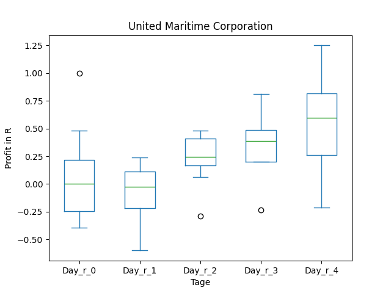
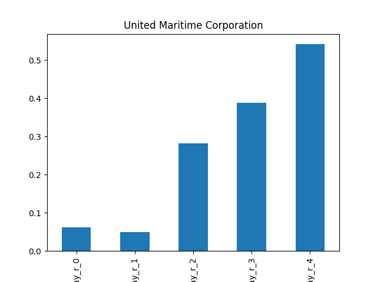

### Mit Filter

## TWN

### Erwartung in R
|      |   Day_r_0 |   Day_r_1 |   Day_r_2 |   Day_r_3 |   Day_r_4 |   Treffer |
|:-----|----------:|----------:|----------:|----------:|----------:|----------:|
| ohne |       0.1 |       0.1 |      -0.1 |      -0.4 |      -0.2 |        14 |
| mit  |       0.1 |       0.1 |       0.1 |       0.1 |       0   |         1 |

### Ohne Filter
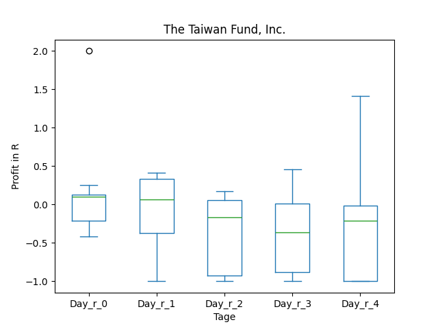
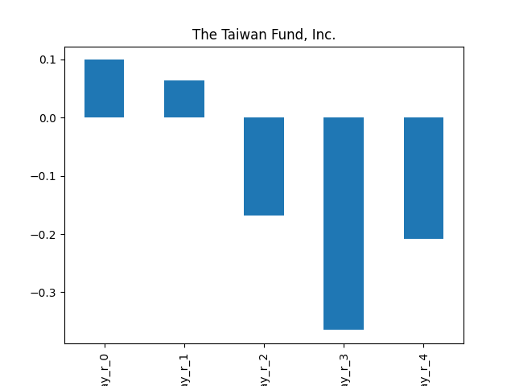

### Mit Filter
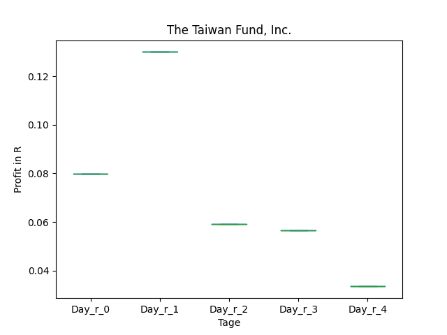
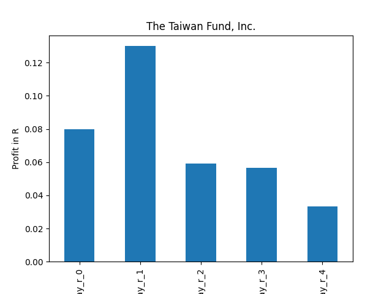

## TIMB

### Erwartung in R
|      |   Day_r_0 |   Day_r_1 |   Day_r_2 |   Day_r_3 |   Day_r_4 |   Treffer |
|:-----|----------:|----------:|----------:|----------:|----------:|----------:|
| ohne |        -0 |       0.1 |       0.1 |       0.4 |      -0.5 |        25 |
| mit  |       nan |     nan   |     nan   |     nan   |     nan   |         0 |

### Ohne Filter
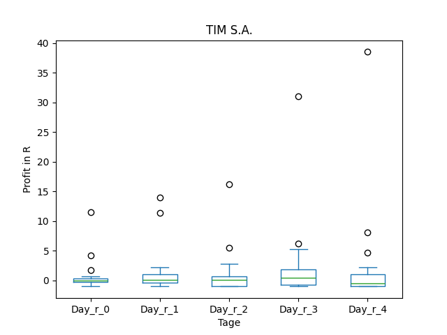
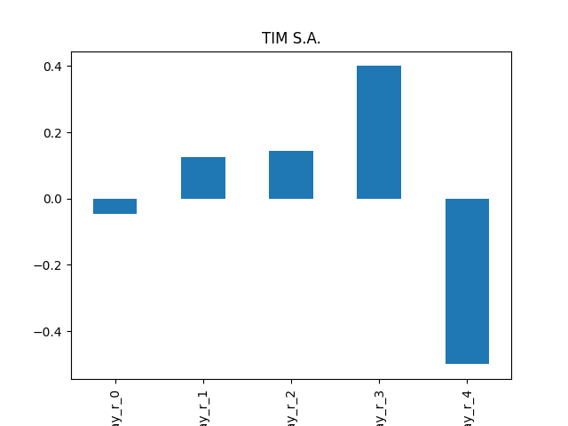

### Mit Filter
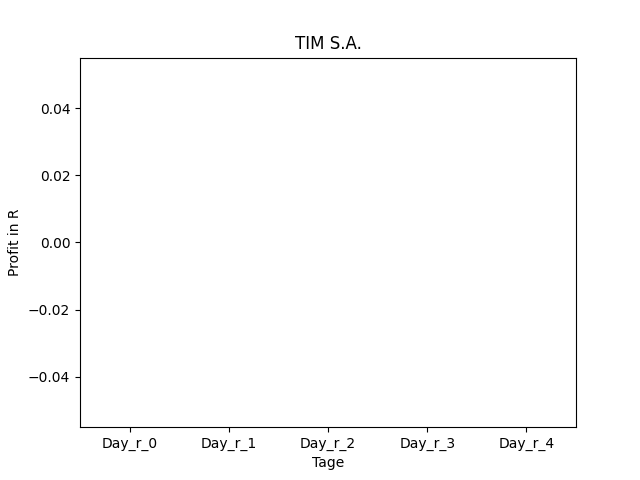
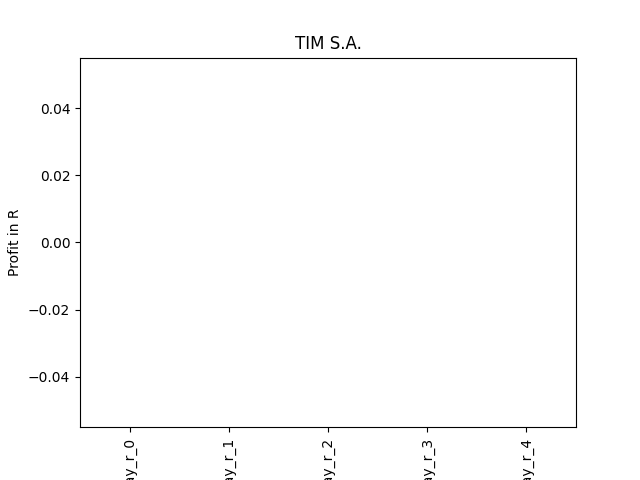

## SRV

### Erwartung in R
|      |   Day_r_0 |   Day_r_1 |   Day_r_2 |   Day_r_3 |   Day_r_4 |   Treffer |
|:-----|----------:|----------:|----------:|----------:|----------:|----------:|
| ohne |       0.1 |         0 |         0 |        -0 |      -0.1 |       170 |
| mit  |     nan   |       nan |       nan |       nan |     nan   |         0 |

### Ohne Filter
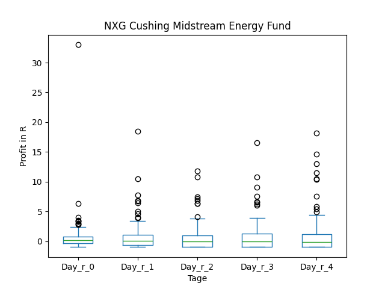
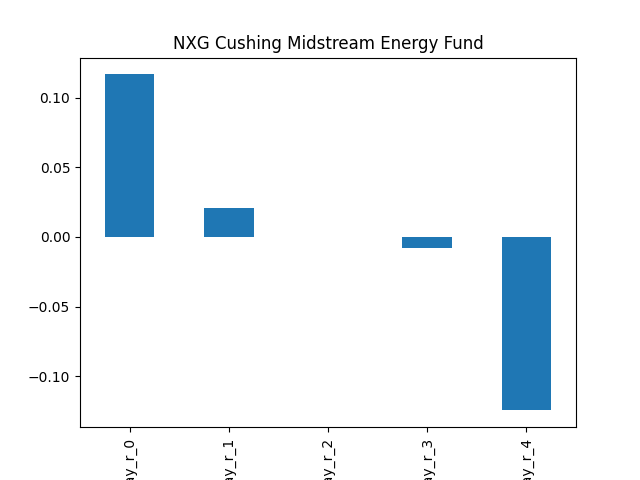

### Mit Filter

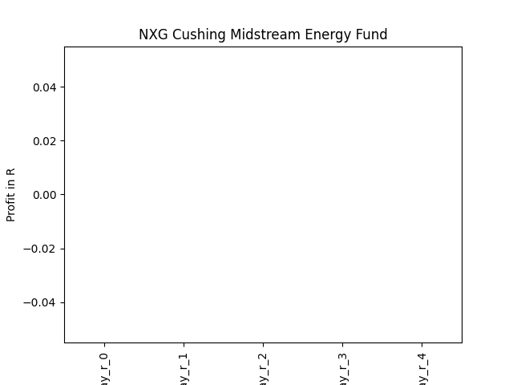

## SPE

### Erwartung in R
|      |   Day_r_0 |   Day_r_1 |   Day_r_2 |   Day_r_3 |   Day_r_4 |   Treffer |
|:-----|----------:|----------:|----------:|----------:|----------:|----------:|
| ohne |       0.1 |         0 |       0.1 |      -0   |       0   |       120 |
| mit  |       0   |         0 |      -0   |      -0.1 |      -0.2 |         1 |

### Ohne Filter
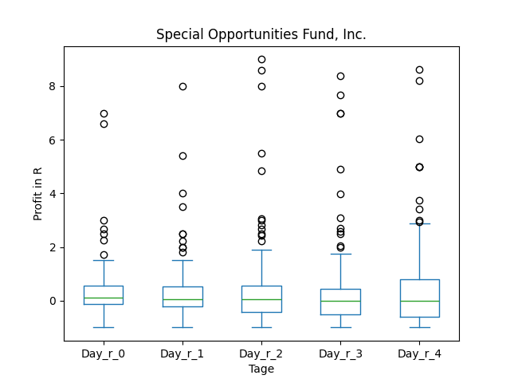
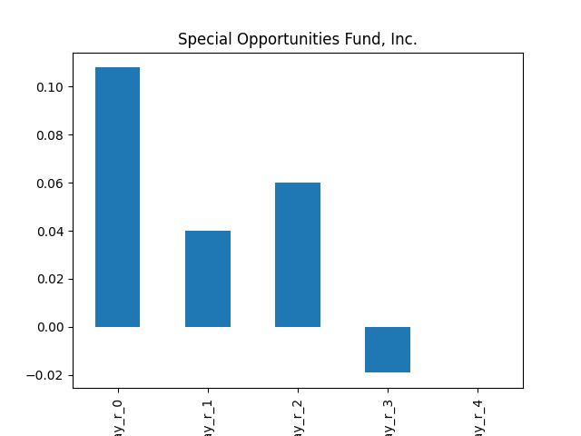

### Mit Filter
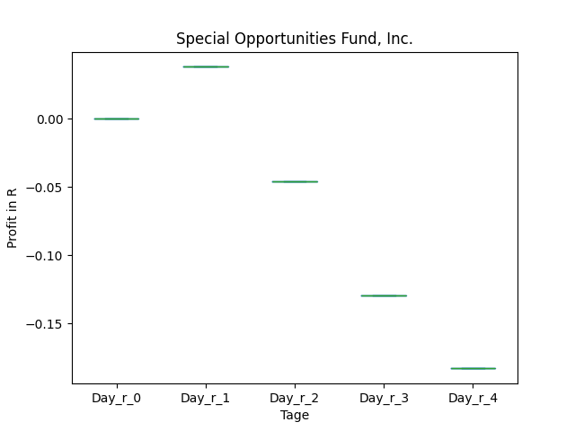
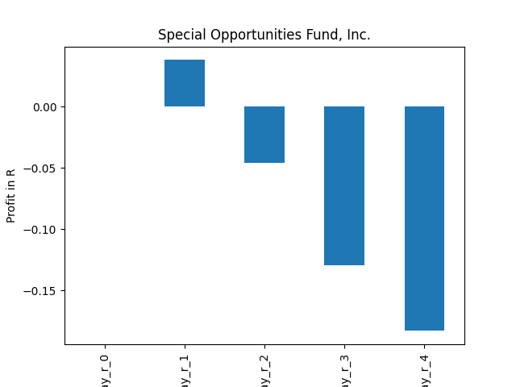

## PSBD

### Erwartung in R
|      |   Day_r_0 |   Day_r_1 |   Day_r_2 |   Day_r_3 |   Day_r_4 |   Treffer |
|:-----|----------:|----------:|----------:|----------:|----------:|----------:|
| ohne |       0.1 |       0   |       0.1 |       0.2 |        -0 |        14 |
| mit  |       0.1 |      -0.1 |      -0   |       0   |        -0 |         1 |

### Ohne Filter
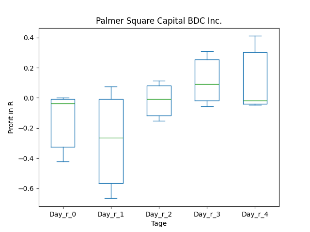
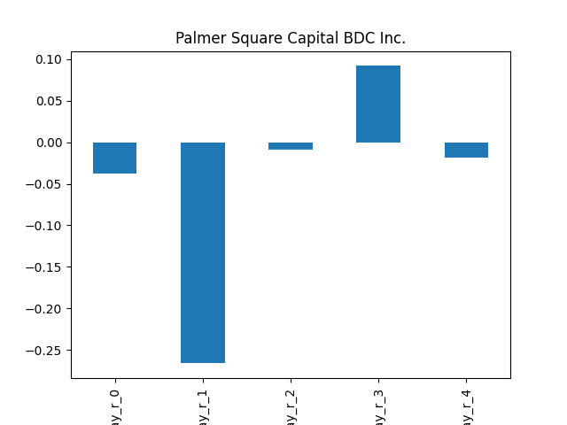

### Mit Filter
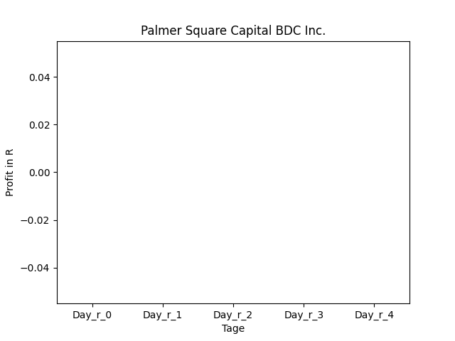

## PDX

### Erwartung in R
|      |   Day_r_0 |   Day_r_1 |   Day_r_2 |   Day_r_3 |   Day_r_4 |   Treffer |
|:-----|----------:|----------:|----------:|----------:|----------:|----------:|
| ohne |       0.3 |       0.2 |       0.2 |        -0 |       0.2 |        29 |
| mit  |     nan   |     nan   |     nan   |       nan |     nan   |         0 |

### Ohne Filter
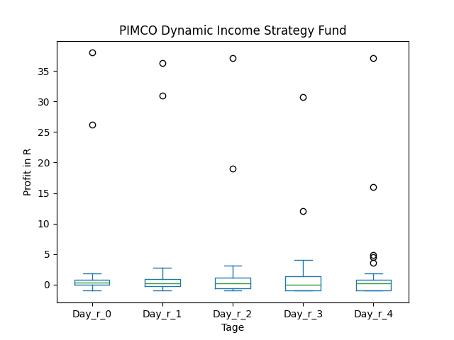
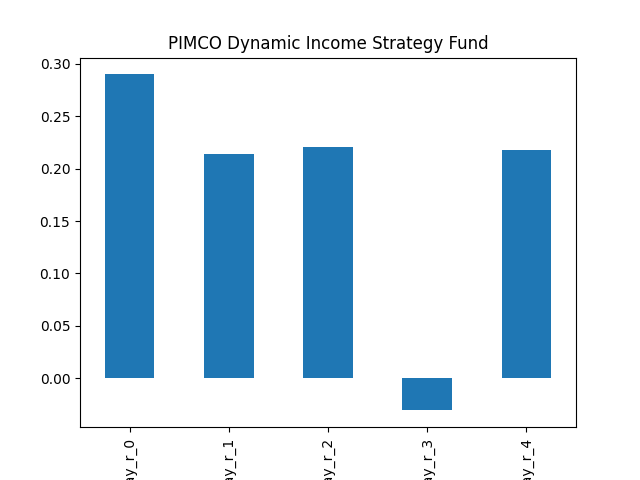

### Mit Filter
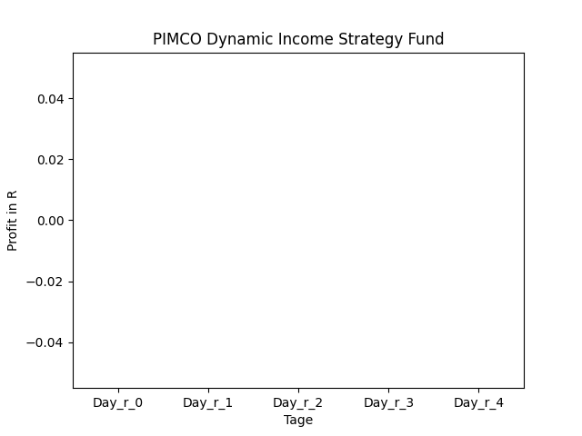
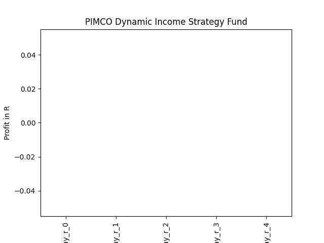

## IVR

### Erwartung in R
|      |   Day_r_0 |   Day_r_1 |   Day_r_2 |   Day_r_3 |   Day_r_4 |   Treffer |
|:-----|----------:|----------:|----------:|----------:|----------:|----------:|
| ohne |       0.1 |       0.1 |       0.2 |       0.2 |       0.2 |        65 |
| mit  |       0.2 |       0.1 |      -0.1 |       0.1 |       0.2 |        14 |

### Ohne Filter
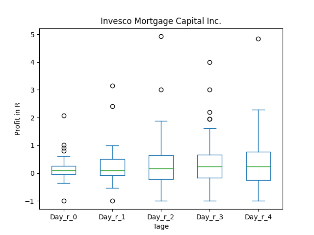
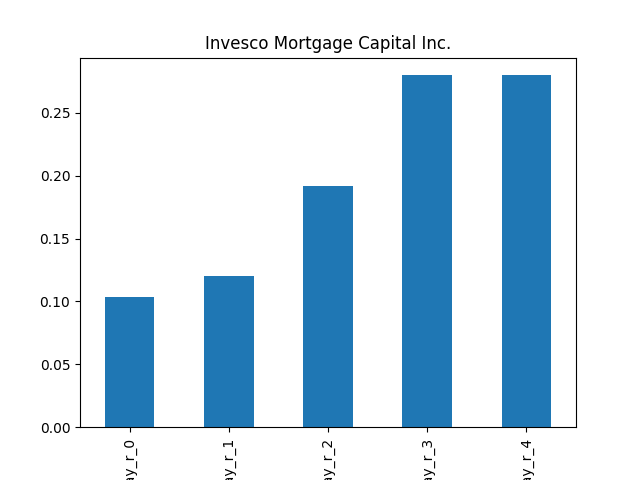

### Mit Filter
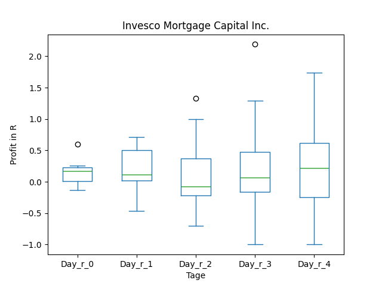
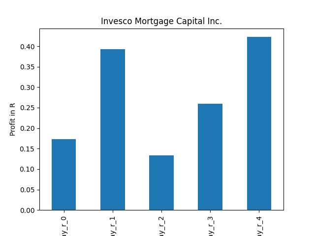

## FTEL

### Erwartung in R
|      |   Day_r_0 |   Day_r_1 |   Day_r_2 |   Day_r_3 |   Day_r_4 |   Treffer |
|:-----|----------:|----------:|----------:|----------:|----------:|----------:|
| ohne |       nan |       nan |       nan |       nan |       nan |         0 |
| mit  |       nan |       nan |       nan |       nan |       nan |         0 |

### Ohne Filter

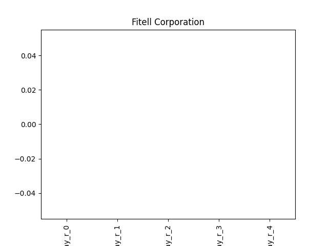

### Mit Filter

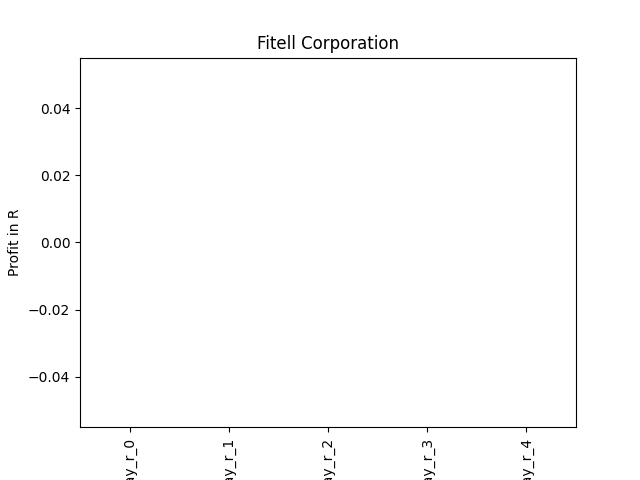

## AIO

### Erwartung in R
|      |   Day_r_0 |   Day_r_1 |   Day_r_2 |   Day_r_3 |   Day_r_4 |   Treffer |
|:-----|----------:|----------:|----------:|----------:|----------:|----------:|
| ohne |       0   |      -0   |       0.1 |       0   |      -0.1 |        75 |
| mit  |      -0.2 |      -0.1 |      -0.1 |      -0.1 |      -0.4 |         2 |

### Ohne Filter
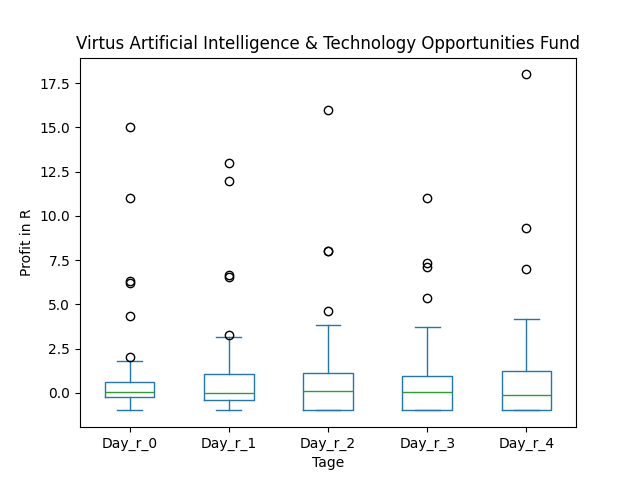
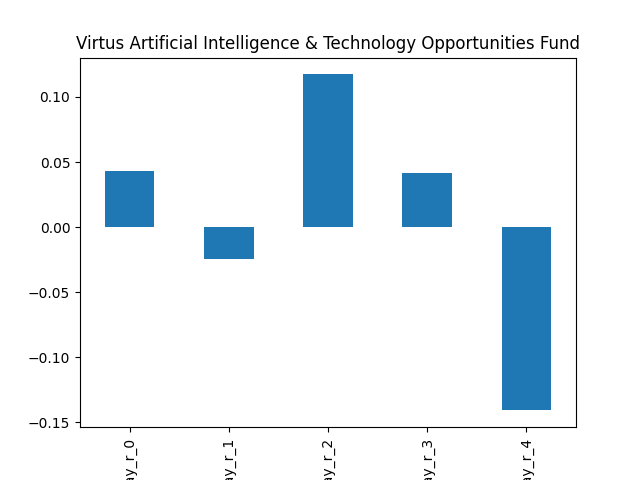

### Mit Filter
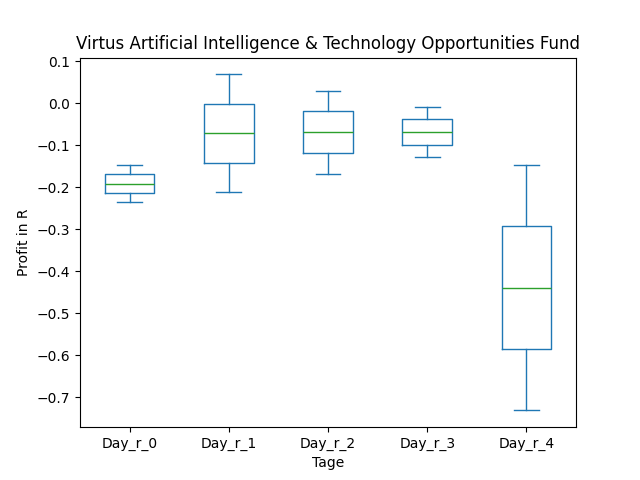
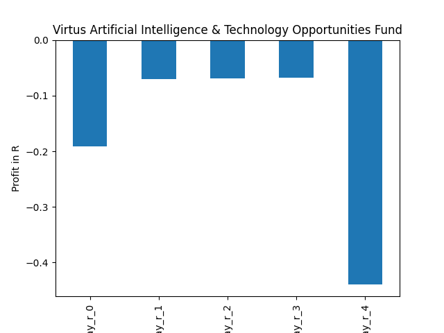

