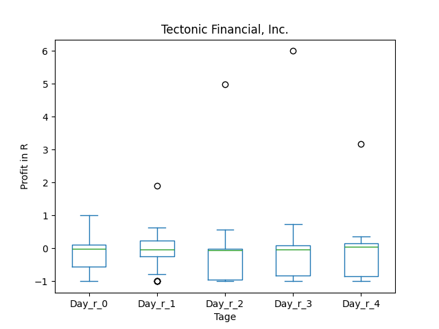
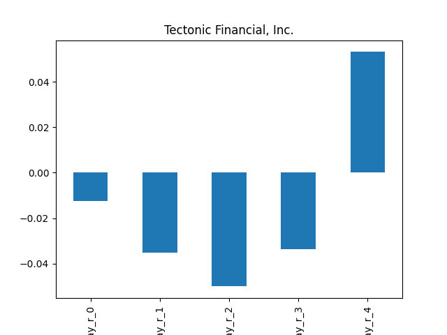
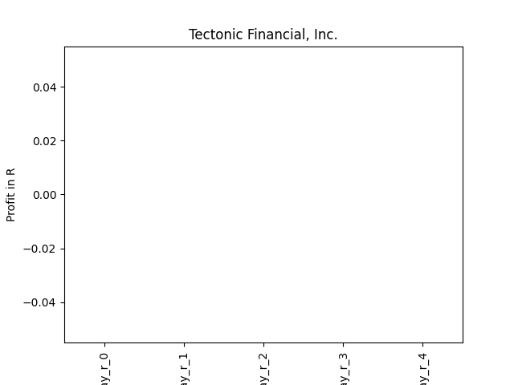
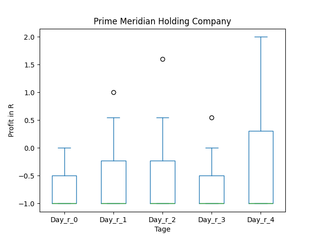
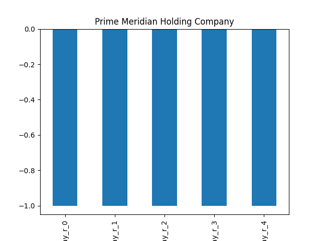
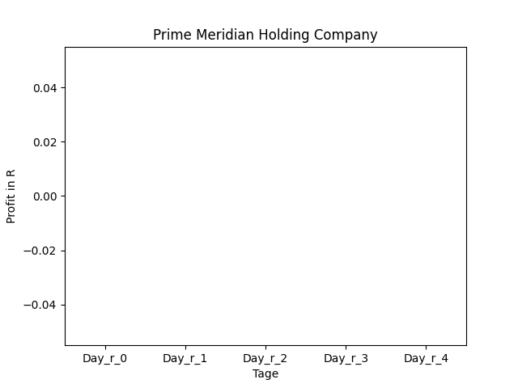

# dividend-shorter

bet on falling prices on payday **2025-02-07**.

## Signale

| Ticker   |   Divid Rate |   Close |   Volume |   last_close_volume |   Divid % | 5_Days_pos   | above_SMA_50   |
|:---------|-------------:|--------:|---------:|--------------------:|----------:|:-------------|:---------------|
| TECTP    |          0.3 |   10.68 |    21676 |              231500 |      2.84 | True         | True           |
| PMHG     |          1   |   29.28 |     6275 |              183732 |      3.42 | True         | True           |

## TECTP

### Erwartung in R
|      |   Day_r_0 |   Day_r_1 |   Day_r_2 |   Day_r_3 |   Day_r_4 |   Treffer |
|:-----|----------:|----------:|----------:|----------:|----------:|----------:|
| ohne |        -0 |        -0 |      -0.1 |        -0 |       0.1 |        22 |
| mit  |       nan |       nan |     nan   |       nan |     nan   |         0 |

### Ohne Filter

### Mit Filter

## PMHG

### Erwartung in R
|      |   Day_r_0 |   Day_r_1 |   Day_r_2 |   Day_r_3 |   Day_r_4 |   Treffer |
|:-----|----------:|----------:|----------:|----------:|----------:|----------:|
| ohne |        -1 |        -1 |        -1 |        -1 |        -1 |         7 |
| mit  |       nan |       nan |       nan |       nan |       nan |         0 |

### Ohne Filter

### Mit Filter

