# dividend-shorter

bet on falling prices on payday **2024-12-06**.

## Signale

| Ticker   |   Divid Rate |   Close |          Volume |   last_close_volume |   Divid % | 5_Days_pos   | above_SMA_50   |
|:---------|-------------:|--------:|----------------:|--------------------:|----------:|:-------------|:---------------|
| TKC      |         0.22 |    6.73 | 639800          |             4305854 |      3.29 | True         | True           |
| HAFN     |         0.38 |    5.75 |      4.1188e+06 |            23683100 |      6.59 | True         | False          |
| AMSF     |         3    |   58.84 | 309500          |            18210980 |      5.1  | False        | True           |

## TKC

### Erwartung in R
|      |   Day_r_0 |   Day_r_1 |   Day_r_2 |   Day_r_3 |   Day_r_4 |   Treffer |
|:-----|----------:|----------:|----------:|----------:|----------:|----------:|
| ohne |        -0 |      -0   |      -0.2 |      -0.5 |      -0.6 |        21 |
| mit  |        -0 |       0.1 |      -0   |      -0.2 |      -0.5 |        12 |

### Ohne Filter
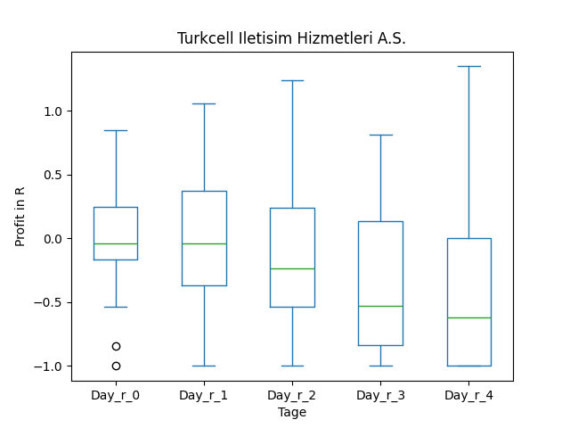
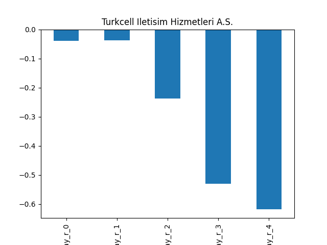

### Mit Filter
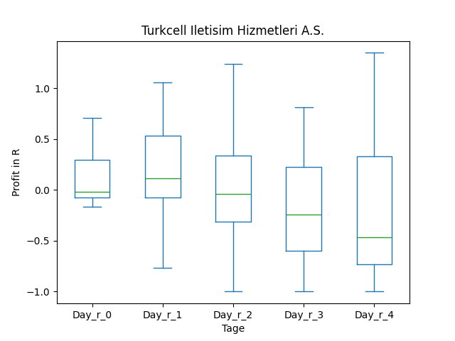
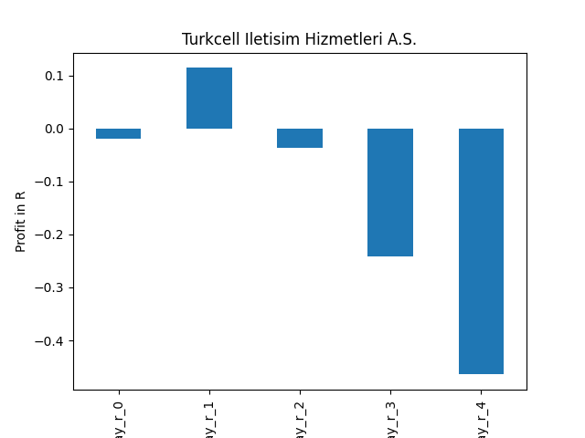

## HAFN

### Erwartung in R
|      |   Day_r_0 |   Day_r_1 |   Day_r_2 |   Day_r_3 |   Day_r_4 |   Treffer |
|:-----|----------:|----------:|----------:|----------:|----------:|----------:|
| ohne |       0.1 |      -0.1 |      -0.1 |      -0.1 |      -0.1 |         2 |
| mit  |       0.1 |      -0.1 |      -0.1 |      -0.1 |      -0.1 |         2 |

### Ohne Filter
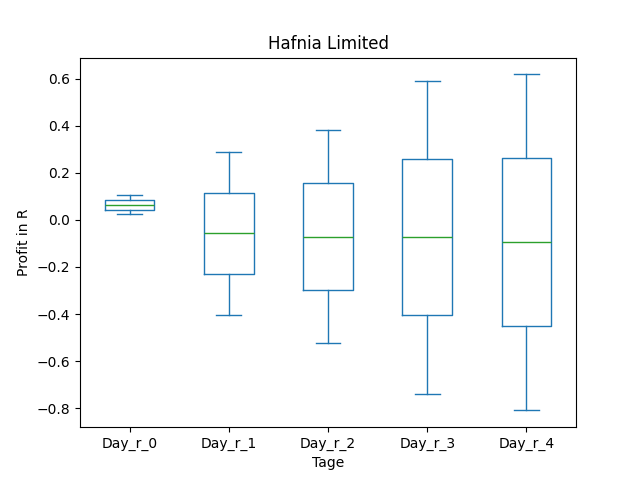
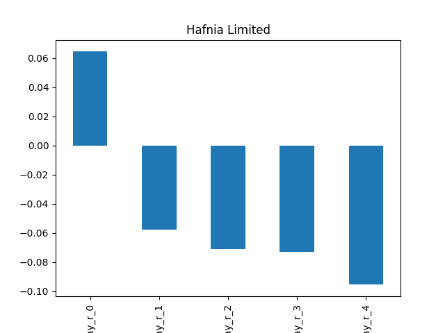

### Mit Filter

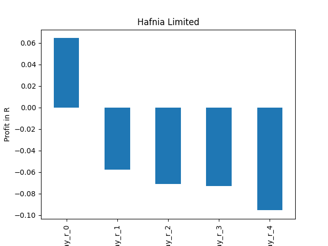

## AMSF

### Erwartung in R
|      |   Day_r_0 |   Day_r_1 |   Day_r_2 |   Day_r_3 |   Day_r_4 |   Treffer |
|:-----|----------:|----------:|----------:|----------:|----------:|----------:|
| ohne |       0.1 |       0.1 |       0.1 |      -0.1 |      -0   |        58 |
| mit  |       0.2 |       0.3 |       0.3 |       0.3 |       0.5 |         9 |

### Ohne Filter
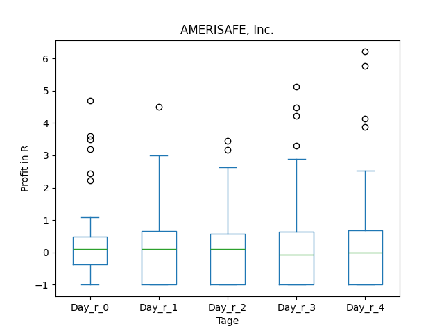
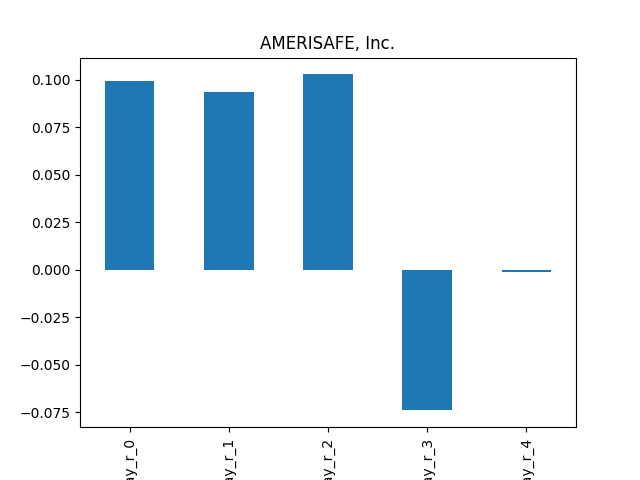

### Mit Filter
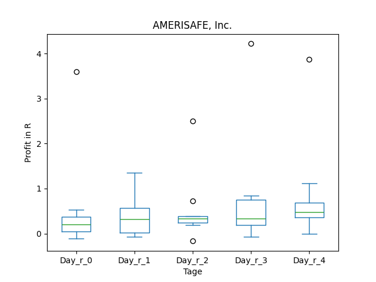
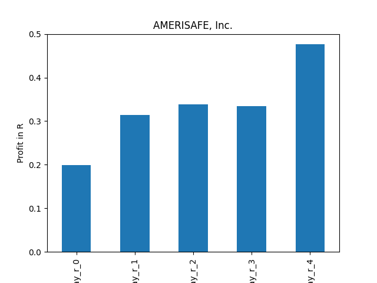

