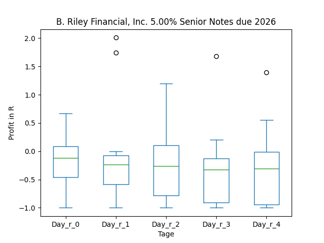
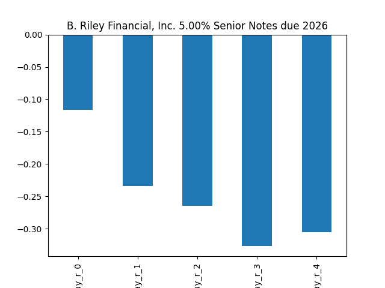
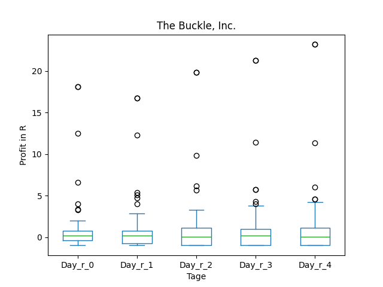
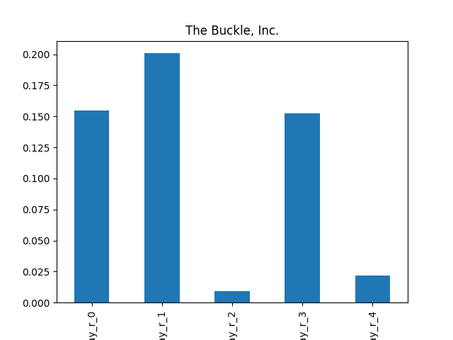
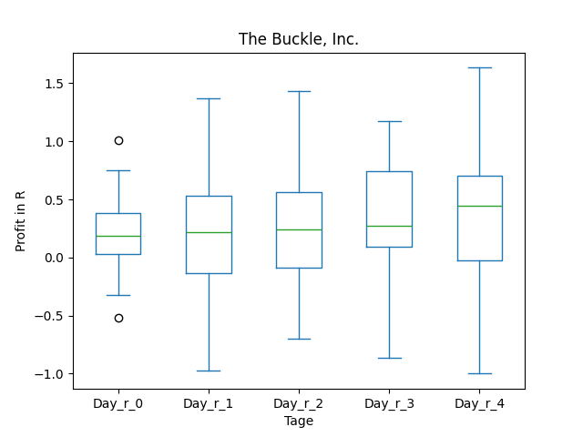
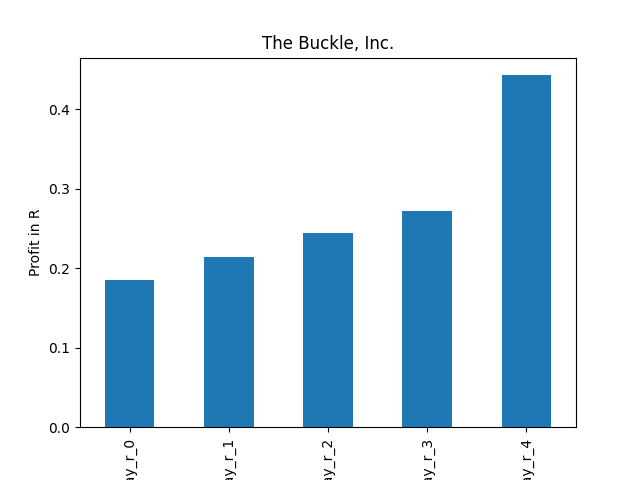

# dividend-shorter

bet on falling prices on payday **2025-01-15**.

## Signale

| Ticker   |   Divid Rate |   Close |   Volume |   last_close_volume |   Divid % | 5_Days_pos   | above_SMA_50   |
|:---------|-------------:|--------:|---------:|--------------------:|----------:|:-------------|:---------------|
| RILYZ    |         0.33 |    8.75 |    59100 |              517125 |      3.75 | False        | False          |
| RILYT    |         0.38 |    9.35 |    59600 |              557260 |      4.01 | False        | False          |
| RILYN    |         0.41 |   11.87 |   129400 |             1535978 |      3.42 | False        | False          |
| RILYG    |         0.31 |   11.72 |    50100 |              587172 |      2.67 | False        | False          |
| BKE      |         2.5  |   51.65 |   630600 |            32570490 |      4.84 | True         | True           |
| ARBKL    |         0.55 |    8.5  |    46700 |              396950 |      6.43 | True         | True           |

## RILYZ

### Erwartung in R
|      |   Day_r_0 |   Day_r_1 |   Day_r_2 |   Day_r_3 |   Day_r_4 |   Treffer |
|:-----|----------:|----------:|----------:|----------:|----------:|----------:|
| ohne |      -0.2 |      -0.4 |      -0.2 |      -0.1 |      -0.2 |        13 |
| mit  |     nan   |     nan   |     nan   |     nan   |     nan   |         0 |

### Ohne Filter

### Mit Filter

## RILYT

### Erwartung in R
|      |   Day_r_0 |   Day_r_1 |   Day_r_2 |   Day_r_3 |   Day_r_4 |   Treffer |
|:-----|----------:|----------:|----------:|----------:|----------:|----------:|
| ohne |         0 |      -0.1 |         0 |       0.4 |       0.3 |        15 |
| mit  |       nan |     nan   |       nan |     nan   |     nan   |         0 |

### Ohne Filter

### Mit Filter

## RILYN

### Erwartung in R
|      |   Day_r_0 |   Day_r_1 |   Day_r_2 |   Day_r_3 |   Day_r_4 |   Treffer |
|:-----|----------:|----------:|----------:|----------:|----------:|----------:|
| ohne |        -0 |       0.3 |      -0.1 |      -0.1 |        -0 |        20 |
| mit  |       nan |     nan   |     nan   |     nan   |       nan |         0 |

### Ohne Filter

### Mit Filter

## RILYG

### Erwartung in R
|      |   Day_r_0 |   Day_r_1 |   Day_r_2 |   Day_r_3 |   Day_r_4 |   Treffer |
|:-----|----------:|----------:|----------:|----------:|----------:|----------:|
| ohne |      -0.1 |      -0.2 |      -0.3 |      -0.3 |      -0.3 |        12 |
| mit  |     nan   |     nan   |     nan   |     nan   |     nan   |         0 |

### Ohne Filter

### Mit Filter

## BKE

### Erwartung in R
|      |   Day_r_0 |   Day_r_1 |   Day_r_2 |   Day_r_3 |   Day_r_4 |   Treffer |
|:-----|----------:|----------:|----------:|----------:|----------:|----------:|
| ohne |       0.2 |       0.2 |       0   |       0.2 |       0   |        99 |
| mit  |       0.2 |       0.2 |       0.2 |       0.3 |       0.4 |        16 |

### Ohne Filter

### Mit Filter

## ARBKL

### Erwartung in R
|      |   Day_r_0 |   Day_r_1 |   Day_r_2 |   Day_r_3 |   Day_r_4 |   Treffer |
|:-----|----------:|----------:|----------:|----------:|----------:|----------:|
| ohne |      -0.1 |       0.3 |       0.5 |         0 |       0.1 |        11 |
| mit  |     nan   |     nan   |     nan   |       nan |     nan   |         0 |

### Ohne Filter

### Mit Filter

