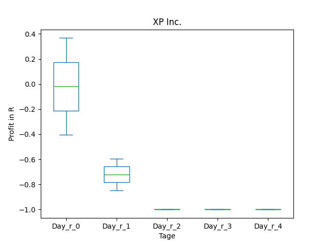
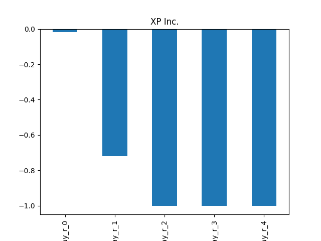
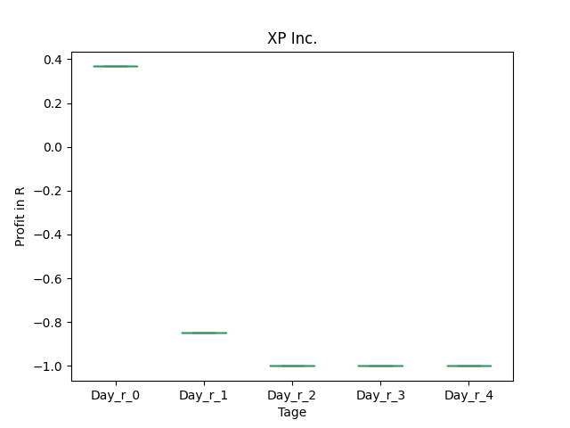
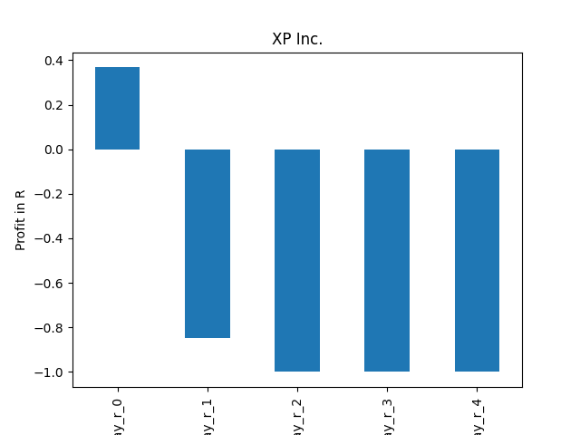
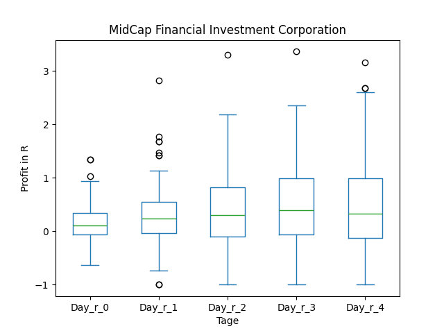
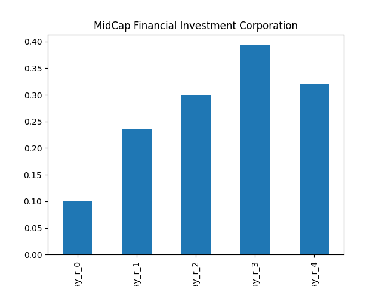
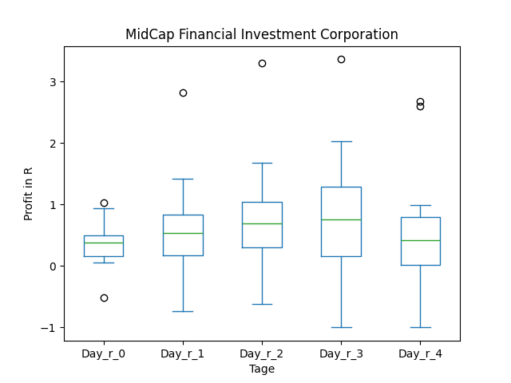
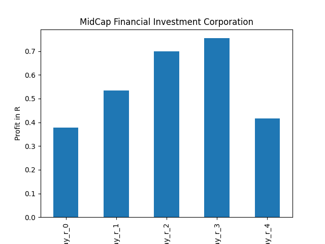
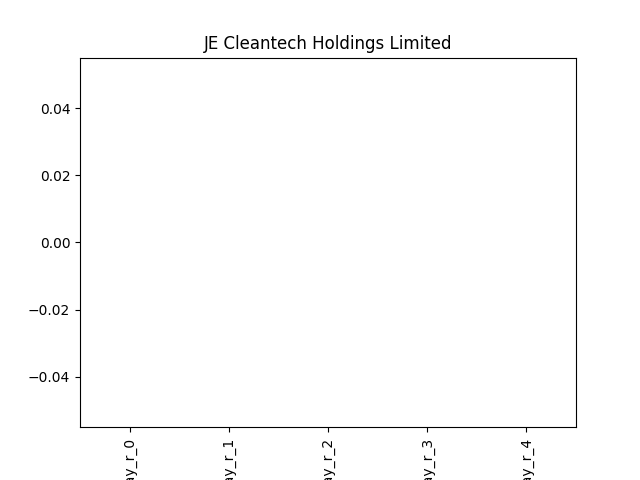

# dividend-shorter

bet on falling prices on payday **2024-12-10**.

## Signale

| Ticker   |   Divid Rate |   Close |          Volume |   last_close_volume |   Divid % | 5_Days_pos   | above_SMA_50   |
|:---------|-------------:|--------:|----------------:|--------------------:|----------:|:-------------|:---------------|
| XP       |         0.65 |   13.43 |      5.4184e+06 |            72769112 |      4.84 | True         | False          |
| MFIC     |         0.38 |   14    | 749000          |            10486000 |      2.71 | False        | True           |
| JCSE     |         0.09 |    1.66 | 124000          |              205840 |      5.42 | True         | True           |

## XP

### Erwartung in R
|      |   Day_r_0 |   Day_r_1 |   Day_r_2 |   Day_r_3 |   Day_r_4 |   Treffer |
|:-----|----------:|----------:|----------:|----------:|----------:|----------:|
| ohne |      -0   |      -0.7 |        -1 |        -1 |        -1 |         2 |
| mit  |       0.4 |      -0.8 |        -1 |        -1 |        -1 |         1 |

### Ohne Filter

### Mit Filter

## MFIC

### Erwartung in R
|      |   Day_r_0 |   Day_r_1 |   Day_r_2 |   Day_r_3 |   Day_r_4 |   Treffer |
|:-----|----------:|----------:|----------:|----------:|----------:|----------:|
| ohne |       0.1 |       0.2 |       0.3 |       0.4 |       0.3 |        72 |
| mit  |       0.4 |       0.5 |       0.7 |       0.8 |       0.4 |        11 |

### Ohne Filter

### Mit Filter

## JCSE

### Erwartung in R
|      |   Day_r_0 |   Day_r_1 |   Day_r_2 |   Day_r_3 |   Day_r_4 |   Treffer |
|:-----|----------:|----------:|----------:|----------:|----------:|----------:|
| ohne |       nan |       nan |       nan |       nan |       nan |         0 |
| mit  |       nan |       nan |       nan |       nan |       nan |         0 |

### Ohne Filter

### Mit Filter

