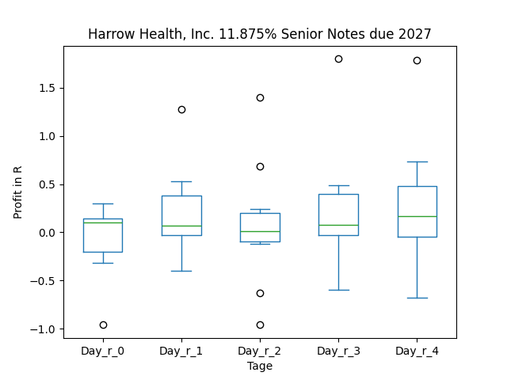
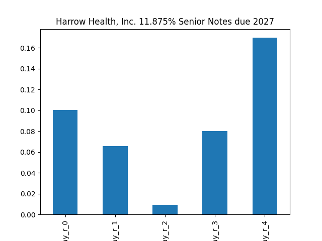
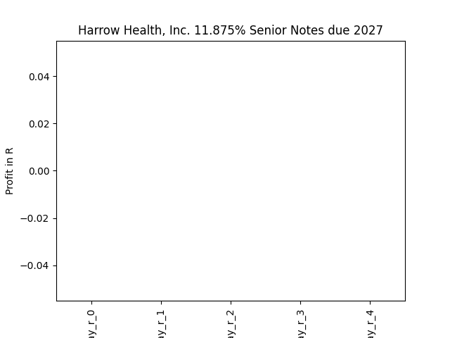
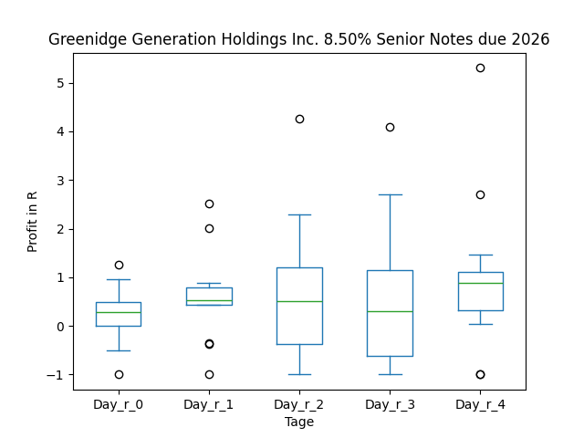
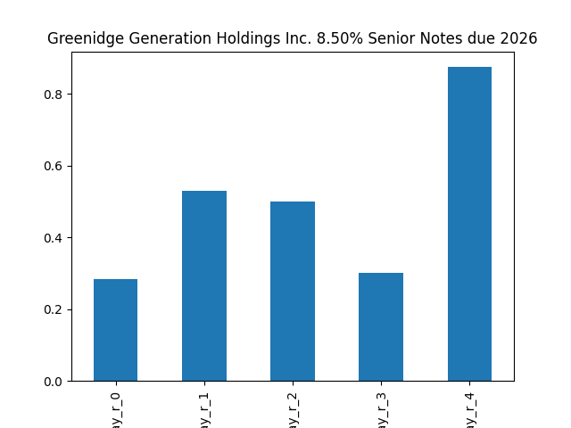
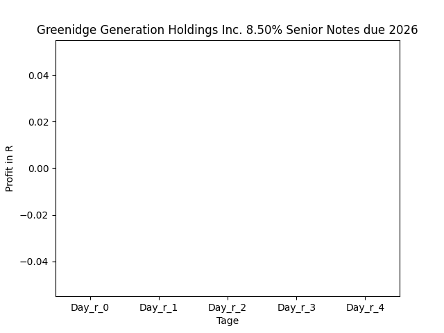
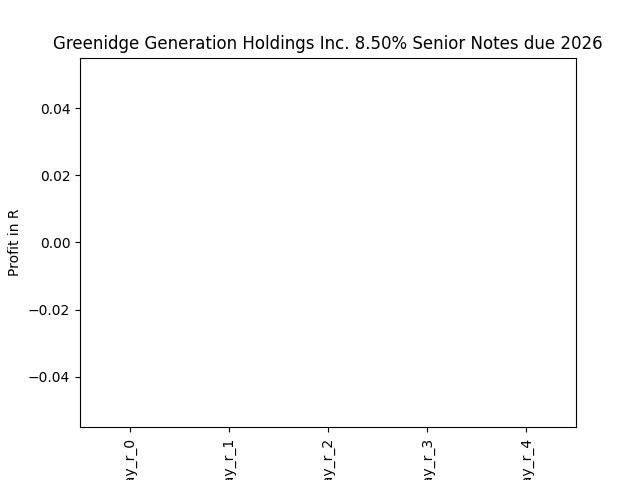
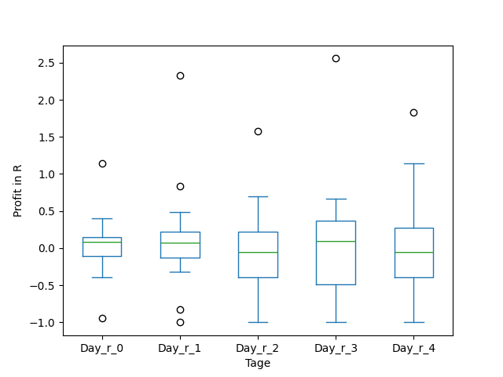
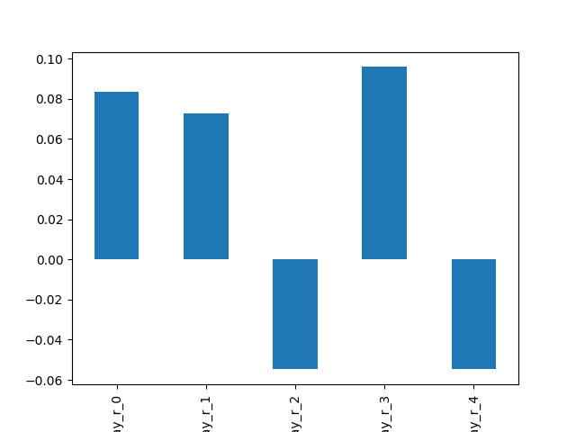

# dividend-shorter

bet on falling prices on payday **2025-07-15**.

## Signale

| Ticker   |   Divid Rate |   Close |   Volume |   last_close_volume |   Divid % | 5_Days_pos   | above_SMA_50   |
|:---------|-------------:|--------:|---------:|--------------------:|----------:|:-------------|:---------------|
| RILYZ    |         0.33 |    9.72 |    25400 |              246888 |      3.38 | True         | True           |
| RILYT    |         0.38 |   10.2  |    33800 |              344760 |      3.68 | True         | True           |
| MVO      |         0.18 |    6.08 |   229400 |             1394752 |      3.04 | True         | True           |
| HROWM    |         0.74 |   26.59 |     8700 |              231333 |      2.79 | True         | True           |
| GREEL    |         0.53 |    8.29 |    14900 |              123521 |      6.41 | False        | True           |
| BWSN     |         0.51 |   19.94 |    17500 |              348950 |      2.55 | True         | True           |
| ARBKL    |         0.55 |    4.4  |   149800 |              659120 |     12.43 | True         | False          |

## RILYZ

### Erwartung in R
|      |   Day_r_0 |   Day_r_1 |   Day_r_2 |   Day_r_3 |   Day_r_4 |   Treffer |
|:-----|----------:|----------:|----------:|----------:|----------:|----------:|
| ohne |      -0.1 |      -0.2 |      -0.2 |      -0.1 |      -0.2 |        15 |
| mit  |     nan   |     nan   |     nan   |     nan   |     nan   |         0 |

### Ohne Filter

### Mit Filter

## RILYT

### Erwartung in R
|      |   Day_r_0 |   Day_r_1 |   Day_r_2 |   Day_r_3 |   Day_r_4 |   Treffer |
|:-----|----------:|----------:|----------:|----------:|----------:|----------:|
| ohne |         0 |      -0.1 |         0 |       0.4 |         0 |        17 |
| mit  |       nan |     nan   |       nan |     nan   |       nan |         0 |

### Ohne Filter

### Mit Filter

## MVO

### Erwartung in R
|      |   Day_r_0 |   Day_r_1 |   Day_r_2 |   Day_r_3 |   Day_r_4 |   Treffer |
|:-----|----------:|----------:|----------:|----------:|----------:|----------:|
| ohne |       0.1 |       0.3 |       0.5 |       0.6 |       0.7 |        72 |
| mit  |       0.4 |       0.4 |       0.7 |       0.9 |       1   |        15 |

### Ohne Filter

### Mit Filter

## HROWM

### Erwartung in R
|      |   Day_r_0 |   Day_r_1 |   Day_r_2 |   Day_r_3 |   Day_r_4 |   Treffer |
|:-----|----------:|----------:|----------:|----------:|----------:|----------:|
| ohne |       0.1 |       0.1 |         0 |       0.1 |       0.2 |        10 |
| mit  |     nan   |     nan   |       nan |     nan   |     nan   |         0 |

### Ohne Filter

### Mit Filter

## GREEL

### Erwartung in R
|      |   Day_r_0 |   Day_r_1 |   Day_r_2 |   Day_r_3 |   Day_r_4 |   Treffer |
|:-----|----------:|----------:|----------:|----------:|----------:|----------:|
| ohne |       0.3 |       0.5 |       0.5 |       0.3 |       0.9 |        13 |
| mit  |     nan   |     nan   |     nan   |     nan   |     nan   |         0 |

### Ohne Filter

### Mit Filter

## BWSN

### Erwartung in R
|      |   Day_r_0 |   Day_r_1 |   Day_r_2 |   Day_r_3 |   Day_r_4 |   Treffer |
|:-----|----------:|----------:|----------:|----------:|----------:|----------:|
| ohne |       0.1 |       0.1 |      -0.1 |       0.1 |      -0.1 |        17 |
| mit  |     nan   |     nan   |     nan   |     nan   |     nan   |         0 |

### Ohne Filter

### Mit Filter

## ARBKL

### Erwartung in R
|      |   Day_r_0 |   Day_r_1 |   Day_r_2 |   Day_r_3 |   Day_r_4 |   Treffer |
|:-----|----------:|----------:|----------:|----------:|----------:|----------:|
| ohne |      -0.1 |       0.3 |       0.5 |         0 |       0.1 |        13 |
| mit  |     nan   |     nan   |     nan   |       nan |     nan   |         0 |

### Ohne Filter

### Mit Filter

