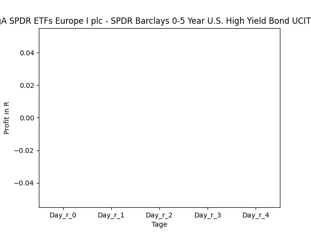
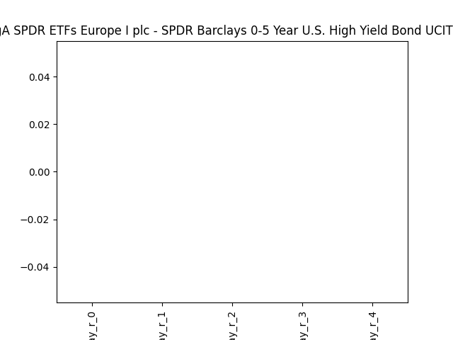
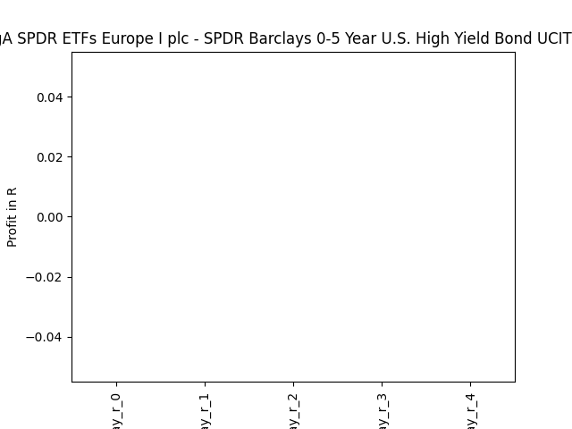
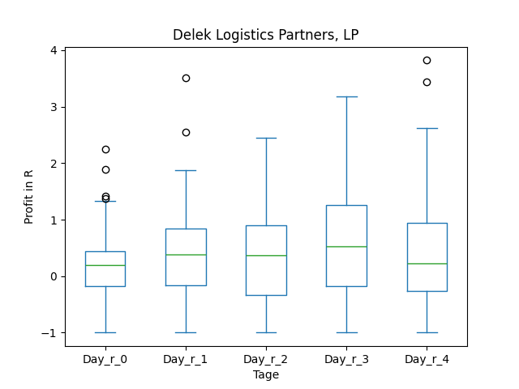
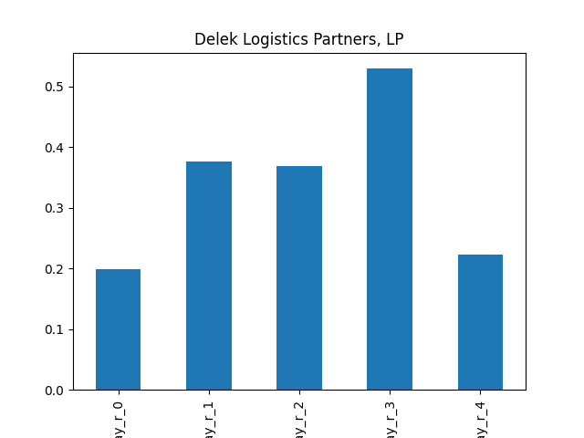
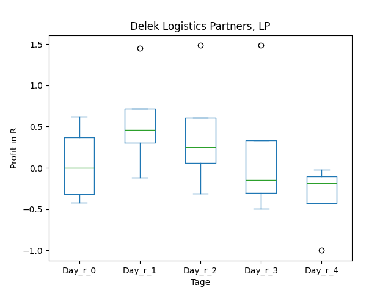
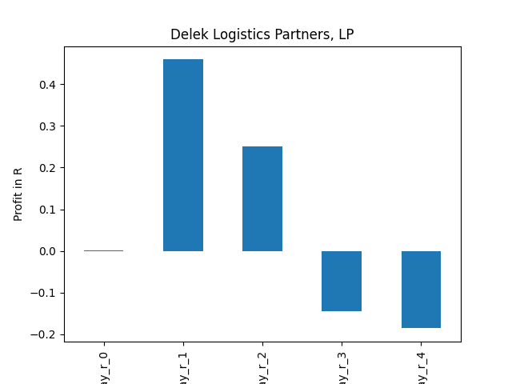

# dividend-shorter

bet on falling prices on payday **2025-02-04**.

## Signale

| Ticker   |   Divid Rate |   Close |   Volume |   last_close_volume |   Divid % | 5_Days_pos   | above_SMA_50   |
|:---------|-------------:|--------:|---------:|--------------------:|----------:|:-------------|:---------------|
| SGSSF    |          1.5 |   39.93 |    14146 |              564850 |      3.76 | False        | False          |
| DKL      |          1.1 |   43.85 |   236100 |            10352985 |      2.52 | True         | True           |

## SGSSF

### Erwartung in R
|      |   Day_r_0 |   Day_r_1 |   Day_r_2 |   Day_r_3 |   Day_r_4 |   Treffer |
|:-----|----------:|----------:|----------:|----------:|----------:|----------:|
| ohne |       nan |       nan |       nan |       nan |       nan |         0 |
| mit  |       nan |       nan |       nan |       nan |       nan |         0 |

### Ohne Filter

### Mit Filter

## DKL

### Erwartung in R
|      |   Day_r_0 |   Day_r_1 |   Day_r_2 |   Day_r_3 |   Day_r_4 |   Treffer |
|:-----|----------:|----------:|----------:|----------:|----------:|----------:|
| ohne |       0.2 |       0.4 |       0.4 |       0.5 |       0.2 |        48 |
| mit  |       0   |       0.5 |       0.3 |      -0.1 |      -0.2 |         4 |

### Ohne Filter

### Mit Filter

