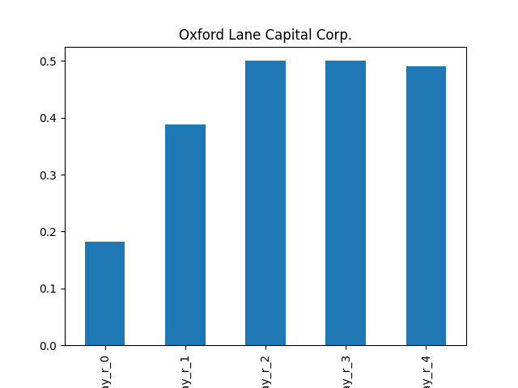
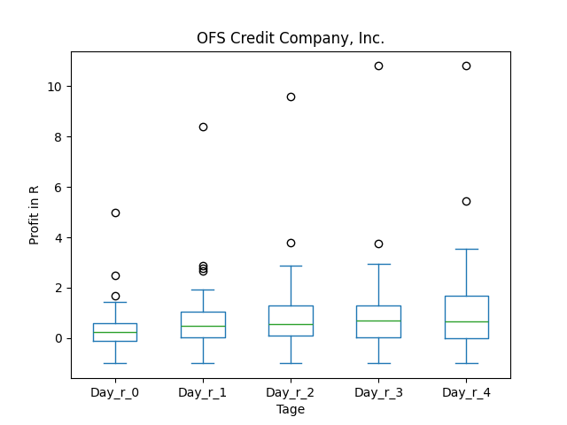
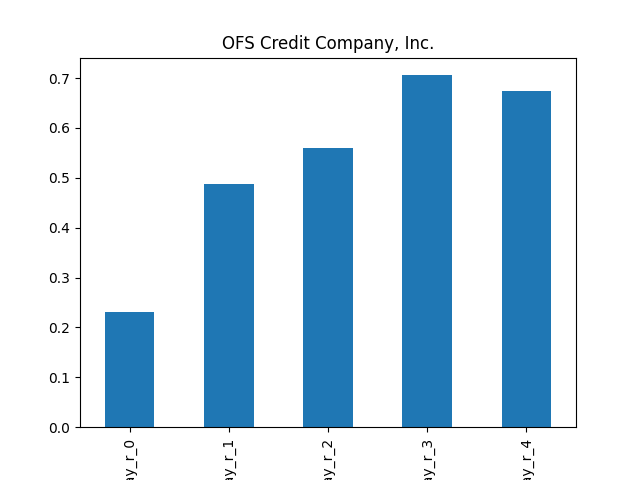
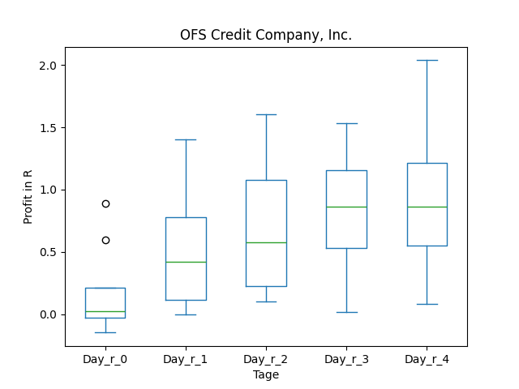
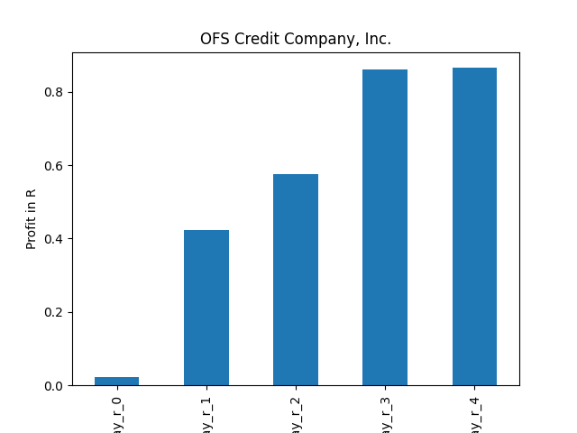

# dividend-shorter

bet on falling prices on payday **2026-02-13**.

## Signale

| Ticker   |   Divid Rate |   Close |          Volume |   last_close_volume |   Divid % | 5_Days_pos   | above_SMA_50   |
|:---------|-------------:|--------:|----------------:|--------------------:|----------:|:-------------|:---------------|
| OXLC     |         0.4  |   10.69 |      1.6053e+06 |            17160657 |      3.74 | False        | False          |
| OCCI     |         0.12 |    4.29 | 611000          |             2621190 |      2.68 | True         | False          |

## OXLC

### Erwartung in R
|      |   Day_r_0 |   Day_r_1 |   Day_r_2 |   Day_r_3 |   Day_r_4 |   Treffer |
|:-----|----------:|----------:|----------:|----------:|----------:|----------:|
| ohne |       0.2 |       0.4 |       0.5 |       0.5 |       0.5 |       126 |
| mit  |      -0.6 |      -0.6 |      -1   |      -0.9 |      -1   |         1 |

### Ohne Filter

### Mit Filter

## OCCI

### Erwartung in R
|      |   Day_r_0 |   Day_r_1 |   Day_r_2 |   Day_r_3 |   Day_r_4 |   Treffer |
|:-----|----------:|----------:|----------:|----------:|----------:|----------:|
| ohne |       0.2 |       0.5 |       0.6 |       0.7 |       0.7 |        58 |
| mit  |       0   |       0.4 |       0.6 |       0.9 |       0.9 |         8 |

### Ohne Filter

### Mit Filter

