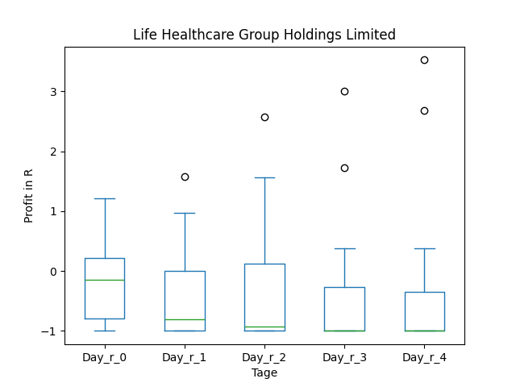
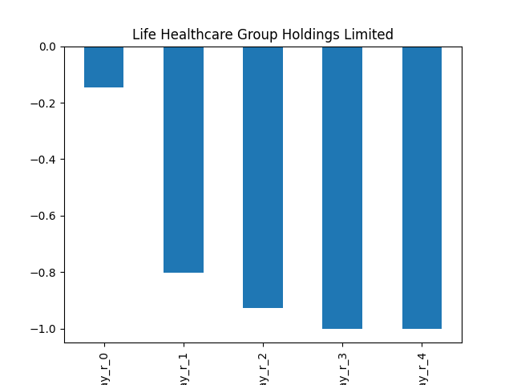
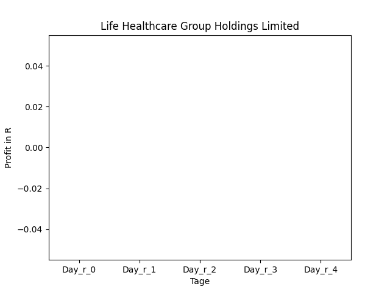
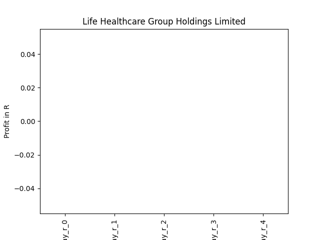
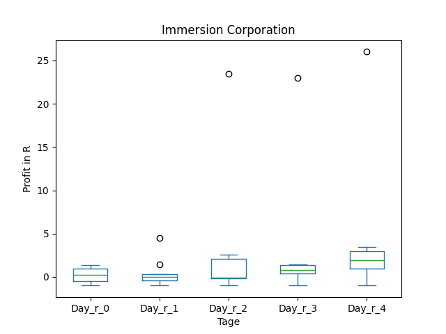
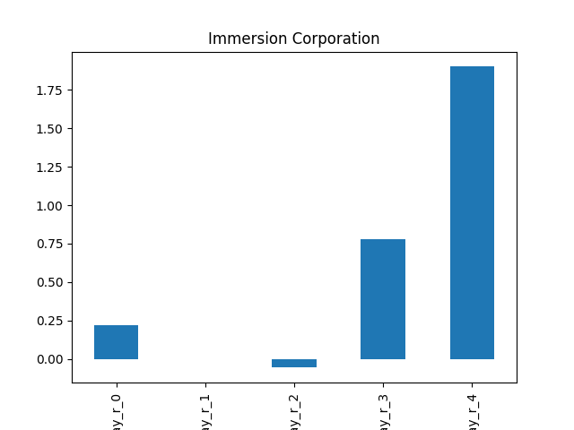
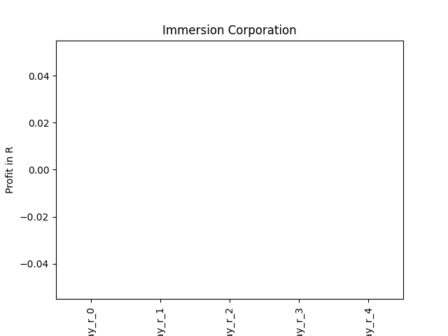

# dividend-shorter

bet on falling prices on payday **2025-01-10**.

## Signale

| Ticker   |   Divid Rate |   Close |         Volume |   last_close_volume |   Divid % | 5_Days_pos   | above_SMA_50   |
|:---------|-------------:|--------:|---------------:|--------------------:|----------:|:-------------|:---------------|
| LTGHY    |         0.16 |    3.43 | 52200          |              179046 |      4.53 | False        | False          |
| IMMR     |         0.24 |    8.66 |     1.0445e+06 |             9045370 |      2.83 | True         | False          |

## LTGHY

### Erwartung in R
|      |   Day_r_0 |   Day_r_1 |   Day_r_2 |   Day_r_3 |   Day_r_4 |   Treffer |
|:-----|----------:|----------:|----------:|----------:|----------:|----------:|
| ohne |      -0.1 |      -0.8 |      -0.9 |        -1 |        -1 |        16 |
| mit  |     nan   |     nan   |     nan   |       nan |       nan |         0 |

### Ohne Filter

### Mit Filter

## IMMR

### Erwartung in R
|      |   Day_r_0 |   Day_r_1 |   Day_r_2 |   Day_r_3 |   Day_r_4 |   Treffer |
|:-----|----------:|----------:|----------:|----------:|----------:|----------:|
| ohne |       0.2 |         0 |      -0.1 |       0.8 |       1.9 |         9 |
| mit  |     nan   |       nan |     nan   |     nan   |     nan   |         0 |

### Ohne Filter

### Mit Filter

