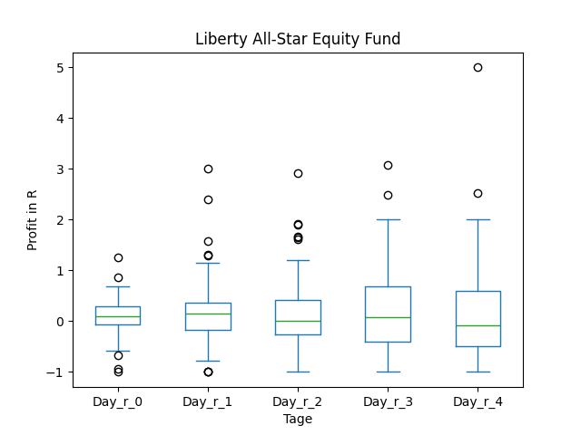
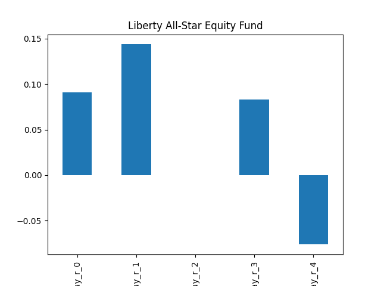
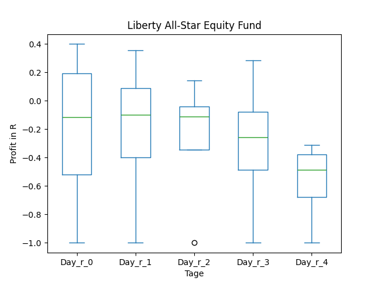
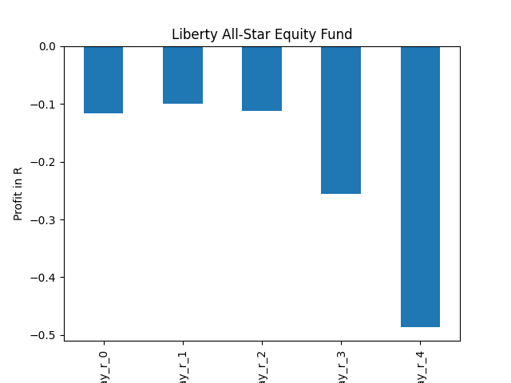
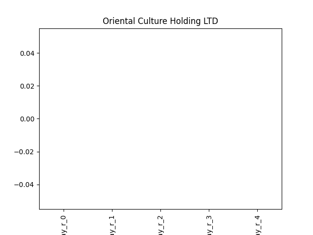

# dividend-shorter

bet on falling prices on payday **2026-01-22**.

## Signale

| Ticker   |   Divid Rate |   Close |     Volume |   last_close_volume |   Divid % | 5_Days_pos   | above_SMA_50   |
|:---------|-------------:|--------:|-----------:|--------------------:|----------:|:-------------|:---------------|
| USA      |         0.18 |    6.31 | 1.2027e+06 |             7589037 |      2.85 | False        | True           |
| OCG      |         0.05 |    1.8  | 1.4733e+06 |             2651940 |      2.78 | False        | False          |

## USA

### Erwartung in R
|      |   Day_r_0 |   Day_r_1 |   Day_r_2 |   Day_r_3 |   Day_r_4 |   Treffer |
|:-----|----------:|----------:|----------:|----------:|----------:|----------:|
| ohne |       0.1 |       0.1 |       0   |       0.1 |      -0.1 |        70 |
| mit  |      -0.1 |      -0.1 |      -0.1 |      -0.3 |      -0.5 |         4 |

### Ohne Filter

### Mit Filter

## OCG

### Erwartung in R
|      |   Day_r_0 |   Day_r_1 |   Day_r_2 |   Day_r_3 |   Day_r_4 |   Treffer |
|:-----|----------:|----------:|----------:|----------:|----------:|----------:|
| ohne |       nan |       nan |       nan |       nan |       nan |         0 |
| mit  |       nan |       nan |       nan |       nan |       nan |         0 |

### Ohne Filter

### Mit Filter

