# dividend-shorter

bet on falling prices on payday **2026-02-20**.

## Signale

| Ticker   |   Divid Rate |   Close |   Volume |   last_close_volume |   Divid % | 5_Days_pos   | above_SMA_50   |
|:---------|-------------:|--------:|---------:|--------------------:|----------:|:-------------|:---------------|
| SLVO     |         7.91 |   99.14 |   203500 |            20174990 |      7.98 | True         | True           |
| NXDT     |         0.15 |    4.85 |   108800 |              527680 |      3.09 | True         | True           |
| IFN      |         0.45 |   13.79 |   505000 |             6963950 |      3.26 | False        | False          |
| IAF      |         0.36 |   14.23 |    18200 |              258986 |      2.53 | False        | True           |
| HQL      |         0.56 |   17.43 |   185300 |             3229779 |      3.21 | True         | True           |
| HQH      |         0.63 |   20.46 |   360800 |             7381968 |      3.08 | True         | True           |
| BBSEY    |         0.49 |    7.2  |   211900 |             1525680 |      6.82 | False        | True           |
| AUDC     |         0.2  |    7.29 |   230300 |             1678887 |      2.74 | True         | False          |
| AOMR     |         0.32 |    9    |   289300 |             2603700 |      3.56 | True         | True           |

## SLVO

### Erwartung in R
|      |   Day_r_0 |   Day_r_1 |   Day_r_2 |   Day_r_3 |   Day_r_4 |   Treffer |
|:-----|----------:|----------:|----------:|----------:|----------:|----------:|
| ohne |       0   |       0   |      -0   |      -0.2 |      -0.2 |       152 |
| mit  |       0.2 |       0.2 |      -0.1 |      -0   |      -0.3 |         2 |

### Ohne Filter

### Mit Filter

## NXDT

### Erwartung in R
|      |   Day_r_0 |   Day_r_1 |   Day_r_2 |   Day_r_3 |   Day_r_4 |   Treffer |
|:-----|----------:|----------:|----------:|----------:|----------:|----------:|
| ohne |      -0.1 |       0   |       0.2 |       0.1 |       0   |        30 |
| mit  |      -0.2 |      -0.3 |      -0.5 |      -0.5 |      -0.2 |         2 |

### Ohne Filter
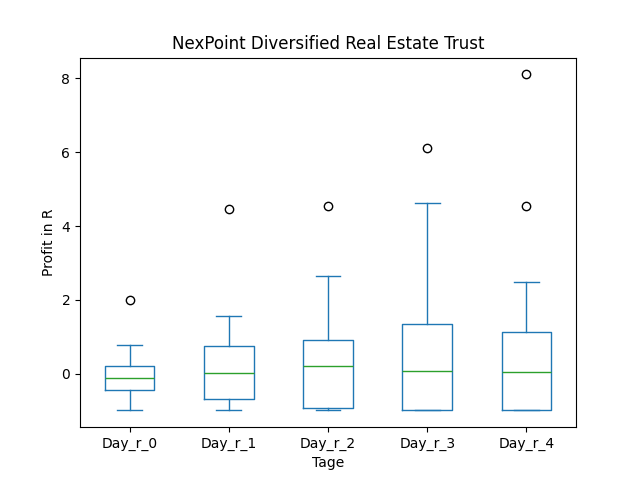
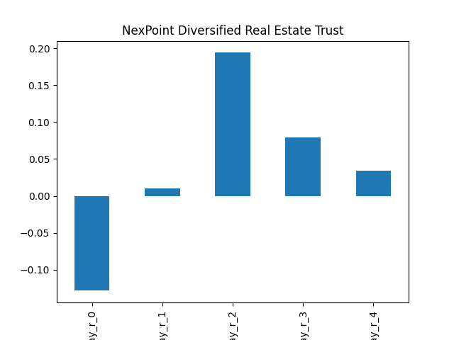

### Mit Filter
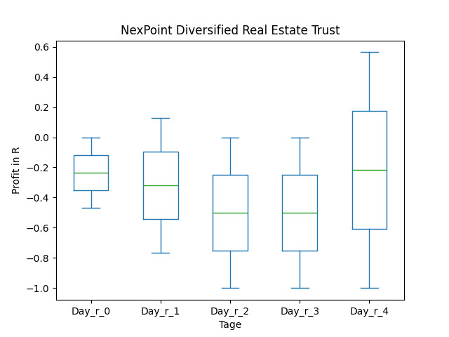
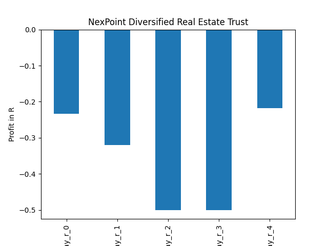

## IFN

### Erwartung in R
|      |   Day_r_0 |   Day_r_1 |   Day_r_2 |   Day_r_3 |   Day_r_4 |   Treffer |
|:-----|----------:|----------:|----------:|----------:|----------:|----------:|
| ohne |       0.1 |       0.2 |       0.1 |       0.1 |       0.1 |        65 |
| mit  |       0   |       0   |       0   |       0.1 |      -0   |        25 |

### Ohne Filter
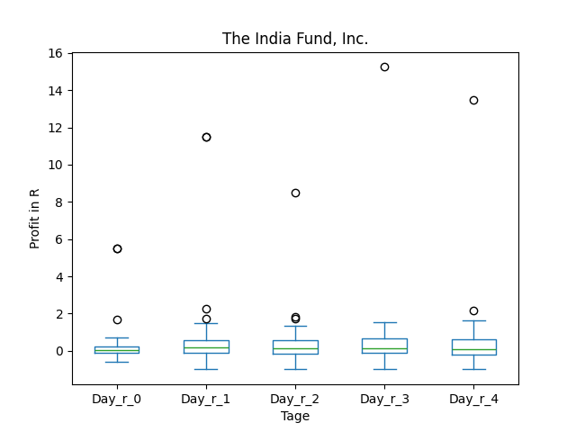
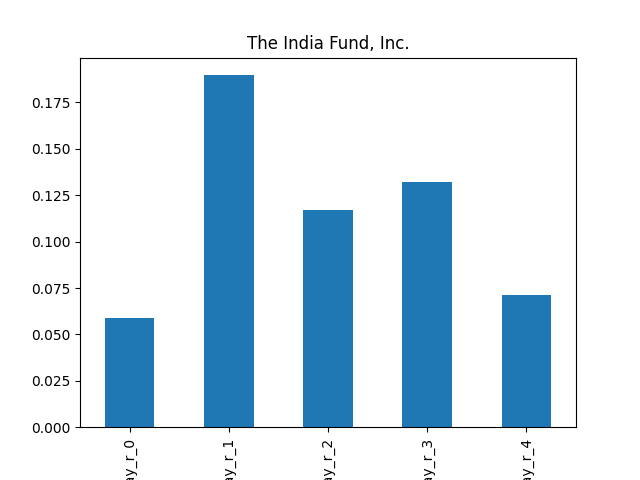

### Mit Filter
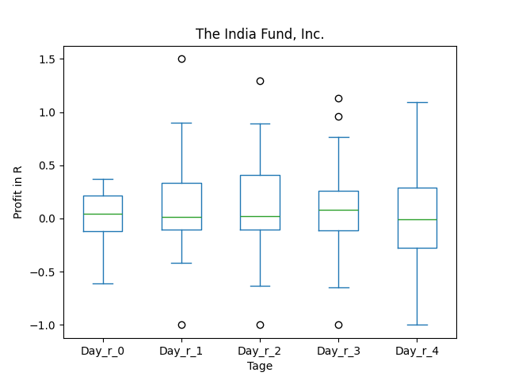
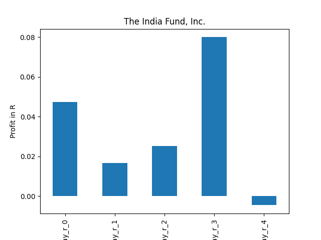

## IAF

### Erwartung in R
|      |   Day_r_0 |   Day_r_1 |   Day_r_2 |   Day_r_3 |   Day_r_4 |   Treffer |
|:-----|----------:|----------:|----------:|----------:|----------:|----------:|
| ohne |       0.1 |       0.1 |         0 |       0.1 |        -0 |        70 |
| mit  |     nan   |     nan   |       nan |     nan   |       nan |         0 |

### Ohne Filter
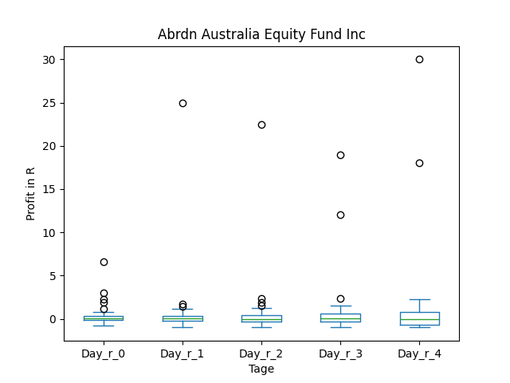
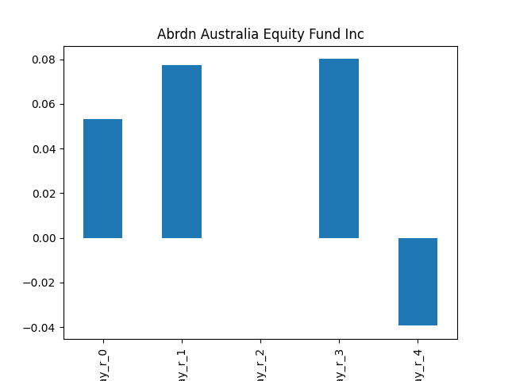

### Mit Filter
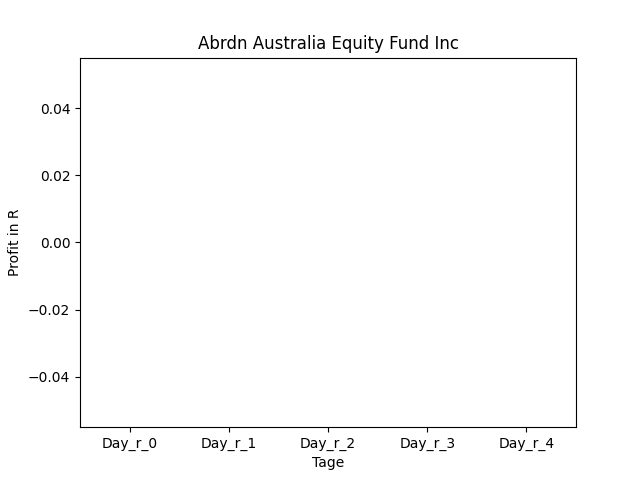

## HQL

### Erwartung in R
|      |   Day_r_0 |   Day_r_1 |   Day_r_2 |   Day_r_3 |   Day_r_4 |   Treffer |
|:-----|----------:|----------:|----------:|----------:|----------:|----------:|
| ohne |       0.1 |       0.2 |         0 |       0.2 |      -0   |        69 |
| mit  |       0   |       0.1 |        -0 |      -0   |      -0.2 |         8 |

### Ohne Filter
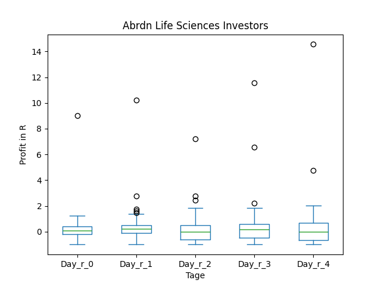
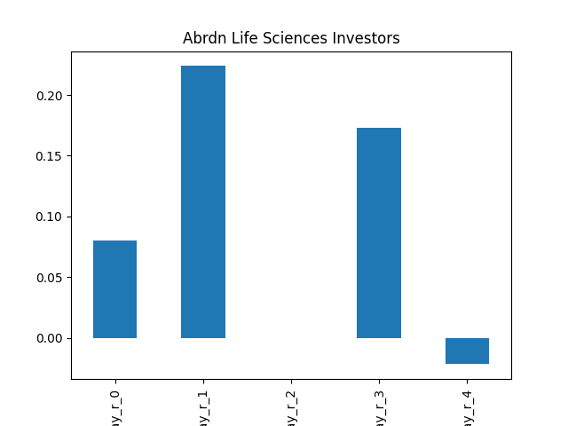

### Mit Filter
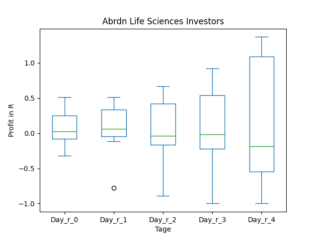
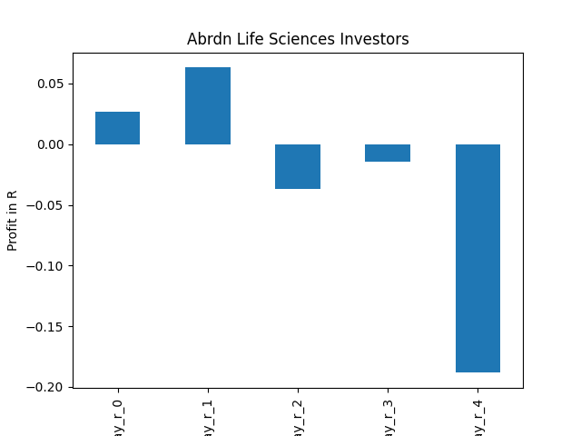

## HQH

### Erwartung in R
|      |   Day_r_0 |   Day_r_1 |   Day_r_2 |   Day_r_3 |   Day_r_4 |   Treffer |
|:-----|----------:|----------:|----------:|----------:|----------:|----------:|
| ohne |       0.1 |       0.2 |       0.1 |       0.1 |       0   |        69 |
| mit  |      -0   |       0.2 |       0.1 |       0.2 |       0.1 |        10 |

### Ohne Filter
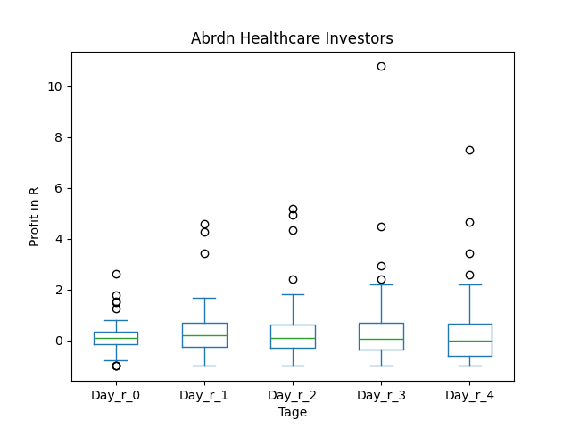
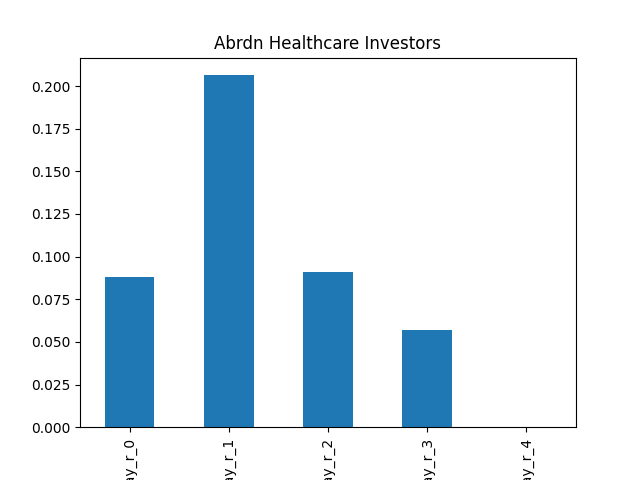

### Mit Filter
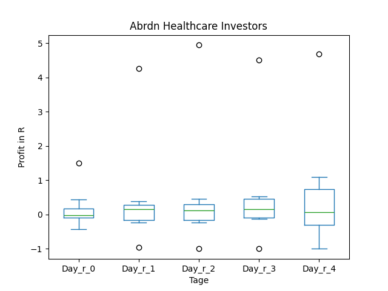
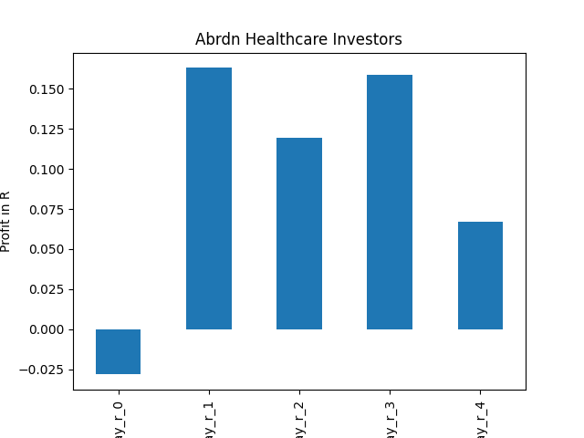

## BBSEY

### Erwartung in R
|      |   Day_r_0 |   Day_r_1 |   Day_r_2 |   Day_r_3 |   Day_r_4 |   Treffer |
|:-----|----------:|----------:|----------:|----------:|----------:|----------:|
| ohne |       0   |       0   |      -0.1 |      -0.1 |      -0.6 |        23 |
| mit  |      -0.4 |      -0.2 |      -0.3 |      -0.2 |      -0.3 |         2 |

### Ohne Filter

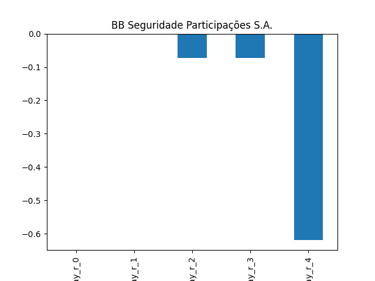

### Mit Filter
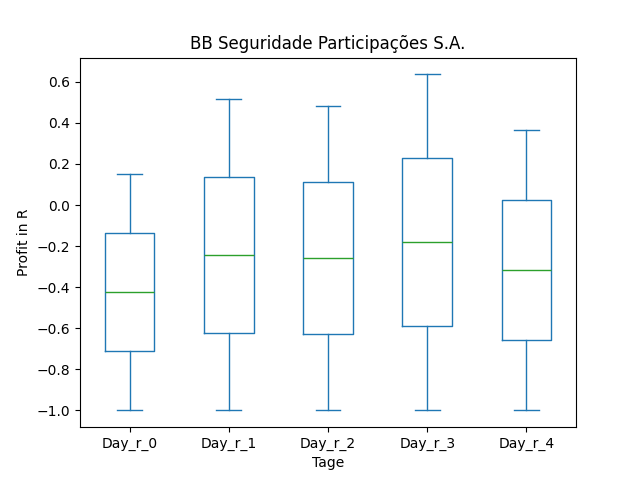
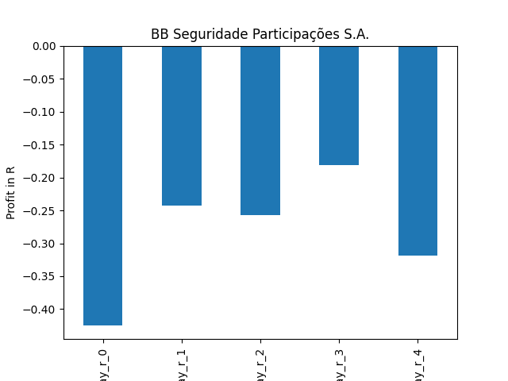

## AUDC

### Erwartung in R
|      |   Day_r_0 |   Day_r_1 |   Day_r_2 |   Day_r_3 |   Day_r_4 |   Treffer |
|:-----|----------:|----------:|----------:|----------:|----------:|----------:|
| ohne |      -0.4 |      -0.4 |      -0.8 |        -1 |        -1 |        15 |
| mit  |     nan   |     nan   |     nan   |       nan |       nan |         0 |

### Ohne Filter
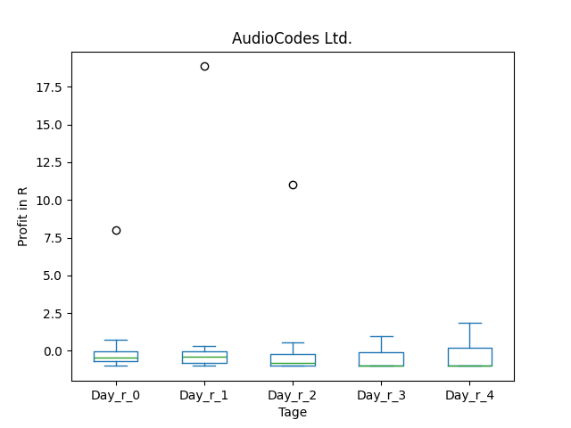
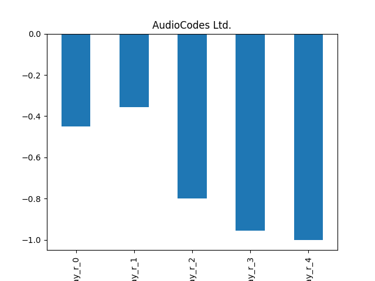

### Mit Filter
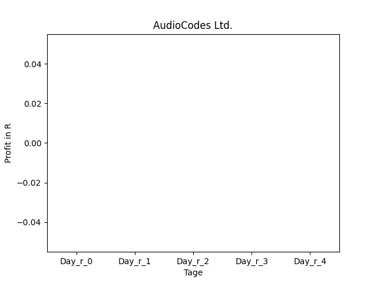

## AOMR

### Erwartung in R
|      |   Day_r_0 |   Day_r_1 |   Day_r_2 |   Day_r_3 |   Day_r_4 |   Treffer |
|:-----|----------:|----------:|----------:|----------:|----------:|----------:|
| ohne |       0.1 |       0.2 |       0.2 |       0.2 |       0.2 |        18 |
| mit  |       0   |      -0.1 |      -0   |      -0.1 |      -0.2 |         7 |

### Ohne Filter
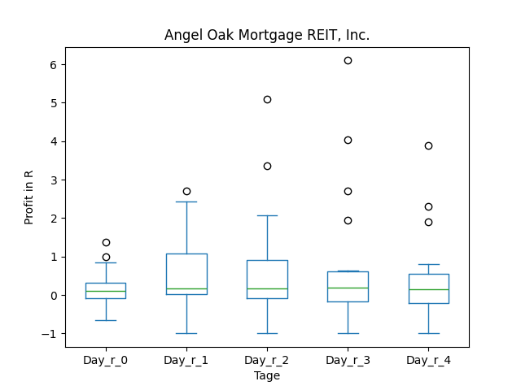
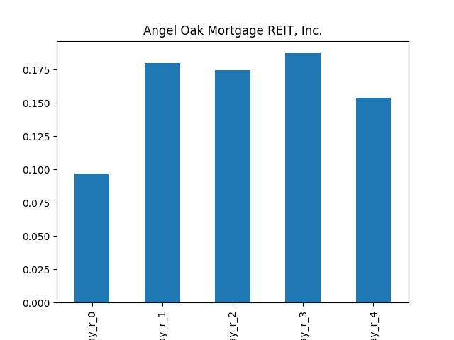

### Mit Filter
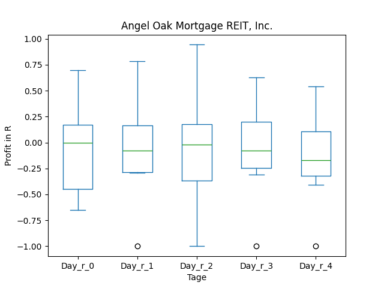
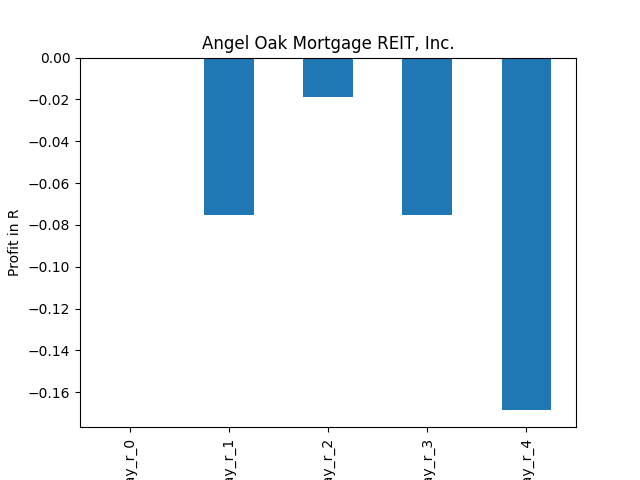

