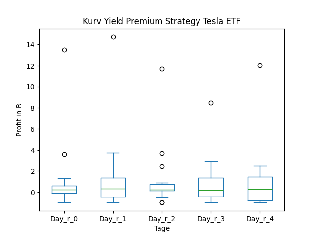
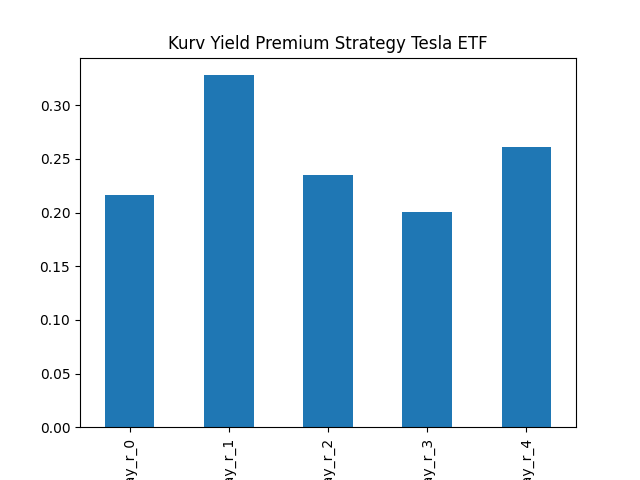
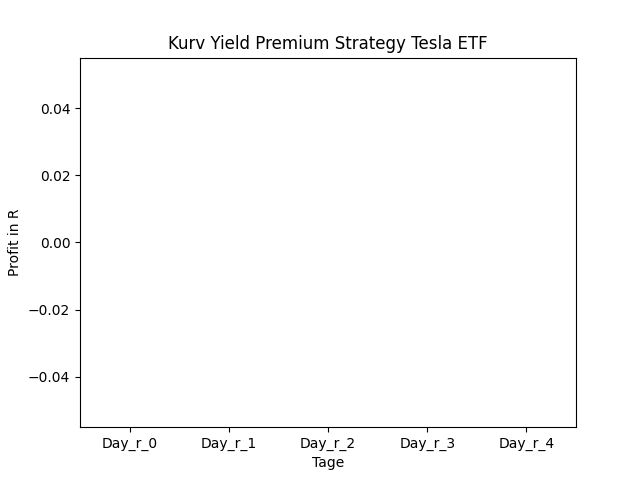
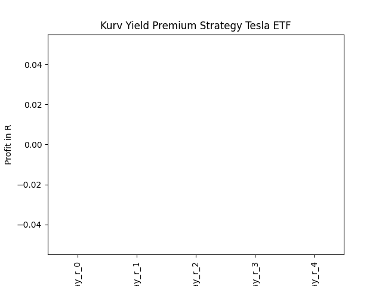
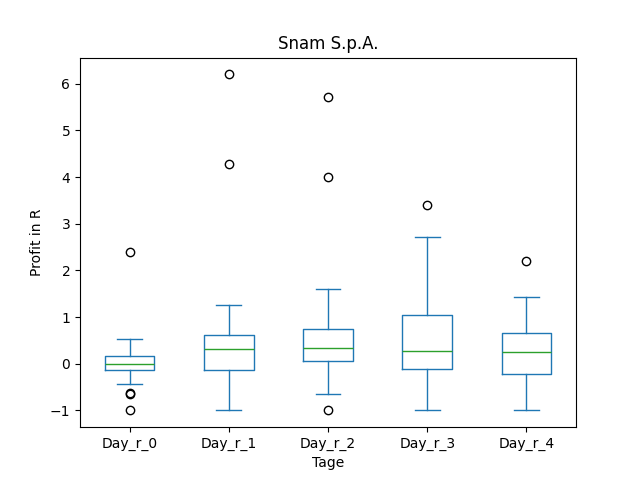
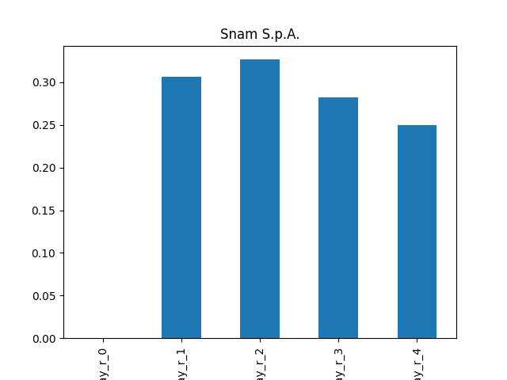
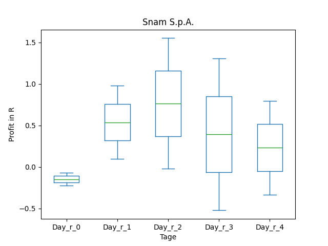
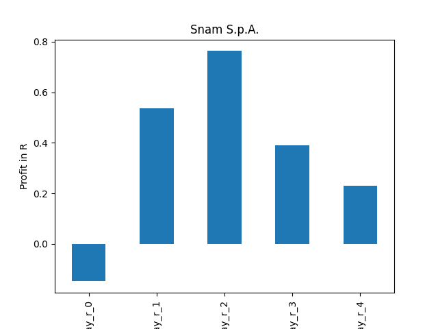

# dividend-shorter

bet on falling prices on payday **2025-01-23**.

## Signale

| Ticker   |   Divid Rate |   Close |   Volume |   last_close_volume |   Divid % | 5_Days_pos   | above_SMA_50   |
|:---------|-------------:|--------:|---------:|--------------------:|----------:|:-------------|:---------------|
| TSLP     |         1.3  |   31.36 |   106700 |             3346112 |      4.15 | False        | True           |
| SNMRY    |         0.24 |    9.21 |    73700 |              678777 |      2.58 | True         | True           |

## TSLP

### Erwartung in R
|      |   Day_r_0 |   Day_r_1 |   Day_r_2 |   Day_r_3 |   Day_r_4 |   Treffer |
|:-----|----------:|----------:|----------:|----------:|----------:|----------:|
| ohne |       0.2 |       0.3 |       0.2 |       0.2 |       0.3 |        14 |
| mit  |     nan   |     nan   |     nan   |     nan   |     nan   |         0 |

### Ohne Filter

### Mit Filter

## SNMRY

### Erwartung in R
|      |   Day_r_0 |   Day_r_1 |   Day_r_2 |   Day_r_3 |   Day_r_4 |   Treffer |
|:-----|----------:|----------:|----------:|----------:|----------:|----------:|
| ohne |       0   |       0.3 |       0.3 |       0.3 |       0.3 |        23 |
| mit  |      -0.1 |       0.5 |       0.8 |       0.4 |       0.2 |         2 |

### Ohne Filter

### Mit Filter

