# dividend-shorter

bet on falling prices on payday **2025-03-21**.

## Signale

| Ticker   |   Divid Rate |   Close |   Volume |   last_close_volume |   Divid % | 5_Days_pos   | above_SMA_50   |
|:---------|-------------:|--------:|---------:|--------------------:|----------:|:-------------|:---------------|
| WHF      |         0.38 |   10.25 |   138600 |             1420650 |      3.76 | True         | False          |
| SPKKY    |         0.36 |    5.93 |   109100 |              646963 |      6.03 | False        | False          |
| OFS      |         0.34 |    9.6  |   240700 |             2310720 |      3.54 | True         | True           |
| JMHLY    |         1.65 |   44.13 |     7100 |              313323 |      3.74 | True         | True           |
| BCH      |         2.1  |   27.85 |   430400 |            11986640 |      7.55 | True         | True           |

## WHF

### Erwartung in R
|      |   Day_r_0 |   Day_r_1 |   Day_r_2 |   Day_r_3 |   Day_r_4 |   Treffer |
|:-----|----------:|----------:|----------:|----------:|----------:|----------:|
| ohne |       0.1 |       0.3 |       0.4 |       0.5 |       0.4 |        55 |
| mit  |       0.1 |       0.3 |       0.7 |       0.7 |       0.8 |         8 |

### Ohne Filter
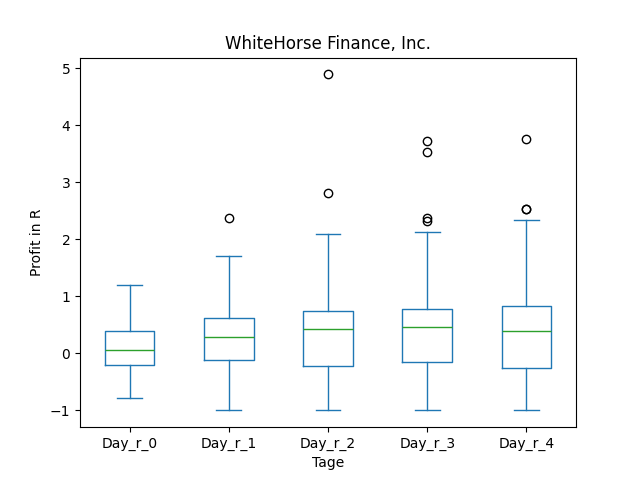
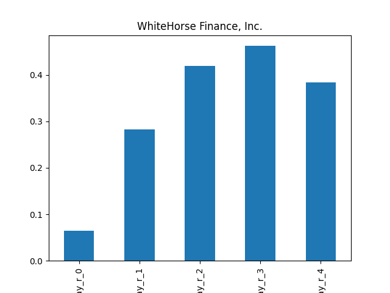

### Mit Filter
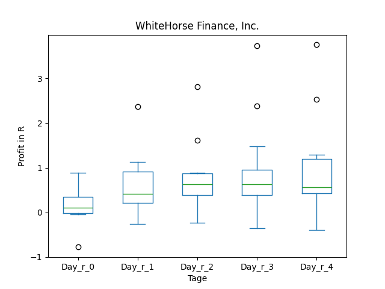
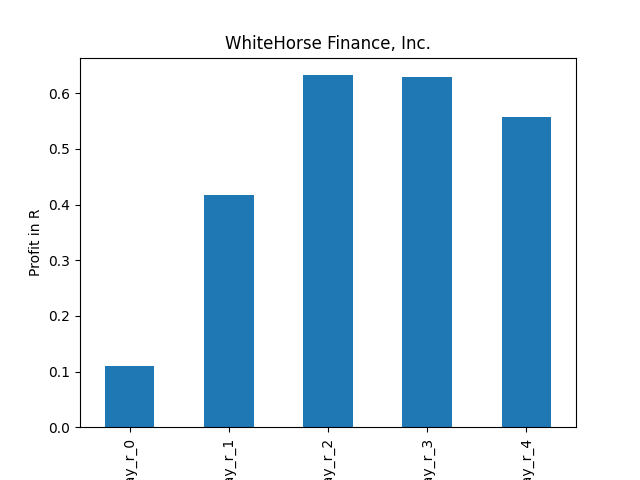

## SPKKY

### Erwartung in R
|      |   Day_r_0 |   Day_r_1 |   Day_r_2 |   Day_r_3 |   Day_r_4 |   Treffer |
|:-----|----------:|----------:|----------:|----------:|----------:|----------:|
| ohne |       0.3 |       0.4 |       0.4 |       0.8 |         1 |        57 |
| mit  |       0.3 |       0.2 |      -0.2 |      -0.1 |        -0 |         5 |

### Ohne Filter
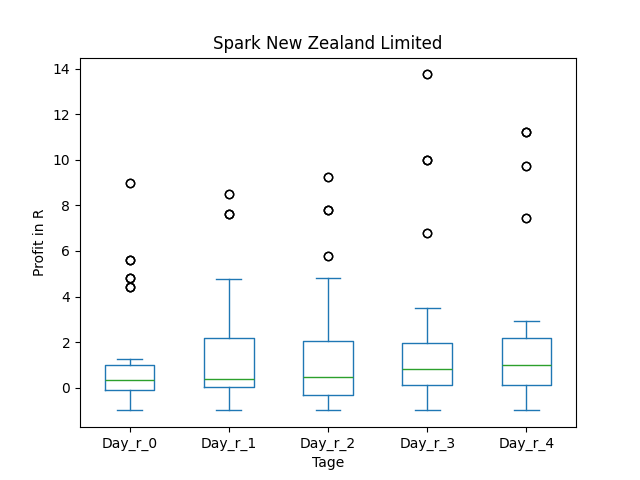
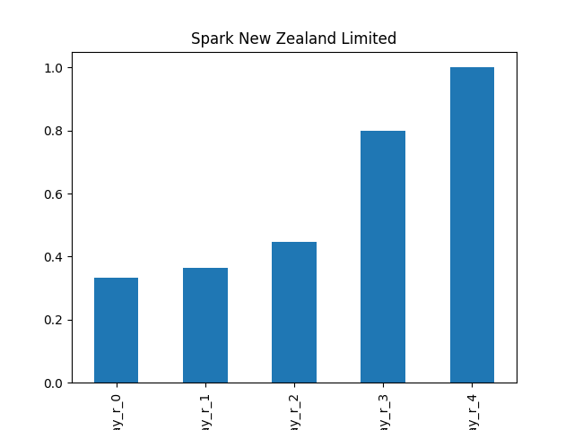

### Mit Filter
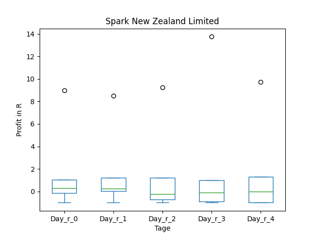
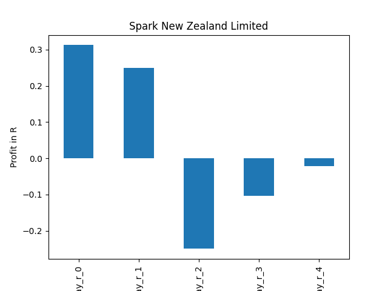

## OFS

### Erwartung in R
|      |   Day_r_0 |   Day_r_1 |   Day_r_2 |   Day_r_3 |   Day_r_4 |   Treffer |
|:-----|----------:|----------:|----------:|----------:|----------:|----------:|
| ohne |       0.2 |       0.5 |       0.5 |       0.4 |       0.4 |        49 |
| mit  |       0.6 |       1.1 |       1.3 |       1.6 |       1.6 |         7 |

### Ohne Filter
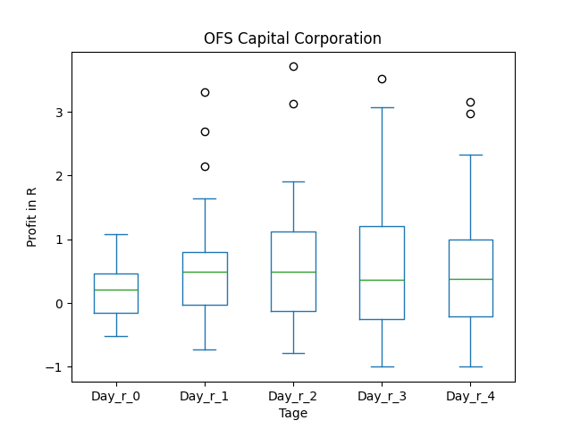
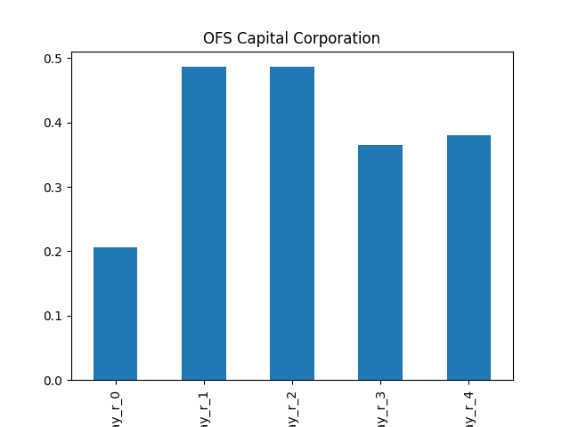

### Mit Filter
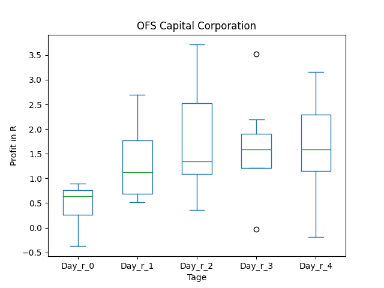
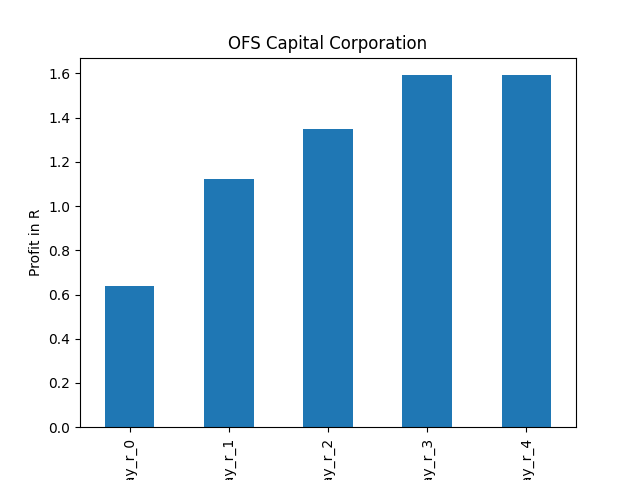

## JMHLY

### Erwartung in R
|      |   Day_r_0 |   Day_r_1 |   Day_r_2 |   Day_r_3 |   Day_r_4 |   Treffer |
|:-----|----------:|----------:|----------:|----------:|----------:|----------:|
| ohne |         0 |      -0.4 |      -0.1 |      -0.1 |      -0.3 |        28 |
| mit  |        -0 |      -0.6 |      -0.2 |       0.1 |      -0.1 |         3 |

### Ohne Filter
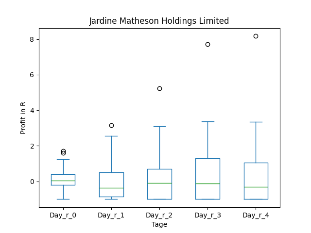
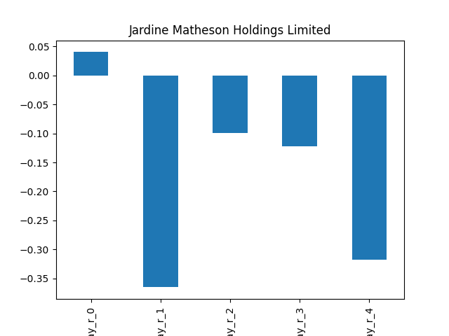

### Mit Filter
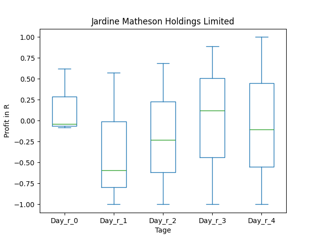
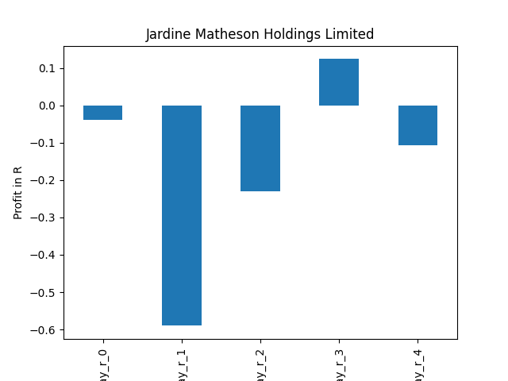

## BCH

### Erwartung in R
|      |   Day_r_0 |   Day_r_1 |   Day_r_2 |   Day_r_3 |   Day_r_4 |   Treffer |
|:-----|----------:|----------:|----------:|----------:|----------:|----------:|
| ohne |       0   |      -0   |      -0.2 |      -0.3 |      -0.1 |        22 |
| mit  |      -0.2 |      -0.1 |      -0.2 |      -0.3 |      -0.1 |        15 |

### Ohne Filter
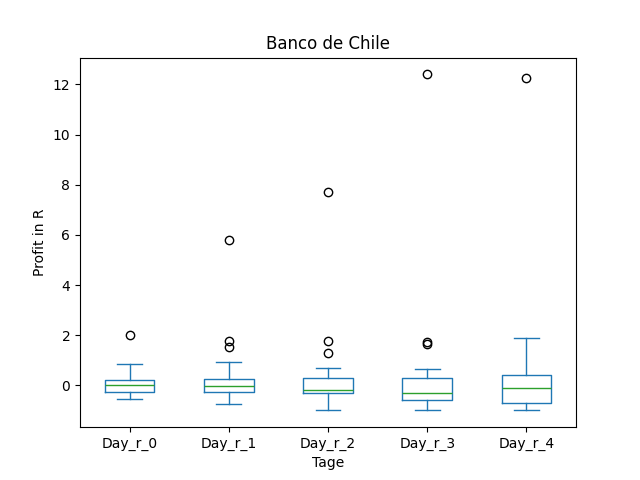
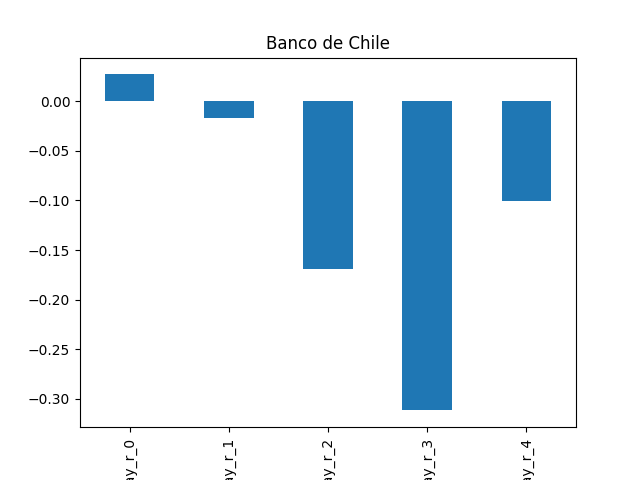

### Mit Filter
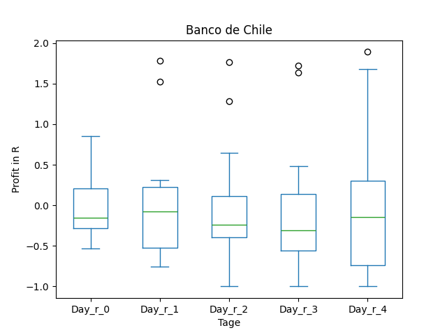
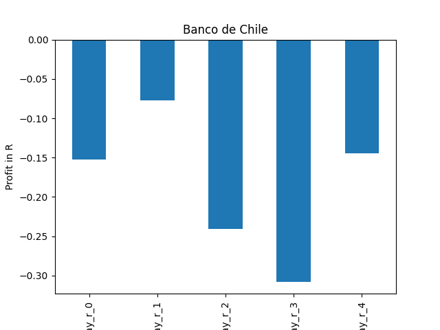

