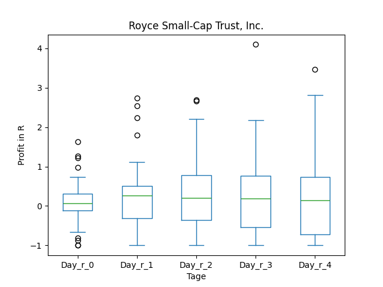
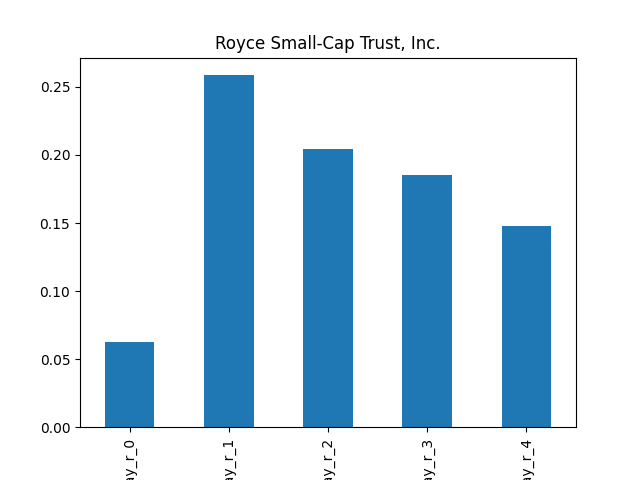
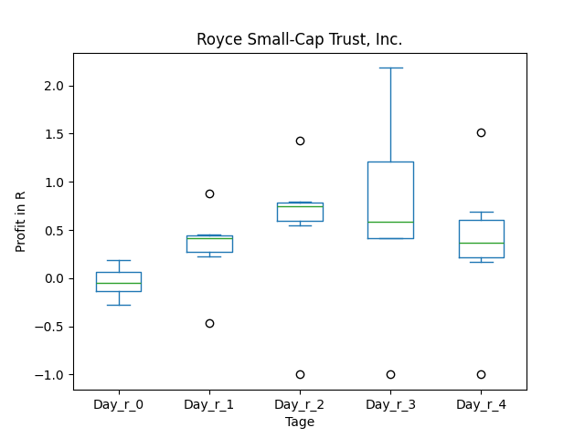
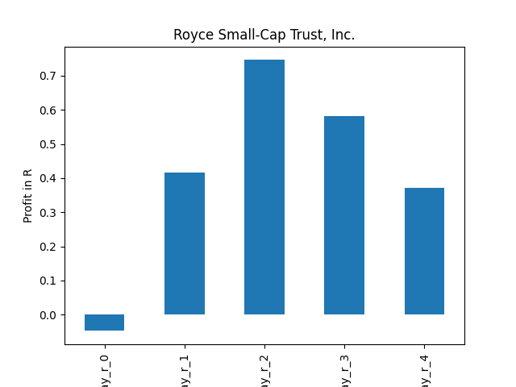
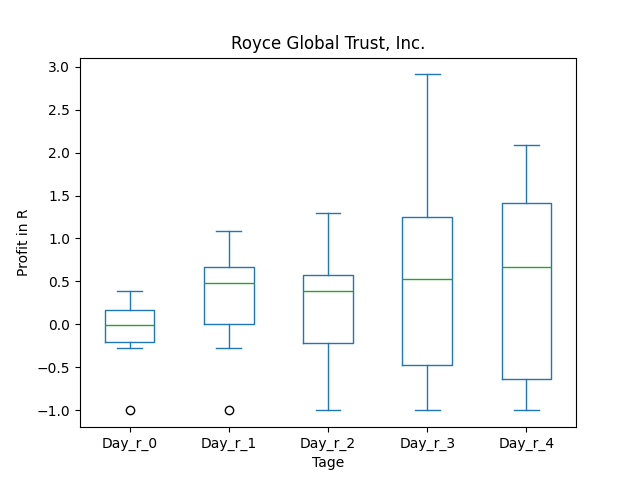
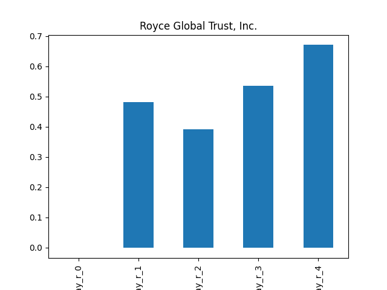
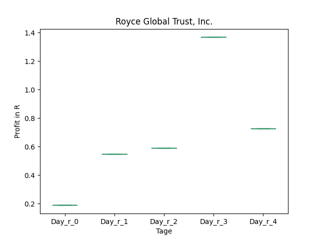
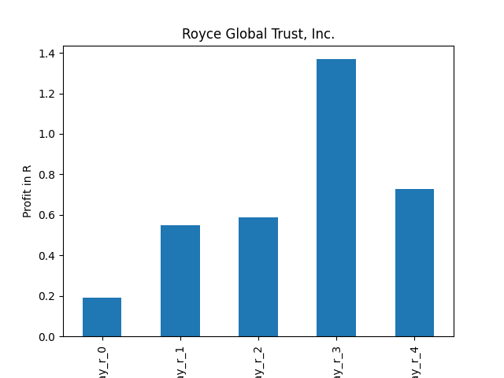
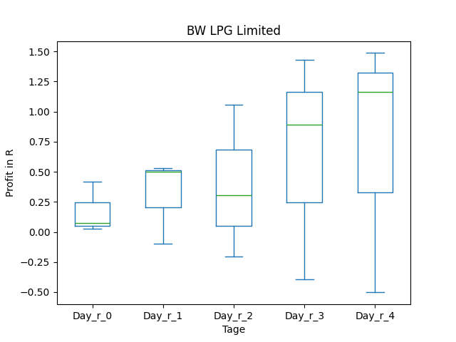
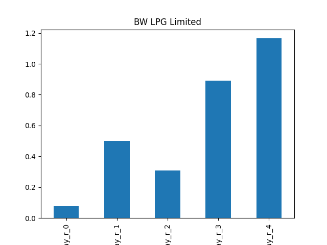

# dividend-shorter

bet on falling prices on payday **2024-12-12**.

## Signale

| Ticker   |   Divid Rate |   Close |   Volume |   last_close_volume |   Divid % | 5_Days_pos   | above_SMA_50   |
|:---------|-------------:|--------:|---------:|--------------------:|----------:|:-------------|:---------------|
| RVT      |         0.44 |   16.66 |   383300 |             6385778 |      2.64 | False        | True           |
| RGT      |         0.47 |   12    |    24600 |              295200 |      3.92 | True         | True           |
| BWLP     |         0.42 |   11.96 |   764200 |             9139832 |      3.51 | True         | False          |

## RVT

### Erwartung in R
|      |   Day_r_0 |   Day_r_1 |   Day_r_2 |   Day_r_3 |   Day_r_4 |   Treffer |
|:-----|----------:|----------:|----------:|----------:|----------:|----------:|
| ohne |       0.1 |       0.3 |       0.2 |       0.2 |       0.1 |        59 |
| mit  |      -0   |       0.4 |       0.7 |       0.6 |       0.4 |         6 |

### Ohne Filter

### Mit Filter

## RGT

### Erwartung in R
|      |   Day_r_0 |   Day_r_1 |   Day_r_2 |   Day_r_3 |   Day_r_4 |   Treffer |
|:-----|----------:|----------:|----------:|----------:|----------:|----------:|
| ohne |      -0   |       0.5 |       0.4 |       0.5 |       0.7 |        10 |
| mit  |       0.2 |       0.5 |       0.6 |       1.4 |       0.7 |         1 |

### Ohne Filter

### Mit Filter

## BWLP

### Erwartung in R
|      |   Day_r_0 |   Day_r_1 |   Day_r_2 |   Day_r_3 |   Day_r_4 |   Treffer |
|:-----|----------:|----------:|----------:|----------:|----------:|----------:|
| ohne |       0.1 |       0.2 |       0.1 |       0.2 |       0.3 |         2 |
| mit  |       0.1 |       0.2 |       0.1 |       0.2 |       0.3 |         2 |

### Ohne Filter

### Mit Filter

