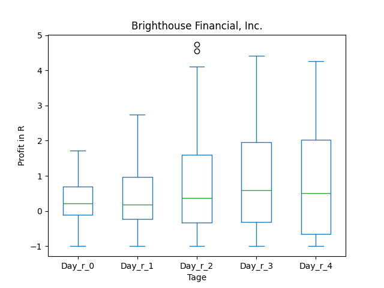
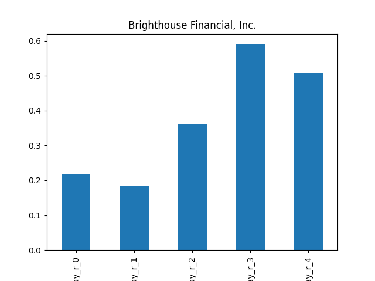
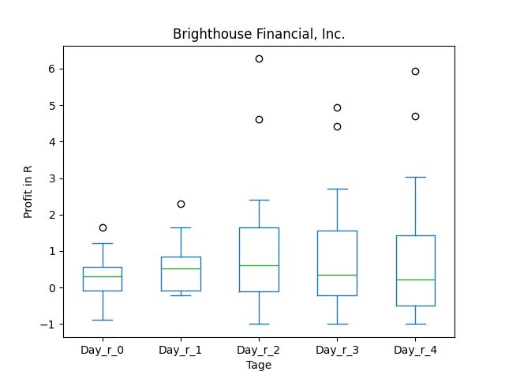
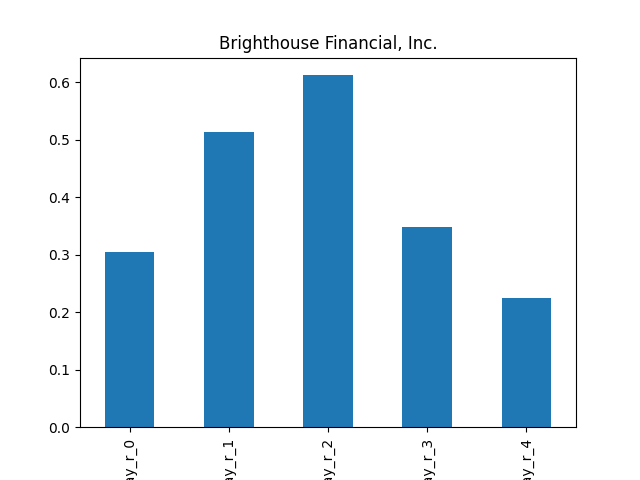
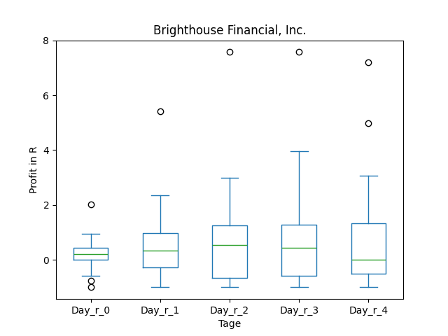
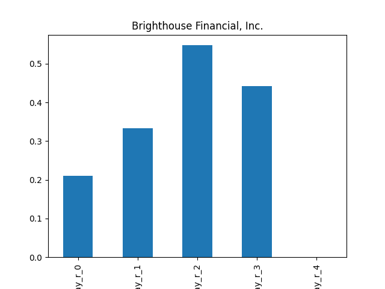
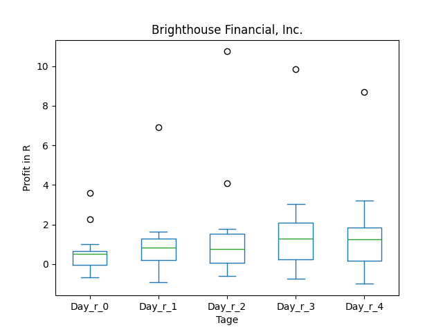
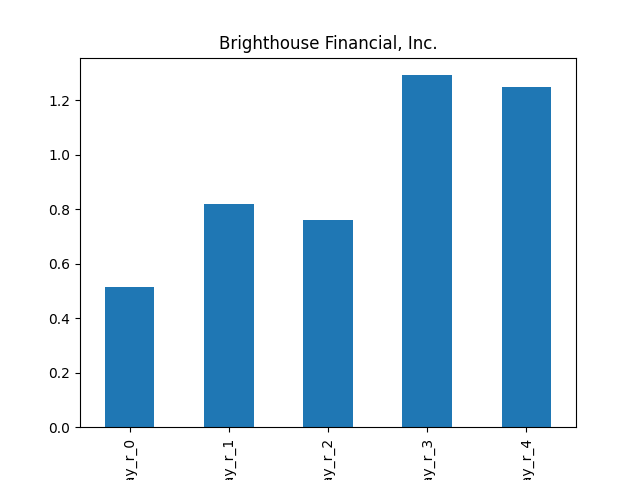

# dividend-shorter

bet on falling prices on payday **2025-12-10**.

## Signale

| Ticker   |   Divid Rate |   Close |   Volume |   last_close_volume |   Divid % | 5_Days_pos   | above_SMA_50   |
|:---------|-------------:|--------:|---------:|--------------------:|----------:|:-------------|:---------------|
| BHFAP    |         0.41 |   15.6  |   148300 |             2313480 |      2.64 | False        | False          |
| BHFAO    |         0.42 |   16    |   101400 |             1622400 |      2.64 | False        | False          |
| BHFAN    |         0.34 |   12.99 |   204100 |             2651259 |      2.59 | False        | False          |
| BHFAM    |         0.29 |   11.34 |    63900 |              724626 |      2.55 | False        | False          |

## BHFAP

### Erwartung in R
|      |   Day_r_0 |   Day_r_1 |   Day_r_2 |   Day_r_3 |   Day_r_4 |   Treffer |
|:-----|----------:|----------:|----------:|----------:|----------:|----------:|
| ohne |       0.2 |       0.2 |       0.4 |       0.6 |       0.5 |        26 |
| mit  |     nan   |     nan   |     nan   |     nan   |     nan   |         0 |

### Ohne Filter

### Mit Filter

## BHFAO

### Erwartung in R
|      |   Day_r_0 |   Day_r_1 |   Day_r_2 |   Day_r_3 |   Day_r_4 |   Treffer |
|:-----|----------:|----------:|----------:|----------:|----------:|----------:|
| ohne |       0.3 |       0.5 |       0.6 |       0.3 |       0.2 |        21 |
| mit  |     nan   |     nan   |     nan   |     nan   |     nan   |         0 |

### Ohne Filter

### Mit Filter

## BHFAN

### Erwartung in R
|      |   Day_r_0 |   Day_r_1 |   Day_r_2 |   Day_r_3 |   Day_r_4 |   Treffer |
|:-----|----------:|----------:|----------:|----------:|----------:|----------:|
| ohne |       0.2 |       0.3 |       0.5 |       0.4 |         0 |        19 |
| mit  |     nan   |     nan   |     nan   |     nan   |       nan |         0 |

### Ohne Filter

### Mit Filter

## BHFAM

### Erwartung in R
|      |   Day_r_0 |   Day_r_1 |   Day_r_2 |   Day_r_3 |   Day_r_4 |   Treffer |
|:-----|----------:|----------:|----------:|----------:|----------:|----------:|
| ohne |       0.5 |       0.8 |       0.8 |       1.3 |       1.2 |        15 |
| mit  |     nan   |     nan   |     nan   |     nan   |     nan   |         0 |

### Ohne Filter

### Mit Filter

