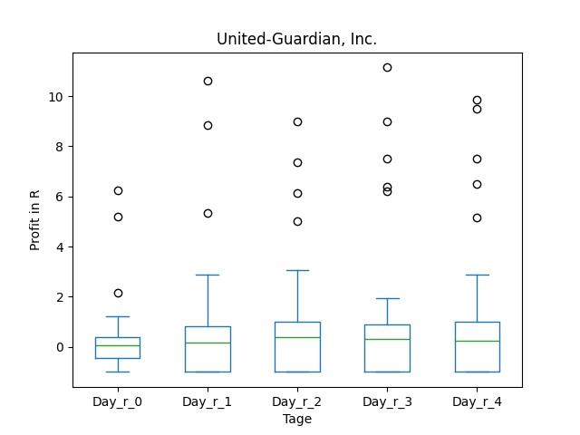
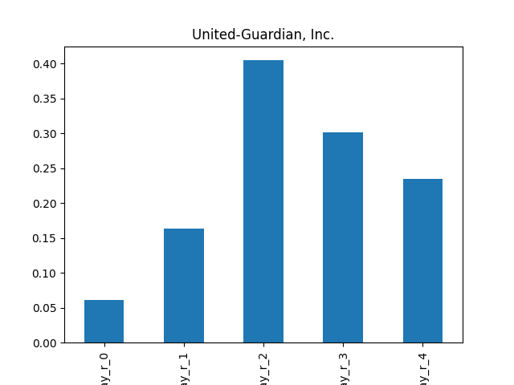
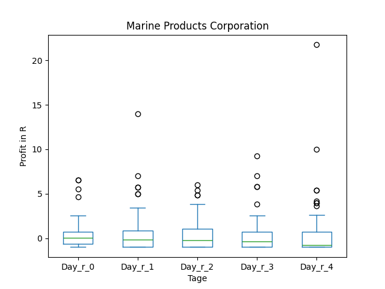
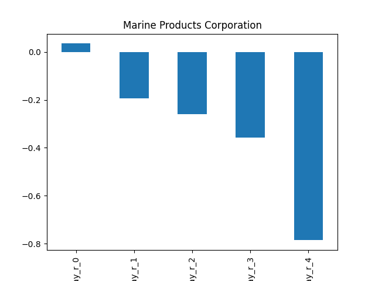
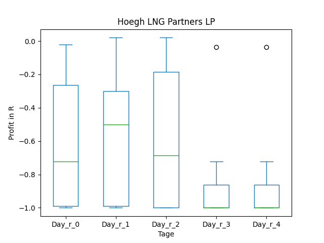
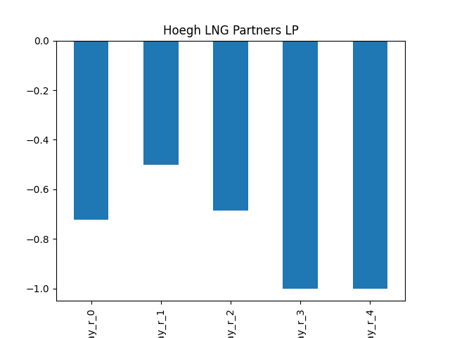

# dividend-shorter

bet on falling prices on payday **2025-02-10**.

## Signale

| Ticker   |   Divid Rate |   Close |   Volume |   last_close_volume |   Divid % | 5_Days_pos   | above_SMA_50   |
|:---------|-------------:|--------:|---------:|--------------------:|----------:|:-------------|:---------------|
| UG       |         0.35 |   11.2  |    22500 |              252000 |      3.12 | False        | True           |
| MPX      |         0.7  |    9.65 |    77300 |              745945 |      7.25 | True         | True           |
| HMLPF    |         0.55 |   17    |    29000 |              493000 |      3.22 | True         | True           |

## UG

### Erwartung in R
|      |   Day_r_0 |   Day_r_1 |   Day_r_2 |   Day_r_3 |   Day_r_4 |   Treffer |
|:-----|----------:|----------:|----------:|----------:|----------:|----------:|
| ohne |       0.1 |       0.2 |       0.4 |       0.3 |       0.2 |        44 |
| mit  |     nan   |     nan   |     nan   |     nan   |     nan   |         0 |

### Ohne Filter

### Mit Filter

## MPX

### Erwartung in R
|      |   Day_r_0 |   Day_r_1 |   Day_r_2 |   Day_r_3 |   Day_r_4 |   Treffer |
|:-----|----------:|----------:|----------:|----------:|----------:|----------:|
| ohne |         0 |      -0.2 |      -0.3 |      -0.4 |      -0.8 |        81 |
| mit  |       nan |     nan   |     nan   |     nan   |     nan   |         0 |

### Ohne Filter

### Mit Filter

## HMLPF

### Erwartung in R
|      |   Day_r_0 |   Day_r_1 |   Day_r_2 |   Day_r_3 |   Day_r_4 |   Treffer |
|:-----|----------:|----------:|----------:|----------:|----------:|----------:|
| ohne |      -0.7 |      -0.5 |      -0.7 |        -1 |        -1 |         7 |
| mit  |     nan   |     nan   |     nan   |       nan |       nan |         0 |

### Ohne Filter

### Mit Filter

