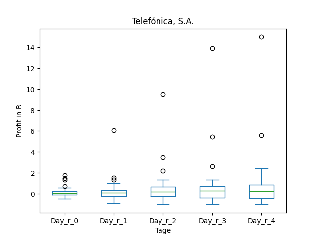
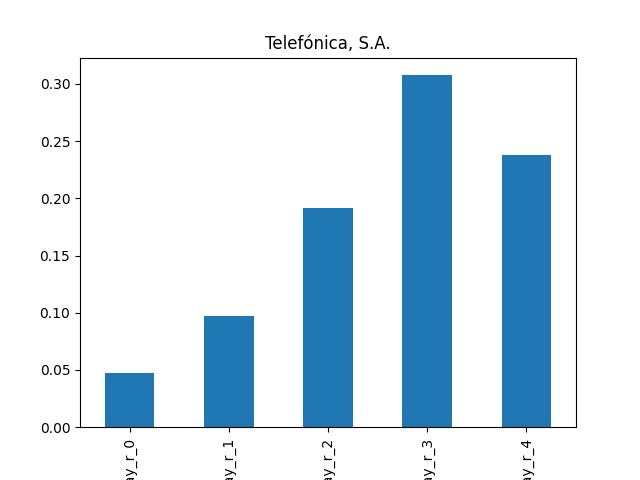
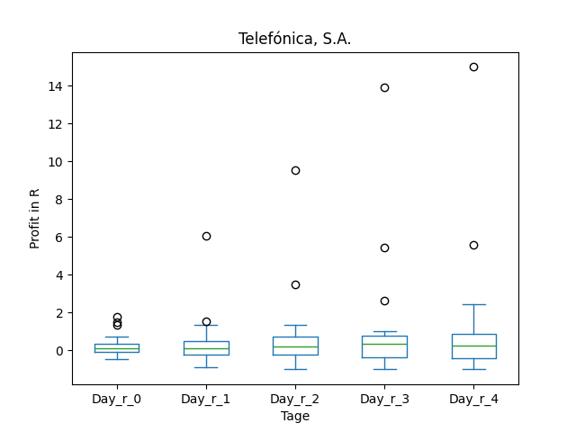
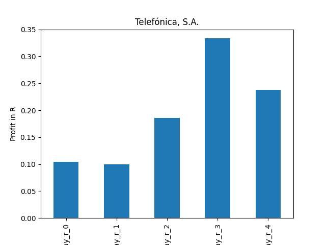
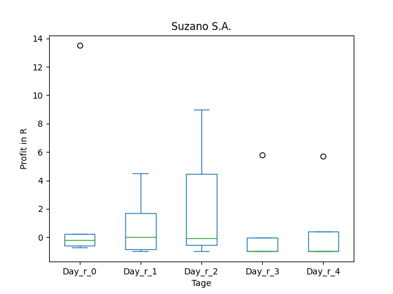
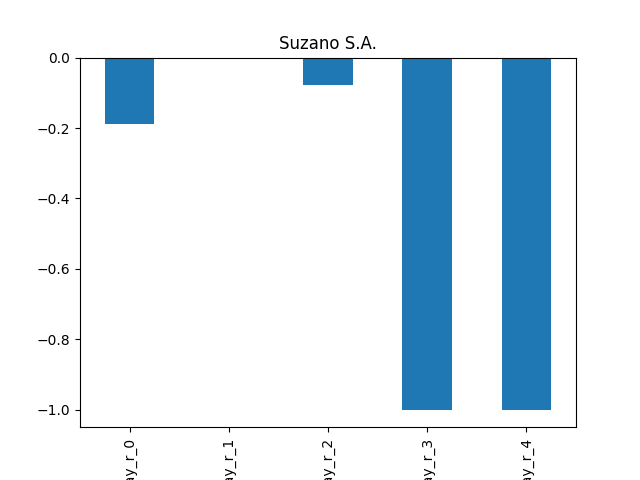
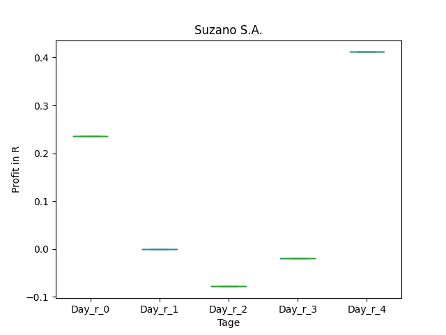
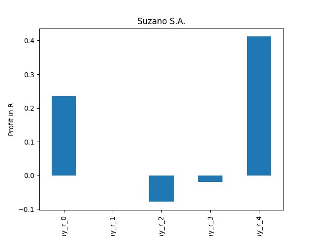

# dividend-shorter

bet on falling prices on payday **2024-12-18**.

## Signale

| Ticker   |   Divid Rate |   Close |          Volume |   last_close_volume |   Divid % | 5_Days_pos   | above_SMA_50   |
|:---------|-------------:|--------:|----------------:|--------------------:|----------:|:-------------|:---------------|
| TEF      |         0.16 |    4.3  | 609700          |             2621710 |      3.66 | False        | False          |
| SUZ      |         0.34 |   10.43 |      1.4321e+06 |            14936803 |      3.23 | False        | True           |

## TEF

### Erwartung in R
|      |   Day_r_0 |   Day_r_1 |   Day_r_2 |   Day_r_3 |   Day_r_4 |   Treffer |
|:-----|----------:|----------:|----------:|----------:|----------:|----------:|
| ohne |       0   |       0.1 |       0.2 |       0.3 |       0.2 |        39 |
| mit  |       0.1 |       0.1 |       0.2 |       0.3 |       0.2 |        31 |

### Ohne Filter

### Mit Filter

## SUZ

### Erwartung in R
|      |   Day_r_0 |   Day_r_1 |   Day_r_2 |   Day_r_3 |   Day_r_4 |   Treffer |
|:-----|----------:|----------:|----------:|----------:|----------:|----------:|
| ohne |      -0.2 |         0 |      -0.1 |        -1 |      -1   |         5 |
| mit  |       0.2 |         0 |      -0.1 |        -0 |       0.4 |         1 |

### Ohne Filter

### Mit Filter

