# dividend-shorter

bet on falling prices on payday **2025-05-28**.

## Signale

| Ticker   |   Divid Rate |   Close |   Volume |   last_close_volume |   Divid % | 5_Days_pos   | above_SMA_50   |
|:---------|-------------:|--------:|---------:|--------------------:|----------:|:-------------|:---------------|
| WYNMY    |         0.24 |    6.96 |    25900 |              180264 |      3.41 | True         | True           |
| CKHUY    |         0.19 |    5.64 |   292900 |             1651956 |      3.45 | False        | True           |
| ASR      |        24.59 |  346.32 |    75600 |            26181792 |      7.1  | True         | True           |
| AOIFF    |         0.04 |    1.39 |    77500 |              107725 |      2.67 | True         | True           |

## WYNMY

### Erwartung in R
|      |   Day_r_0 |   Day_r_1 |   Day_r_2 |   Day_r_3 |   Day_r_4 |   Treffer |
|:-----|----------:|----------:|----------:|----------:|----------:|----------:|
| ohne |       0.3 |      -0.1 |      -0.4 |      -0.9 |      -0.7 |        15 |
| mit  |       1.6 |       0.8 |       1.6 |       1.7 |       0.6 |         2 |

### Ohne Filter
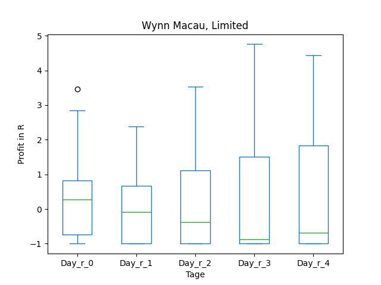
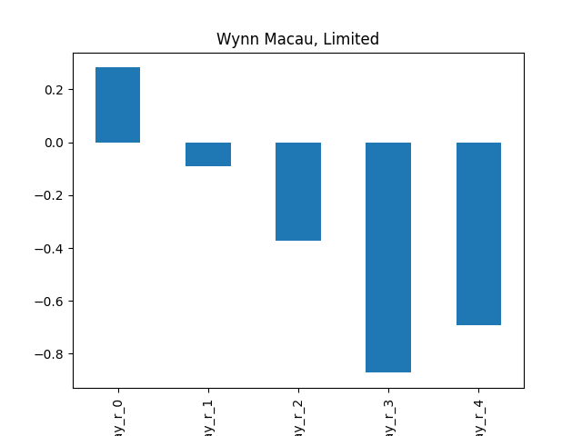

### Mit Filter
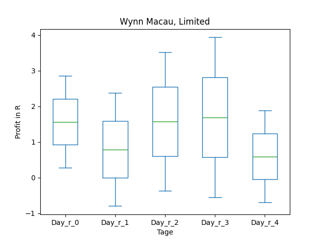
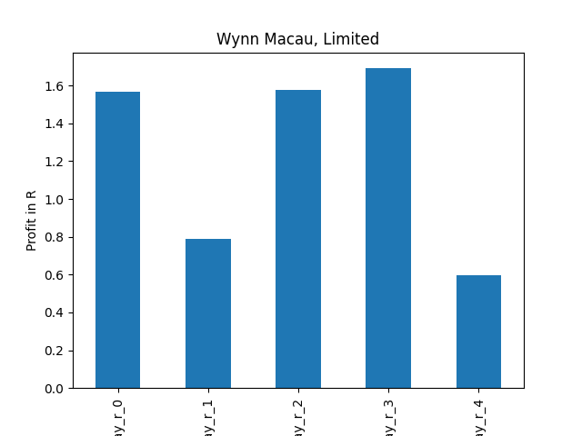

## CKHUY

### Erwartung in R
|      |   Day_r_0 |   Day_r_1 |   Day_r_2 |   Day_r_3 |   Day_r_4 |   Treffer |
|:-----|----------:|----------:|----------:|----------:|----------:|----------:|
| ohne |      -0.1 |      -0.1 |       0.1 |       0.1 |       0.2 |        20 |
| mit  |      -0   |       0   |       0.1 |       0.1 |       0.1 |         3 |

### Ohne Filter
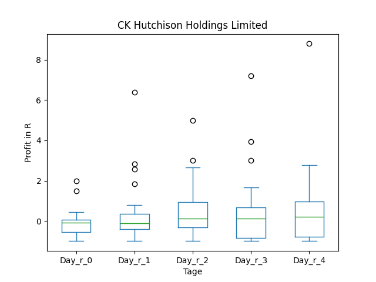
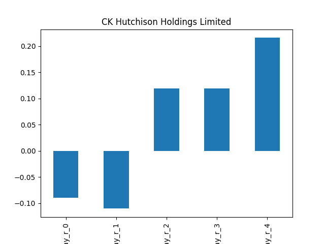

### Mit Filter
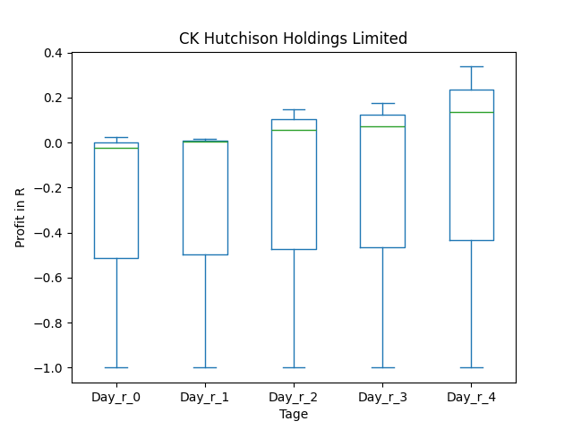
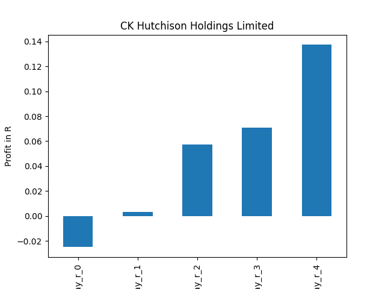

## ASR

### Erwartung in R
|      |   Day_r_0 |   Day_r_1 |   Day_r_2 |   Day_r_3 |   Day_r_4 |   Treffer |
|:-----|----------:|----------:|----------:|----------:|----------:|----------:|
| ohne |      -0.1 |      -0.3 |      -0.2 |      -0.1 |      -0.4 |        24 |
| mit  |      -0.1 |      -0.1 |       0.4 |       0.4 |       0.6 |         7 |

### Ohne Filter
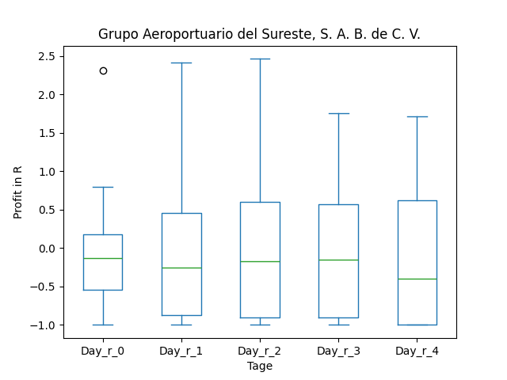
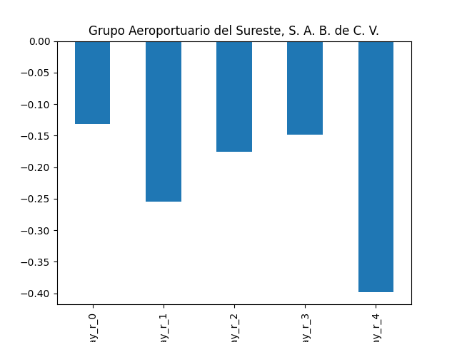

### Mit Filter
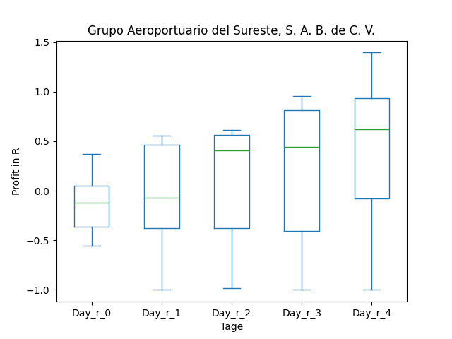
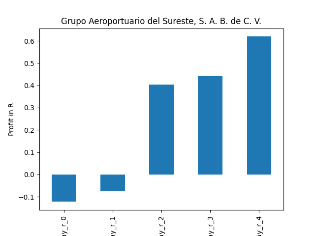

## AOIFF

### Erwartung in R
|      |   Day_r_0 |   Day_r_1 |   Day_r_2 |   Day_r_3 |   Day_r_4 |   Treffer |
|:-----|----------:|----------:|----------:|----------:|----------:|----------:|
| ohne |      -0.4 |      -0.5 |      -0.7 |      -0.8 |        -1 |         7 |
| mit  |     nan   |     nan   |     nan   |     nan   |       nan |         0 |

### Ohne Filter
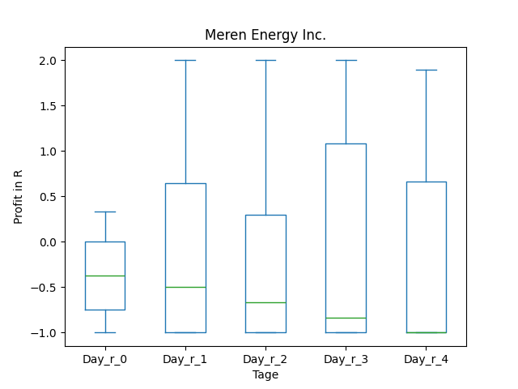
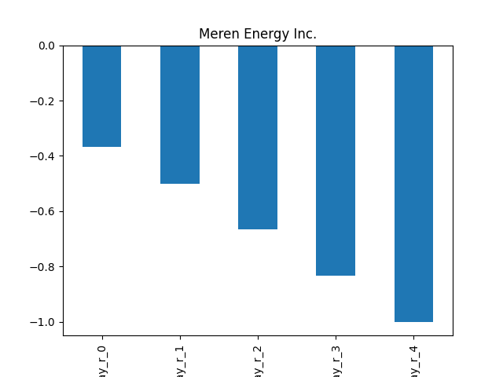

### Mit Filter
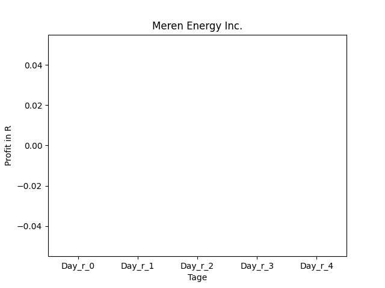

