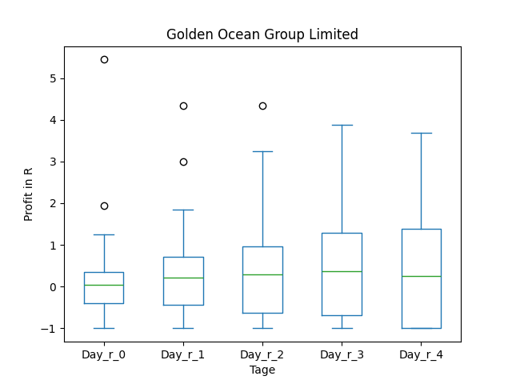
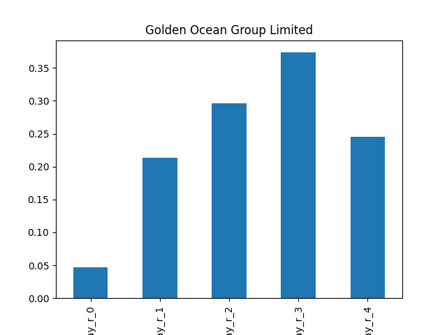
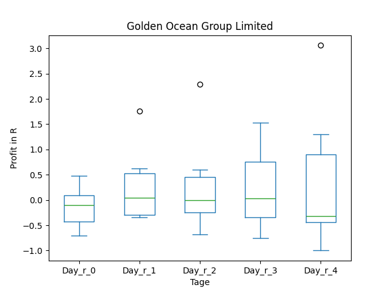
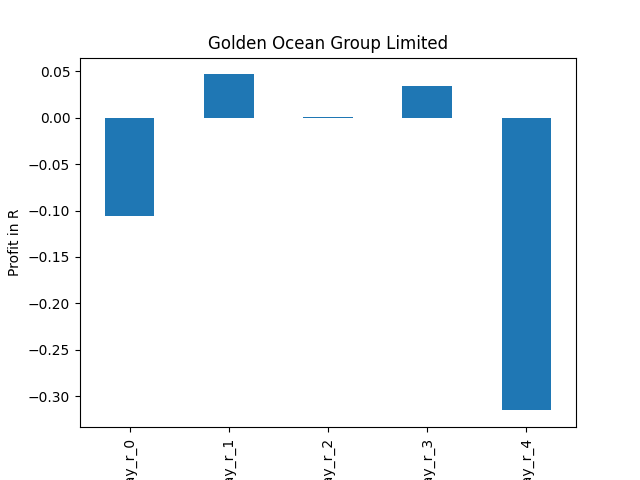
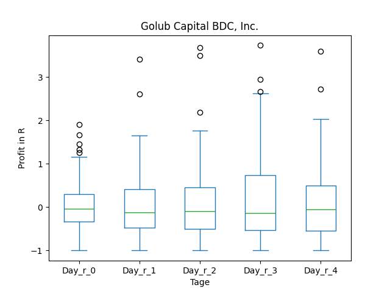
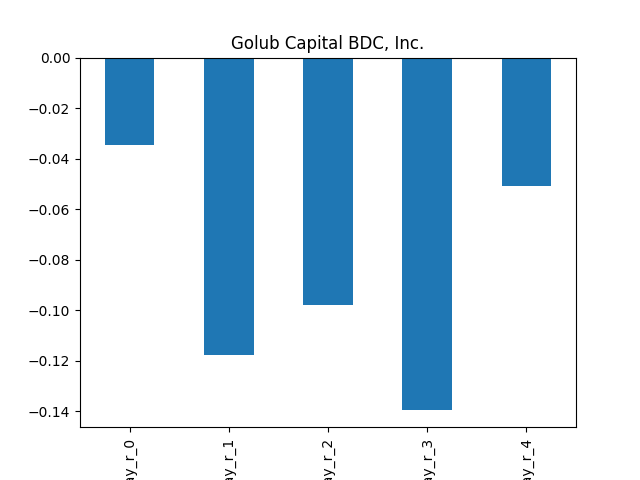
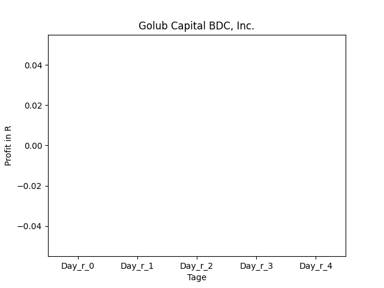

# dividend-shorter

bet on falling prices on payday **2024-12-09**.

## Signale

| Ticker   |   Divid Rate |   Close |     Volume |   last_close_volume |   Divid % | 5_Days_pos   | above_SMA_50   |
|:---------|-------------:|--------:|-----------:|--------------------:|----------:|:-------------|:---------------|
| GOGL     |         0.3  |    9.56 | 2.4881e+06 |            23786236 |      3.14 | False        | False          |
| GBDC     |         0.39 |   15.46 | 1.7267e+06 |            26694782 |      2.52 | False        | True           |

## GOGL

### Erwartung in R
|      |   Day_r_0 |   Day_r_1 |   Day_r_2 |   Day_r_3 |   Day_r_4 |   Treffer |
|:-----|----------:|----------:|----------:|----------:|----------:|----------:|
| ohne |       0   |       0.2 |       0.3 |       0.4 |       0.2 |        64 |
| mit  |      -0.1 |       0   |       0   |       0   |      -0.3 |         6 |

### Ohne Filter

### Mit Filter

## GBDC

### Erwartung in R
|      |   Day_r_0 |   Day_r_1 |   Day_r_2 |   Day_r_3 |   Day_r_4 |   Treffer |
|:-----|----------:|----------:|----------:|----------:|----------:|----------:|
| ohne |        -0 |      -0.1 |      -0.1 |      -0.1 |      -0.1 |        70 |
| mit  |       nan |     nan   |     nan   |     nan   |     nan   |         0 |

### Ohne Filter

### Mit Filter

