# dividend-shorter

bet on falling prices on payday **2025-04-29**.

## Signale

| Ticker   |   Divid Rate |   Close |          Volume |   last_close_volume |   Divid % | 5_Days_pos   | above_SMA_50   |
|:---------|-------------:|--------:|----------------:|--------------------:|----------:|:-------------|:---------------|
| UMICY    |         0.07 |    2.33 | 48300           |              112539 |      2.96 | True         | True           |
| SIGA     |         0.6  |    6.35 |     1.0206e+06  |             6480810 |      9.45 | True         | True           |
| CYCC     |         0.15 |    0.29 |     1.09676e+07 |             3180604 |     51.72 | True         | False          |
| CTTAY    |         0.28 |    7.93 | 28800           |              228384 |      3.58 | True         | True           |
| AVTE     |         2.4  |   93.8  | 29132           |             2732582 |      2.56 | False        | True           |

## UMICY

### Erwartung in R
|      |   Day_r_0 |   Day_r_1 |   Day_r_2 |   Day_r_3 |   Day_r_4 |   Treffer |
|:-----|----------:|----------:|----------:|----------:|----------:|----------:|
| ohne |      -0.5 |      -0.5 |      -0.3 |      -0.2 |      -0.8 |        13 |
| mit  |     nan   |     nan   |     nan   |     nan   |     nan   |         0 |

### Ohne Filter
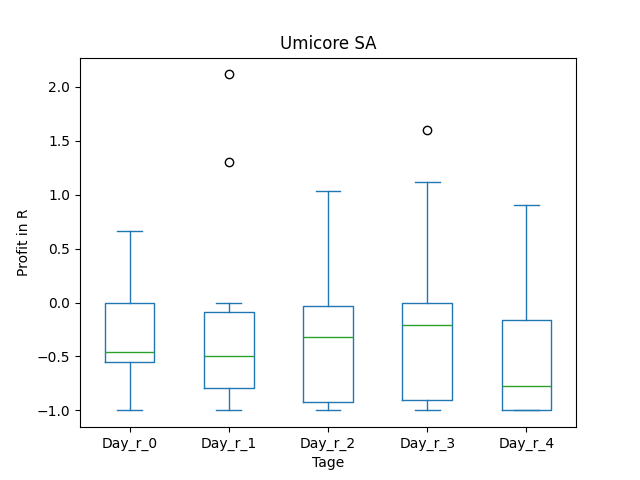
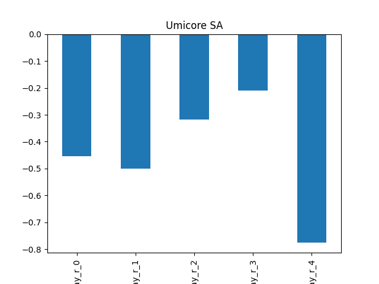

### Mit Filter

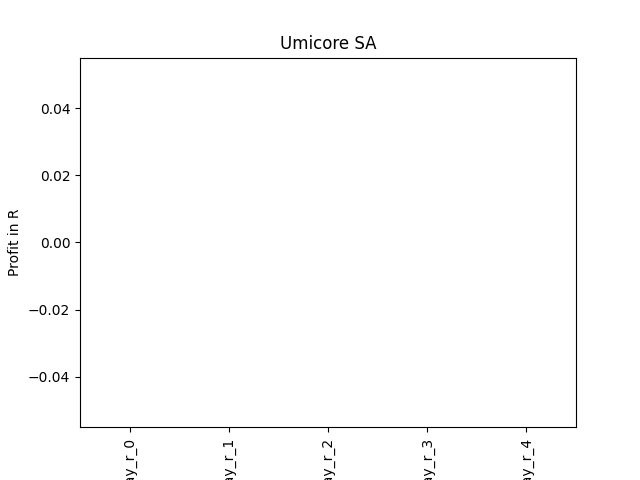

## SIGA

### Erwartung in R
|      |   Day_r_0 |   Day_r_1 |   Day_r_2 |   Day_r_3 |   Day_r_4 |   Treffer |
|:-----|----------:|----------:|----------:|----------:|----------:|----------:|
| ohne |      -0.3 |      -0.3 |      -0.5 |      -0.5 |      -0.8 |         3 |
| mit  |      -0.3 |      -0.3 |      -0.5 |      -0.5 |      -0.8 |         3 |

### Ohne Filter
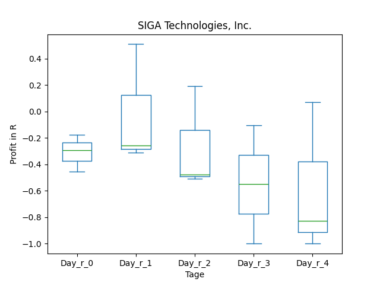
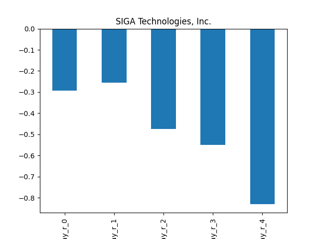

### Mit Filter

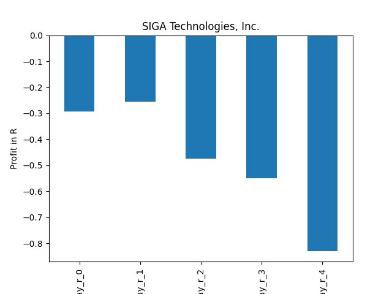

## CYCC

### Erwartung in R
|      |   Day_r_0 |   Day_r_1 |   Day_r_2 |   Day_r_3 |   Day_r_4 |   Treffer |
|:-----|----------:|----------:|----------:|----------:|----------:|----------:|
| ohne |       nan |       nan |       nan |       nan |       nan |         0 |
| mit  |       nan |       nan |       nan |       nan |       nan |         0 |

### Ohne Filter
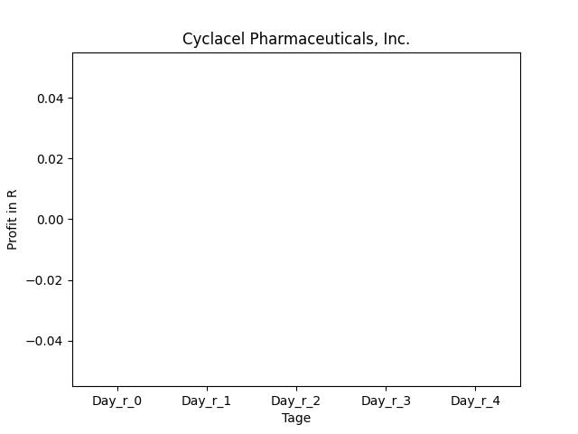
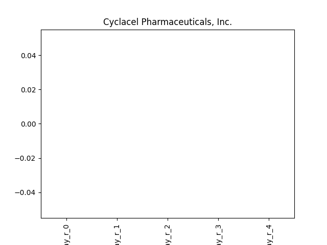

### Mit Filter

## CTTAY

### Erwartung in R
|      |   Day_r_0 |   Day_r_1 |   Day_r_2 |   Day_r_3 |   Day_r_4 |   Treffer |
|:-----|----------:|----------:|----------:|----------:|----------:|----------:|
| ohne |         0 |      -0.3 |      -0.4 |      -0.3 |      -0.8 |        18 |
| mit  |         0 |      -0.4 |      -0.8 |      -0.5 |      -0.9 |         6 |

### Ohne Filter
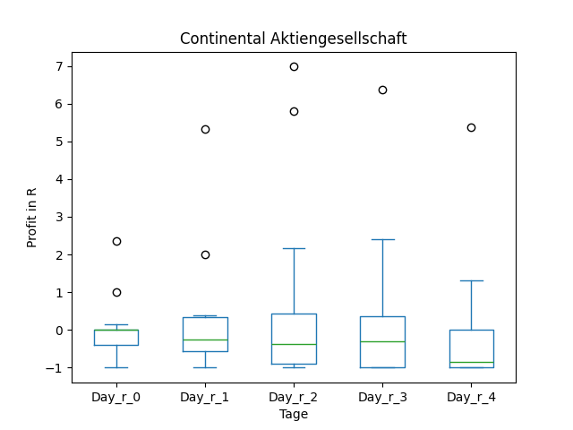
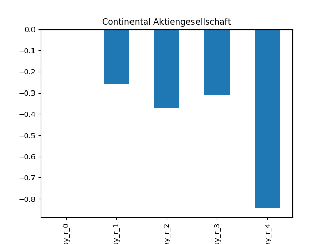

### Mit Filter
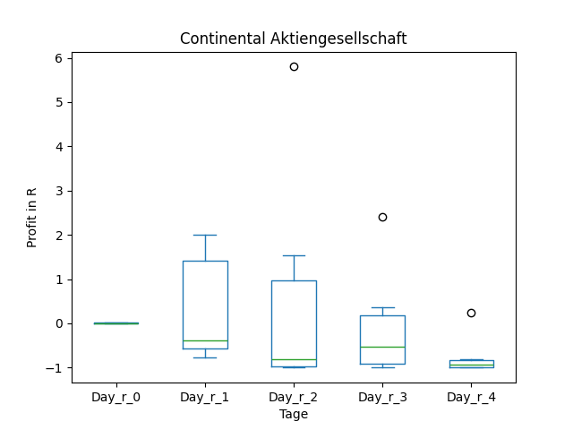
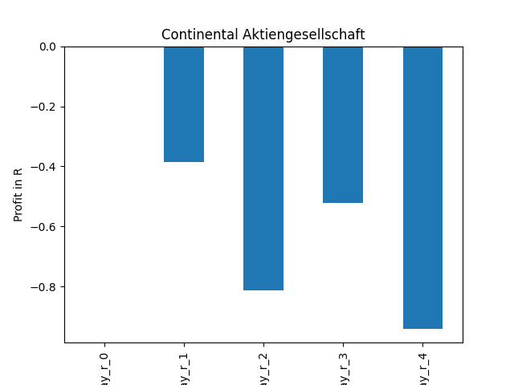

## AVTE

### Erwartung in R
|      |   Day_r_0 |   Day_r_1 |   Day_r_2 |   Day_r_3 |   Day_r_4 |   Treffer |
|:-----|----------:|----------:|----------:|----------:|----------:|----------:|
| ohne |       nan |       nan |       nan |       nan |       nan |         0 |
| mit  |       nan |       nan |       nan |       nan |       nan |         0 |

### Ohne Filter
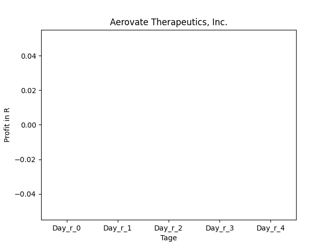
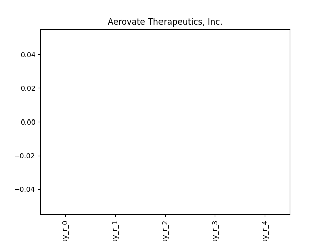

### Mit Filter

