# dividend-shorter

bet on falling prices on payday **2025-04-08**.

## Signale

| Ticker   |   Divid Rate |   Close |      Volume |   last_close_volume |   Divid % | 5_Days_pos   | above_SMA_50   |
|:---------|-------------:|--------:|------------:|--------------------:|----------:|:-------------|:---------------|
| TIGO     |         0.75 |   27.93 | 1.3806e+06  |            38560158 |      2.69 | False        | False          |
| OPFI     |         0.25 |    8.16 | 1.6207e+06  |            13224912 |      3.06 | False        | False          |
| JD       |         1    |   34.92 | 2.88191e+07 |          1006362972 |      2.86 | False        | False          |

## TIGO

### Erwartung in R
|      |   Day_r_0 |   Day_r_1 |   Day_r_2 |   Day_r_3 |   Day_r_4 |   Treffer |
|:-----|----------:|----------:|----------:|----------:|----------:|----------:|
| ohne |      -0.1 |      -0.1 |      -0.1 |      -0   |       0.3 |         3 |
| mit  |      -0.3 |      -0.6 |      -0.7 |      -0.6 |       0.2 |         1 |

### Ohne Filter
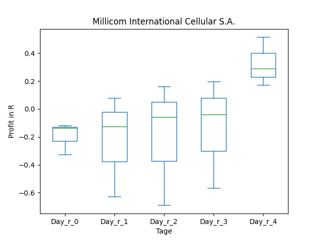
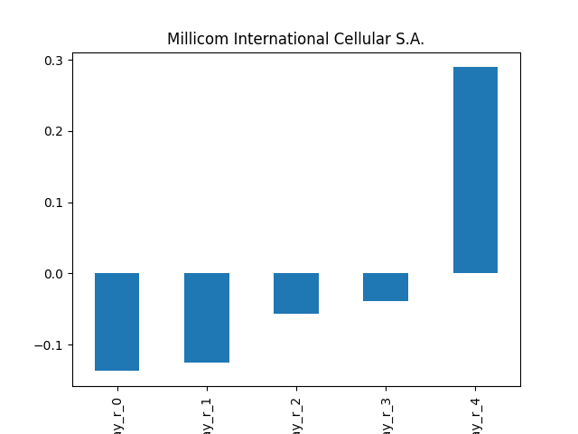

### Mit Filter
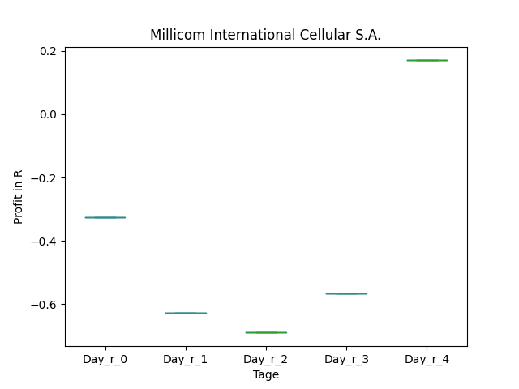
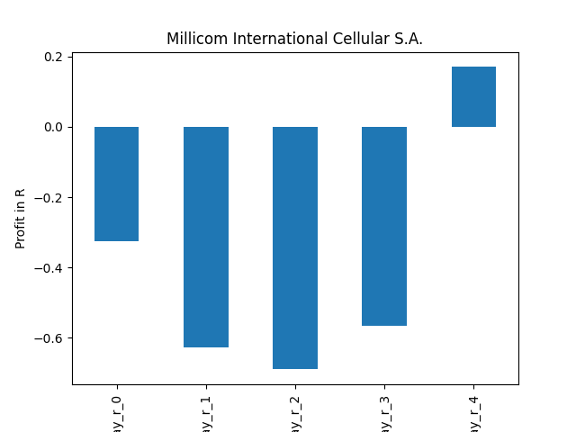

## OPFI

### Erwartung in R
|      |   Day_r_0 |   Day_r_1 |   Day_r_2 |   Day_r_3 |   Day_r_4 |   Treffer |
|:-----|----------:|----------:|----------:|----------:|----------:|----------:|
| ohne |      -0.4 |        -1 |        -1 |        -1 |        -1 |         1 |
| mit  |     nan   |       nan |       nan |       nan |       nan |         0 |

### Ohne Filter
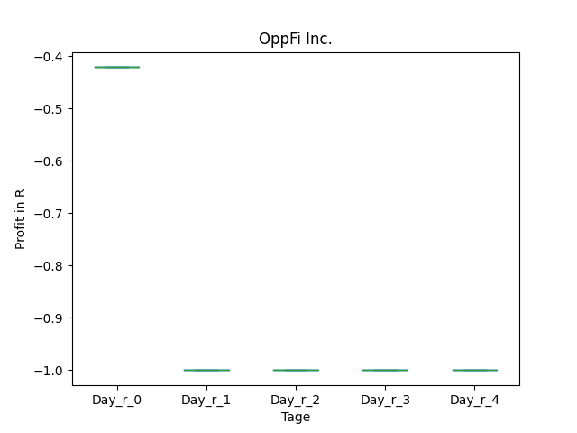
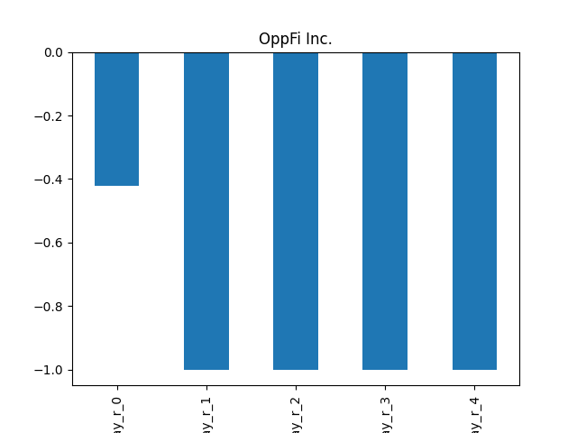

### Mit Filter
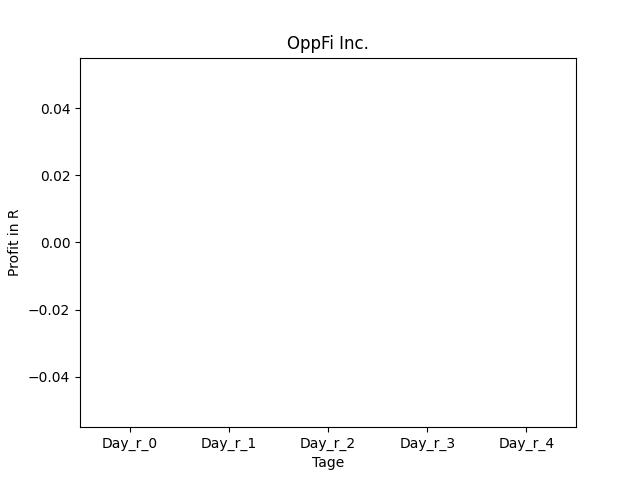

## JD

### Erwartung in R
|      |   Day_r_0 |   Day_r_1 |   Day_r_2 |   Day_r_3 |   Day_r_4 |   Treffer |
|:-----|----------:|----------:|----------:|----------:|----------:|----------:|
| ohne |       0.5 |       0.3 |       0.9 |       0.5 |       0.6 |         3 |
| mit  |       1.5 |       1.7 |       1.8 |       0.5 |       0.6 |         1 |

### Ohne Filter
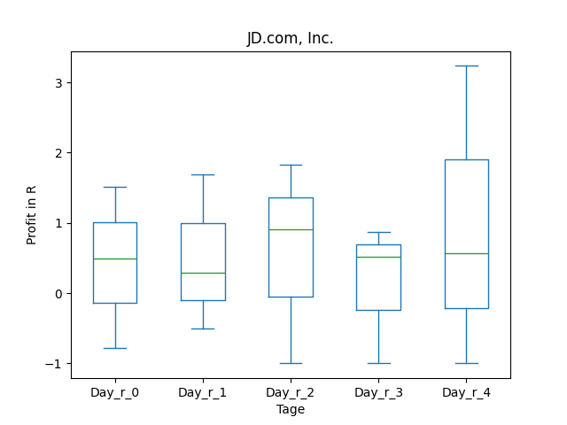
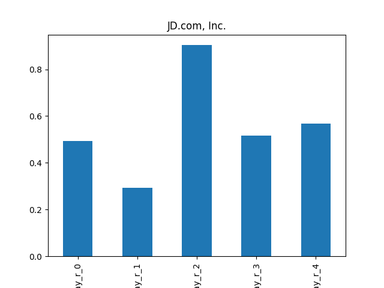

### Mit Filter
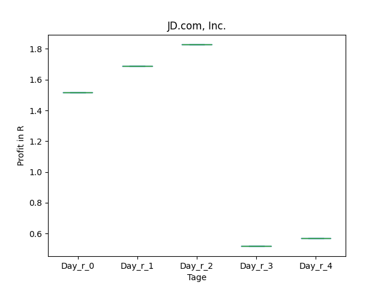
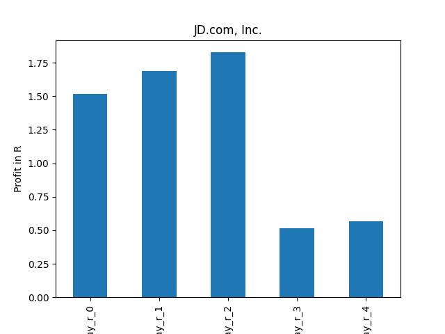

