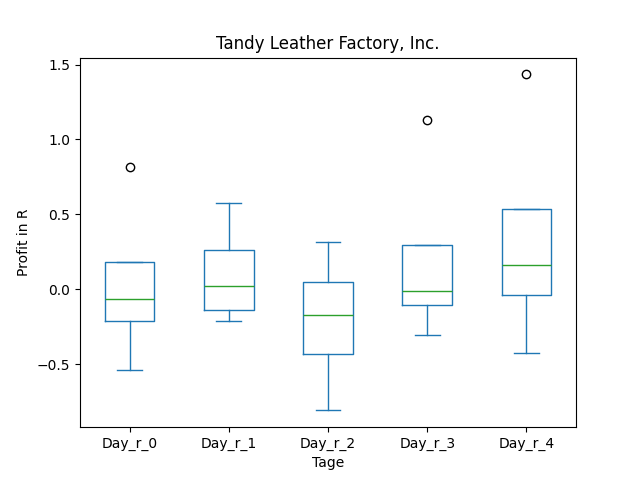
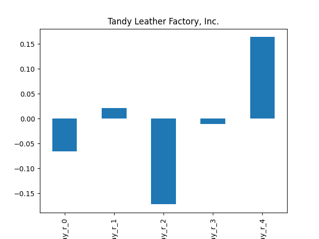
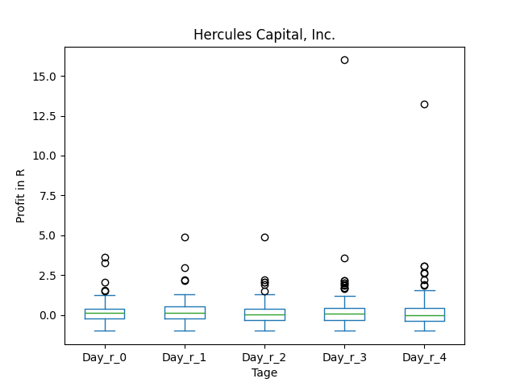
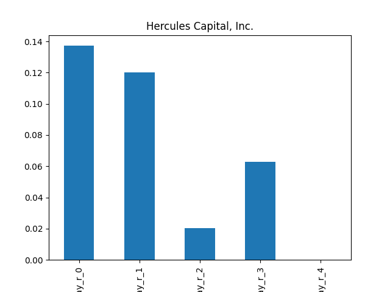
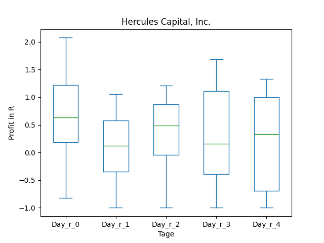
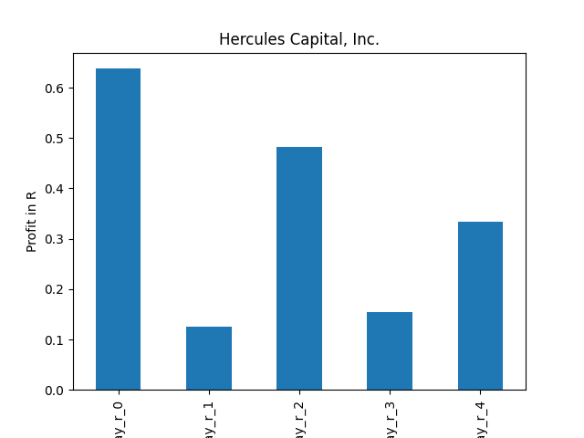

# dividend-shorter

bet on falling prices on payday **2026-02-25**.

## Signale

| Ticker   |   Divid Rate |   Close |         Volume |   last_close_volume |   Divid % | 5_Days_pos   | above_SMA_50   |
|:---------|-------------:|--------:|---------------:|--------------------:|----------:|:-------------|:---------------|
| TLF      |         0.75 |    3.07 | 92200          |              283054 |     24.43 | False        | True           |
| HTGC     |         0.4  |   15.07 |     4.6709e+06 |            70390463 |      2.65 | False        | False          |

## TLF

### Erwartung in R
|      |   Day_r_0 |   Day_r_1 |   Day_r_2 |   Day_r_3 |   Day_r_4 |   Treffer |
|:-----|----------:|----------:|----------:|----------:|----------:|----------:|
| ohne |      -0.1 |         0 |      -0.2 |        -0 |       0.2 |         4 |
| mit  |     nan   |       nan |     nan   |       nan |     nan   |         0 |

### Ohne Filter

### Mit Filter

## HTGC

### Erwartung in R
|      |   Day_r_0 |   Day_r_1 |   Day_r_2 |   Day_r_3 |   Day_r_4 |   Treffer |
|:-----|----------:|----------:|----------:|----------:|----------:|----------:|
| ohne |       0.1 |       0.1 |       0   |       0.1 |       0   |       108 |
| mit  |       0.6 |       0.1 |       0.5 |       0.2 |       0.3 |         9 |

### Ohne Filter

### Mit Filter

