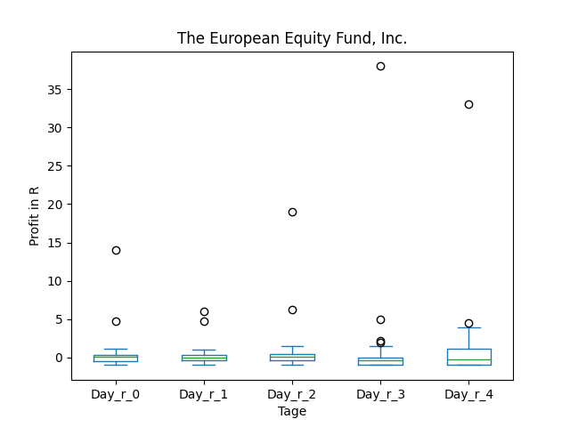
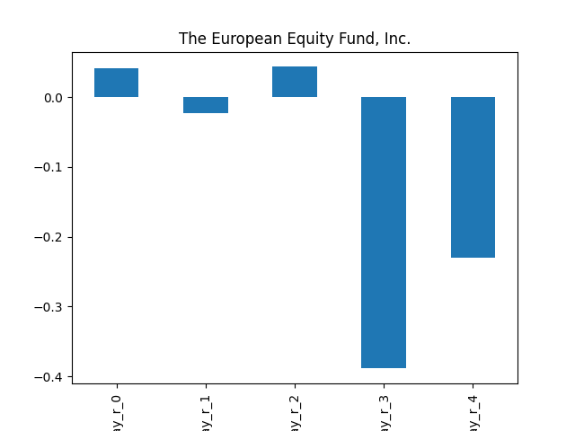
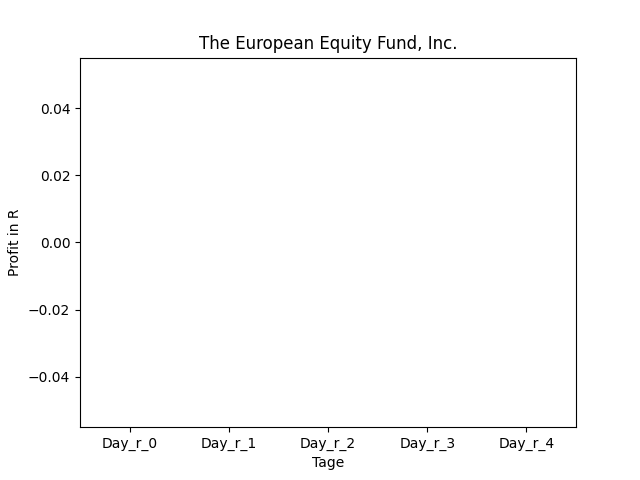

# dividend-shorter

bet on falling prices on payday **2025-12-30**.

## Signale

| Ticker   |   Divid Rate |   Close |          Volume |   last_close_volume |   Divid % | 5_Days_pos   | above_SMA_50   |
|:---------|-------------:|--------:|----------------:|--------------------:|----------:|:-------------|:---------------|
| FTEL     |         0.1  |    0.8  |     2.52673e+07 |            20213840 |     12.5  | True         | False          |
| EEA      |         0.75 |   11.08 | 43000           |              476440 |      6.75 | True         | True           |

## FTEL

### Erwartung in R
|      |   Day_r_0 |   Day_r_1 |   Day_r_2 |   Day_r_3 |   Day_r_4 |   Treffer |
|:-----|----------:|----------:|----------:|----------:|----------:|----------:|
| ohne |       nan |       nan |       nan |       nan |       nan |         0 |
| mit  |       nan |       nan |       nan |       nan |       nan |         0 |

### Ohne Filter

### Mit Filter

## EEA

### Erwartung in R
|      |   Day_r_0 |   Day_r_1 |   Day_r_2 |   Day_r_3 |   Day_r_4 |   Treffer |
|:-----|----------:|----------:|----------:|----------:|----------:|----------:|
| ohne |         0 |        -0 |         0 |      -0.4 |      -0.2 |        31 |
| mit  |       nan |       nan |       nan |     nan   |     nan   |         0 |

### Ohne Filter

### Mit Filter

