# dividend-shorter

bet on falling prices on payday **2026-03-12**.

## Signale

| Ticker   |   Divid Rate |   Close |          Volume |   last_close_volume |   Divid % | 5_Days_pos   | above_SMA_50   |
|:---------|-------------:|--------:|----------------:|--------------------:|----------:|:-------------|:---------------|
| WHF      |         0.25 |    7.45 | 225000          |             1676250 |      3.36 | True         | True           |
| TRMD     |         0.7  |   27.23 |      1.3563e+06 |            36932049 |      2.57 | False        | True           |
| FRO      |         1.03 |   33.5  |      5.1384e+06 |           172136400 |      3.07 | False        | True           |
| CLPR     |         0.1  |    3.21 |  71100          |              228231 |      2.96 | True         | False          |

## WHF

### Erwartung in R
|      |   Day_r_0 |   Day_r_1 |   Day_r_2 |   Day_r_3 |   Day_r_4 |   Treffer |
|:-----|----------:|----------:|----------:|----------:|----------:|----------:|
| ohne |       0.1 |       0.3 |       0.4 |       0.5 |       0.4 |        60 |
| mit  |       0.1 |       0.4 |       0.6 |       0.6 |       0.6 |        12 |

### Ohne Filter
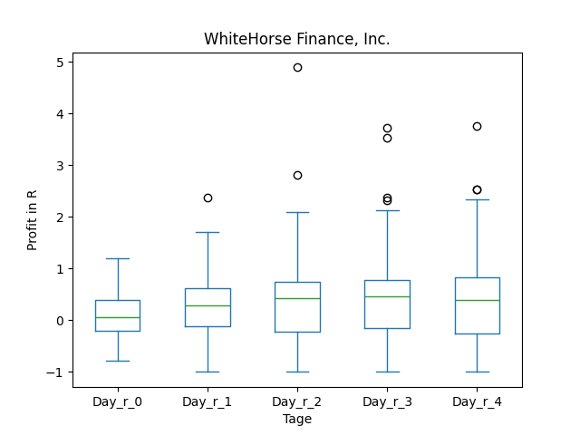
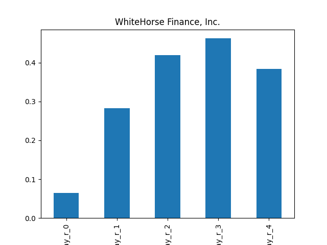

### Mit Filter
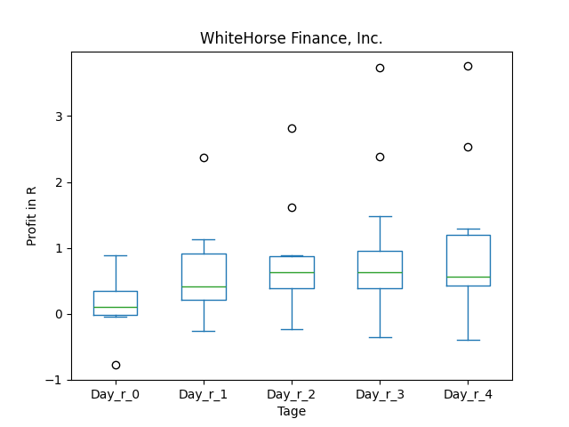
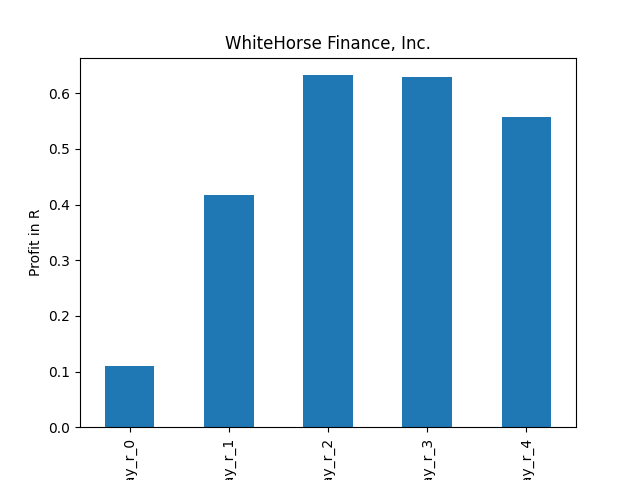

## TRMD

### Erwartung in R
|      |   Day_r_0 |   Day_r_1 |   Day_r_2 |   Day_r_3 |   Day_r_4 |   Treffer |
|:-----|----------:|----------:|----------:|----------:|----------:|----------:|
| ohne |         0 |       0.3 |       0.5 |       0.6 |       0.7 |        15 |
| mit  |         0 |       0.1 |       0.5 |       0.4 |       0.7 |        11 |

### Ohne Filter
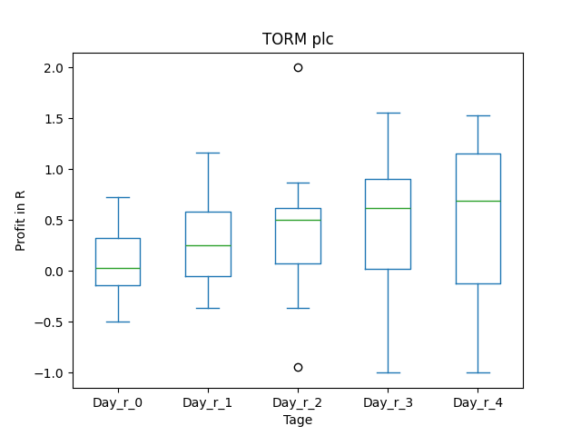
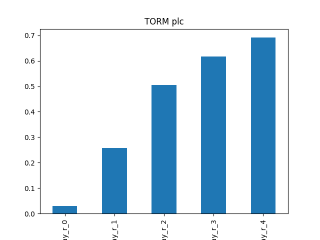

### Mit Filter
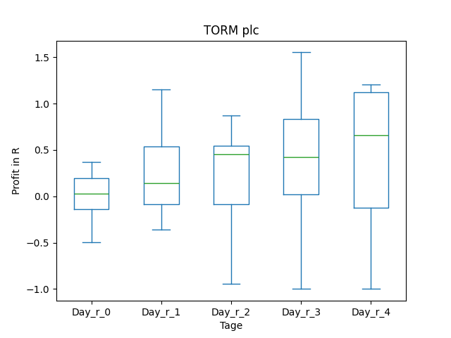
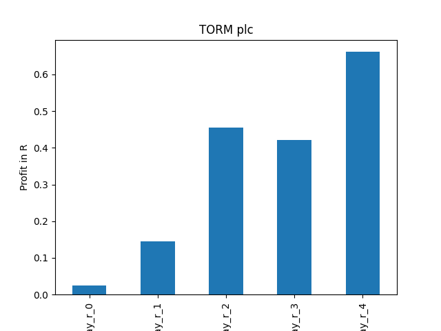

## FRO

### Erwartung in R
|      |   Day_r_0 |   Day_r_1 |   Day_r_2 |   Day_r_3 |   Day_r_4 |   Treffer |
|:-----|----------:|----------:|----------:|----------:|----------:|----------:|
| ohne |      -0.1 |      -0   |       0   |       0.1 |      -0.2 |        60 |
| mit  |      -0.1 |       0.1 |       0.1 |       0   |      -0   |         8 |

### Ohne Filter
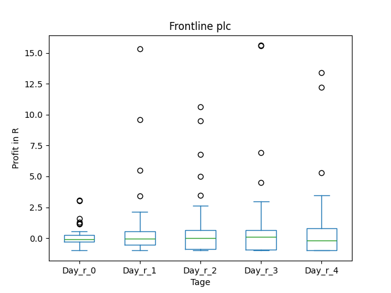
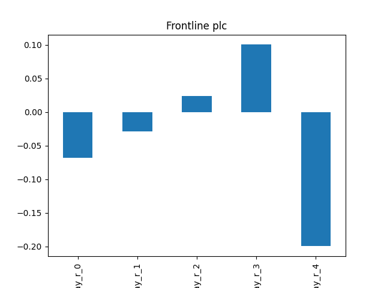

### Mit Filter
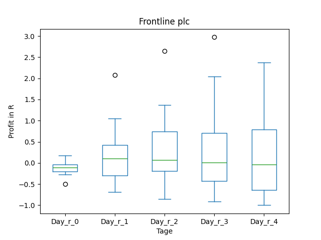
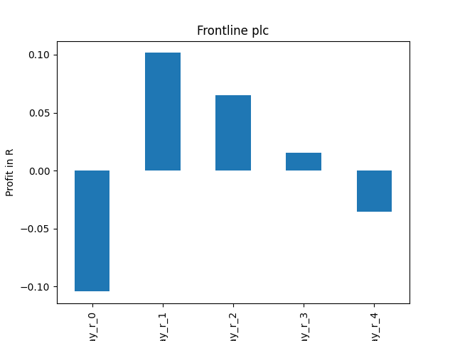

## CLPR

### Erwartung in R
|      |   Day_r_0 |   Day_r_1 |   Day_r_2 |   Day_r_3 |   Day_r_4 |   Treffer |
|:-----|----------:|----------:|----------:|----------:|----------:|----------:|
| ohne |      -0.1 |      -0.1 |      -0.2 |      -0.2 |      -0.3 |        36 |
| mit  |     nan   |     nan   |     nan   |     nan   |     nan   |         0 |

### Ohne Filter
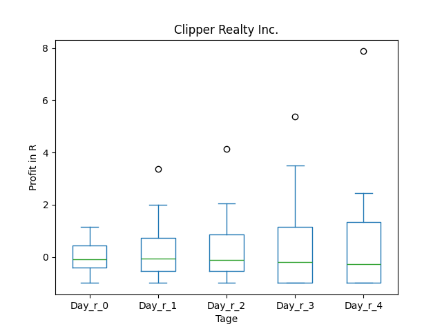
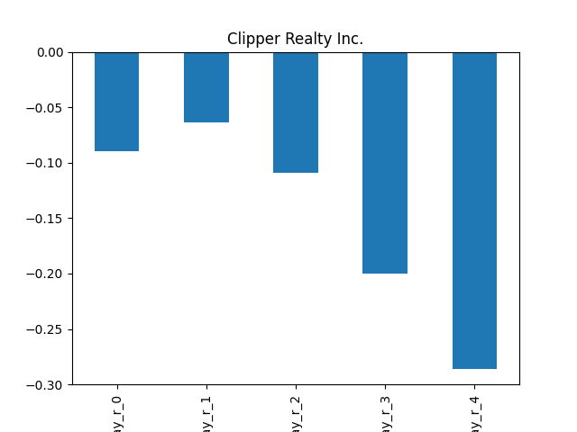

### Mit Filter
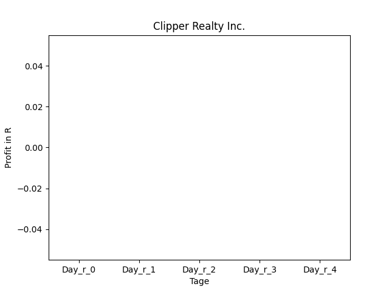
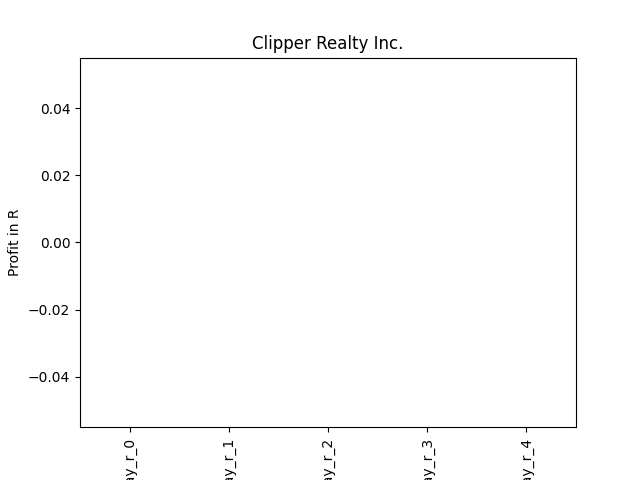

