# dividend-shorter

bet on falling prices on payday **2026-06-15**.

## Signale

| Ticker   |   Divid Rate |   Close |          Volume |   last_close_volume |   Divid % | 5_Days_pos   | above_SMA_50   |
|:---------|-------------:|--------:|----------------:|--------------------:|----------:|:-------------|:---------------|
| VTS      |         0.44 |   17.15 | 571900          |             9808085 |      2.55 | False        | False          |
| STRK     |         2    |   69.57 | 114700          |             7979679 |      2.87 | True         | False          |
| STRF     |         2.5  |   95.27 |  72700          |             6926129 |      2.62 | True         | False          |
| STRD     |         2.5  |   71.5  | 226300          |            16180450 |      3.5  | True         | False          |
| NREF     |         0.5  |   15.87 | 166700          |             2645529 |      3.15 | True         | True           |
| HXGBY    |         1.61 |    9.77 | 161200          |             1574924 |     16.51 | False        | False          |
| GELHY    |         1.28 |   50.24 |  12100          |              607904 |      2.54 | True         | False          |
| GECC     |         0.25 |    6.16 | 231900          |             1428504 |      4.06 | True         | True           |
| GCV      |         0.12 |    4.66 |  31800          |              148188 |      2.58 | True         | True           |
| GAB      |         0.15 |    5.65 | 977400          |             5522310 |      2.65 | True         | True           |
| EPM      |         0.12 |    4.16 | 448000          |             1863680 |      2.88 | False        | False          |
| BCSF     |         0.42 |   12.9  | 353100          |             4554990 |      3.26 | True         | False          |
| AEG      |         0.25 |    8.66 |      4.3441e+06 |            37619906 |      2.85 | True         | True           |

## VTS

### Erwartung in R
|      |   Day_r_0 |   Day_r_1 |   Day_r_2 |   Day_r_3 |   Day_r_4 |   Treffer |
|:-----|----------:|----------:|----------:|----------:|----------:|----------:|
| ohne |       0.3 |       0.3 |       0.1 |       0.3 |       0.9 |        13 |
| mit  |       0   |       0.3 |       0.1 |       0.1 |       0.4 |         1 |

### Ohne Filter
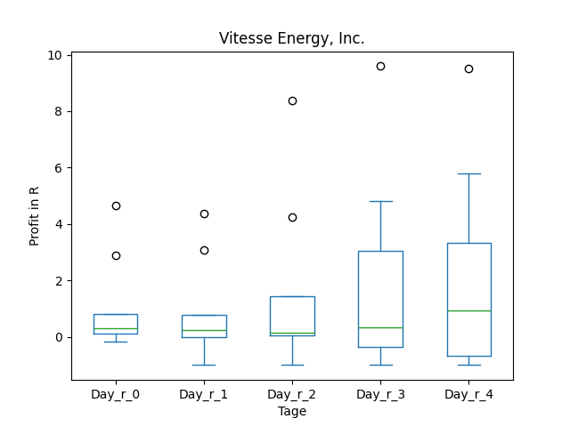
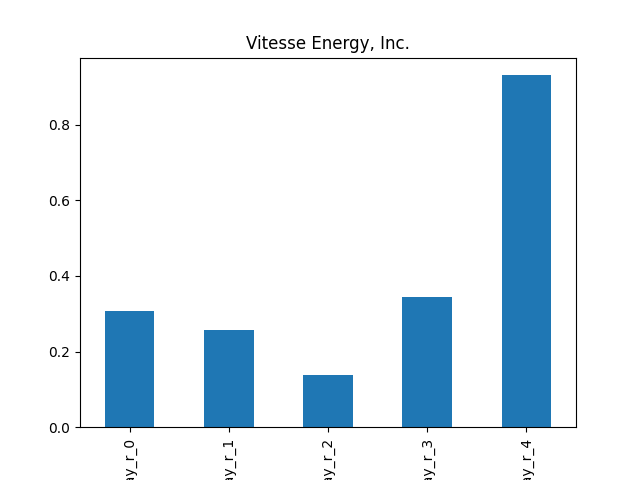

### Mit Filter
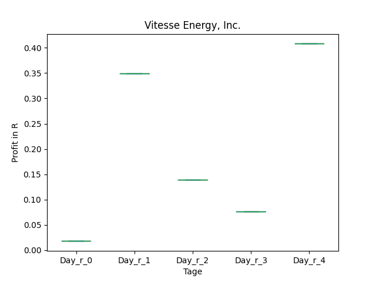
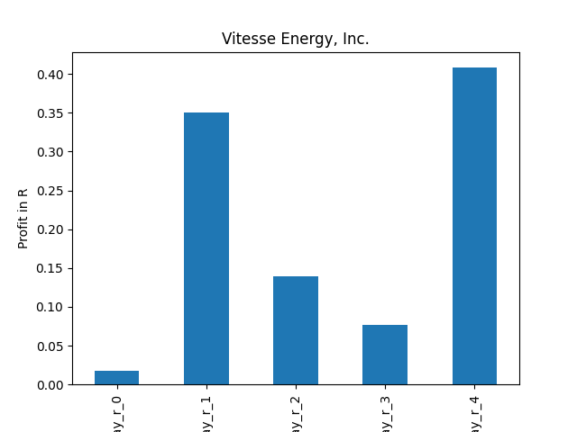

## STRK

### Erwartung in R
|      |   Day_r_0 |   Day_r_1 |   Day_r_2 |   Day_r_3 |   Day_r_4 |   Treffer |
|:-----|----------:|----------:|----------:|----------:|----------:|----------:|
| ohne |       0.3 |       0.4 |       1.1 |       1.3 |       1.3 |         5 |
| mit  |     nan   |     nan   |     nan   |     nan   |     nan   |         0 |

### Ohne Filter
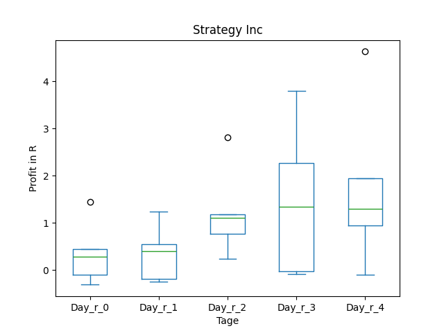
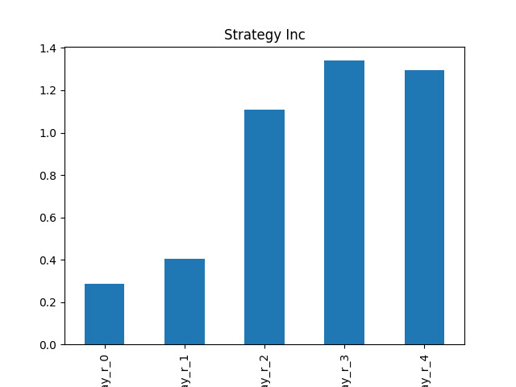

### Mit Filter
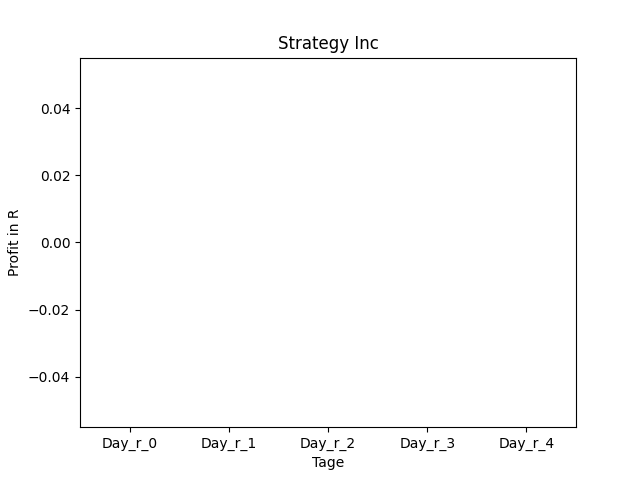
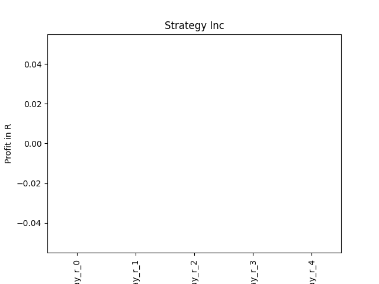

## STRF

### Erwartung in R
|      |   Day_r_0 |   Day_r_1 |   Day_r_2 |   Day_r_3 |   Day_r_4 |   Treffer |
|:-----|----------:|----------:|----------:|----------:|----------:|----------:|
| ohne |         0 |         0 |         0 |       0.1 |       0.1 |         4 |
| mit  |       nan |       nan |       nan |     nan   |     nan   |         0 |

### Ohne Filter
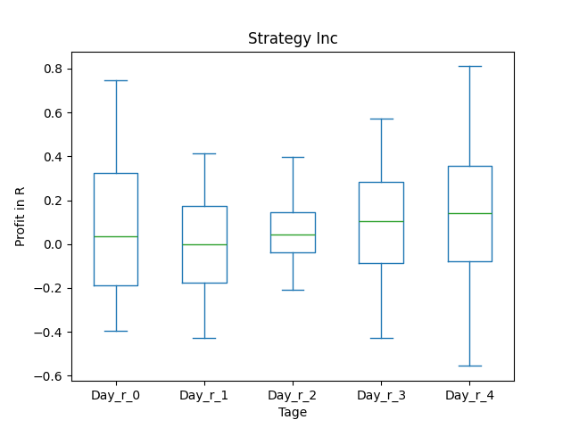
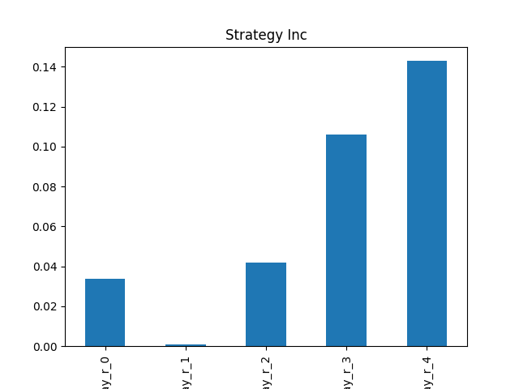

### Mit Filter

## STRD

### Erwartung in R
|      |   Day_r_0 |   Day_r_1 |   Day_r_2 |   Day_r_3 |   Day_r_4 |   Treffer |
|:-----|----------:|----------:|----------:|----------:|----------:|----------:|
| ohne |       0.2 |       0.5 |       1.1 |       1.2 |       0.4 |         3 |
| mit  |       0.2 |       0.5 |       1.1 |       1.2 |       0.4 |         3 |

### Ohne Filter
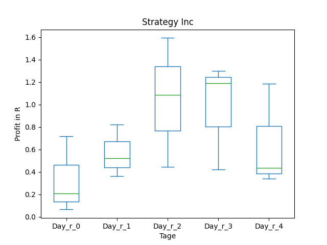
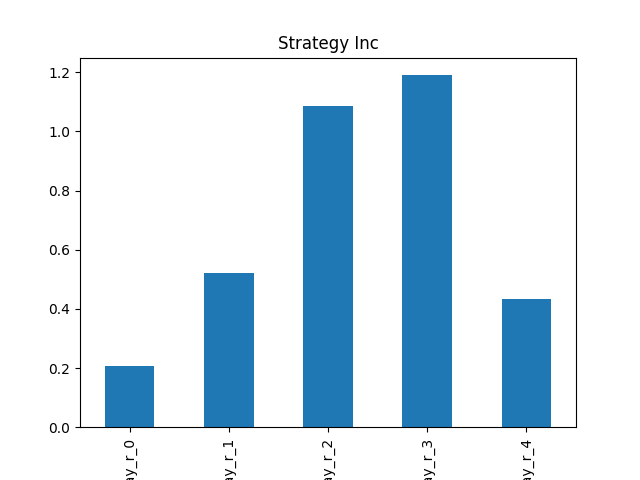

### Mit Filter

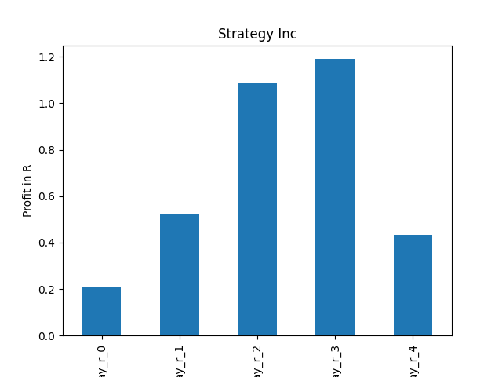

## NREF

### Erwartung in R
|      |   Day_r_0 |   Day_r_1 |   Day_r_2 |   Day_r_3 |   Day_r_4 |   Treffer |
|:-----|----------:|----------:|----------:|----------:|----------:|----------:|
| ohne |       0.3 |       0.5 |       0.6 |       0.6 |       1   |        29 |
| mit  |       0.3 |       0.5 |       0.6 |       0.3 |       0.4 |         7 |

### Ohne Filter
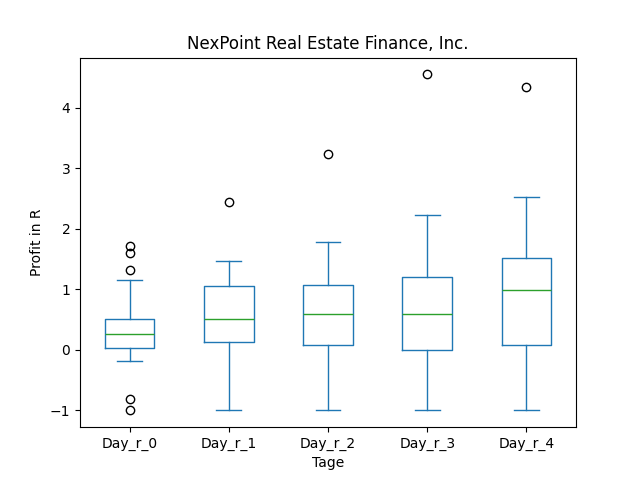
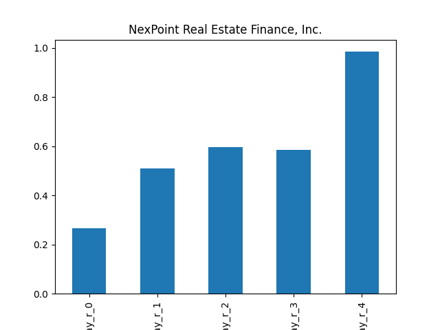

### Mit Filter
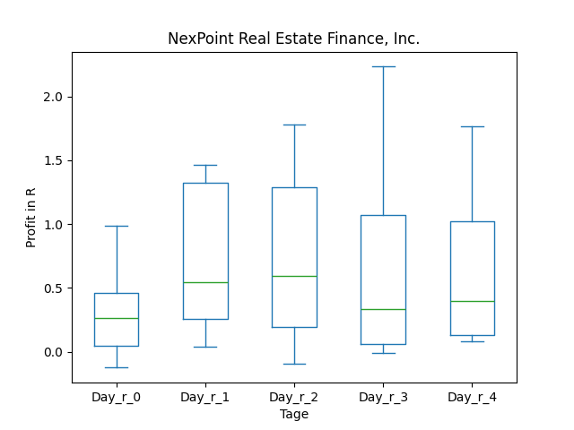
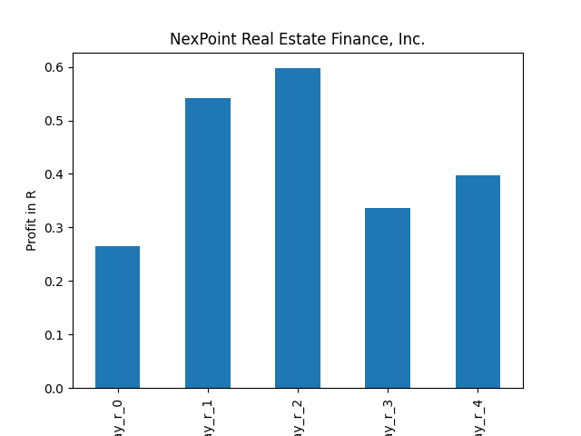

## HXGBY

### Erwartung in R
|      |   Day_r_0 |   Day_r_1 |   Day_r_2 |   Day_r_3 |   Day_r_4 |   Treffer |
|:-----|----------:|----------:|----------:|----------:|----------:|----------:|
| ohne |      -0.1 |      -0.1 |      -0.6 |      -0.6 |      -0.3 |        13 |
| mit  |      -0.1 |      -0.5 |      -0.1 |      -0.2 |      -0.3 |         1 |

### Ohne Filter
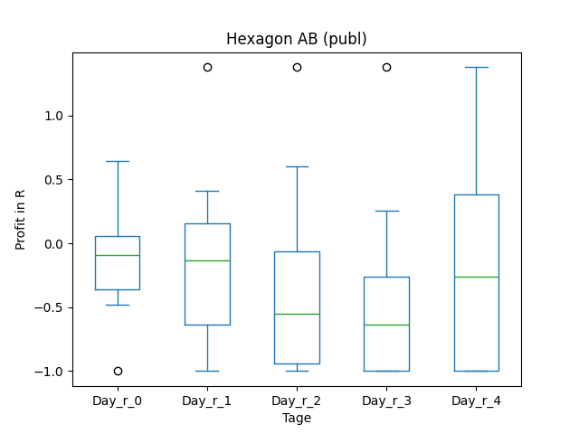
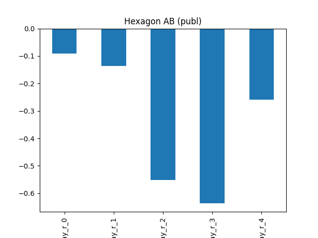

### Mit Filter
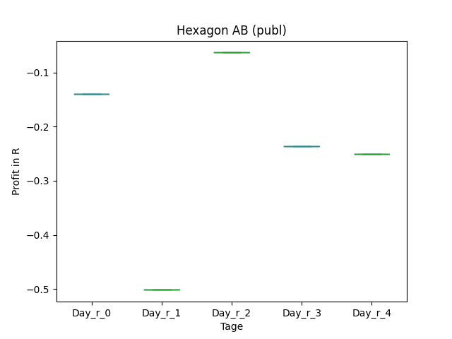
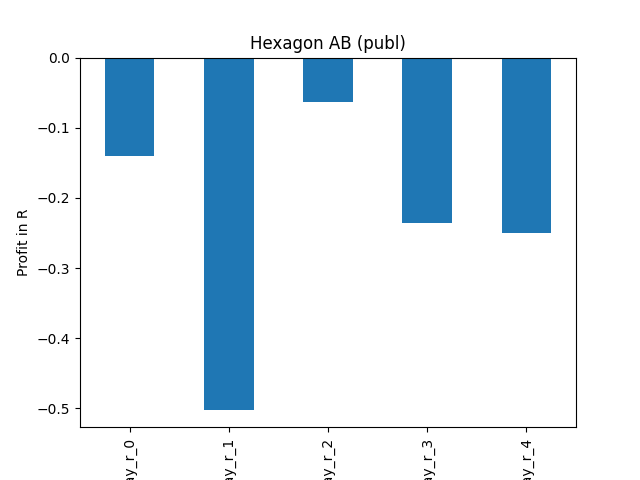

## GELHY

### Erwartung in R
|      |   Day_r_0 |   Day_r_1 |   Day_r_2 |   Day_r_3 |   Day_r_4 |   Treffer |
|:-----|----------:|----------:|----------:|----------:|----------:|----------:|
| ohne |       nan |       nan |       nan |       nan |       nan |         0 |
| mit  |       nan |       nan |       nan |       nan |       nan |         0 |

### Ohne Filter

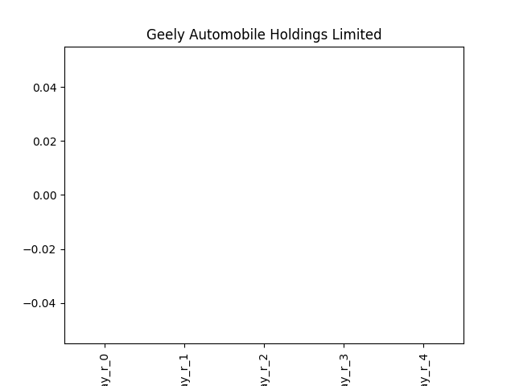

### Mit Filter
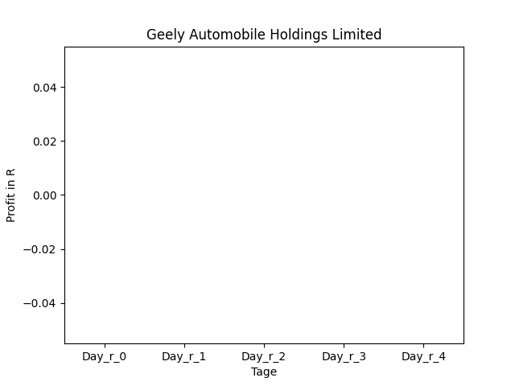
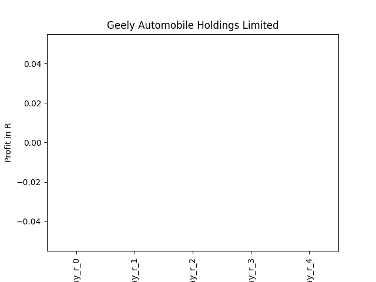

## GECC

### Erwartung in R
|      |   Day_r_0 |   Day_r_1 |   Day_r_2 |   Day_r_3 |   Day_r_4 |   Treffer |
|:-----|----------:|----------:|----------:|----------:|----------:|----------:|
| ohne |       0.3 |       0.4 |       0.6 |       0.6 |       0.6 |        73 |
| mit  |       0.3 |       0.6 |       0.4 |       0.2 |       0.4 |         3 |

### Ohne Filter
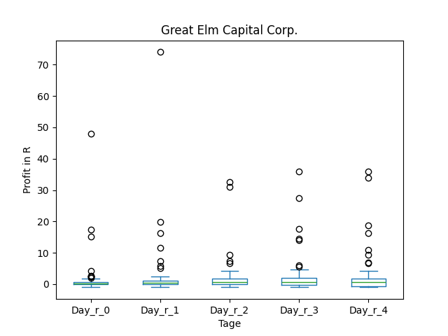
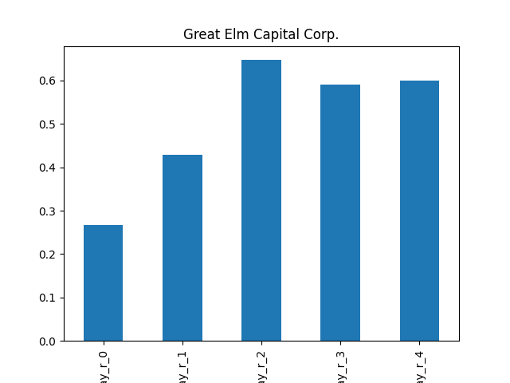

### Mit Filter
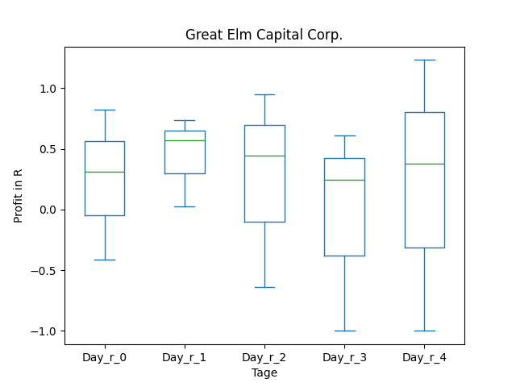
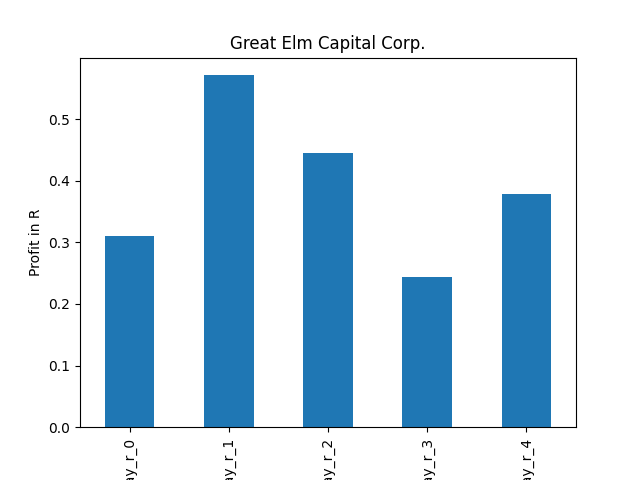

## GCV

### Erwartung in R
|      |   Day_r_0 |   Day_r_1 |   Day_r_2 |   Day_r_3 |   Day_r_4 |   Treffer |
|:-----|----------:|----------:|----------:|----------:|----------:|----------:|
| ohne |       0.1 |       0.2 |       0.3 |       0.1 |      -0.1 |        72 |
| mit  |       0   |       0.4 |       0.1 |       0.1 |      -0.2 |         1 |

### Ohne Filter
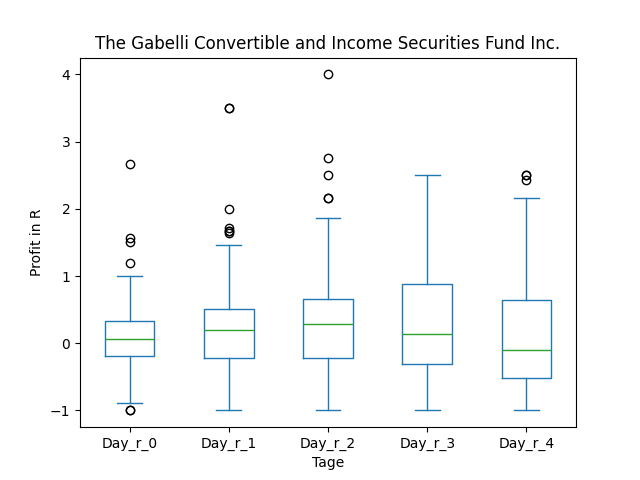
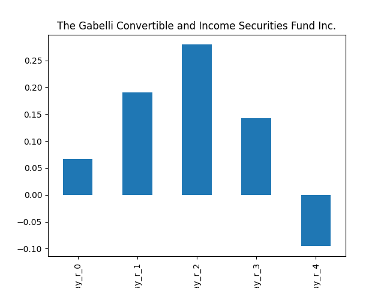

### Mit Filter
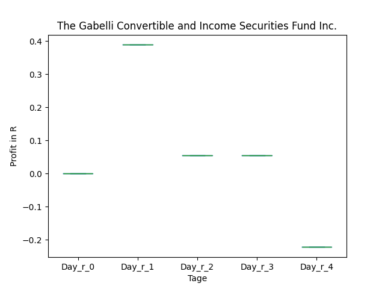
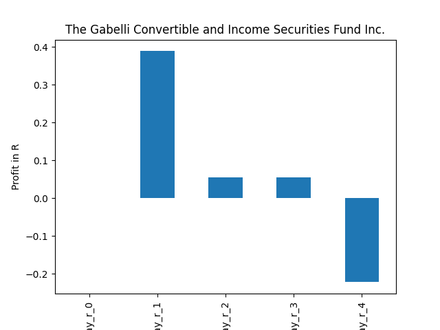

## GAB

### Erwartung in R
|      |   Day_r_0 |   Day_r_1 |   Day_r_2 |   Day_r_3 |   Day_r_4 |   Treffer |
|:-----|----------:|----------:|----------:|----------:|----------:|----------:|
| ohne |       0.3 |       0.3 |       0.4 |       0.4 |       0.2 |        71 |
| mit  |       0.3 |       0.3 |       0.5 |       0.4 |       0.1 |        23 |

### Ohne Filter
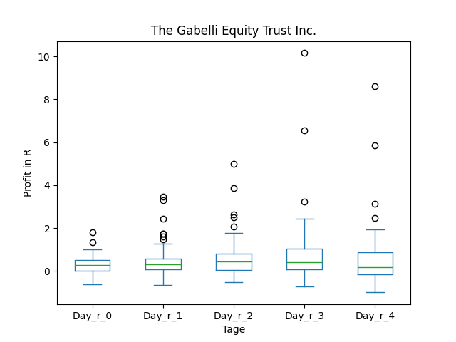
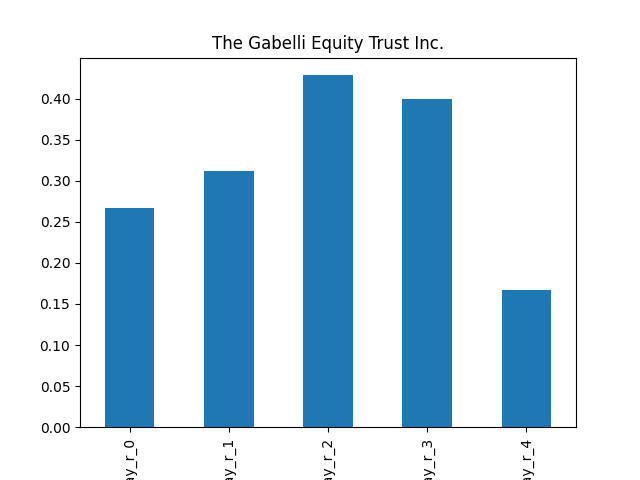

### Mit Filter
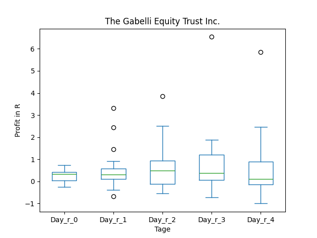
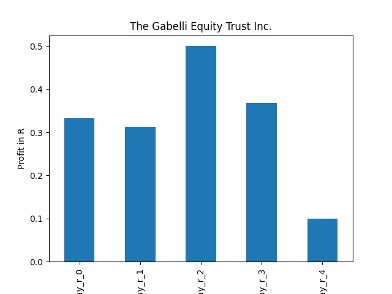

## EPM

### Erwartung in R
|      |   Day_r_0 |   Day_r_1 |   Day_r_2 |   Day_r_3 |   Day_r_4 |   Treffer |
|:-----|----------:|----------:|----------:|----------:|----------:|----------:|
| ohne |       0.2 |       0.3 |      -0   |       0.1 |      -0.2 |        50 |
| mit  |       1.5 |       2.2 |       2.5 |       4   |       4.3 |         1 |

### Ohne Filter
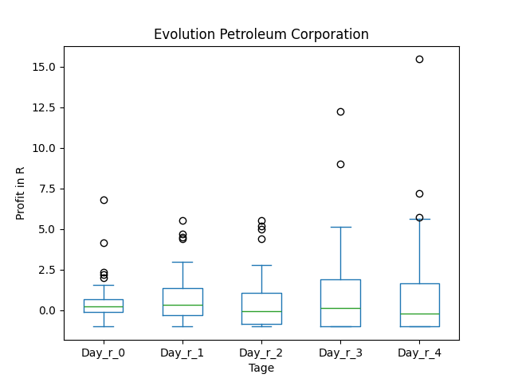
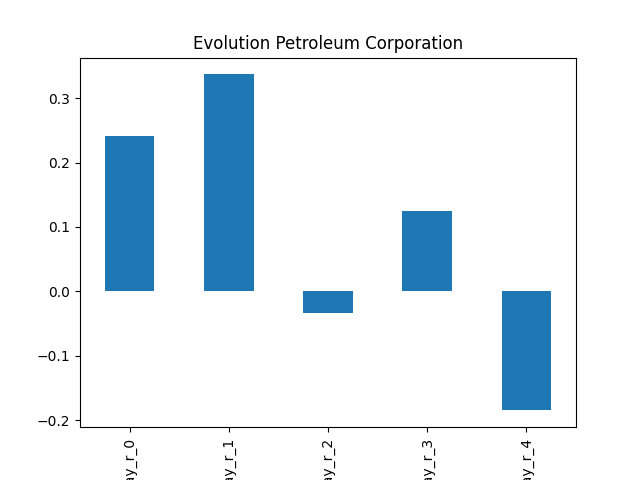

### Mit Filter
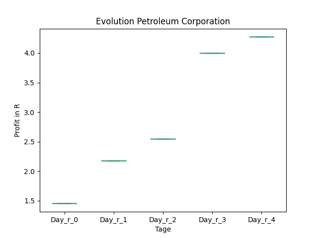
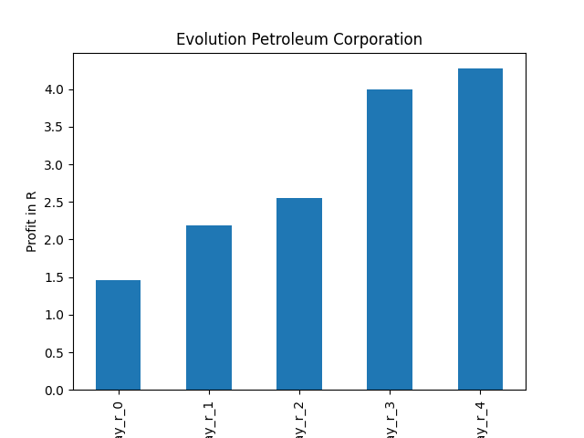

## BCSF

### Erwartung in R
|      |   Day_r_0 |   Day_r_1 |   Day_r_2 |   Day_r_3 |   Day_r_4 |   Treffer |
|:-----|----------:|----------:|----------:|----------:|----------:|----------:|
| ohne |         0 |       0.1 |      -0   |      -0   |      -0   |        39 |
| mit  |         0 |       0.1 |      -0.1 |      -0.1 |       0.1 |         9 |

### Ohne Filter
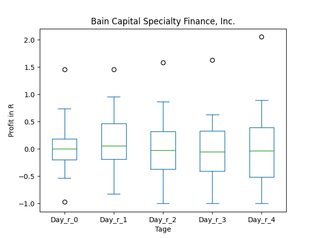
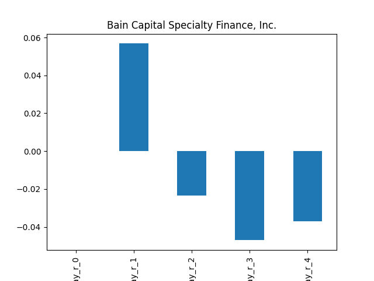

### Mit Filter
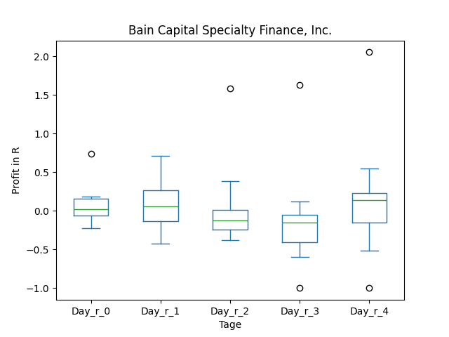
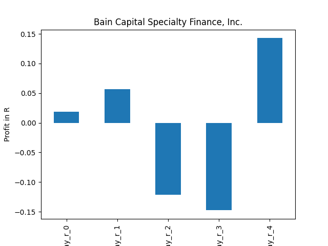

## AEG

### Erwartung in R
|      |   Day_r_0 |   Day_r_1 |   Day_r_2 |   Day_r_3 |   Day_r_4 |   Treffer |
|:-----|----------:|----------:|----------:|----------:|----------:|----------:|
| ohne |         0 |      -0.2 |        -0 |      -0.1 |      -0.3 |        37 |
| mit  |         0 |      -0.5 |         0 |      -0.2 |      -0.6 |        14 |

### Ohne Filter
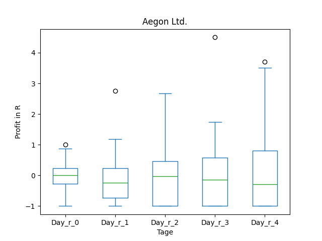
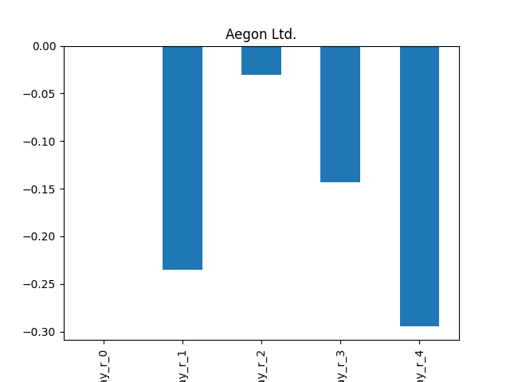

### Mit Filter
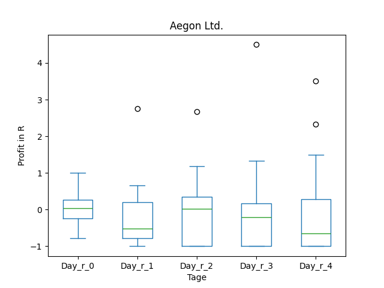
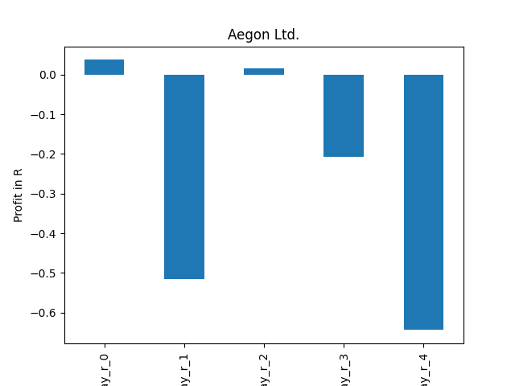

