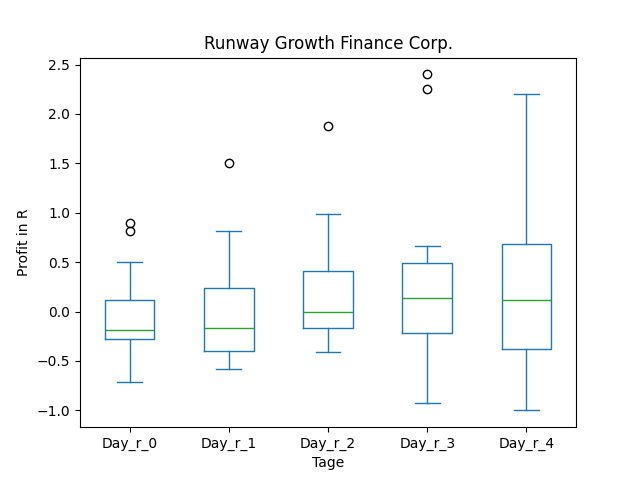
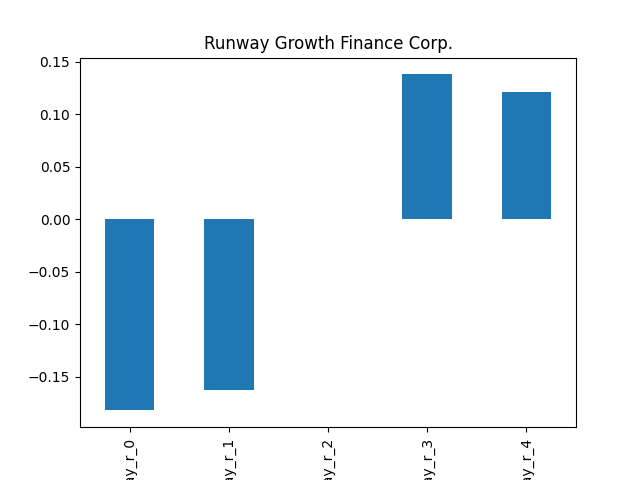
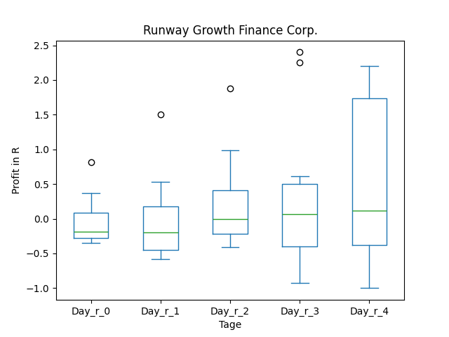
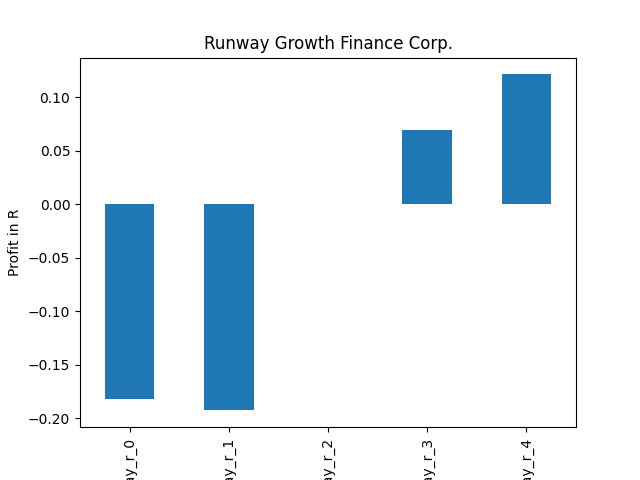
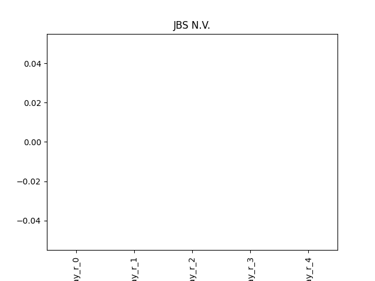
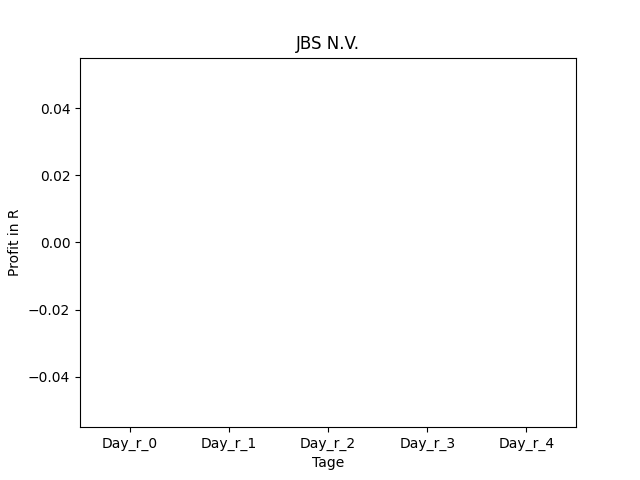
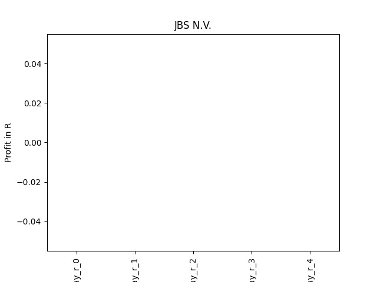

# dividend-shorter

bet on falling prices on payday **2026-05-18**.

## Signale

| Ticker   |   Divid Rate |   Close |     Volume |   last_close_volume |   Divid % | 5_Days_pos   | above_SMA_50   |
|:---------|-------------:|--------:|-----------:|--------------------:|----------:|:-------------|:---------------|
| RWAY     |         0.33 |    6.65 | 1.2088e+06 |             8038520 |      4.96 | True         | False          |
| JBS      |         1    |   13.48 | 8.3012e+06 |           111900176 |      7.42 | False        | False          |
| IEP      |         0.5  |    8.19 | 2.7783e+06 |            22754277 |      6.11 | True         | True           |

## RWAY

### Erwartung in R
|      |   Day_r_0 |   Day_r_1 |   Day_r_2 |   Day_r_3 |   Day_r_4 |   Treffer |
|:-----|----------:|----------:|----------:|----------:|----------:|----------:|
| ohne |      -0.2 |      -0.2 |         0 |       0.1 |       0.1 |        28 |
| mit  |      -0.2 |      -0.2 |         0 |       0.1 |       0.1 |        13 |

### Ohne Filter

### Mit Filter

## JBS

### Erwartung in R
|      |   Day_r_0 |   Day_r_1 |   Day_r_2 |   Day_r_3 |   Day_r_4 |   Treffer |
|:-----|----------:|----------:|----------:|----------:|----------:|----------:|
| ohne |       nan |       nan |       nan |       nan |       nan |         0 |
| mit  |       nan |       nan |       nan |       nan |       nan |         0 |

### Ohne Filter

### Mit Filter

## IEP

### Erwartung in R
|      |   Day_r_0 |   Day_r_1 |   Day_r_2 |   Day_r_3 |   Day_r_4 |   Treffer |
|:-----|----------:|----------:|----------:|----------:|----------:|----------:|
| ohne |       0.2 |       0.4 |       0.6 |       0.6 |       0.6 |        82 |
| mit  |       0.2 |       0.5 |       0.8 |       0.6 |       0.6 |        29 |

### Ohne Filter

### Mit Filter

