# dividend-shorter

bet on falling prices on payday **2026-04-27**.

## Signale

| Ticker   |   Divid Rate |   Close |   Volume |   last_close_volume |   Divid % | 5_Days_pos   | above_SMA_50   |
|:---------|-------------:|--------:|---------:|--------------------:|----------:|:-------------|:---------------|
| TSQ      |         0.2  |    6.85 |   184200 |             1261770 |      2.92 | False        | True           |
| SITIY    |         1.28 |   41.95 |     4400 |              184580 |      3.04 | False        | False          |
| ORKLY    |         0.63 |   13.11 |    67900 |              890169 |      4.79 | True         | True           |
| EONGY    |         0.67 |   22.53 |    61500 |             1385595 |      2.98 | True         | True           |
| BOUYY    |         0.49 |   12.2  |    26400 |              322080 |      3.99 | False        | True           |
| BAWAY    |         1.12 |   41.3  |     5920 |              244496 |      2.72 | True         | True           |

## TSQ

### Erwartung in R
|      |   Day_r_0 |   Day_r_1 |   Day_r_2 |   Day_r_3 |   Day_r_4 |   Treffer |
|:-----|----------:|----------:|----------:|----------:|----------:|----------:|
| ohne |       0.3 |      -0.1 |      -0.1 |      -0.1 |       0.6 |        19 |
| mit  |      -1   |      -1   |      -1   |      -1   |      -1   |         1 |

### Ohne Filter
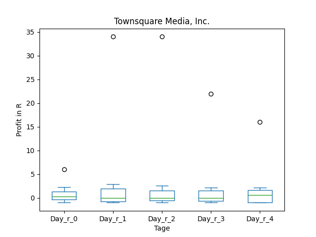
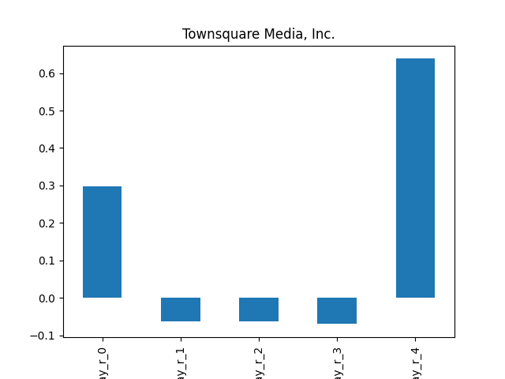

### Mit Filter
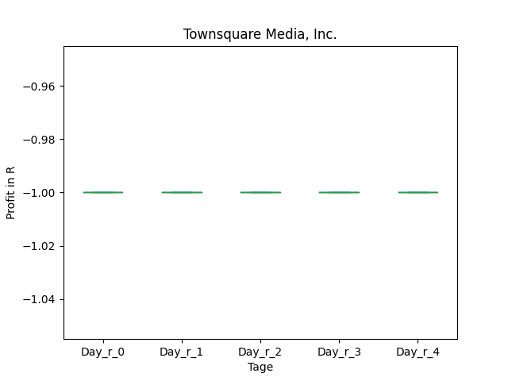
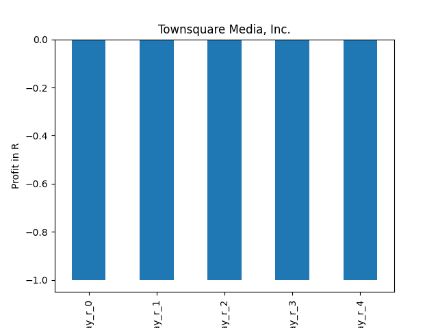

## SITIY

### Erwartung in R
|      |   Day_r_0 |   Day_r_1 |   Day_r_2 |   Day_r_3 |   Day_r_4 |   Treffer |
|:-----|----------:|----------:|----------:|----------:|----------:|----------:|
| ohne |      -0.6 |        -1 |        -1 |        -1 |        -1 |        18 |
| mit  |     nan   |       nan |       nan |       nan |       nan |         0 |

### Ohne Filter
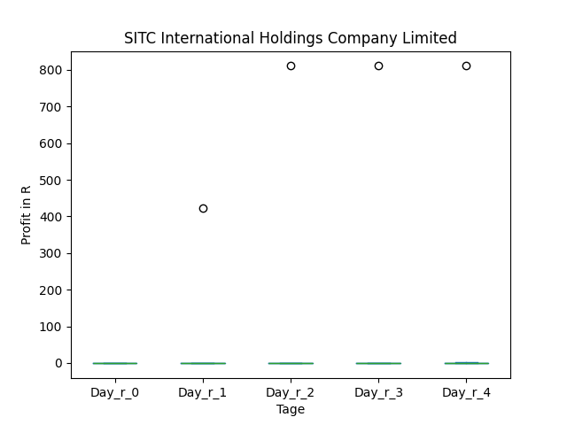
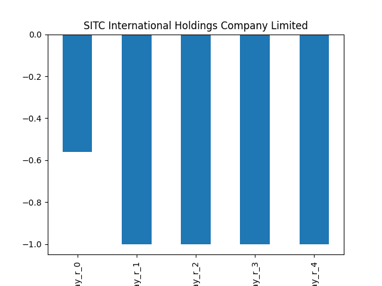

### Mit Filter
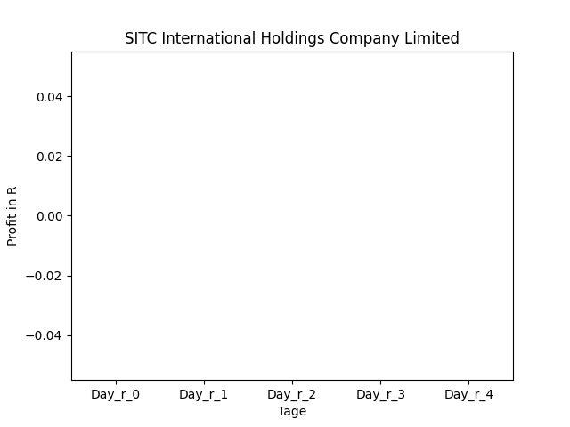
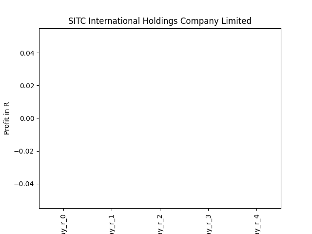

## ORKLY

### Erwartung in R
|      |   Day_r_0 |   Day_r_1 |   Day_r_2 |   Day_r_3 |   Day_r_4 |   Treffer |
|:-----|----------:|----------:|----------:|----------:|----------:|----------:|
| ohne |      -0   |      -0.2 |      -0.2 |      -0.3 |      -0.3 |        16 |
| mit  |      -0.1 |      -0.1 |      -0.3 |      -0.3 |      -0.4 |         3 |

### Ohne Filter
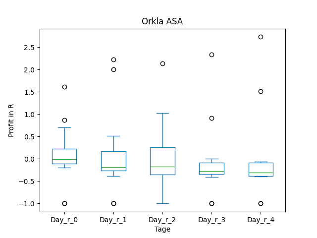
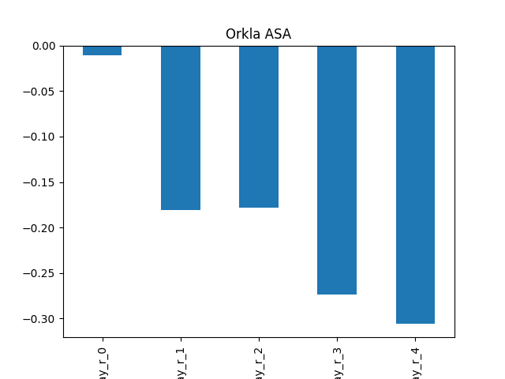

### Mit Filter
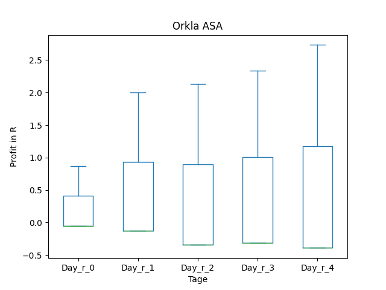
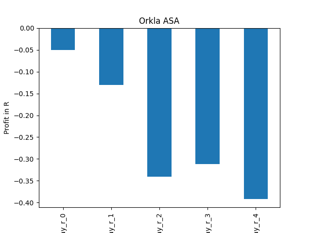

## EONGY

### Erwartung in R
|      |   Day_r_0 |   Day_r_1 |   Day_r_2 |   Day_r_3 |   Day_r_4 |   Treffer |
|:-----|----------:|----------:|----------:|----------:|----------:|----------:|
| ohne |      -0   |      -0.3 |      -0.3 |      -0.4 |      -0.3 |        16 |
| mit  |      -0.1 |      -0.2 |      -0.4 |      -0.6 |      -0.6 |        10 |

### Ohne Filter
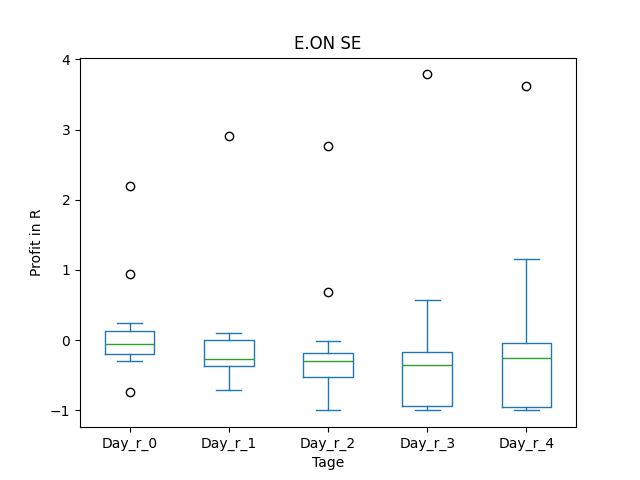
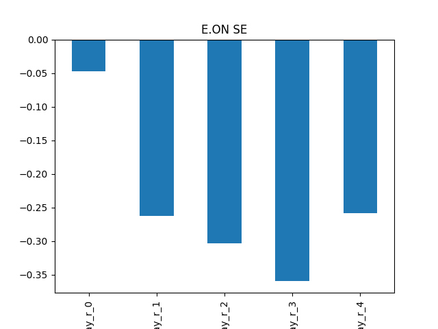

### Mit Filter
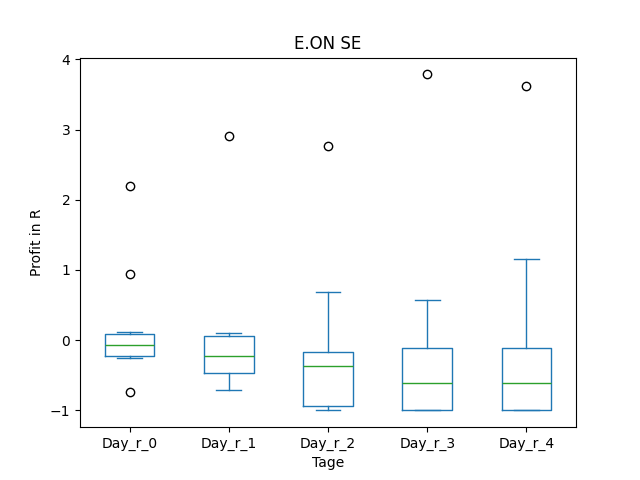
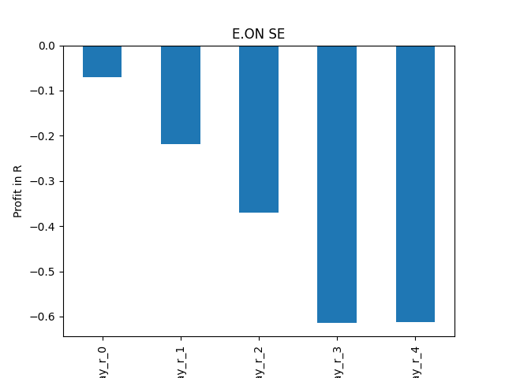

## BOUYY

### Erwartung in R
|      |   Day_r_0 |   Day_r_1 |   Day_r_2 |   Day_r_3 |   Day_r_4 |   Treffer |
|:-----|----------:|----------:|----------:|----------:|----------:|----------:|
| ohne |       0.5 |       0.1 |        -0 |       0.1 |       0.4 |         1 |
| mit  |     nan   |     nan   |       nan |     nan   |     nan   |         0 |

### Ohne Filter
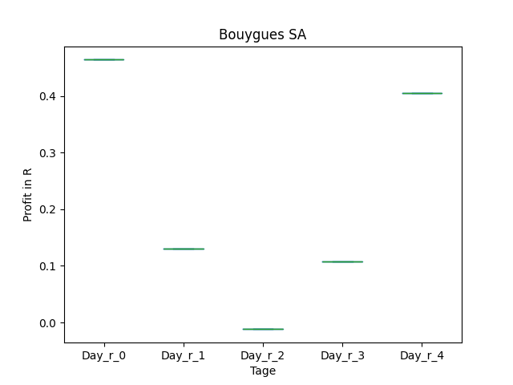
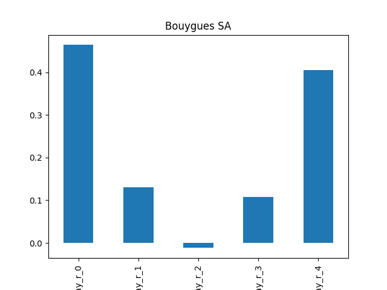

### Mit Filter

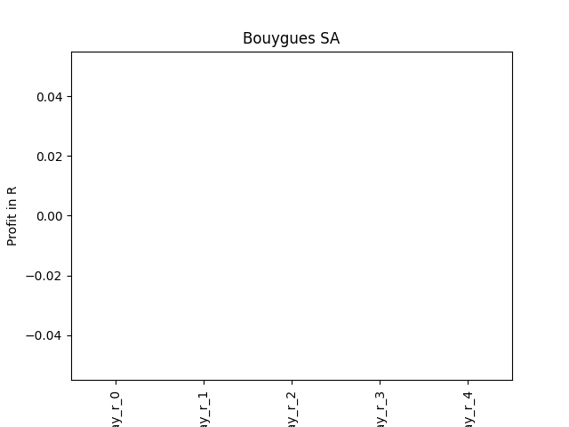

## BAWAY

### Erwartung in R
|      |   Day_r_0 |   Day_r_1 |   Day_r_2 |   Day_r_3 |   Day_r_4 |   Treffer |
|:-----|----------:|----------:|----------:|----------:|----------:|----------:|
| ohne |         0 |      -0.9 |      -0.9 |      -0.9 |      -0.9 |         1 |
| mit  |       nan |     nan   |     nan   |     nan   |     nan   |         0 |

### Ohne Filter
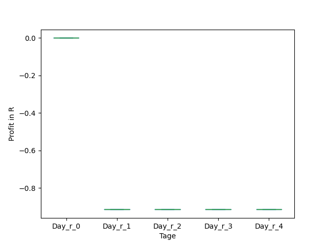
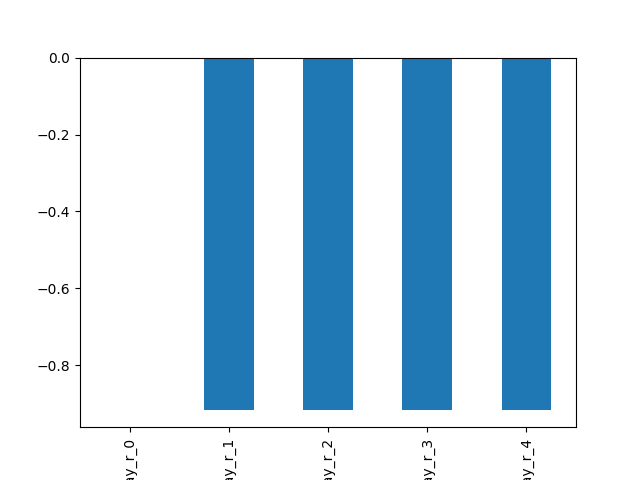

### Mit Filter
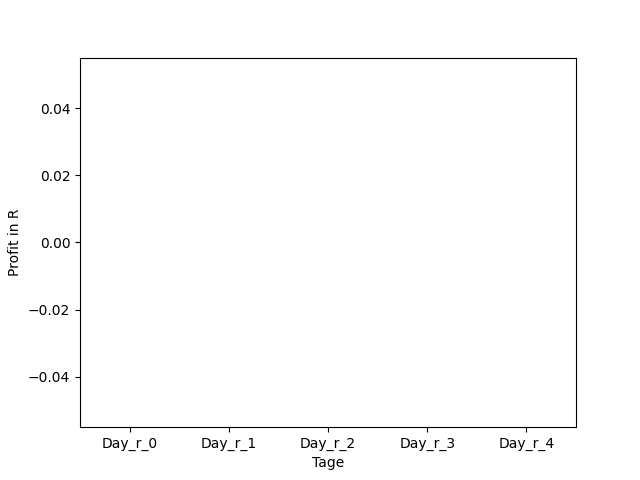
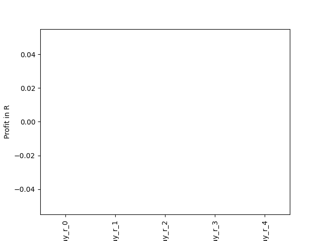

