# dividend-shorter

bet on falling prices on payday **2026-07-02**.

## Signale

| Ticker   |   Divid Rate |   Close |          Volume |   last_close_volume |   Divid % | 5_Days_pos   | above_SMA_50   |
|:---------|-------------:|--------:|----------------:|--------------------:|----------:|:-------------|:---------------|
| YB       |         1.26 |   16.38 |  76700          |             1256346 |      7.69 | True         | True           |
| TWO      |         0.34 |   12.35 |      2.0926e+06 |            25843610 |      2.75 | False        | True           |
| RITM     |         0.25 |    9.36 |      7.0237e+06 |            65741832 |      2.67 | True         | False          |
| PPCCY    |         1.63 |   47    |   3000          |              141000 |      3.46 | True         | True           |
| HNHPF    |         0.45 |   15.26 |  32800          |              500528 |      2.98 | False        | False          |
| HLTOY    |         0.51 |   11.31 |  13300          |              150423 |      4.48 | True         | True           |
| DSWL     |         0.1  |    3.87 |  64000          |              247680 |      2.58 | True         | True           |
| DSWL     |         0.2  |    3.87 |  64000          |              247680 |      5.17 | True         | True           |
| CSUAY    |         0.61 |   20.4  |  42200          |              860880 |      2.99 | False        | False          |
| CIHKY    |         0.74 |   28.75 |  80100          |             2302875 |      2.57 | True         | False          |
| CICHY    |         0.6  |   20.63 | 141000          |             2908830 |      2.91 | False        | False          |
| BACHY    |         0.43 |   15.95 | 153400          |             2446730 |      2.71 | True         | False          |
| ATHM     |         0.66 |   19.09 | 763100          |            14567579 |      3.46 | True         | True           |

## YB

### Erwartung in R
|      |   Day_r_0 |   Day_r_1 |   Day_r_2 |   Day_r_3 |   Day_r_4 |   Treffer |
|:-----|----------:|----------:|----------:|----------:|----------:|----------:|
| ohne |       nan |       nan |       nan |       nan |       nan |         0 |
| mit  |       nan |       nan |       nan |       nan |       nan |         0 |

### Ohne Filter

### Mit Filter

## TWO

### Erwartung in R
|      |   Day_r_0 |   Day_r_1 |   Day_r_2 |   Day_r_3 |   Day_r_4 |   Treffer |
|:-----|----------:|----------:|----------:|----------:|----------:|----------:|
| ohne |       0   |       0.1 |       0   |       0   |       0   |        67 |
| mit  |       0.1 |       0.1 |       0.2 |       0.1 |       0.2 |        14 |

### Ohne Filter
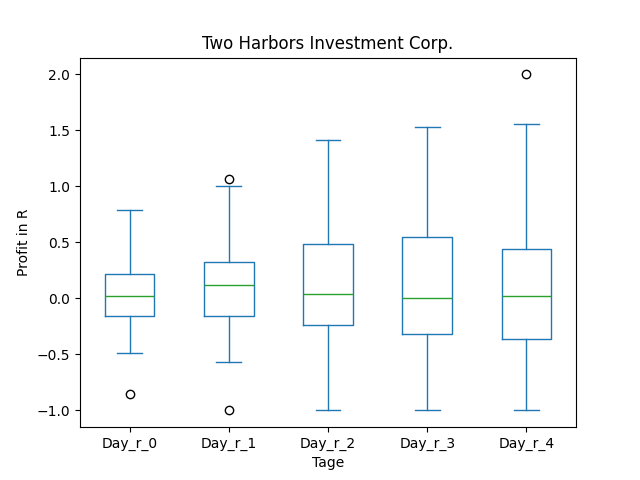
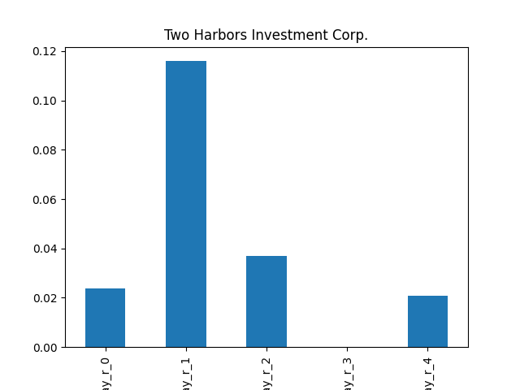

### Mit Filter
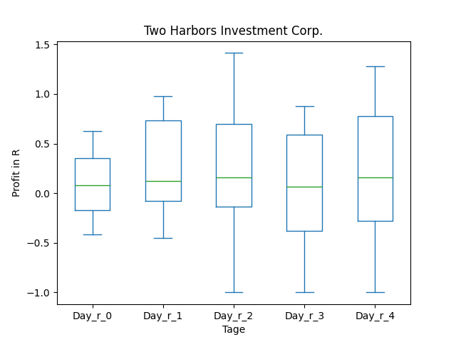
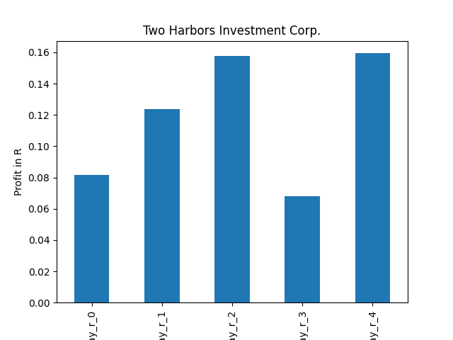

## RITM

### Erwartung in R
|      |   Day_r_0 |   Day_r_1 |   Day_r_2 |   Day_r_3 |   Day_r_4 |   Treffer |
|:-----|----------:|----------:|----------:|----------:|----------:|----------:|
| ohne |       0   |      -0   |         0 |         0 |       0.1 |        54 |
| mit  |       0.1 |       0.1 |         0 |         0 |      -0.2 |        20 |

### Ohne Filter
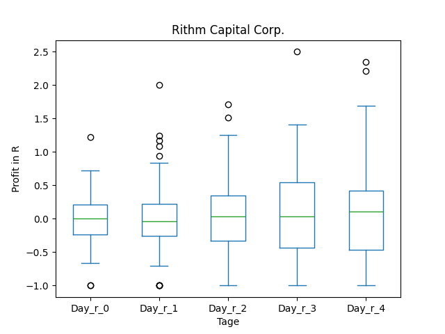
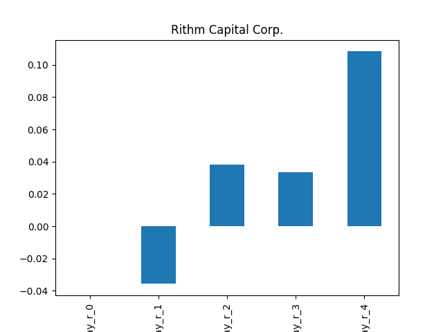

### Mit Filter
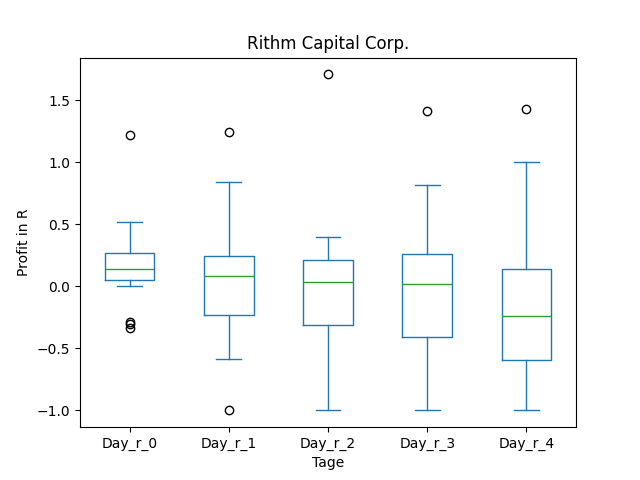
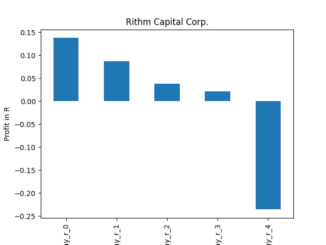

## PPCCY

### Erwartung in R
|      |   Day_r_0 |   Day_r_1 |   Day_r_2 |   Day_r_3 |   Day_r_4 |   Treffer |
|:-----|----------:|----------:|----------:|----------:|----------:|----------:|
| ohne |         0 |         0 |        -0 |        -0 |      -0.2 |        16 |
| mit  |       nan |       nan |       nan |       nan |     nan   |         0 |

### Ohne Filter
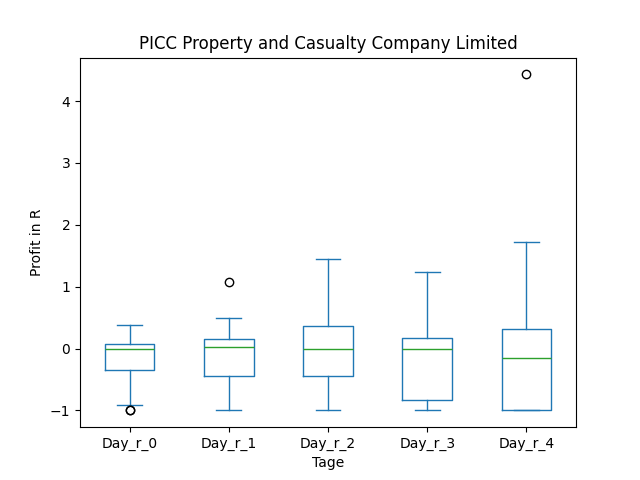
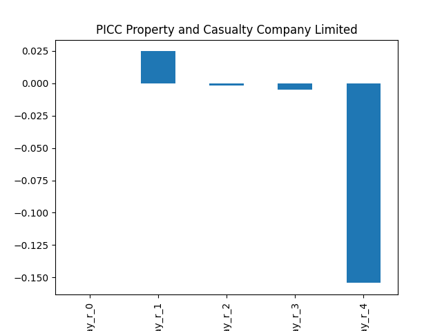

### Mit Filter
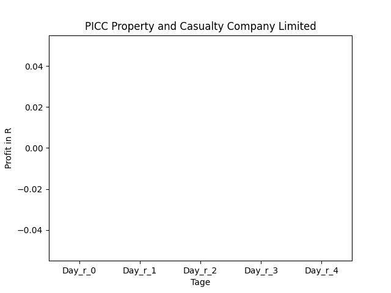

## HNHPF

### Erwartung in R
|      |   Day_r_0 |   Day_r_1 |   Day_r_2 |   Day_r_3 |   Day_r_4 |   Treffer |
|:-----|----------:|----------:|----------:|----------:|----------:|----------:|
| ohne |       0   |      -0.1 |      -0.2 |      -0.6 |      -0.4 |        17 |
| mit  |       0.3 |       0.8 |       0.8 |       1.1 |       1   |         1 |

### Ohne Filter
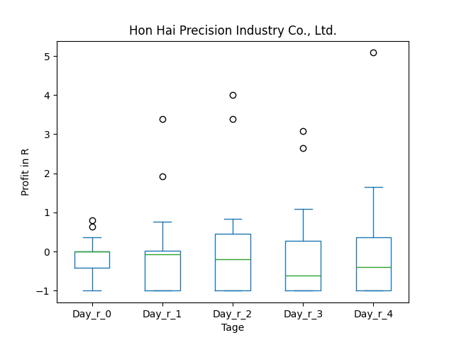
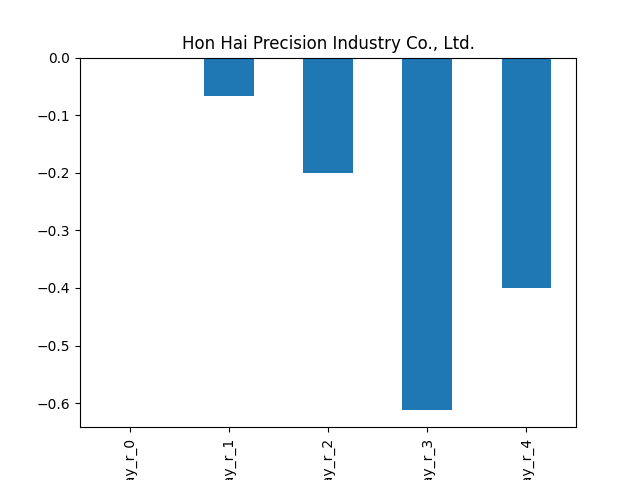

### Mit Filter
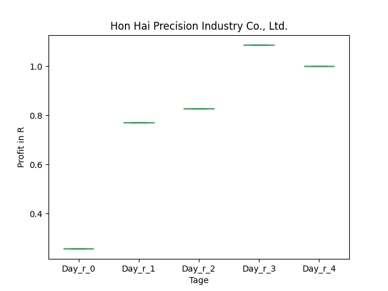
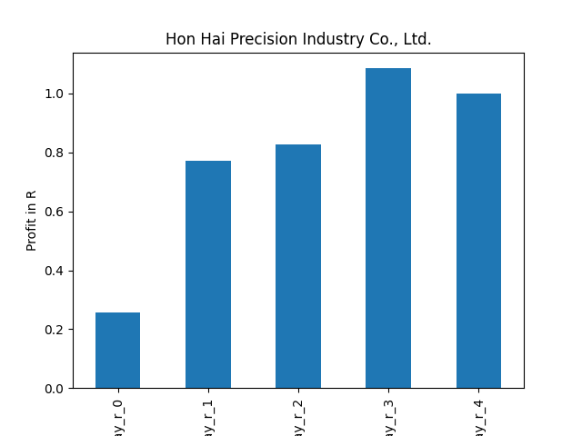

## HLTOY

### Erwartung in R
|      |   Day_r_0 |   Day_r_1 |   Day_r_2 |   Day_r_3 |   Day_r_4 |   Treffer |
|:-----|----------:|----------:|----------:|----------:|----------:|----------:|
| ohne |       0.2 |       0.1 |         0 |      -0.4 |      -0.2 |        15 |
| mit  |     nan   |     nan   |       nan |     nan   |     nan   |         0 |

### Ohne Filter
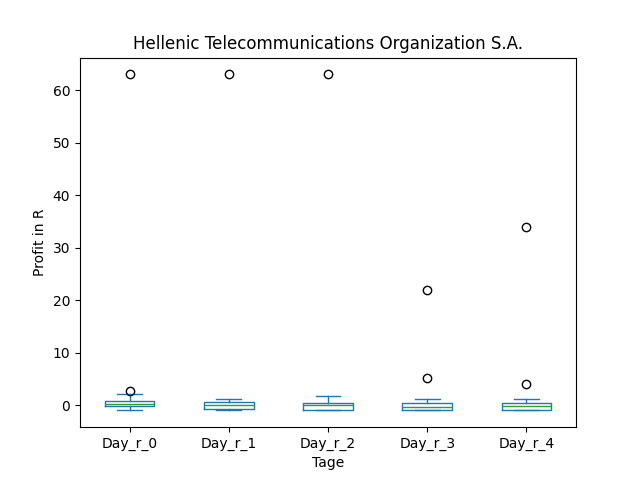
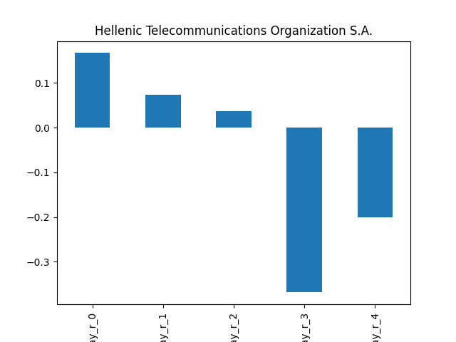

### Mit Filter
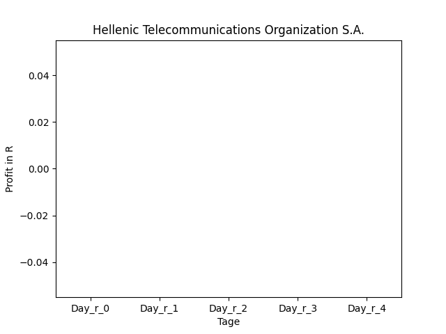
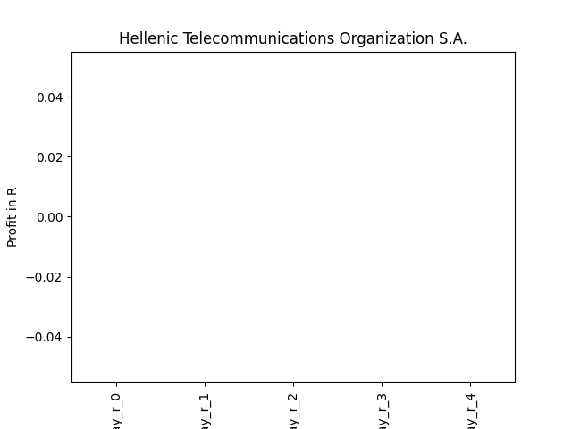

## DSWL

### Erwartung in R
|      |   Day_r_0 |   Day_r_1 |   Day_r_2 |   Day_r_3 |   Day_r_4 |   Treffer |
|:-----|----------:|----------:|----------:|----------:|----------:|----------:|
| ohne |       0.1 |      -0.1 |         0 |       0.1 |       0.2 |        65 |
| mit  |     nan   |     nan   |       nan |     nan   |     nan   |         0 |

### Ohne Filter
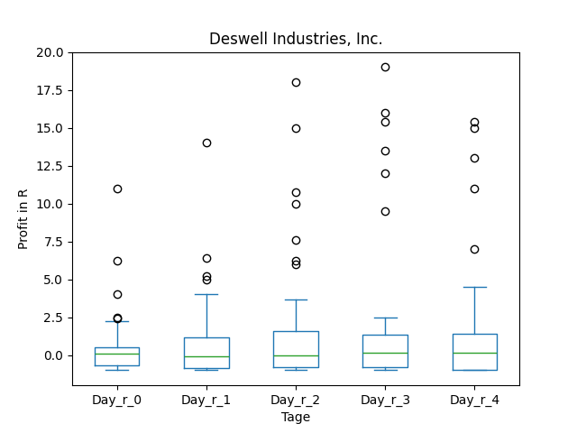
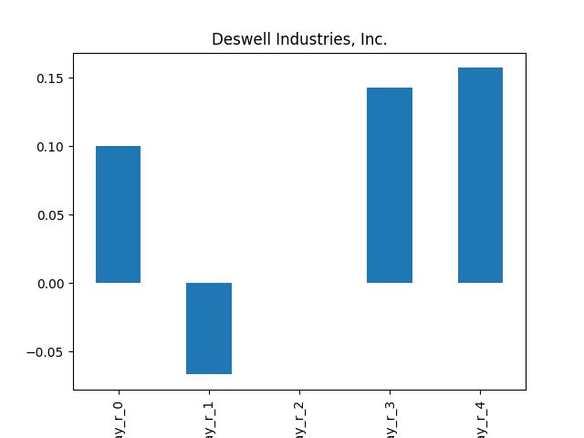

### Mit Filter

## DSWL

### Erwartung in R
|      |   Day_r_0 |   Day_r_1 |   Day_r_2 |   Day_r_3 |   Day_r_4 |   Treffer |
|:-----|----------:|----------:|----------:|----------:|----------:|----------:|
| ohne |       0.1 |      -0.1 |         0 |       0.1 |       0.2 |        65 |
| mit  |     nan   |     nan   |       nan |     nan   |     nan   |         0 |

### Ohne Filter

### Mit Filter

## CSUAY

### Erwartung in R
|      |   Day_r_0 |   Day_r_1 |   Day_r_2 |   Day_r_3 |   Day_r_4 |   Treffer |
|:-----|----------:|----------:|----------:|----------:|----------:|----------:|
| ohne |       0.1 |       0.1 |       0.3 |       0.2 |       0.4 |        16 |
| mit  |      -0.1 |      -0.2 |      -0.8 |      -0.9 |      -0.7 |         1 |

### Ohne Filter
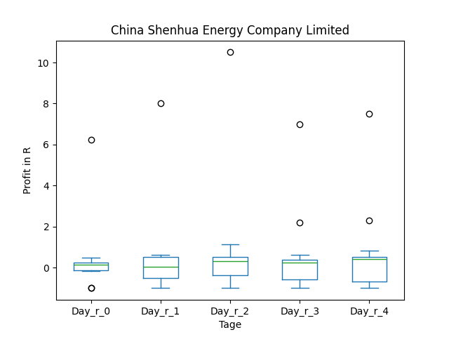
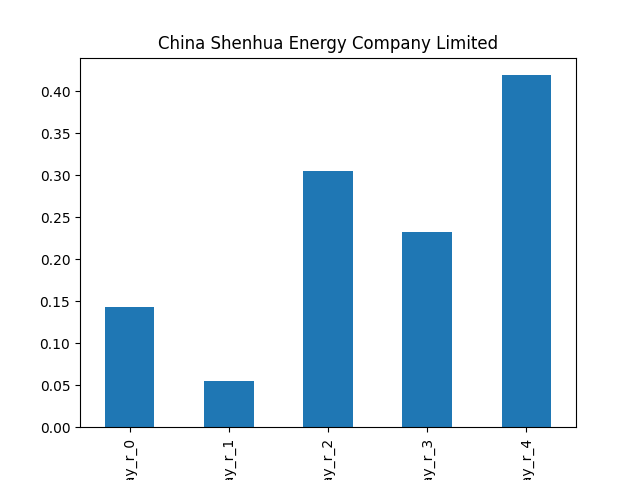

### Mit Filter
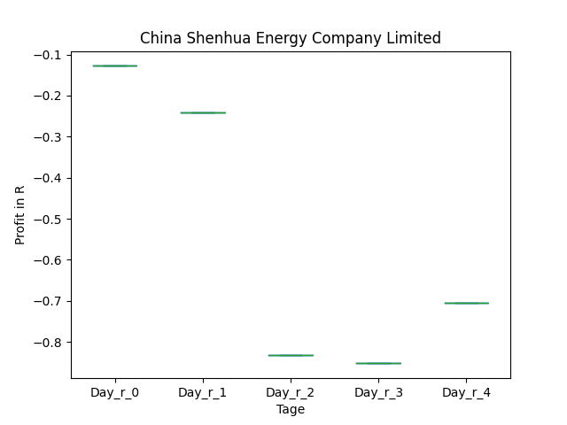
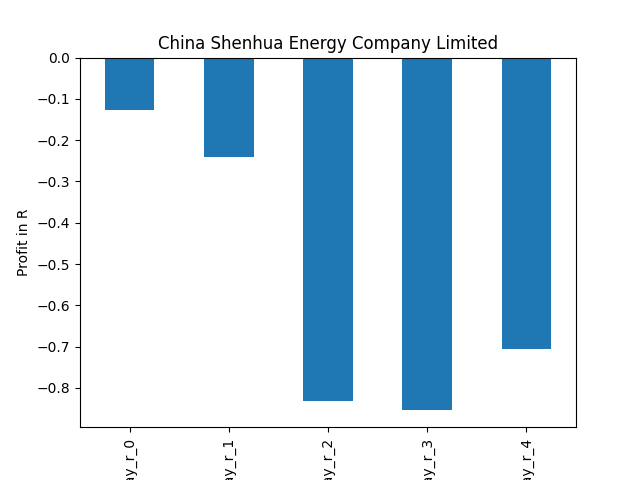

## CIHKY

### Erwartung in R
|      |   Day_r_0 |   Day_r_1 |   Day_r_2 |   Day_r_3 |   Day_r_4 |   Treffer |
|:-----|----------:|----------:|----------:|----------:|----------:|----------:|
| ohne |         0 |      -0.2 |       0.1 |       0.2 |       0.2 |        15 |
| mit  |         0 |       0.3 |       0.4 |       0.6 |       0.8 |         3 |

### Ohne Filter
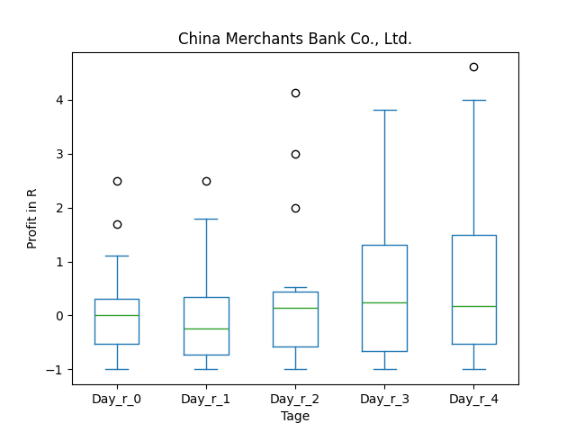
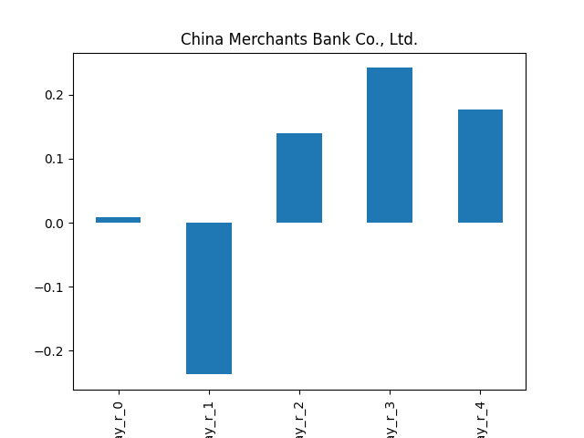

### Mit Filter
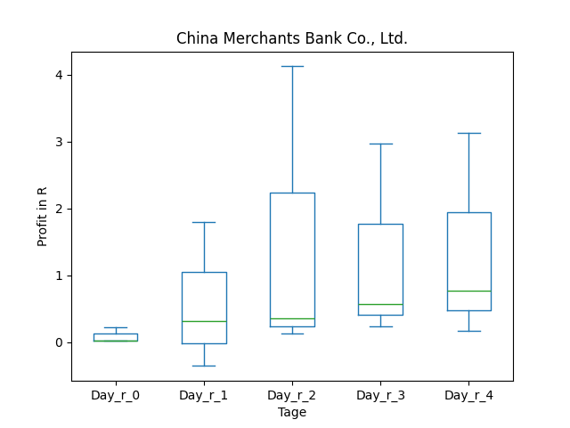
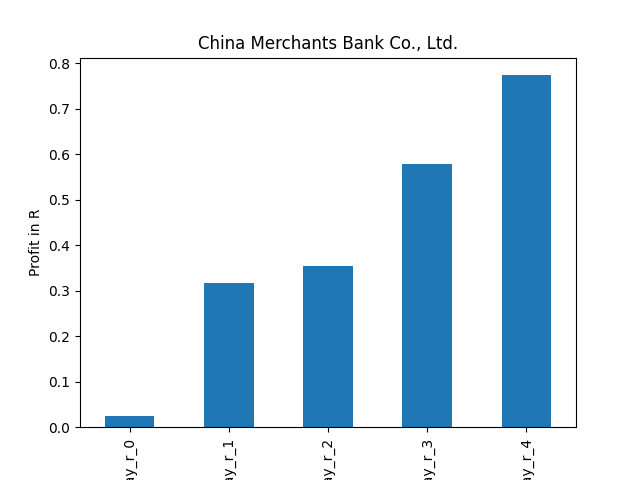

## CICHY

### Erwartung in R
|      |   Day_r_0 |   Day_r_1 |   Day_r_2 |   Day_r_3 |   Day_r_4 |   Treffer |
|:-----|----------:|----------:|----------:|----------:|----------:|----------:|
| ohne |       0.3 |       0.1 |       0.2 |       0.1 |       0.1 |        16 |
| mit  |       0.3 |       0   |       0.1 |       0.1 |      -0.2 |         9 |

### Ohne Filter
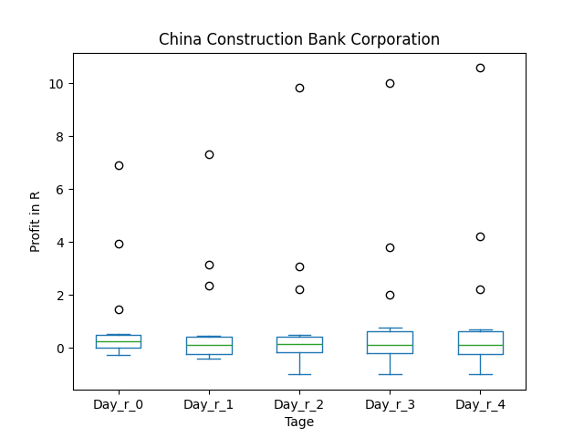
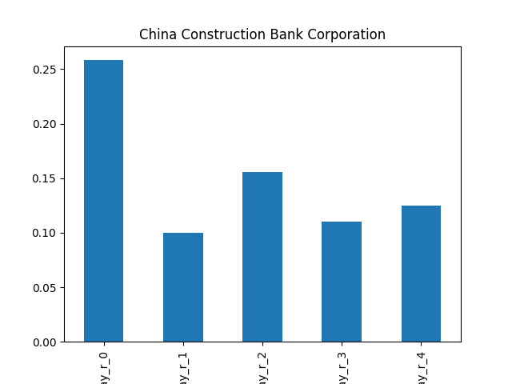

### Mit Filter
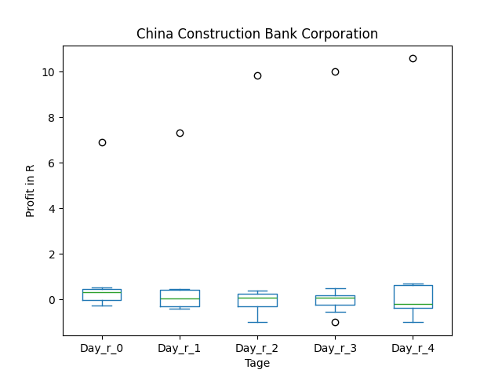
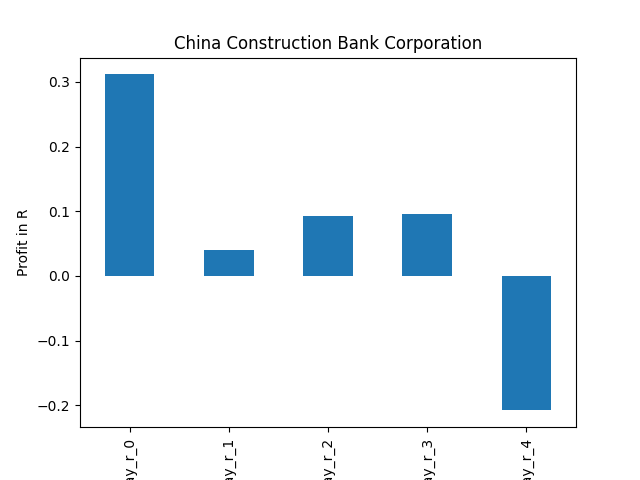

## BACHY

### Erwartung in R
|      |   Day_r_0 |   Day_r_1 |   Day_r_2 |   Day_r_3 |   Day_r_4 |   Treffer |
|:-----|----------:|----------:|----------:|----------:|----------:|----------:|
| ohne |       0.2 |       0.2 |       0.3 |       0.4 |       0.4 |        17 |
| mit  |      -0.3 |      -1   |      -1   |      -1   |      -1   |         1 |

### Ohne Filter
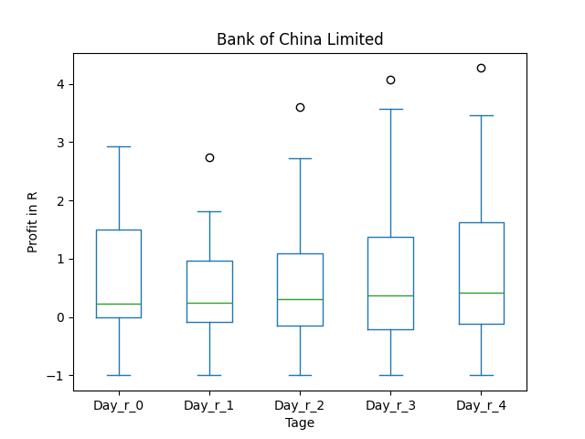
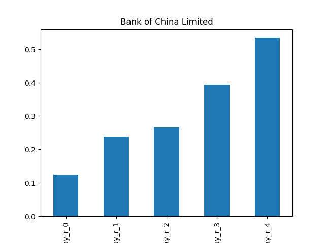

### Mit Filter
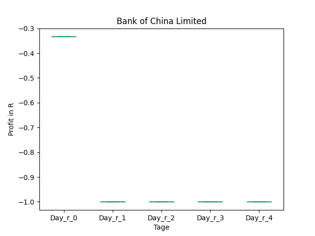
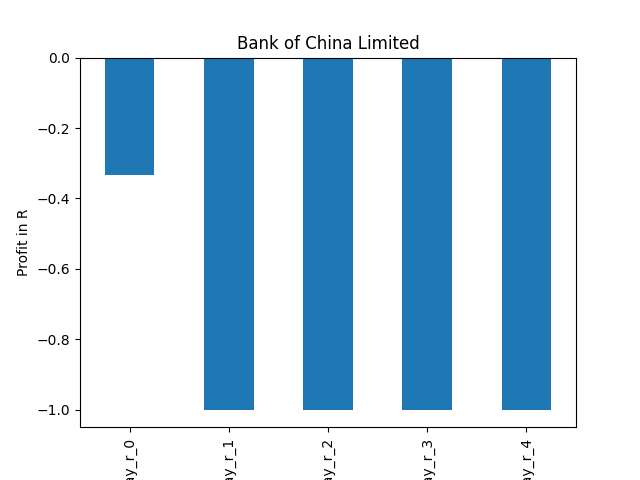

## ATHM

### Erwartung in R
|      |   Day_r_0 |   Day_r_1 |   Day_r_2 |   Day_r_3 |   Day_r_4 |   Treffer |
|:-----|----------:|----------:|----------:|----------:|----------:|----------:|
| ohne |      -0.6 |      -1   |      -1   |      -1   |      -1   |        10 |
| mit  |      -0.6 |      -0.5 |      -0.7 |      -0.7 |      -0.8 |         3 |

### Ohne Filter
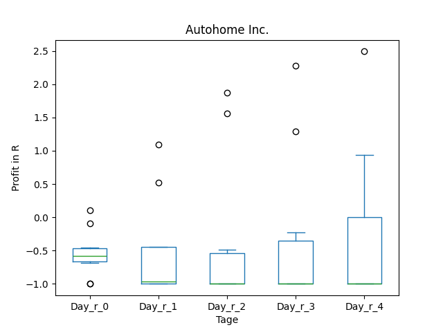
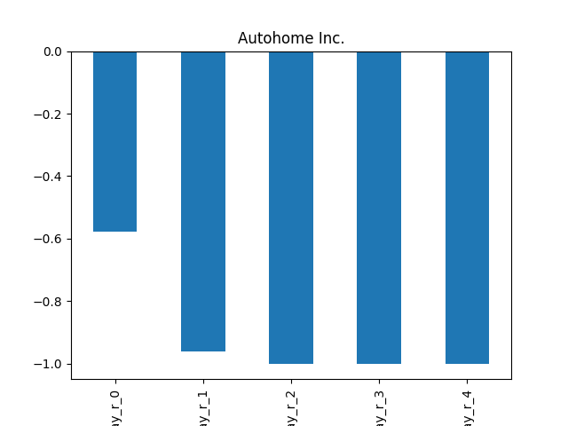

### Mit Filter
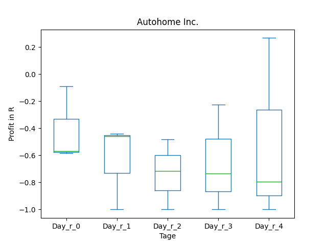
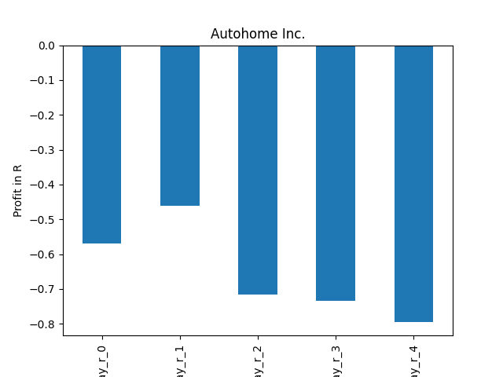

