# dividend-shorter

bet on falling prices on payday **2026-04-24**.

## Signale

| Ticker   |   Divid Rate |   Close |          Volume |   last_close_volume |   Divid % | 5_Days_pos   | above_SMA_50   |
|:---------|-------------:|--------:|----------------:|--------------------:|----------:|:-------------|:---------------|
| STNE     |         2.53 |   14.55 |      8.7547e+06 |           127380885 |     17.39 | False        | False          |
| SAXPY    |         0.83 |   21.59 |  39600          |              854964 |      3.86 | False        | True           |
| LX       |         0.19 |    2.31 |      2.0268e+06 |             4681908 |      8.14 | False        | False          |
| LGGNY    |         1.04 |   17.87 |  35000          |              625450 |      5.8  | False        | True           |
| IFS      |         1.8  |   45.79 | 378800          |            17345252 |      3.93 | False        | False          |
| BKRKY    |         0.61 |    9.61 | 104000          |              999440 |      6.31 | False        | False          |
| BKRIY    |         0.53 |   18.87 |  20500          |              386835 |      2.79 | False        | True           |
| ANYYY    |         0.64 |   14.8  |  32900          |              486920 |      4.35 | False        | False          |

## STNE

### Erwartung in R
|      |   Day_r_0 |   Day_r_1 |   Day_r_2 |   Day_r_3 |   Day_r_4 |   Treffer |
|:-----|----------:|----------:|----------:|----------:|----------:|----------:|
| ohne |       nan |       nan |       nan |       nan |       nan |         0 |
| mit  |       nan |       nan |       nan |       nan |       nan |         0 |

### Ohne Filter

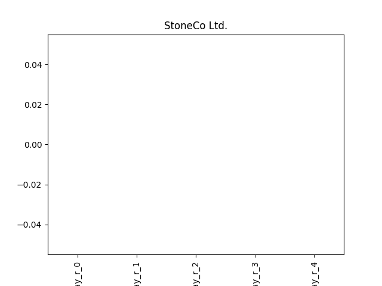

### Mit Filter

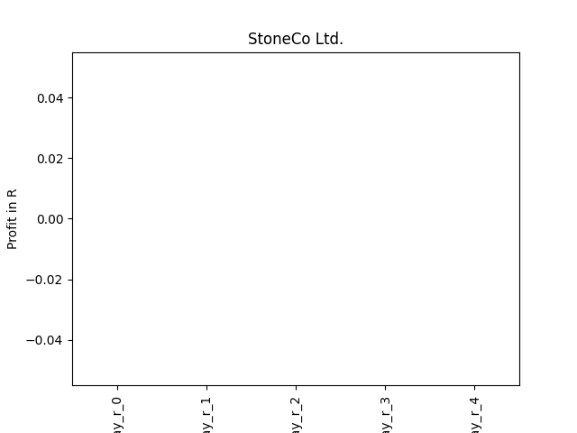

## SAXPY

### Erwartung in R
|      |   Day_r_0 |   Day_r_1 |   Day_r_2 |   Day_r_3 |   Day_r_4 |   Treffer |
|:-----|----------:|----------:|----------:|----------:|----------:|----------:|
| ohne |      -0   |      -0   |      -0.1 |      -0.2 |        -0 |        15 |
| mit  |      -0.4 |      -0.3 |      -0.1 |      -0.5 |         0 |         2 |

### Ohne Filter
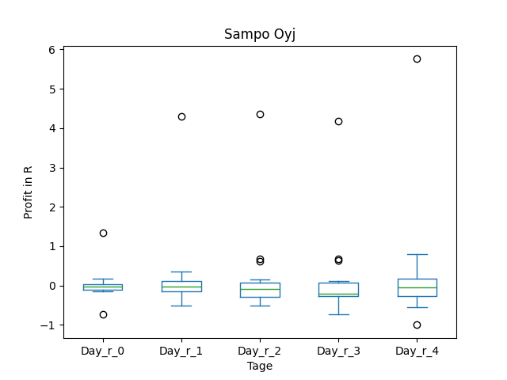
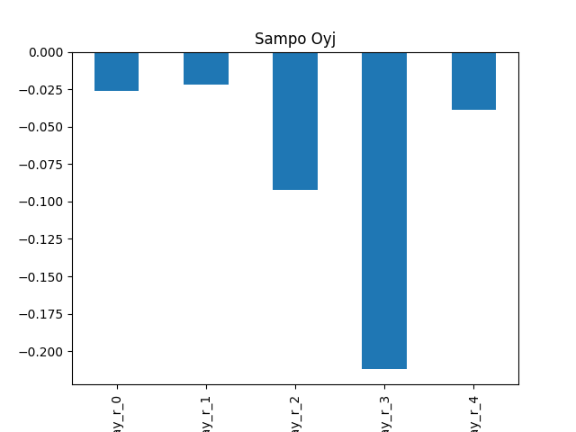

### Mit Filter
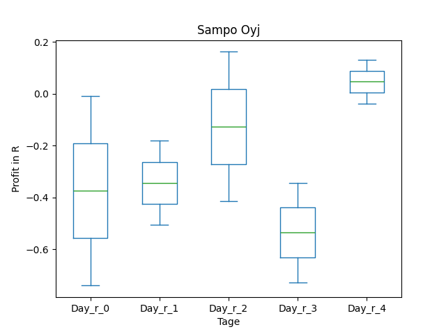
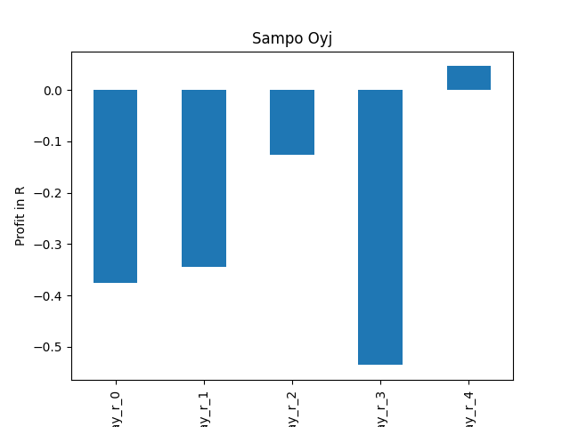

## LX

### Erwartung in R
|      |   Day_r_0 |   Day_r_1 |   Day_r_2 |   Day_r_3 |   Day_r_4 |   Treffer |
|:-----|----------:|----------:|----------:|----------:|----------:|----------:|
| ohne |       0.4 |       0.5 |       0.3 |       0   |      -0.4 |         5 |
| mit  |      -0.2 |       0.5 |       0.7 |       0.6 |       0.7 |         3 |

### Ohne Filter
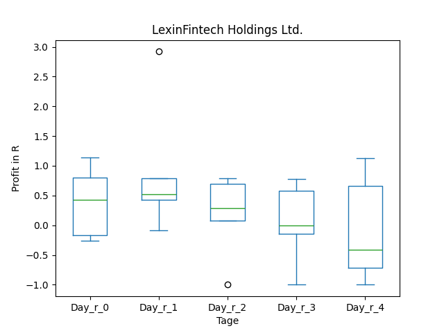
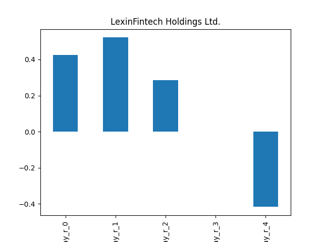

### Mit Filter
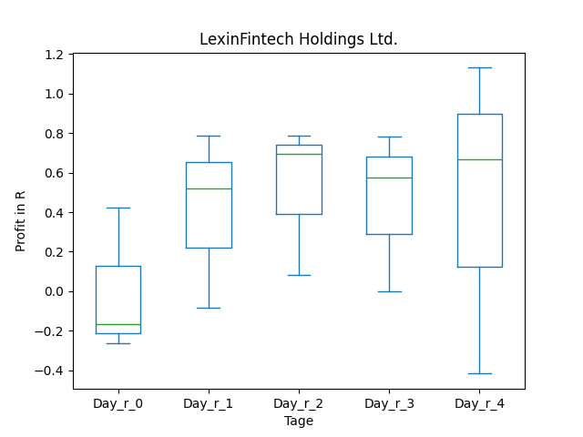
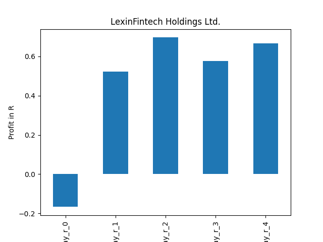

## LGGNY

### Erwartung in R
|      |   Day_r_0 |   Day_r_1 |   Day_r_2 |   Day_r_3 |   Day_r_4 |   Treffer |
|:-----|----------:|----------:|----------:|----------:|----------:|----------:|
| ohne |      -0.1 |      -0   |      -0.1 |         0 |      -0.1 |        28 |
| mit  |      -0.1 |      -0.1 |      -0.1 |        -0 |      -0   |         2 |

### Ohne Filter
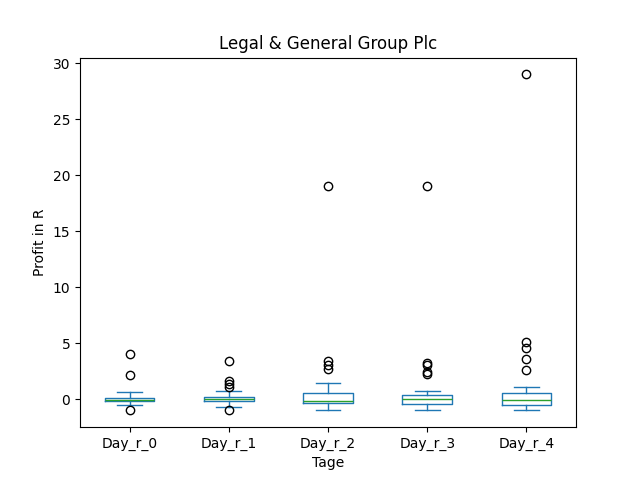
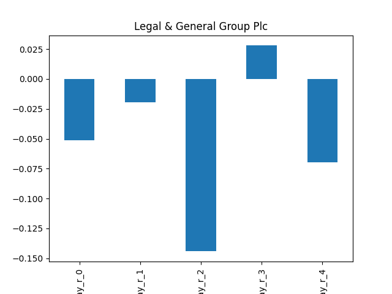

### Mit Filter
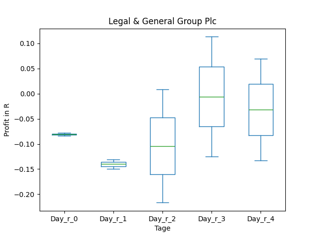
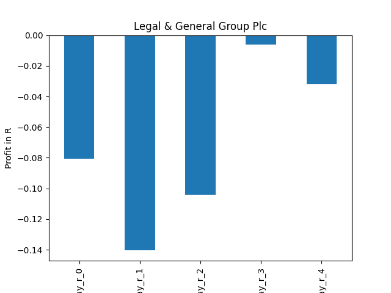

## IFS

### Erwartung in R
|      |   Day_r_0 |   Day_r_1 |   Day_r_2 |   Day_r_3 |   Day_r_4 |   Treffer |
|:-----|----------:|----------:|----------:|----------:|----------:|----------:|
| ohne |      -0.1 |      -0.3 |      -0.3 |      -0.1 |      -0.1 |         7 |
| mit  |      -0   |      -0.1 |      -0.3 |      -0.3 |      -0.2 |         4 |

### Ohne Filter
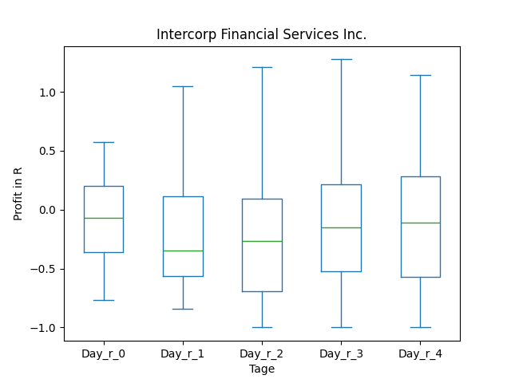
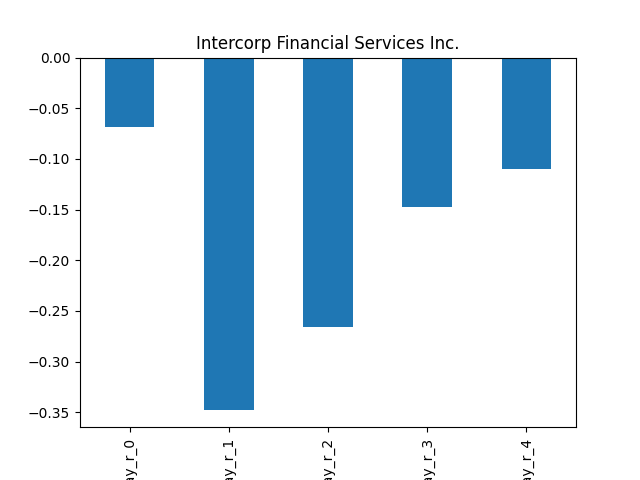

### Mit Filter
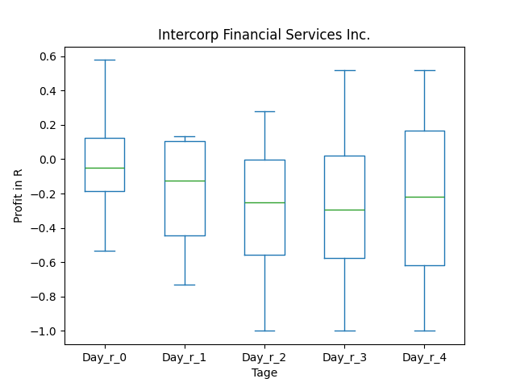
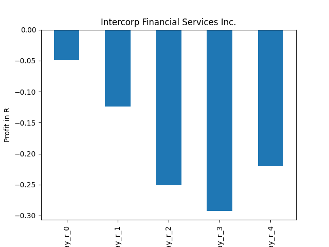

## BKRKY

### Erwartung in R
|      |   Day_r_0 |   Day_r_1 |   Day_r_2 |   Day_r_3 |   Day_r_4 |   Treffer |
|:-----|----------:|----------:|----------:|----------:|----------:|----------:|
| ohne |      -0.2 |       0.2 |       0.1 |      -0.1 |      -0   |        18 |
| mit  |       1.2 |       1.2 |       1.1 |       1.1 |       1.1 |         3 |

### Ohne Filter
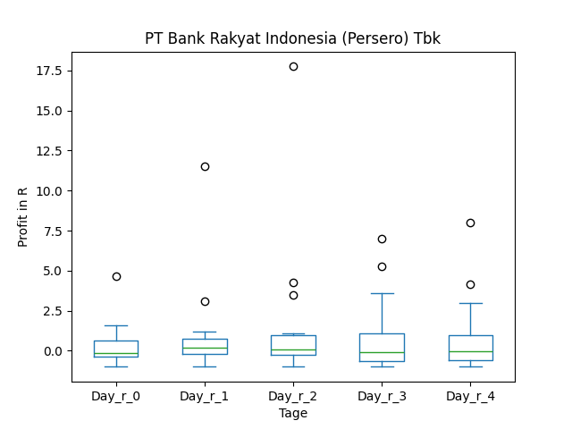
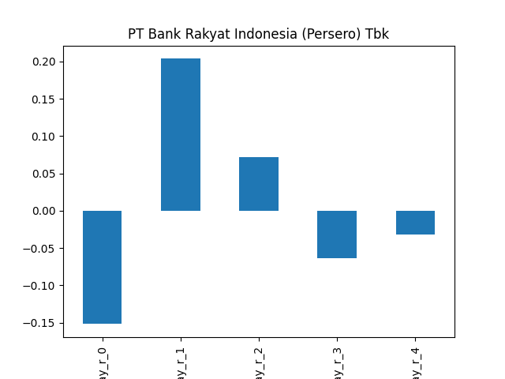

### Mit Filter
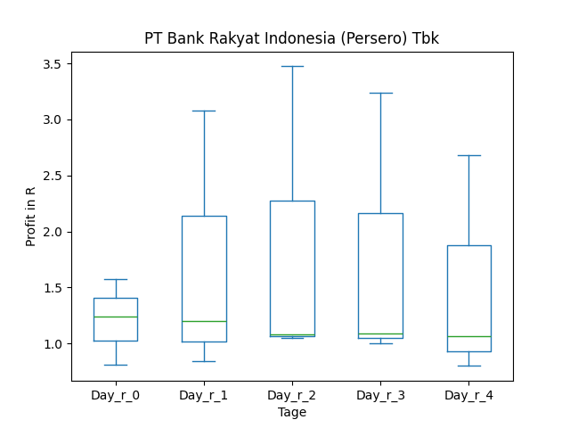
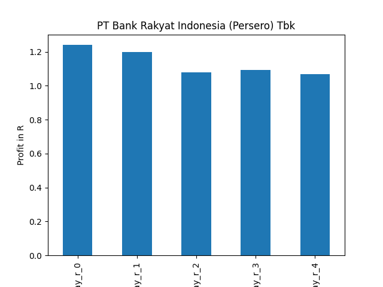

## BKRIY

### Erwartung in R
|      |   Day_r_0 |   Day_r_1 |   Day_r_2 |   Day_r_3 |   Day_r_4 |   Treffer |
|:-----|----------:|----------:|----------:|----------:|----------:|----------:|
| ohne |         0 |      -0.1 |      -0.4 |      -0.4 |      -0.4 |         8 |
| mit  |       nan |     nan   |     nan   |     nan   |     nan   |         0 |

### Ohne Filter
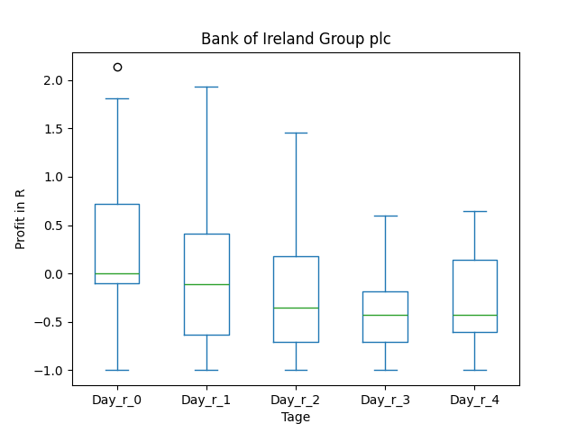
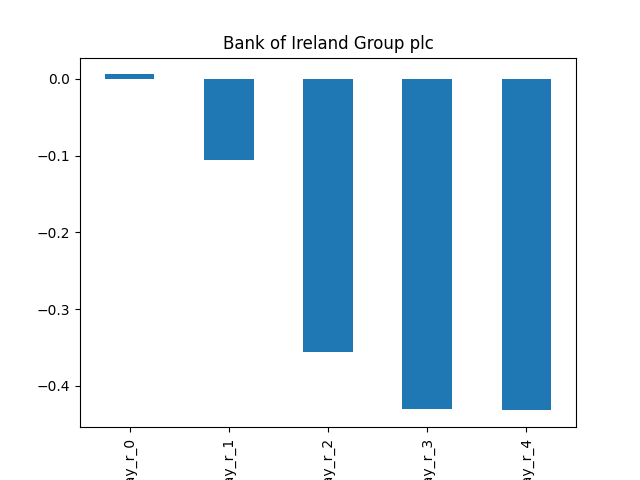

### Mit Filter
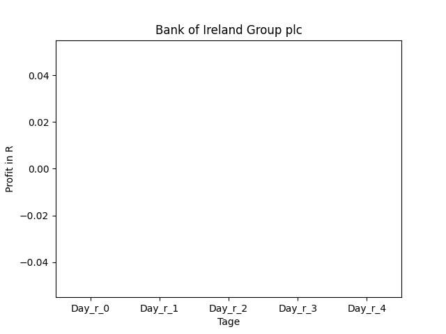

## ANYYY

### Erwartung in R
|      |   Day_r_0 |   Day_r_1 |   Day_r_2 |   Day_r_3 |   Day_r_4 |   Treffer |
|:-----|----------:|----------:|----------:|----------:|----------:|----------:|
| ohne |      -0.5 |      -0.2 |      -0.3 |      -0.4 |      -0.2 |         3 |
| mit  |     nan   |     nan   |     nan   |     nan   |     nan   |         0 |

### Ohne Filter
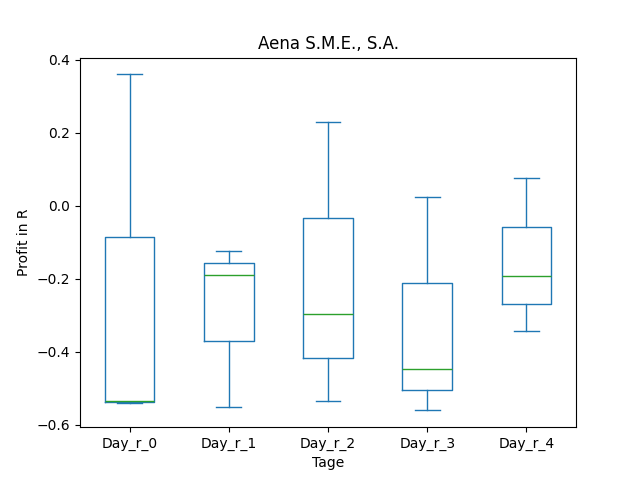
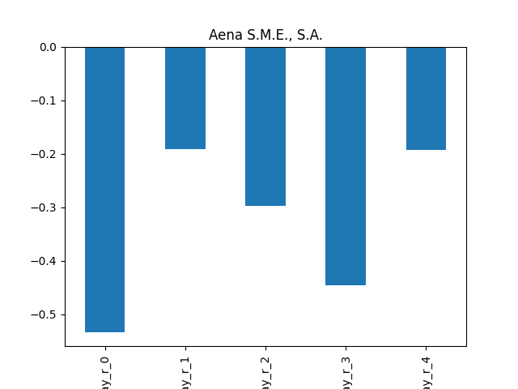

### Mit Filter
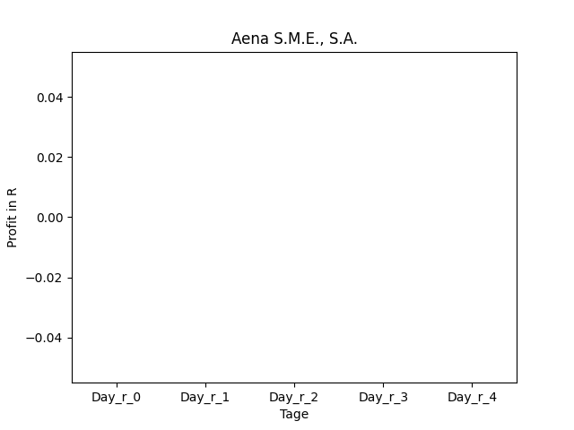
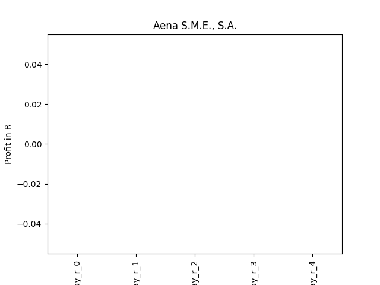

