# dividend-shorter

bet on falling prices on payday **2026-05-26**.

## Signale

| Ticker   |   Divid Rate |   Close |   Volume |   last_close_volume |   Divid % | 5_Days_pos   | above_SMA_50   |
|:---------|-------------:|--------:|---------:|--------------------:|----------:|:-------------|:---------------|
| WTKWY    |         1.87 |   72.28 |    61200 |             4423536 |      2.58 | False        | False          |
| TK       |         1    |   13.34 |   711600 |             9492744 |      7.5  | False        | True           |
| SPOK     |         0.31 |   10.96 |   259800 |             2847408 |      2.85 | False        | False          |
| OMAB     |         2.92 |  103.21 |    91300 |             9423073 |      2.83 | False        | False          |
| NNGRY    |         1.47 |   44.47 |    42300 |             1881081 |      3.31 | True         | True           |
| FSNUY    |         0.31 |   11.37 |   162300 |             1845351 |      2.7  | False        | False          |
| CLPR     |         0.1  |    2.91 |   140600 |              409146 |      3.26 | False        | False          |
| CHHQY    |         2.11 |   37.52 |    14116 |              529632 |      5.61 | False        | False          |

## WTKWY

### Erwartung in R
|      |   Day_r_0 |   Day_r_1 |   Day_r_2 |   Day_r_3 |   Day_r_4 |   Treffer |
|:-----|----------:|----------:|----------:|----------:|----------:|----------:|
| ohne |         0 |        -0 |      -0.1 |      -0.2 |      -0.2 |        30 |
| mit  |       inf |       inf |     inf   |     inf   |     inf   |         2 |

### Ohne Filter
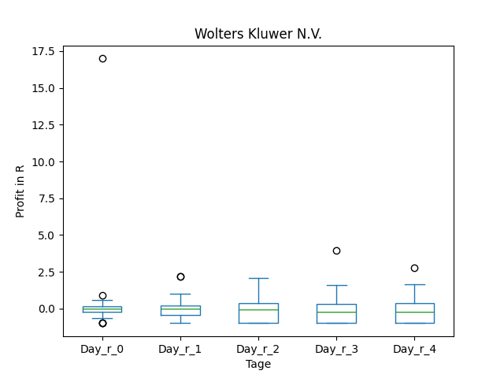
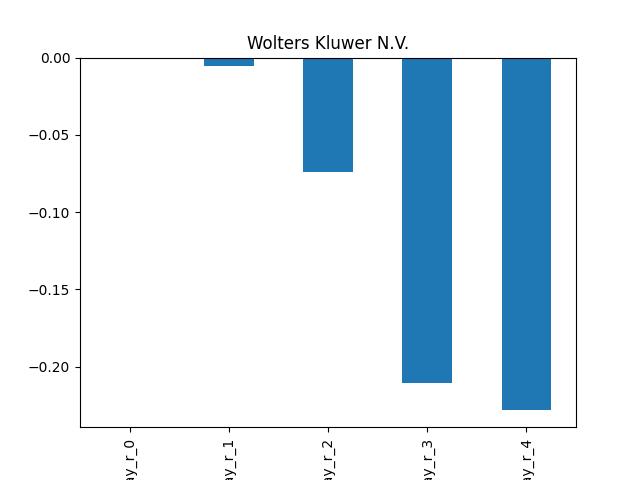

### Mit Filter
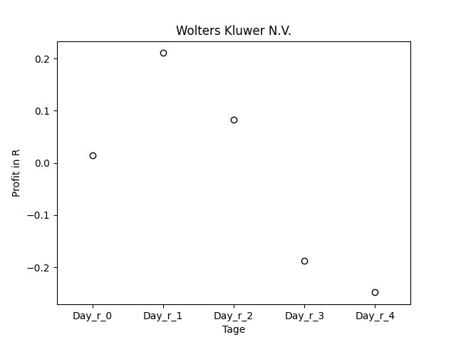
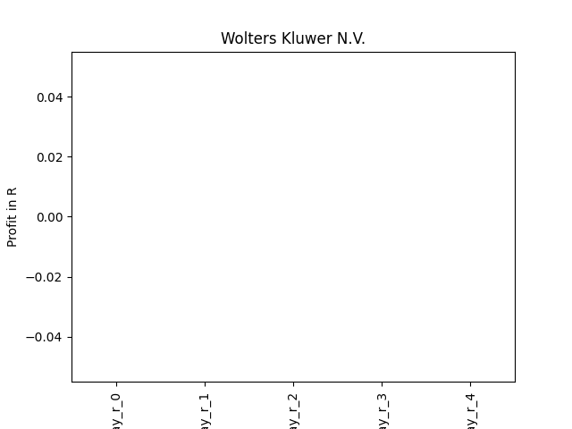

## TK

### Erwartung in R
|      |   Day_r_0 |   Day_r_1 |   Day_r_2 |   Day_r_3 |   Day_r_4 |   Treffer |
|:-----|----------:|----------:|----------:|----------:|----------:|----------:|
| ohne |      -0   |      -0.1 |       0   |      -0.1 |      -0.2 |        63 |
| mit  |      -0.1 |      -0.1 |      -0.2 |      -0.2 |      -0   |         2 |

### Ohne Filter
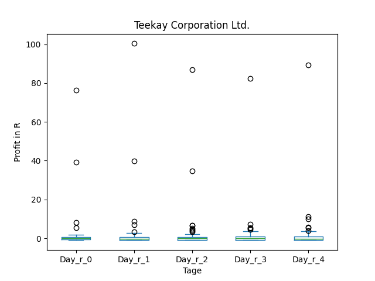
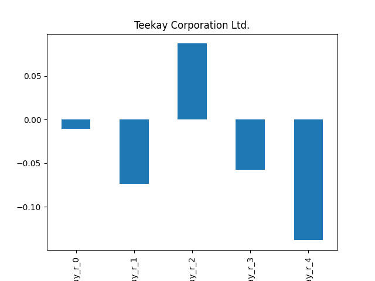

### Mit Filter
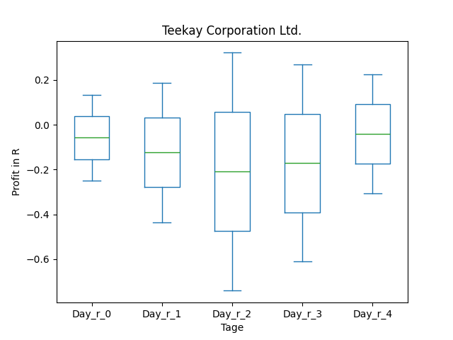
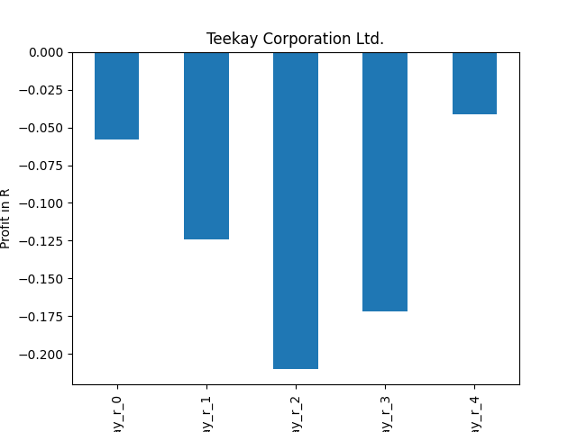

## SPOK

### Erwartung in R
|      |   Day_r_0 |   Day_r_1 |   Day_r_2 |   Day_r_3 |   Day_r_4 |   Treffer |
|:-----|----------:|----------:|----------:|----------:|----------:|----------:|
| ohne |       0.1 |       0.1 |       0   |      -0.1 |      -0.3 |        81 |
| mit  |       0.4 |       0.5 |       0.6 |       0.4 |       0.2 |         8 |

### Ohne Filter
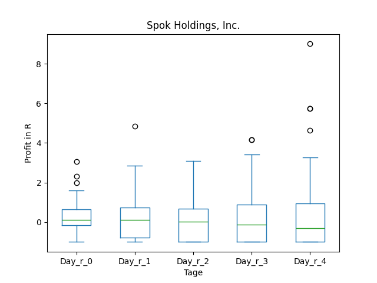
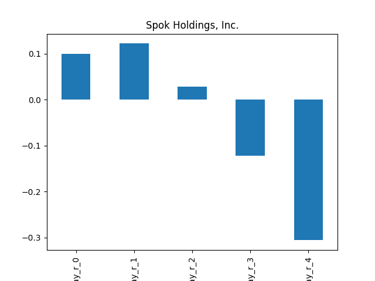

### Mit Filter
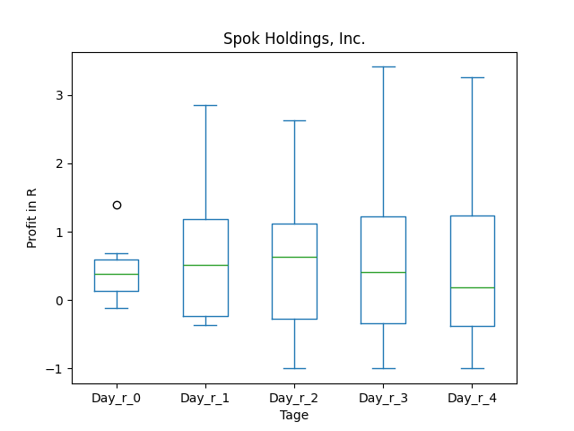
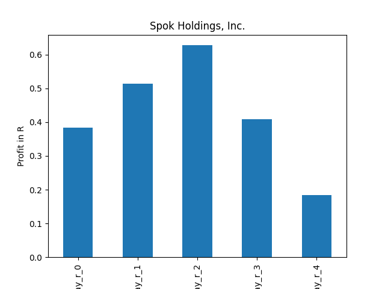

## OMAB

### Erwartung in R
|      |   Day_r_0 |   Day_r_1 |   Day_r_2 |   Day_r_3 |   Day_r_4 |   Treffer |
|:-----|----------:|----------:|----------:|----------:|----------:|----------:|
| ohne |      -0   |      -0.1 |      -0.2 |      -0.3 |      -0   |        43 |
| mit  |      -0.2 |      -0.2 |      -0.2 |      -0.2 |      -0.3 |        10 |

### Ohne Filter
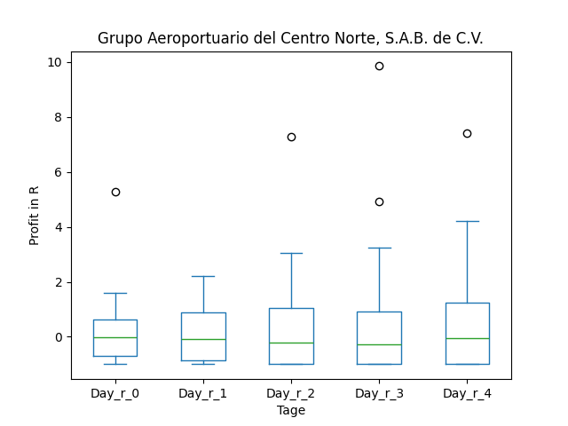
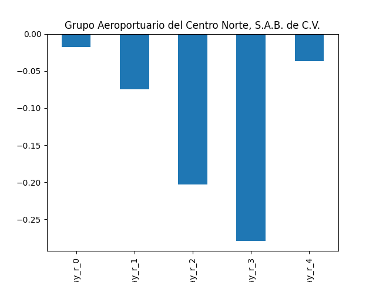

### Mit Filter
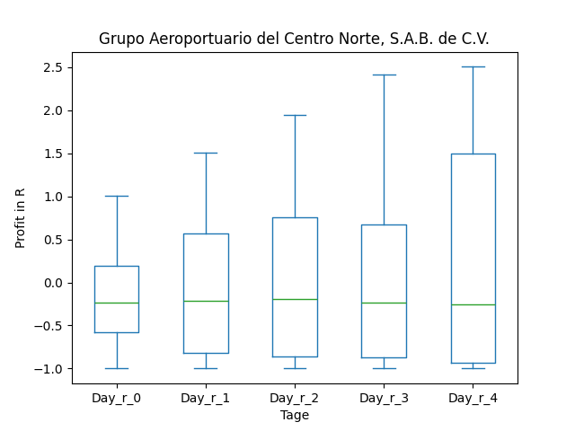
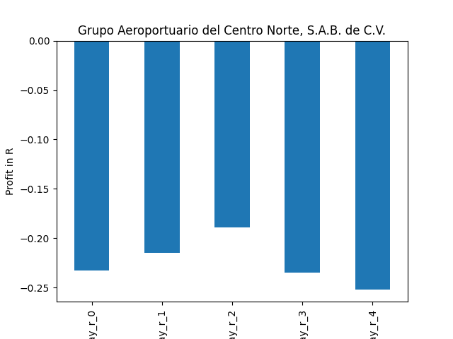

## NNGRY

### Erwartung in R
|      |   Day_r_0 |   Day_r_1 |   Day_r_2 |   Day_r_3 |   Day_r_4 |   Treffer |
|:-----|----------:|----------:|----------:|----------:|----------:|----------:|
| ohne |       0   |       0   |      -0.1 |      -0.3 |      -0.1 |        15 |
| mit  |       0.1 |      -0.1 |      -0.6 |      -0.4 |      -0.5 |         2 |

### Ohne Filter
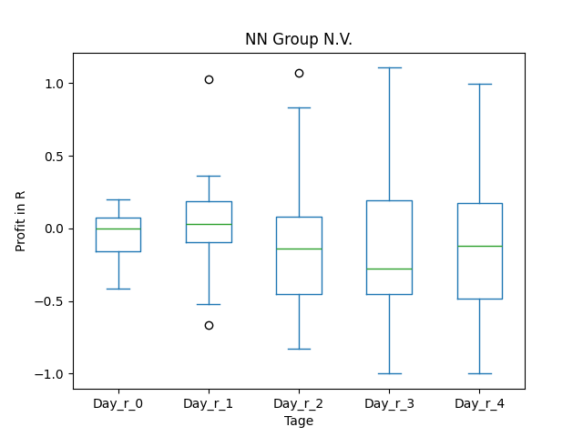
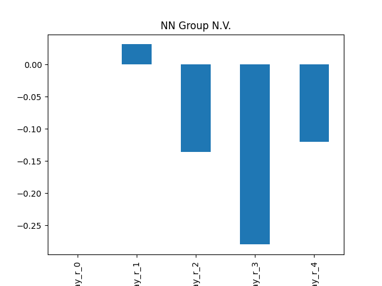

### Mit Filter
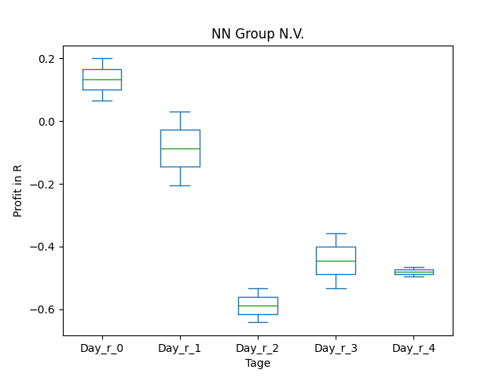
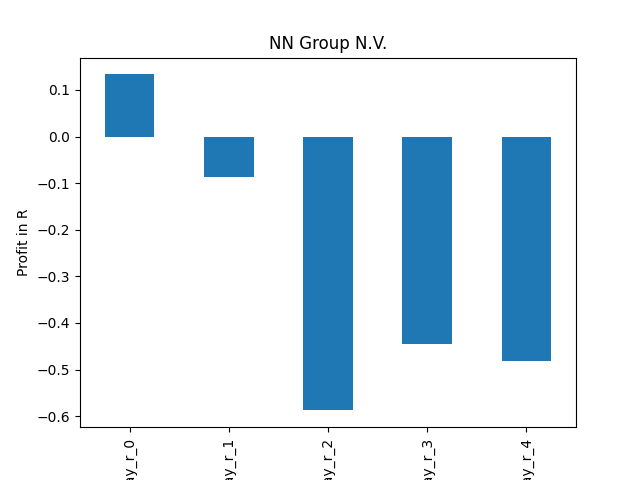

## FSNUY

### Erwartung in R
|      |   Day_r_0 |   Day_r_1 |   Day_r_2 |   Day_r_3 |   Day_r_4 |   Treffer |
|:-----|----------:|----------:|----------:|----------:|----------:|----------:|
| ohne |      -0.1 |      -0.3 |       0.3 |       0.4 |       0.5 |        12 |
| mit  |     nan   |     nan   |     nan   |     nan   |     nan   |         0 |

### Ohne Filter
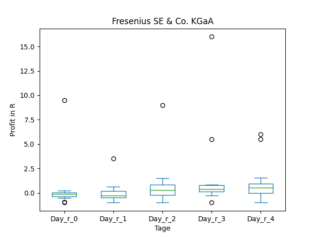
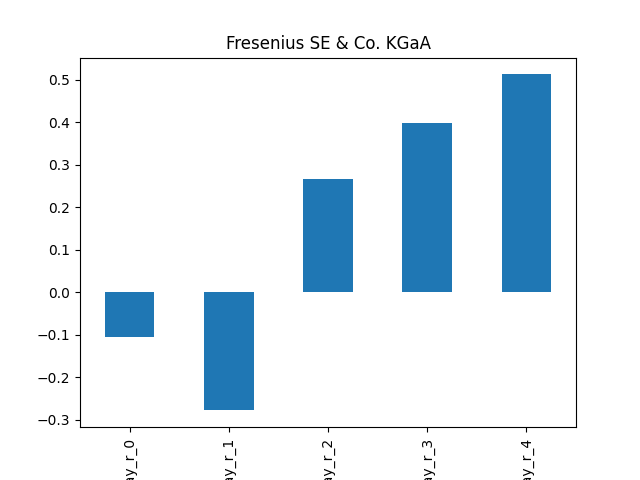

### Mit Filter
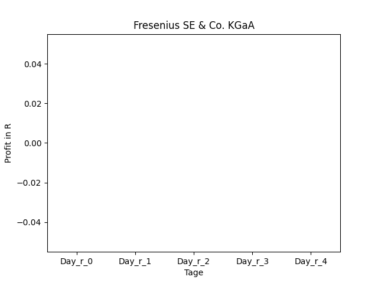

## CLPR

### Erwartung in R
|      |   Day_r_0 |   Day_r_1 |   Day_r_2 |   Day_r_3 |   Day_r_4 |   Treffer |
|:-----|----------:|----------:|----------:|----------:|----------:|----------:|
| ohne |      -0.1 |      -0.1 |      -0.1 |      -0.2 |      -0.3 |        37 |
| mit  |     nan   |     nan   |     nan   |     nan   |     nan   |         0 |

### Ohne Filter

### Mit Filter

## CHHQY

### Erwartung in R
|      |   Day_r_0 |   Day_r_1 |   Day_r_2 |   Day_r_3 |   Day_r_4 |   Treffer |
|:-----|----------:|----------:|----------:|----------:|----------:|----------:|
| ohne |        -1 |        -1 |        -1 |        -1 |        -1 |         7 |
| mit  |       nan |       nan |       nan |       nan |       nan |         0 |

### Ohne Filter
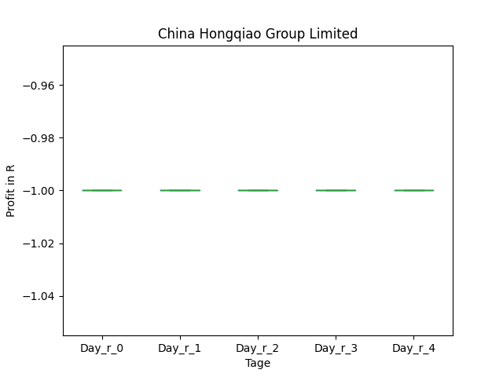
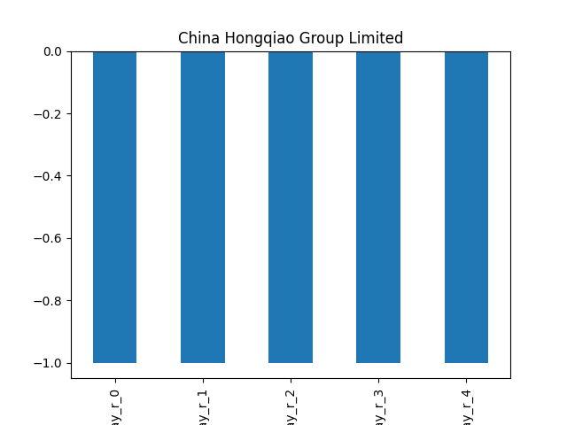

### Mit Filter
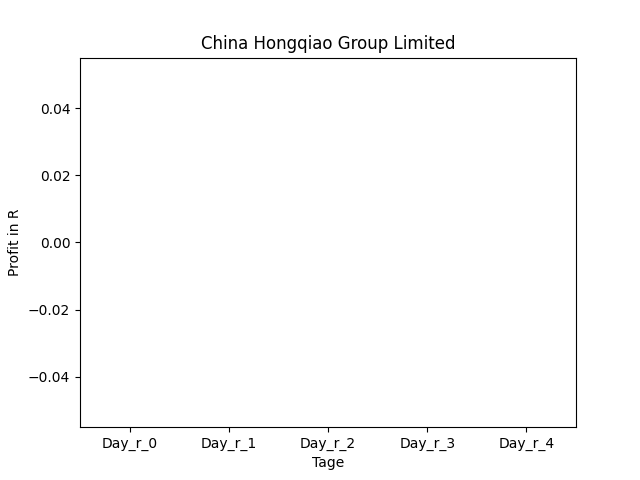

