# dividend-shorter

bet on falling prices on payday **2026-03-24**.

## Signale

| Ticker   |   Divid Rate |   Close |           Volume |   last_close_volume |   Divid % | 5_Days_pos   | above_SMA_50   |
|:---------|-------------:|--------:|-----------------:|--------------------:|----------:|:-------------|:---------------|
| RWT      |         0.18 |    5.49 |      3.31099e+06 |            18177319 |      3.28 | False        | False          |
| GVDNY    |         1.84 |   68.82 |   3640           |              250505 |      2.68 | False        | False          |
| AEF      |         0.21 |    7.64 | 141993           |             1084827 |      2.75 | False        | False          |

## RWT

### Erwartung in R
|      |   Day_r_0 |   Day_r_1 |   Day_r_2 |   Day_r_3 |   Day_r_4 |   Treffer |
|:-----|----------:|----------:|----------:|----------:|----------:|----------:|
| ohne |       0.1 |         0 |      -0.2 |      -0   |      -0.3 |        94 |
| mit  |       0.2 |        -0 |      -0.1 |       0.1 |      -0.2 |        15 |

### Ohne Filter
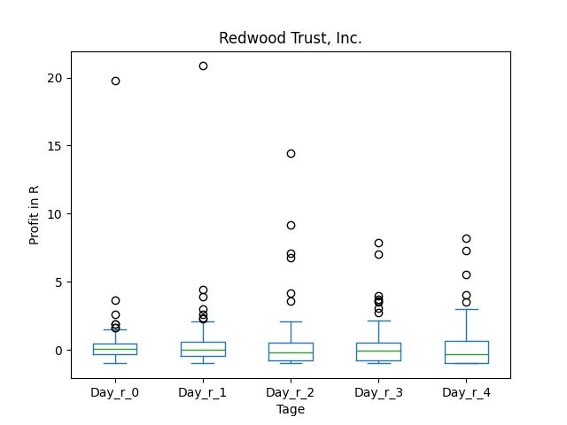
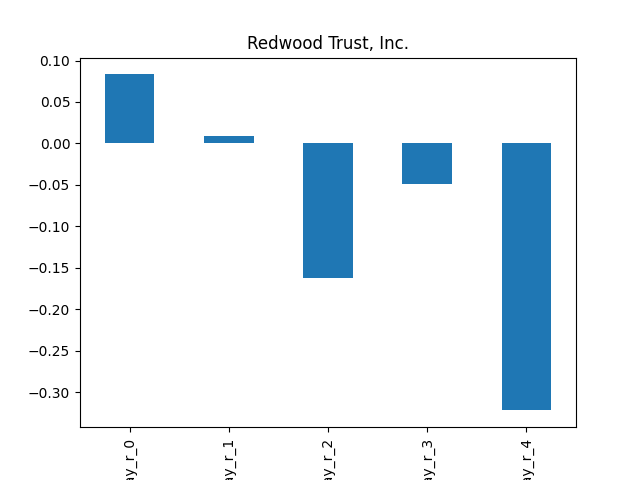

### Mit Filter
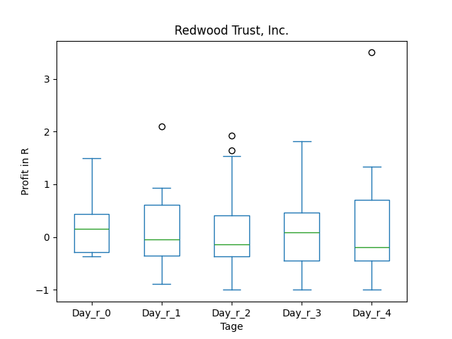
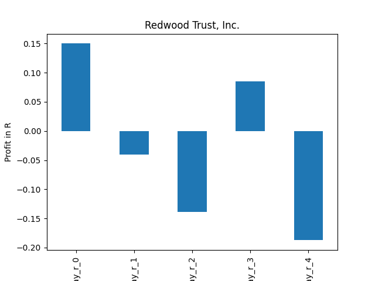

## GVDNY

### Erwartung in R
|      |   Day_r_0 |   Day_r_1 |   Day_r_2 |   Day_r_3 |   Day_r_4 |   Treffer |
|:-----|----------:|----------:|----------:|----------:|----------:|----------:|
| ohne |        -0 |       0.5 |       0.2 |      -0.1 |      -0.3 |        16 |
| mit  |       nan |     nan   |     nan   |     nan   |     nan   |         0 |

### Ohne Filter
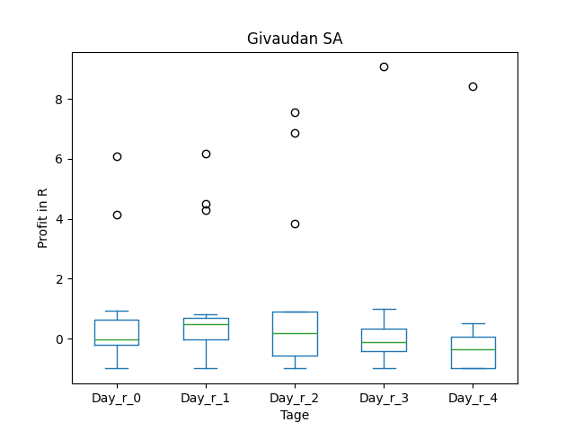
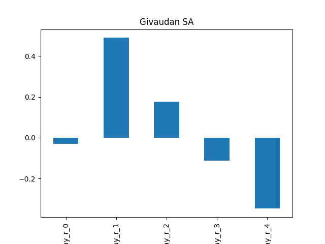

### Mit Filter

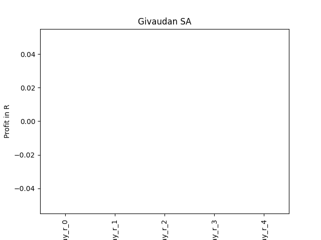

## AEF

### Erwartung in R
|      |   Day_r_0 |   Day_r_1 |   Day_r_2 |   Day_r_3 |   Day_r_4 |   Treffer |
|:-----|----------:|----------:|----------:|----------:|----------:|----------:|
| ohne |      -0.1 |      -0.1 |      -0.2 |      -0.3 |      -0.5 |        72 |
| mit  |      -0.3 |       0.1 |       0.1 |       0.4 |       0.5 |         2 |

### Ohne Filter
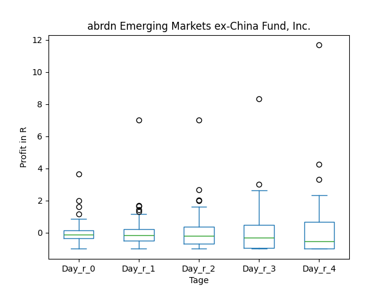
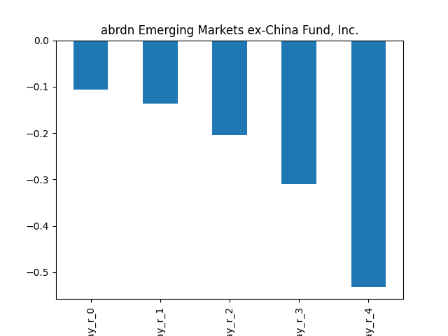

### Mit Filter
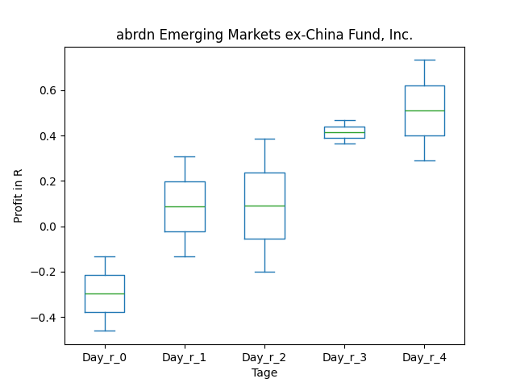
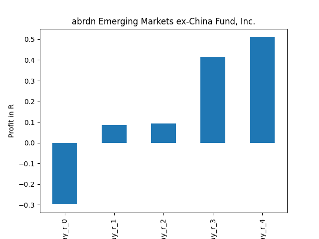

