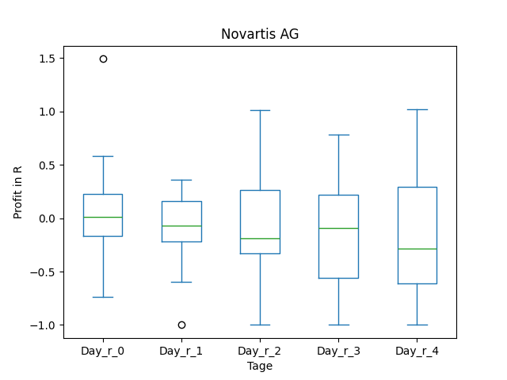
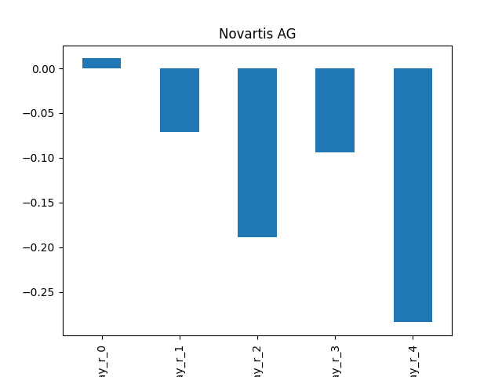
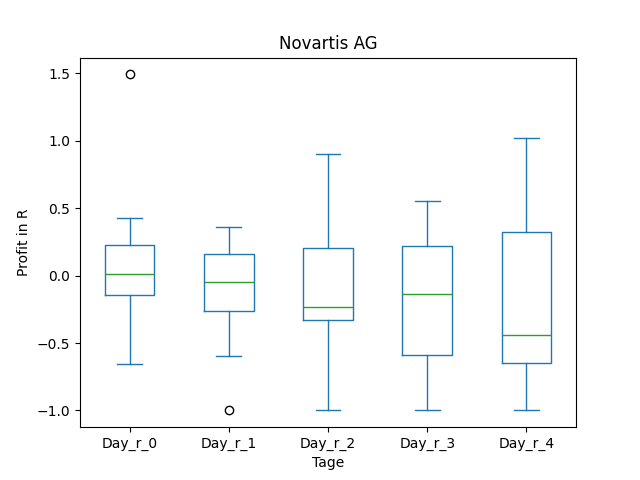
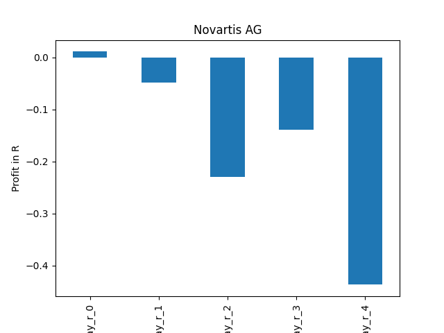
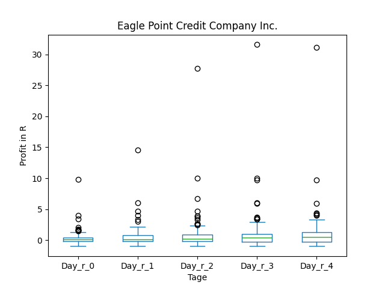
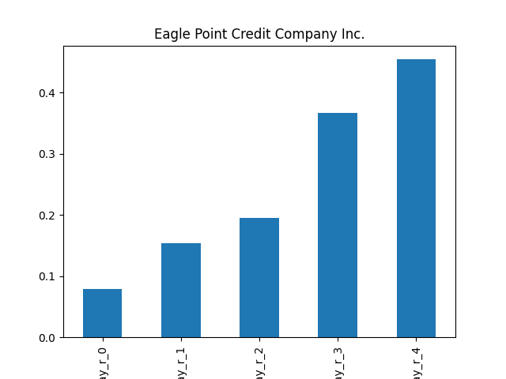
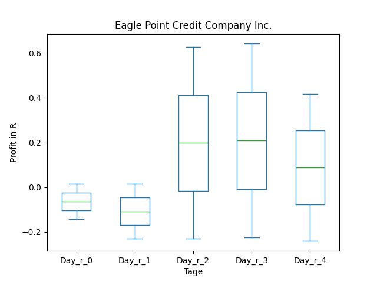
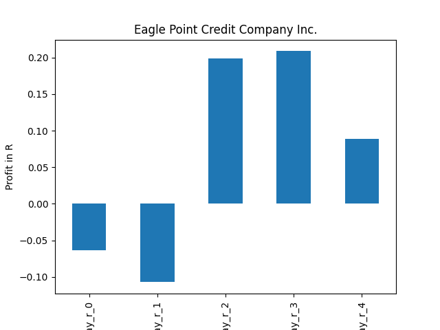

# dividend-shorter

bet on falling prices on payday **2026-03-11**.

## Signale

| Ticker   |   Divid Rate |   Close |     Volume |   last_close_volume |   Divid % | 5_Days_pos   | above_SMA_50   |
|:---------|-------------:|--------:|-----------:|--------------------:|----------:|:-------------|:---------------|
| NVS      |         4.77 |  161.59 | 3.7057e+06 |           598804063 |      2.95 | False        | True           |
| ECC      |         0.14 |    4.18 | 2.7282e+06 |            11403876 |      3.35 | True         | False          |

## NVS

### Erwartung in R
|      |   Day_r_0 |   Day_r_1 |   Day_r_2 |   Day_r_3 |   Day_r_4 |   Treffer |
|:-----|----------:|----------:|----------:|----------:|----------:|----------:|
| ohne |         0 |      -0.1 |      -0.2 |      -0.1 |      -0.3 |        22 |
| mit  |         0 |      -0   |      -0.2 |      -0.1 |      -0.4 |        18 |

### Ohne Filter

### Mit Filter

## ECC

### Erwartung in R
|      |   Day_r_0 |   Day_r_1 |   Day_r_2 |   Day_r_3 |   Day_r_4 |   Treffer |
|:-----|----------:|----------:|----------:|----------:|----------:|----------:|
| ohne |       0.1 |       0.2 |       0.2 |       0.4 |       0.5 |       143 |
| mit  |      -0.1 |      -0.1 |       0.2 |       0.2 |       0.1 |         2 |

### Ohne Filter

### Mit Filter

