# dividend-shorter

bet on falling prices on payday **2026-03-26**.

## Signale

| Ticker   |   Divid Rate |   Close |           Volume |   last_close_volume |   Divid % | 5_Days_pos   | above_SMA_50   |
|:---------|-------------:|--------:|-----------------:|--------------------:|----------:|:-------------|:---------------|
| TASK     |         3.65 |   10.48 | 604371           |             6333808 |     34.83 | False        | False          |
| SWDBY    |         3.29 |   36.2  |  46232           |             1673598 |      9.09 | False        | False          |
| NRDBY    |         1.15 |   18.07 |  50883           |              919456 |      6.35 | False        | False          |
| AHRT     |         0.14 |    5.49 |      2.43532e+06 |            13369912 |      2.55 | False        | False          |

## TASK

### Erwartung in R
|      |   Day_r_0 |   Day_r_1 |   Day_r_2 |   Day_r_3 |   Day_r_4 |   Treffer |
|:-----|----------:|----------:|----------:|----------:|----------:|----------:|
| ohne |       nan |       nan |       nan |       nan |       nan |         0 |
| mit  |       nan |       nan |       nan |       nan |       nan |         0 |

### Ohne Filter
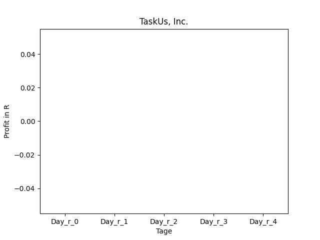

### Mit Filter

## SWDBY

### Erwartung in R
|      |   Day_r_0 |   Day_r_1 |   Day_r_2 |   Day_r_3 |   Day_r_4 |   Treffer |
|:-----|----------:|----------:|----------:|----------:|----------:|----------:|
| ohne |       0.1 |       0.1 |       0.2 |       0.1 |       0.2 |        15 |
| mit  |       0.1 |      -0.1 |      -0.1 |      -0.1 |      -0.2 |         3 |

### Ohne Filter
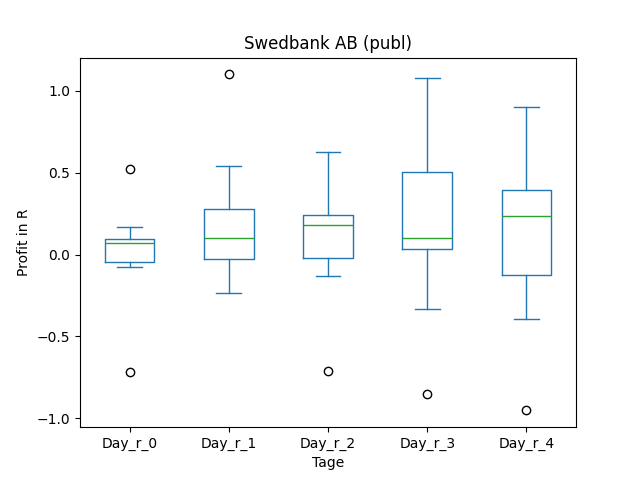
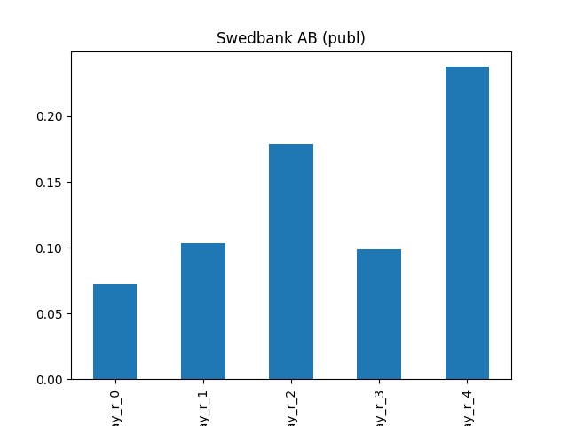

### Mit Filter
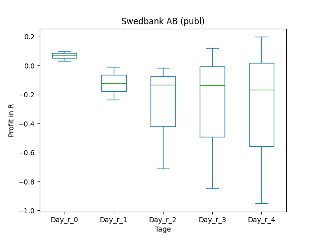
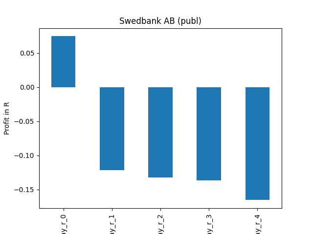

## NRDBY

### Erwartung in R
|      |   Day_r_0 |   Day_r_1 |   Day_r_2 |   Day_r_3 |   Day_r_4 |   Treffer |
|:-----|----------:|----------:|----------:|----------:|----------:|----------:|
| ohne |         0 |      -0.1 |        -0 |      -0.3 |        -0 |         8 |
| mit  |        -0 |      -0.1 |        -0 |      -0.3 |        -0 |         6 |

### Ohne Filter
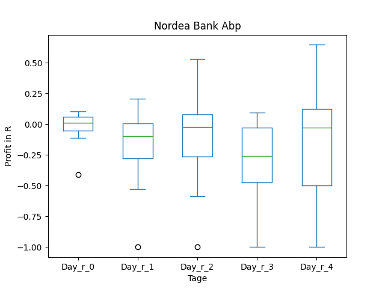
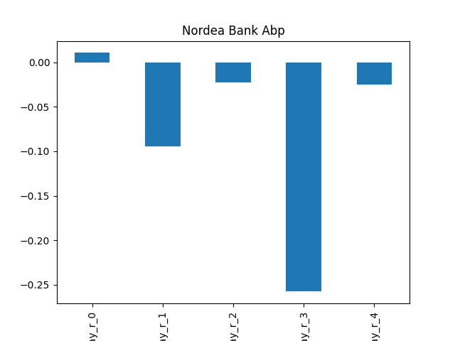

### Mit Filter
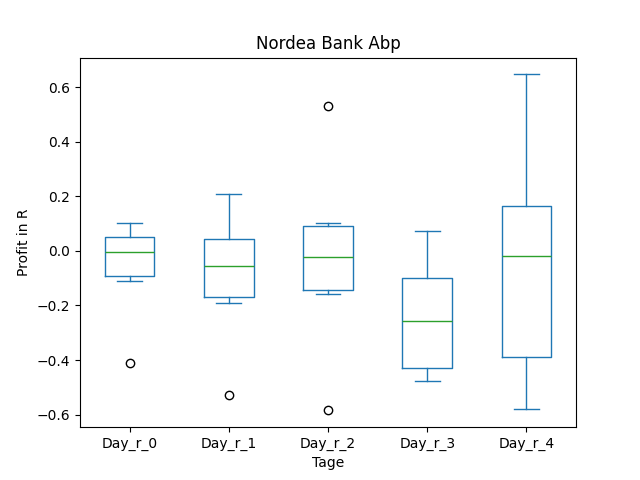
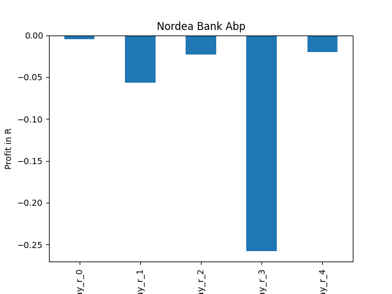

## AHRT

### Erwartung in R
|      |   Day_r_0 |   Day_r_1 |   Day_r_2 |   Day_r_3 |   Day_r_4 |   Treffer |
|:-----|----------:|----------:|----------:|----------:|----------:|----------:|
| ohne |      -0.4 |        -1 |        -1 |        -1 |        -1 |         6 |
| mit  |     nan   |       nan |       nan |       nan |       nan |         0 |

### Ohne Filter
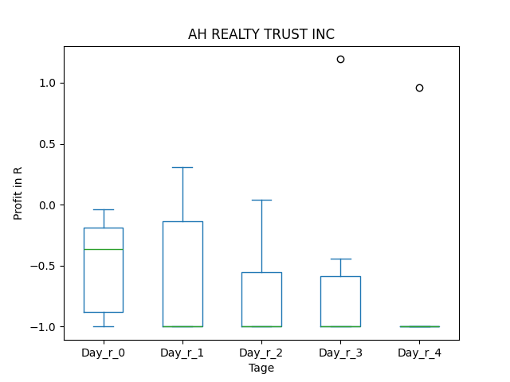
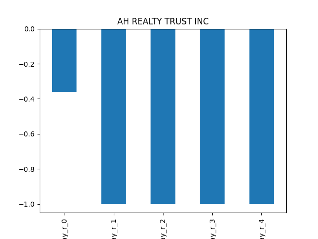

### Mit Filter
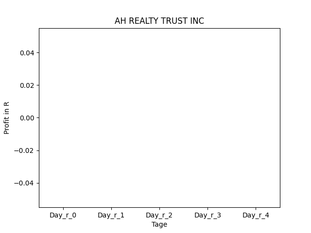
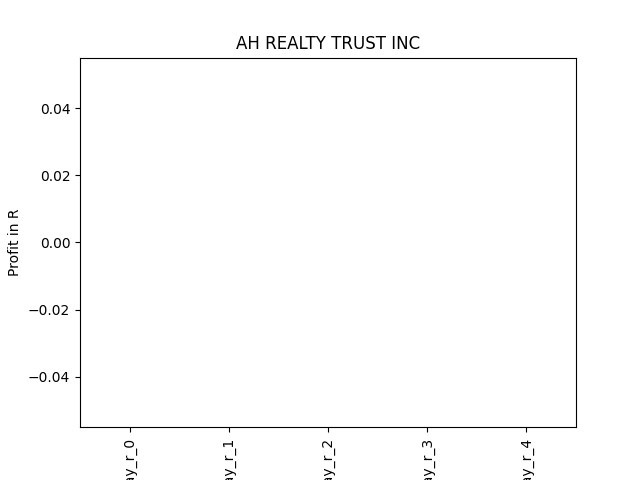

