# dividend-shorter

bet on falling prices on payday **2026-04-15**.

## Signale

| Ticker   |   Divid Rate |   Close |   Volume |   last_close_volume |   Divid % | 5_Days_pos   | above_SMA_50   |
|:---------|-------------:|--------:|---------:|--------------------:|----------:|:-------------|:---------------|
| SSREY    |         2    |   42.96 |    33900 |             1456344 |      4.66 | True         | True           |
| RAIFY    |         0.46 |   13.69 |     8900 |              121841 |      3.4  | True         | True           |
| MVO      |         0.17 |    3.23 |   599900 |             1937677 |      5.26 | True         | True           |

## SSREY

### Erwartung in R
|      |   Day_r_0 |   Day_r_1 |   Day_r_2 |   Day_r_3 |   Day_r_4 |   Treffer |
|:-----|----------:|----------:|----------:|----------:|----------:|----------:|
| ohne |         0 |       0.1 |       0.1 |       0.2 |       0.2 |        16 |
| mit  |         0 |       0.1 |       0.1 |       0.1 |       0.1 |         5 |

### Ohne Filter
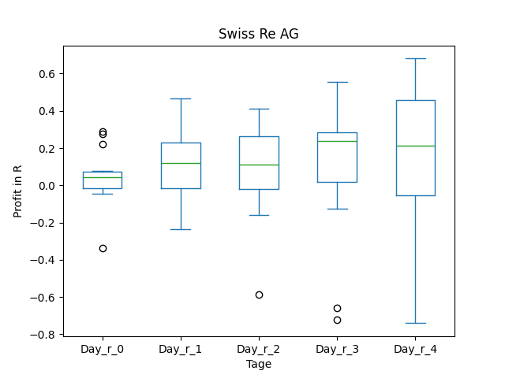
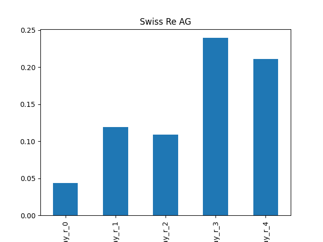

### Mit Filter
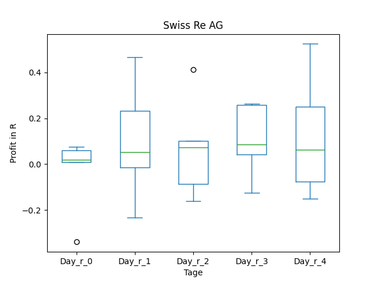
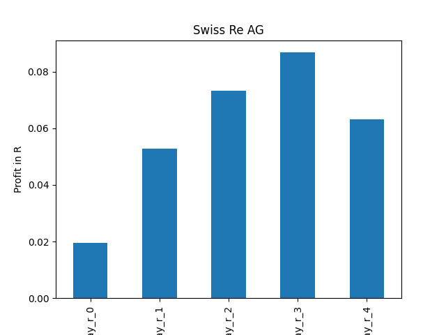

## RAIFY

### Erwartung in R
|      |   Day_r_0 |   Day_r_1 |   Day_r_2 |   Day_r_3 |   Day_r_4 |   Treffer |
|:-----|----------:|----------:|----------:|----------:|----------:|----------:|
| ohne |      -0.4 |      -0.3 |      -0.4 |      -0.2 |       1.1 |         5 |
| mit  |     nan   |     nan   |     nan   |     nan   |     nan   |         0 |

### Ohne Filter
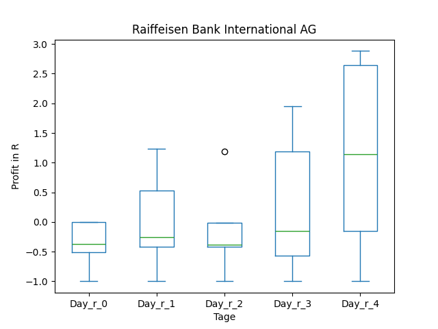
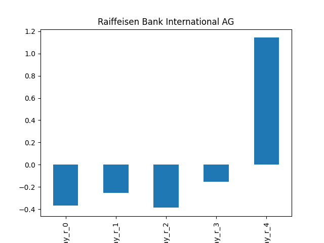

### Mit Filter
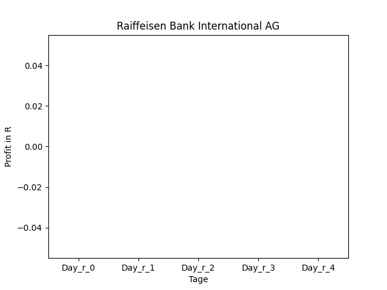
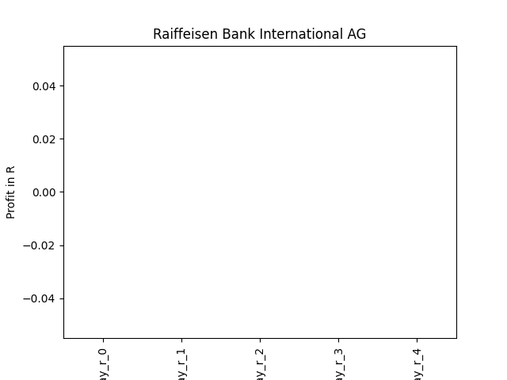

## MVO

### Erwartung in R
|      |   Day_r_0 |   Day_r_1 |   Day_r_2 |   Day_r_3 |   Day_r_4 |   Treffer |
|:-----|----------:|----------:|----------:|----------:|----------:|----------:|
| ohne |       0.1 |       0.4 |       0.5 |       0.6 |       0.6 |        75 |
| mit  |       0.3 |       0.5 |       0.8 |       0.9 |       1   |        16 |

### Ohne Filter
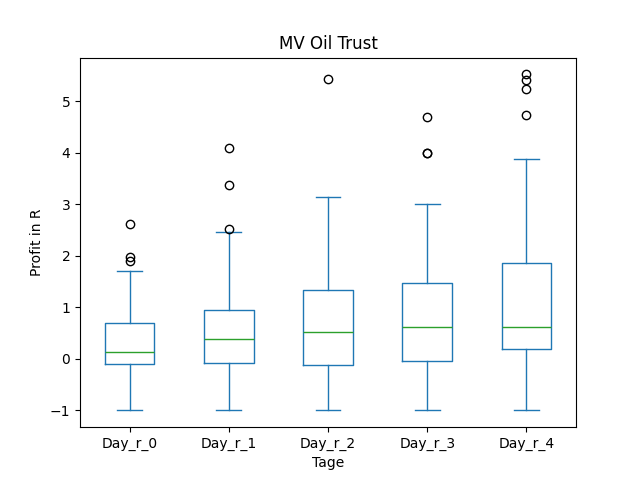
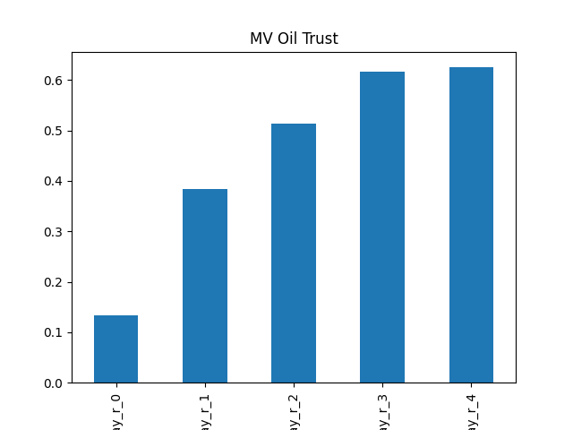

### Mit Filter
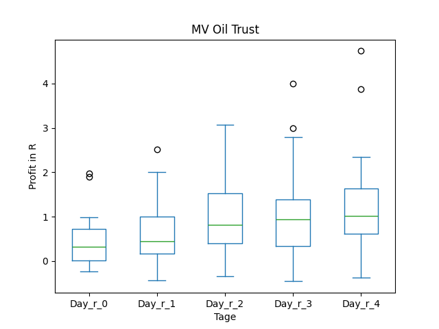
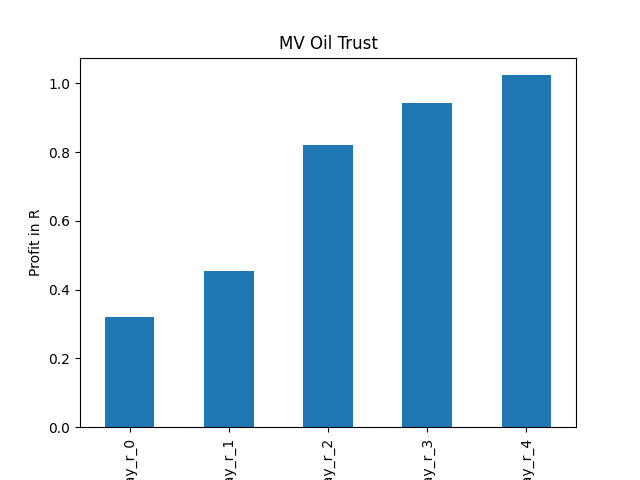

