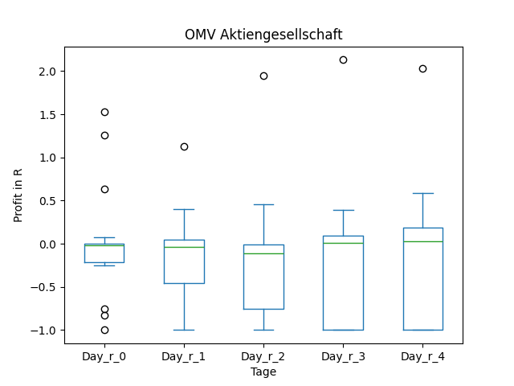
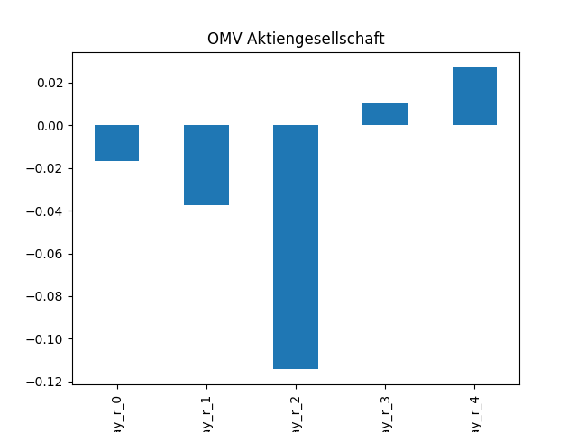
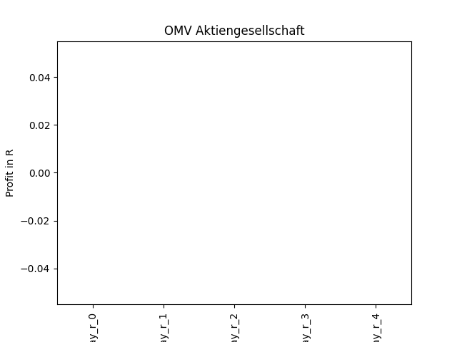
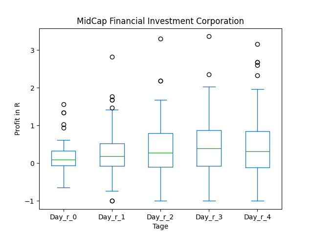
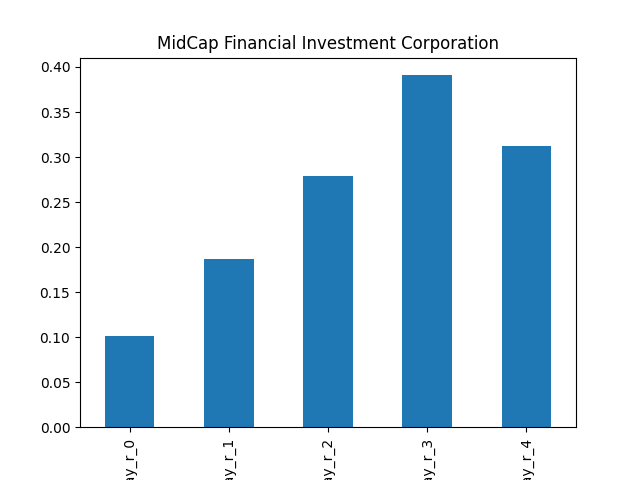
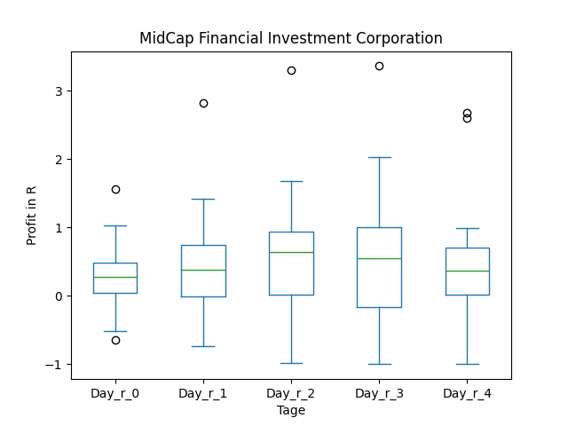
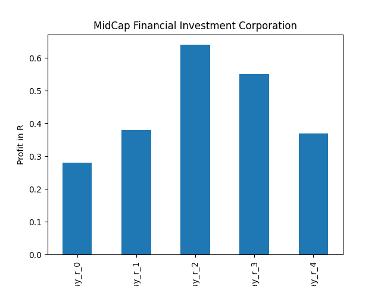

# dividend-shorter

bet on falling prices on payday **2026-06-09**.

## Signale

| Ticker   |   Divid Rate |   Close |   Volume |   last_close_volume |   Divid % | 5_Days_pos   | above_SMA_50   |
|:---------|-------------:|--------:|---------:|--------------------:|----------:|:-------------|:---------------|
| OMVKY    |         0.92 |   17.92 |    30100 |              539392 |      5.15 | False        | False          |
| MFIC     |         0.31 |   10.53 |   595600 |             6271668 |      2.94 | False        | False          |

## OMVKY

### Erwartung in R
|      |   Day_r_0 |   Day_r_1 |   Day_r_2 |   Day_r_3 |   Day_r_4 |   Treffer |
|:-----|----------:|----------:|----------:|----------:|----------:|----------:|
| ohne |        -0 |        -0 |      -0.1 |         0 |         0 |        17 |
| mit  |       nan |       nan |     nan   |       nan |       nan |         0 |

### Ohne Filter

### Mit Filter

## MFIC

### Erwartung in R
|      |   Day_r_0 |   Day_r_1 |   Day_r_2 |   Day_r_3 |   Day_r_4 |   Treffer |
|:-----|----------:|----------:|----------:|----------:|----------:|----------:|
| ohne |       0.1 |       0.2 |       0.3 |       0.4 |       0.3 |        78 |
| mit  |       0.3 |       0.4 |       0.6 |       0.6 |       0.4 |        16 |

### Ohne Filter

### Mit Filter

