# dividend-shorter

bet on falling prices on payday **2026-03-09**.

## Signale

| Ticker   |   Divid Rate |   Close |          Volume |   last_close_volume |   Divid % | 5_Days_pos   | above_SMA_50   |
|:---------|-------------:|--------:|----------------:|--------------------:|----------:|:-------------|:---------------|
| MCHB     |         0.4  |   14.8  | 543400          |             8042320 |      2.7  | False        | False          |
| KNYJY    |         1.07 |   34.49 |  33300          |             1148517 |      3.09 | False        | False          |
| IEP      |         0.5  |    8.11 |      2.2725e+06 |            18429975 |      6.17 | True         | True           |
| FSUGY    |         0.88 |   27.49 |  93300          |             2564817 |      3.2  | False        | False          |

## MCHB

### Erwartung in R
|      |   Day_r_0 |   Day_r_1 |   Day_r_2 |   Day_r_3 |   Day_r_4 |   Treffer |
|:-----|----------:|----------:|----------:|----------:|----------:|----------:|
| ohne |      -0.2 |      -0.1 |      -0.7 |      -0.8 |        -1 |        24 |
| mit  |      -0.2 |      -0.1 |      -0.9 |      -0.6 |        -1 |        15 |

### Ohne Filter
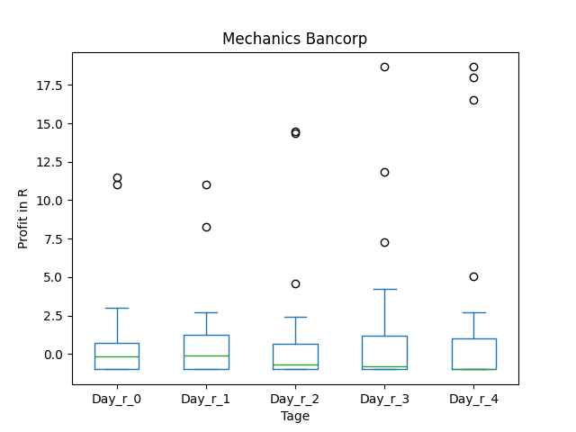
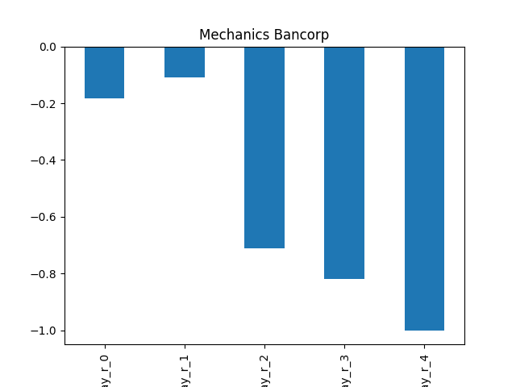

### Mit Filter
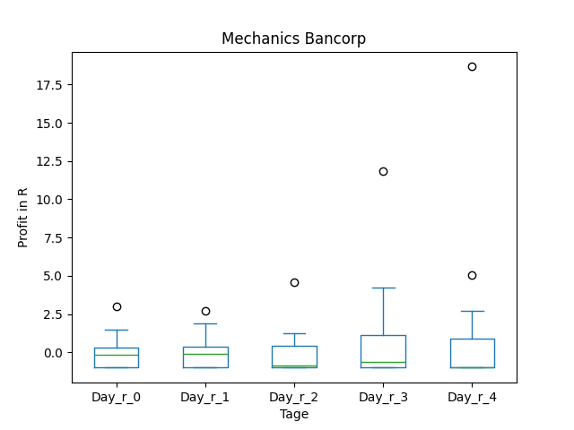
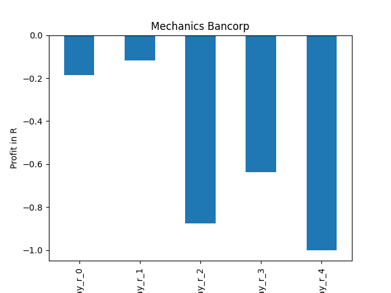

## KNYJY

### Erwartung in R
|      |   Day_r_0 |   Day_r_1 |   Day_r_2 |   Day_r_3 |   Day_r_4 |   Treffer |
|:-----|----------:|----------:|----------:|----------:|----------:|----------:|
| ohne |      -0   |       0.1 |      -0.2 |      -0.2 |      -0.2 |        15 |
| mit  |      -0.1 |       0.1 |       0.3 |       0.2 |       0.2 |         5 |

### Ohne Filter
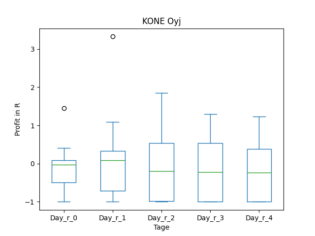
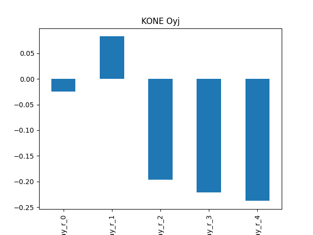

### Mit Filter
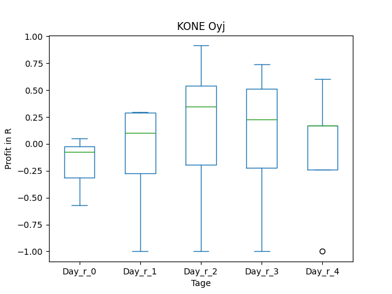
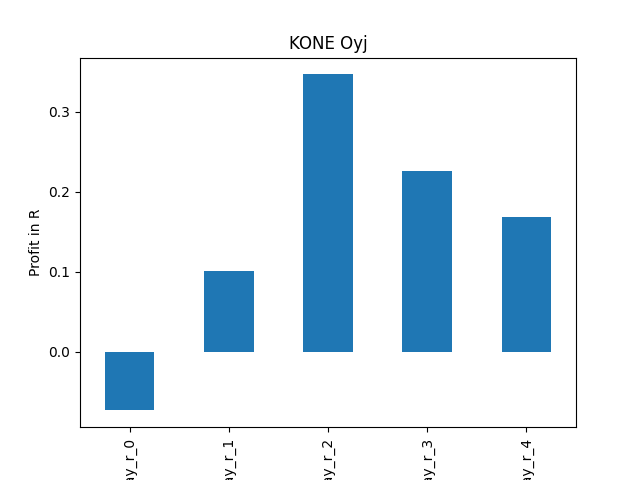

## IEP

### Erwartung in R
|      |   Day_r_0 |   Day_r_1 |   Day_r_2 |   Day_r_3 |   Day_r_4 |   Treffer |
|:-----|----------:|----------:|----------:|----------:|----------:|----------:|
| ohne |       0.2 |       0.4 |       0.6 |       0.6 |       0.6 |        81 |
| mit  |       0.2 |       0.5 |       0.8 |       0.7 |       0.6 |        28 |

### Ohne Filter
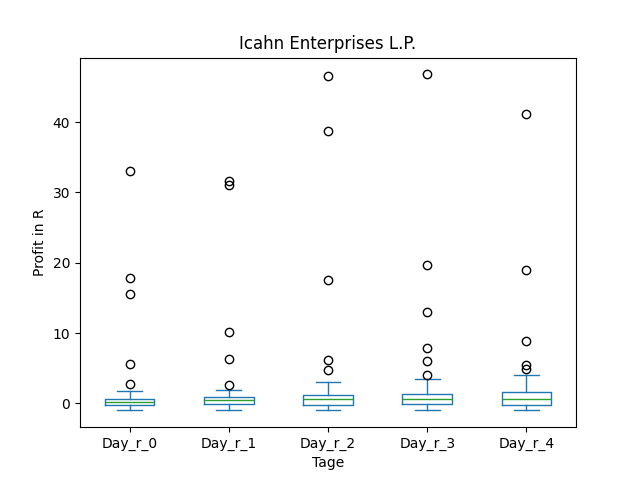
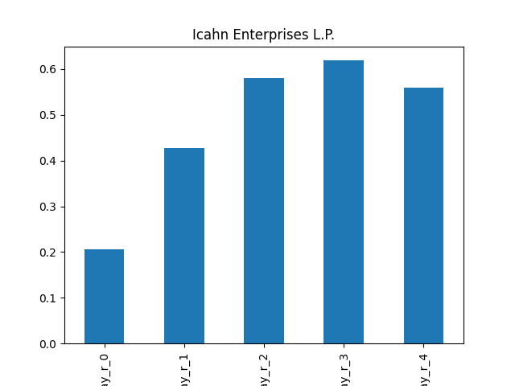

### Mit Filter
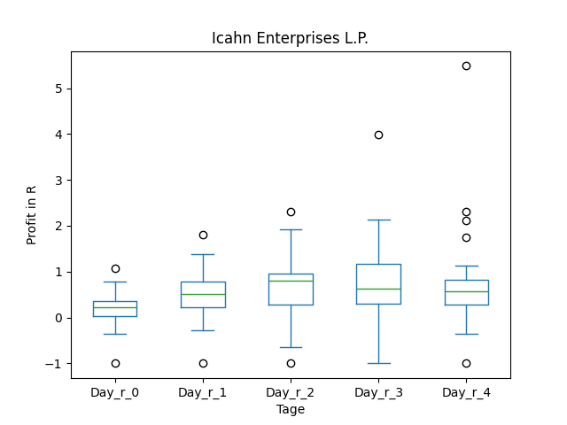
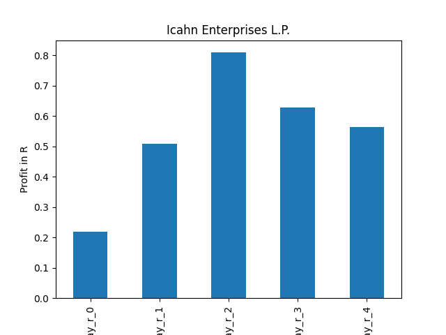

## FSUGY

### Erwartung in R
|      |   Day_r_0 |   Day_r_1 |   Day_r_2 |   Day_r_3 |   Day_r_4 |   Treffer |
|:-----|----------:|----------:|----------:|----------:|----------:|----------:|
| ohne |       0.1 |       0.1 |         0 |       0   |      -0.3 |        27 |
| mit  |       0.2 |       0.5 |         0 |      -0.1 |      -0.3 |        11 |

### Ohne Filter
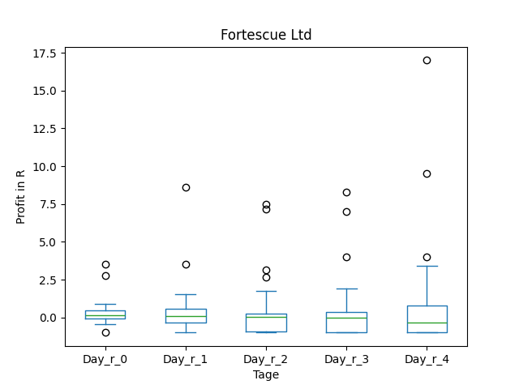
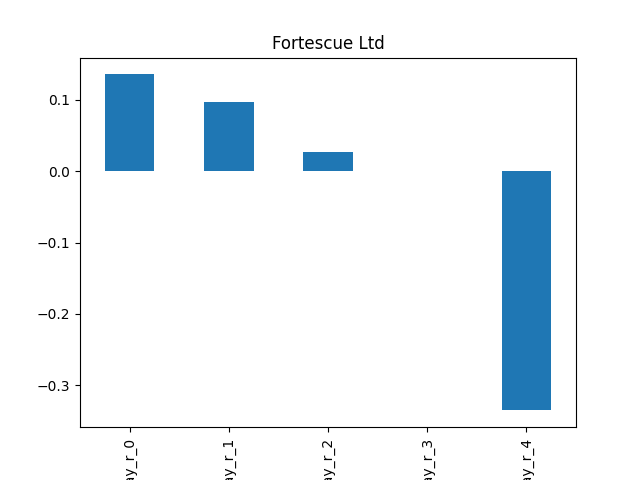

### Mit Filter
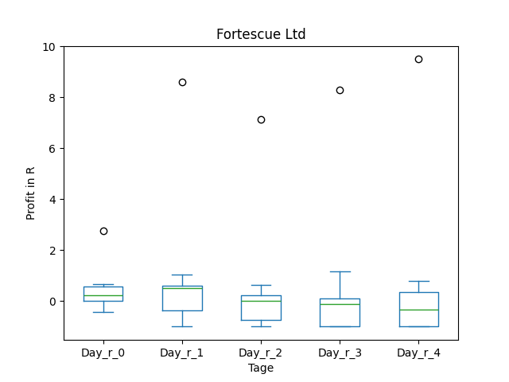
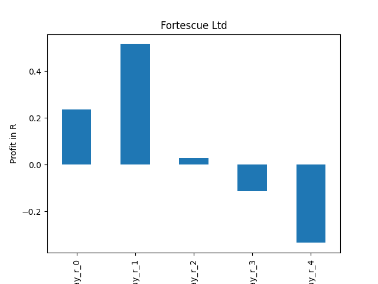

