# dividend-shorter

bet on falling prices on payday **2026-06-04**.

## Signale

| Ticker   |   Divid Rate |   Close |          Volume |   last_close_volume |   Divid % | 5_Days_pos   | above_SMA_50   |
|:---------|-------------:|--------:|----------------:|--------------------:|----------:|:-------------|:---------------|
| SSTK     |         0.36 |   13.54 | 758400          |            10268736 |      2.66 | False        | False          |
| HAFN     |         0.29 |    7.73 |      1.8359e+06 |            14191507 |      3.72 | True         | False          |
| AGESY    |         2.63 |   77.95 |   9900          |              771705 |      3.38 | False        | True           |

## SSTK

### Erwartung in R
|      |   Day_r_0 |   Day_r_1 |   Day_r_2 |   Day_r_3 |   Day_r_4 |   Treffer |
|:-----|----------:|----------:|----------:|----------:|----------:|----------:|
| ohne |       0.3 |      -0.2 |      -0.3 |      -0.2 |      -0.3 |        26 |
| mit  |      -0.3 |      -0.3 |      -0.2 |      -0.2 |      -0.2 |         1 |

### Ohne Filter
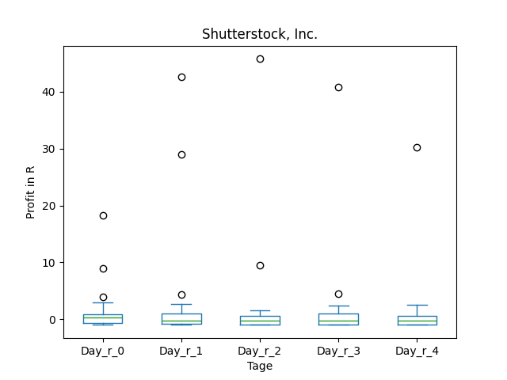
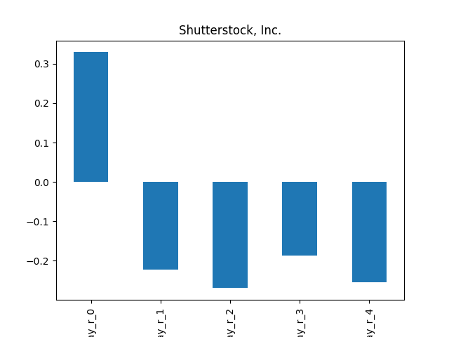

### Mit Filter
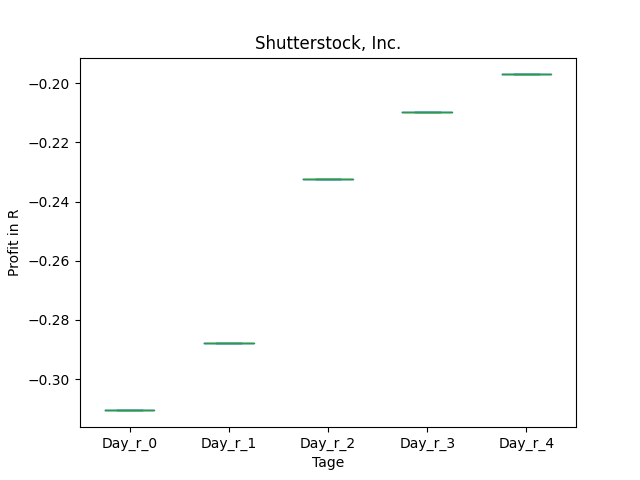
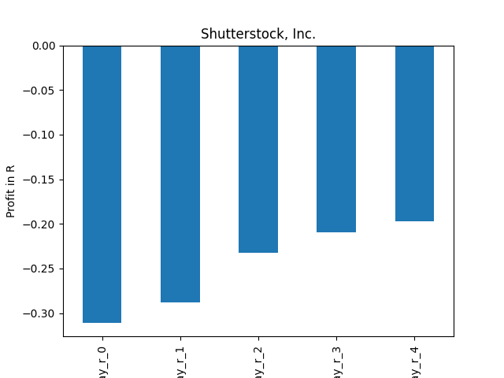

## HAFN

### Erwartung in R
|      |   Day_r_0 |   Day_r_1 |   Day_r_2 |   Day_r_3 |   Day_r_4 |   Treffer |
|:-----|----------:|----------:|----------:|----------:|----------:|----------:|
| ohne |       0.1 |       0   |       0   |       0.3 |       0.4 |         8 |
| mit  |       0.1 |       0.1 |      -0.3 |      -0.2 |       0.1 |         3 |

### Ohne Filter
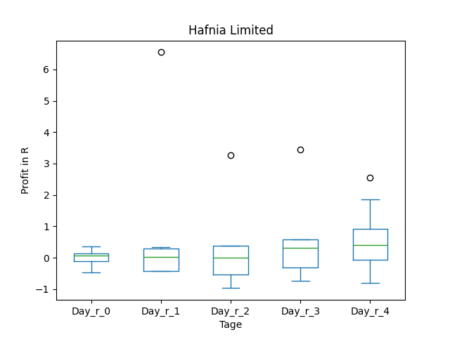
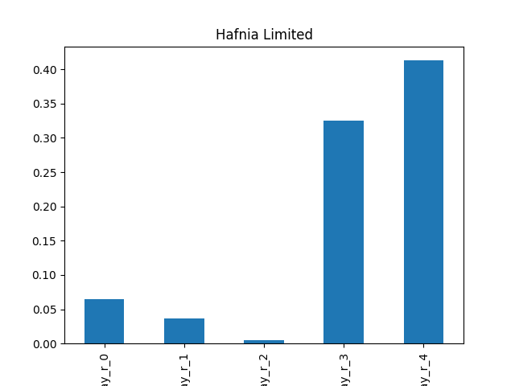

### Mit Filter
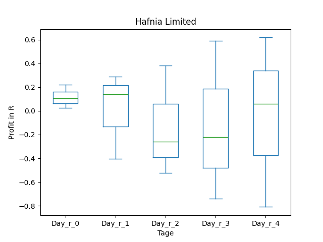
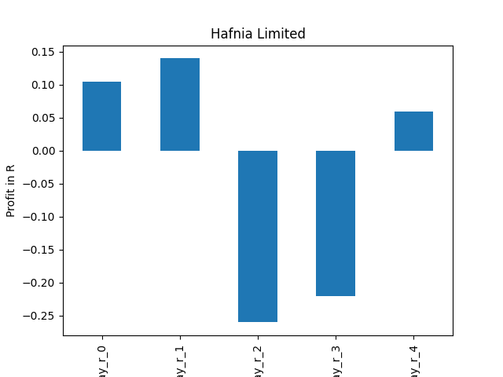

## AGESY

### Erwartung in R
|      |   Day_r_0 |   Day_r_1 |   Day_r_2 |   Day_r_3 |   Day_r_4 |   Treffer |
|:-----|----------:|----------:|----------:|----------:|----------:|----------:|
| ohne |       0   |       0.1 |      -0   |      -0   |       0.1 |        28 |
| mit  |       0.2 |       0.1 |       0.1 |       0.3 |       0.1 |         1 |

### Ohne Filter
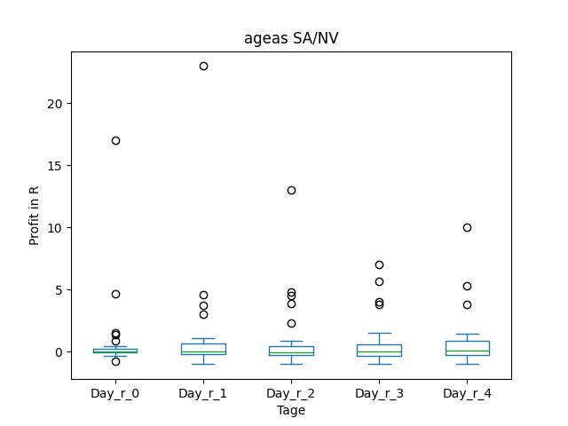
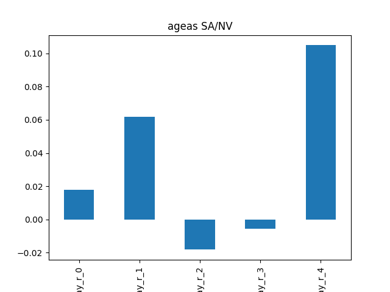

### Mit Filter
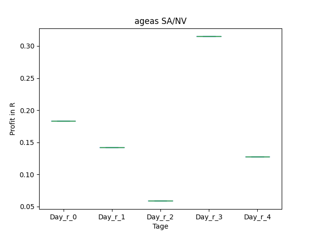
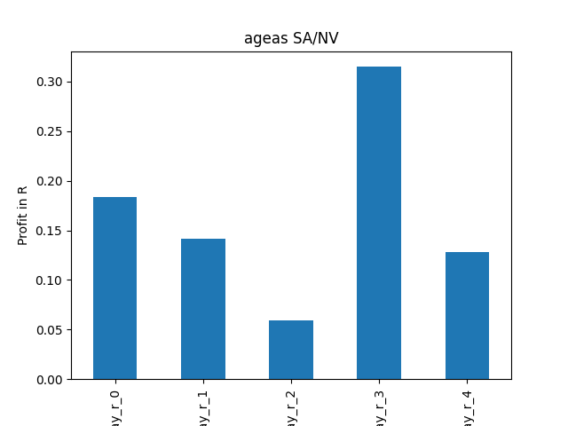

