# dividend-shorter

bet on falling prices on payday **2026-04-10**.

## Signale

| Ticker   |   Divid Rate |   Close |          Volume |   last_close_volume |   Divid % | 5_Days_pos   | above_SMA_50   |
|:---------|-------------:|--------:|----------------:|--------------------:|----------:|:-------------|:---------------|
| VLVLY    |         0.95 |   36.12 |  66500          |             2401980 |      2.63 | True         | True           |
| VIPS     |         0.62 |   15.55 |      1.9377e+06 |            30131235 |      3.99 | True         | False          |
| SLLDY    |         0.58 |   11.6  |  84100          |              975560 |      5.01 | True         | False          |
| NDBKY    |         0.69 |   17.1  |  17200          |              294120 |      4.06 | True         | True           |
| MOMO     |         0.28 |    6.17 | 876100          |             5405537 |      4.54 | True         | False          |

## VLVLY

### Erwartung in R
|      |   Day_r_0 |   Day_r_1 |   Day_r_2 |   Day_r_3 |   Day_r_4 |   Treffer |
|:-----|----------:|----------:|----------:|----------:|----------:|----------:|
| ohne |         0 |         0 |         0 |      -0.2 |      -0.3 |        11 |
| mit  |         0 |         0 |         0 |      -0.2 |      -0.3 |         9 |

### Ohne Filter
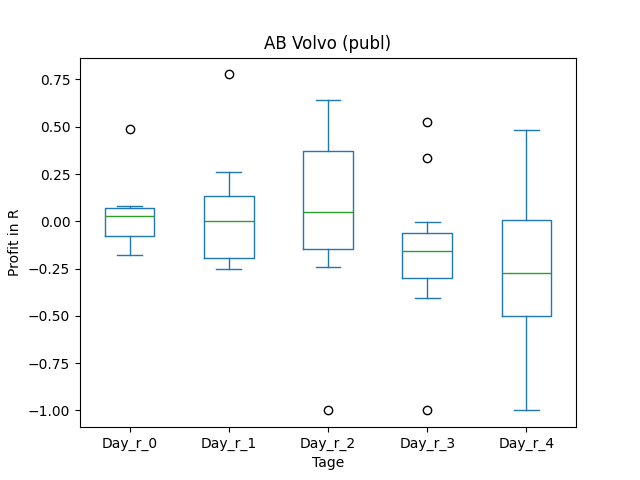

### Mit Filter
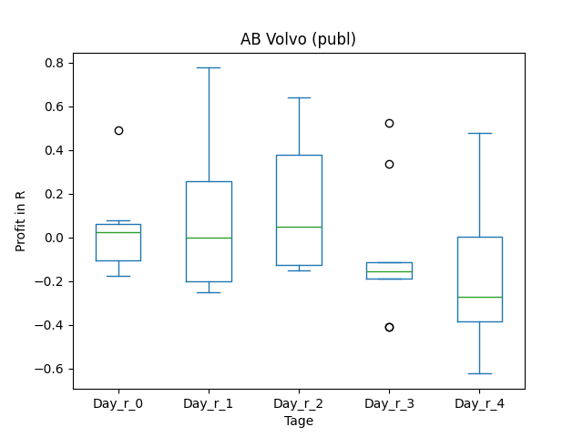
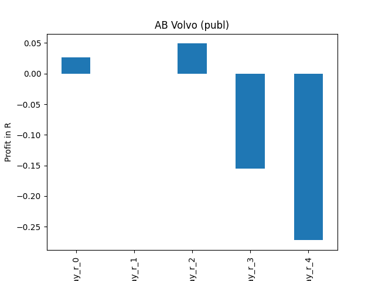

## VIPS

### Erwartung in R
|      |   Day_r_0 |   Day_r_1 |   Day_r_2 |   Day_r_3 |   Day_r_4 |   Treffer |
|:-----|----------:|----------:|----------:|----------:|----------:|----------:|
| ohne |       0.2 |       0.3 |       0.2 |       0.4 |      -0   |         2 |
| mit  |       0.5 |       0.6 |       0.4 |       0.7 |       0.6 |         1 |

### Ohne Filter
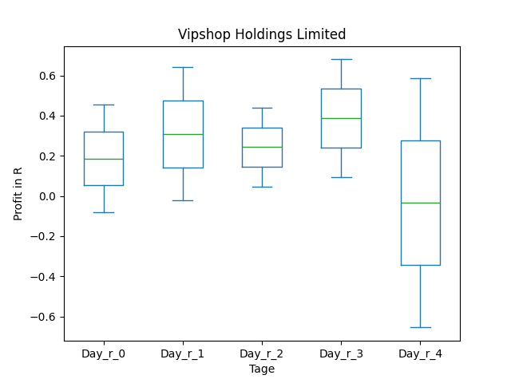
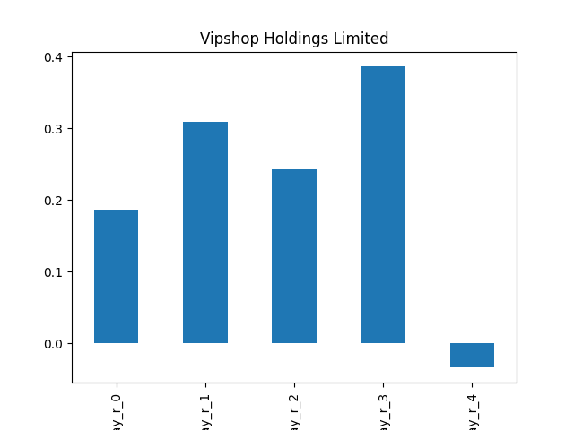

### Mit Filter
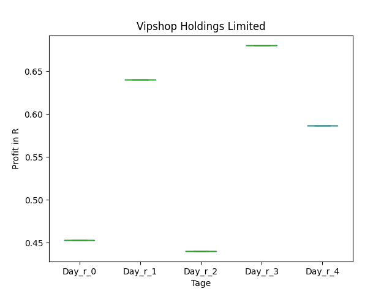
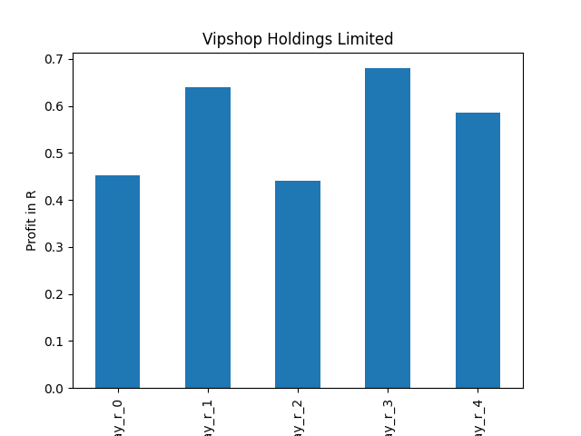

## SLLDY

### Erwartung in R
|      |   Day_r_0 |   Day_r_1 |   Day_r_2 |   Day_r_3 |   Day_r_4 |   Treffer |
|:-----|----------:|----------:|----------:|----------:|----------:|----------:|
| ohne |       0.1 |      -0.1 |      -0   |      -0.3 |      -0.4 |        14 |
| mit  |      -0.4 |       0.2 |      -0.4 |      -1   |      -1   |         1 |

### Ohne Filter
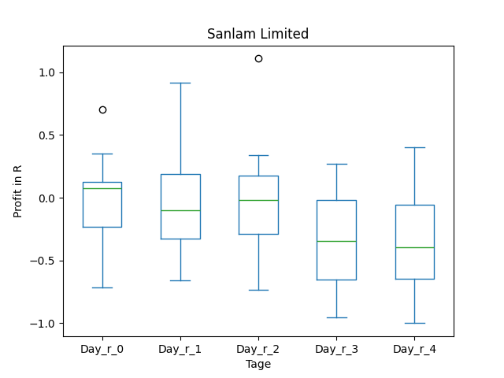
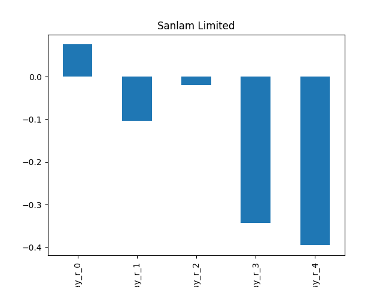

### Mit Filter
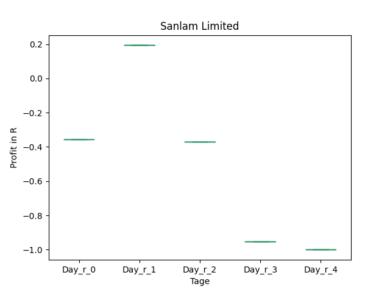
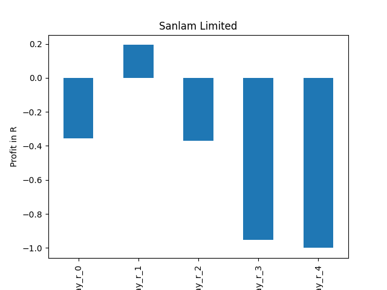

## NDBKY

### Erwartung in R
|      |   Day_r_0 |   Day_r_1 |   Day_r_2 |   Day_r_3 |   Day_r_4 |   Treffer |
|:-----|----------:|----------:|----------:|----------:|----------:|----------:|
| ohne |         0 |        -0 |       0.1 |      -0.1 |      -0.6 |        26 |
| mit  |       nan |       nan |     nan   |     nan   |     nan   |         0 |

### Ohne Filter
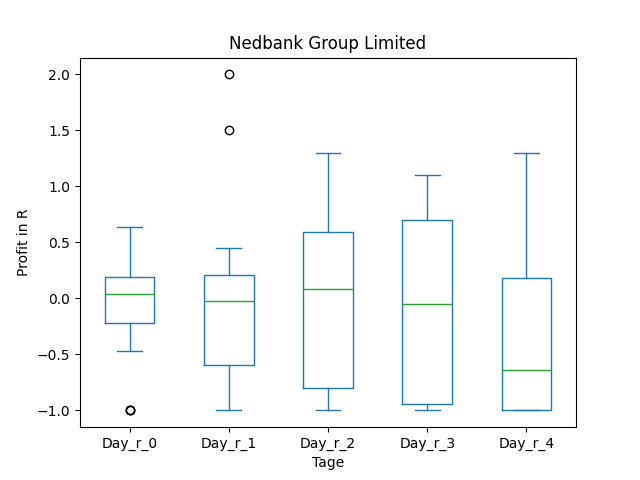
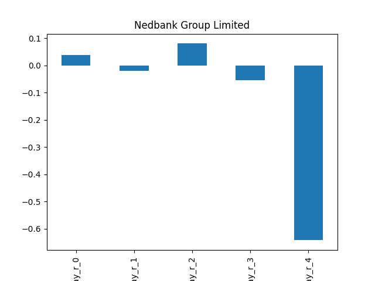

### Mit Filter
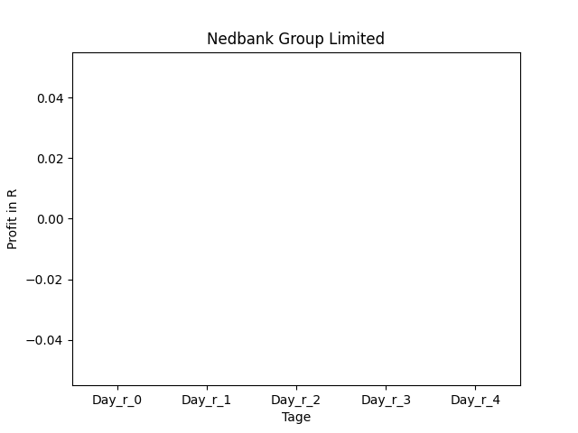

## MOMO

### Erwartung in R
|      |   Day_r_0 |   Day_r_1 |   Day_r_2 |   Day_r_3 |   Day_r_4 |   Treffer |
|:-----|----------:|----------:|----------:|----------:|----------:|----------:|
| ohne |       0.2 |       0.3 |       0.2 |       0.2 |       0.4 |         7 |
| mit  |       0.1 |       0.2 |      -0.2 |       0.2 |       0.3 |         6 |

### Ohne Filter
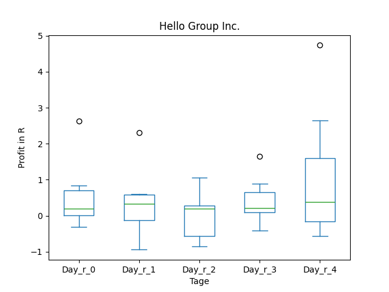
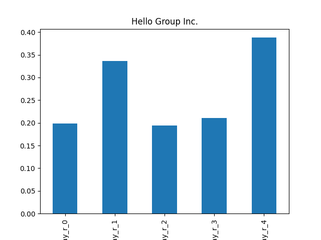

### Mit Filter
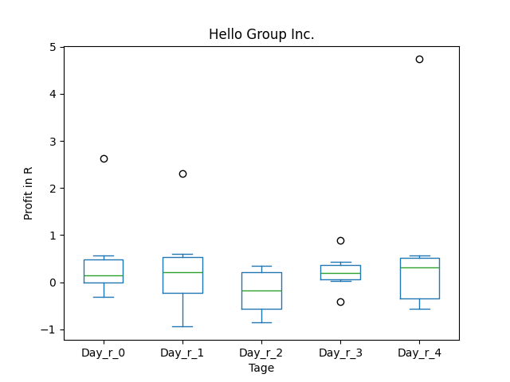
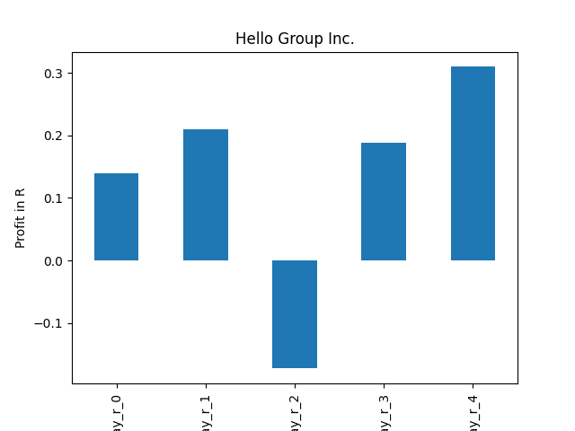

