# dividend-shorter

bet on falling prices on payday **2026-04-17**.

## Signale

| Ticker   |   Divid Rate |   Close |         Volume |   last_close_volume |   Divid % | 5_Days_pos   | above_SMA_50   |
|:---------|-------------:|--------:|---------------:|--------------------:|----------:|:-------------|:---------------|
| WB       |         0.61 |    9.27 |     1.1682e+06 |            10829214 |      6.58 | True         | False          |
| SGBLY    |         0.52 |   20    | 29400          |              588000 |      2.58 | False        | True           |
| ING      |         0.88 |   29.24 |     2.181e+06  |            63772440 |      3.01 | True         | True           |
| GOFPY    |         0.46 |    8.64 | 75900          |              655776 |      5.36 | True         | False          |

## WB

### Erwartung in R
|      |   Day_r_0 |   Day_r_1 |   Day_r_2 |   Day_r_3 |   Day_r_4 |   Treffer |
|:-----|----------:|----------:|----------:|----------:|----------:|----------:|
| ohne |       0.1 |       0.4 |        -0 |       0.3 |       0.4 |         3 |
| mit  |       0.1 |       0.4 |        -0 |       0.3 |       0.4 |         3 |

### Ohne Filter

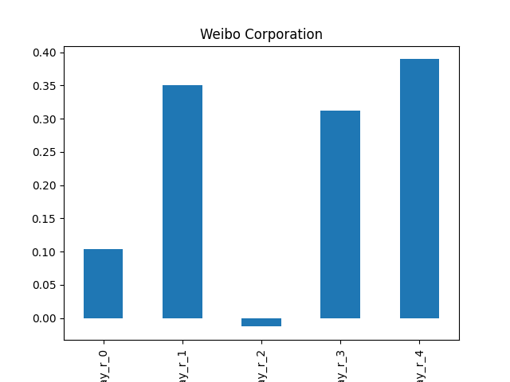

### Mit Filter
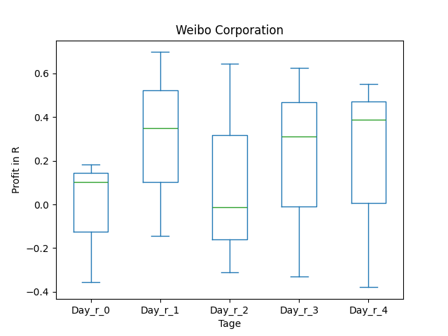

## SGBLY

### Erwartung in R
|      |   Day_r_0 |   Day_r_1 |   Day_r_2 |   Day_r_3 |   Day_r_4 |   Treffer |
|:-----|----------:|----------:|----------:|----------:|----------:|----------:|
| ohne |        -0 |       0.1 |       0.1 |         0 |      -0.4 |        27 |
| mit  |       nan |     nan   |     nan   |       nan |     nan   |         0 |

### Ohne Filter
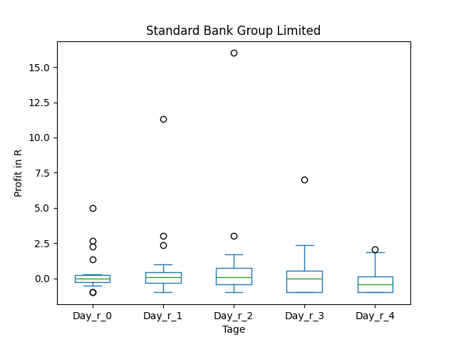
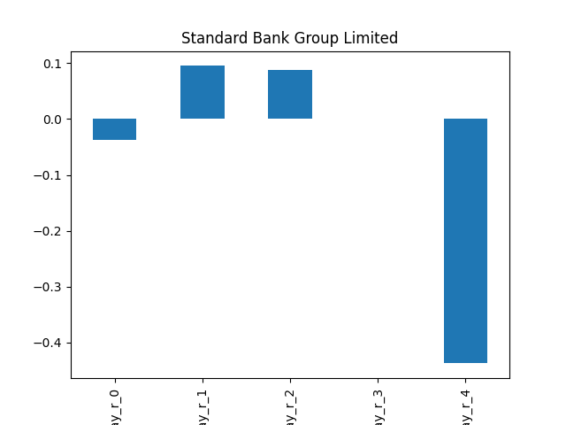

### Mit Filter
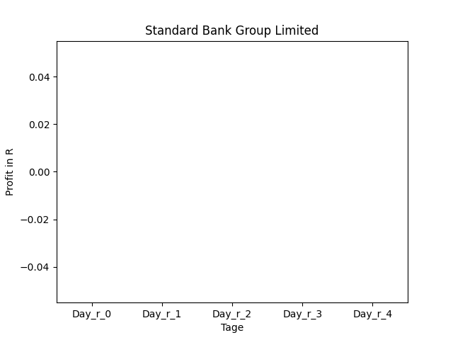
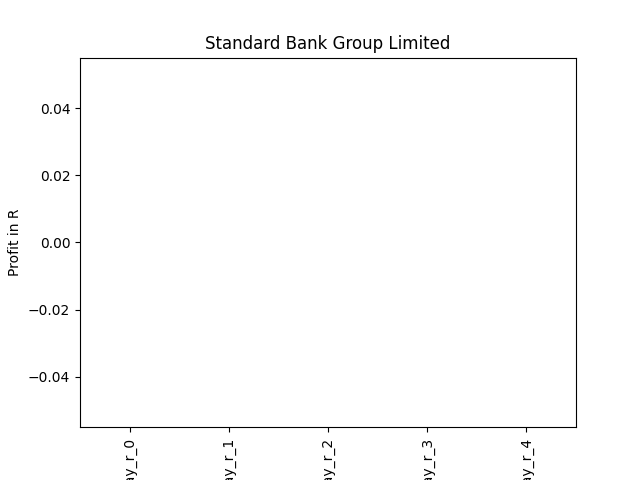

## ING

### Erwartung in R
|      |   Day_r_0 |   Day_r_1 |   Day_r_2 |   Day_r_3 |   Day_r_4 |   Treffer |
|:-----|----------:|----------:|----------:|----------:|----------:|----------:|
| ohne |         0 |      -0.1 |      -0   |      -0.1 |      -0.1 |        34 |
| mit  |         0 |      -0.1 |      -0.2 |      -0.1 |       0   |        10 |

### Ohne Filter
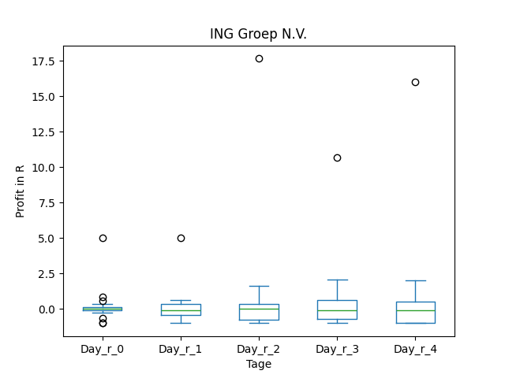
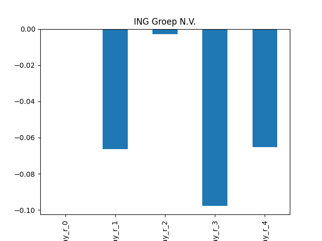

### Mit Filter
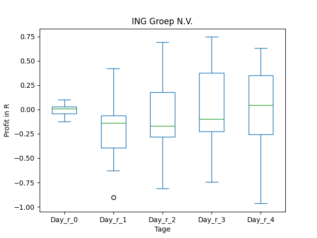
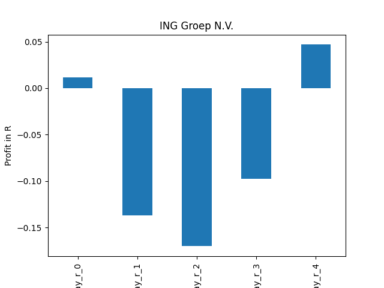

## GOFPY

### Erwartung in R
|      |   Day_r_0 |   Day_r_1 |   Day_r_2 |   Day_r_3 |   Day_r_4 |   Treffer |
|:-----|----------:|----------:|----------:|----------:|----------:|----------:|
| ohne |         0 |      -0.1 |      -0.3 |      -0.5 |      -0.5 |        33 |
| mit  |       nan |     nan   |     nan   |     nan   |     nan   |         0 |

### Ohne Filter
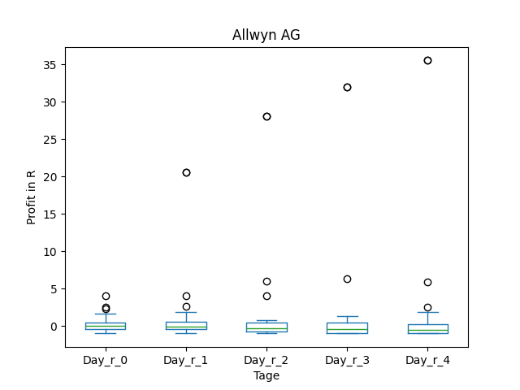
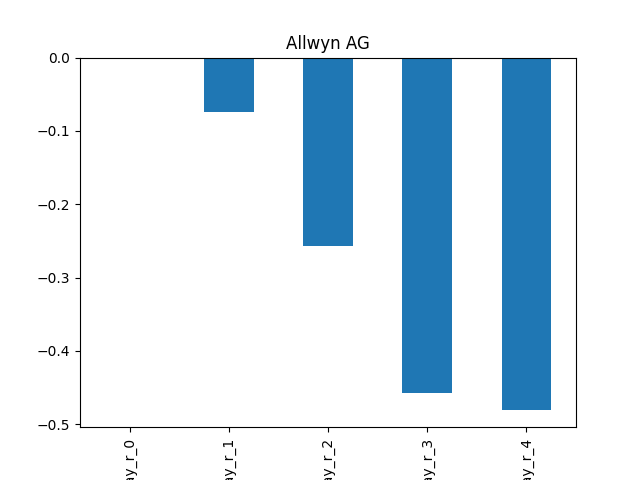

### Mit Filter
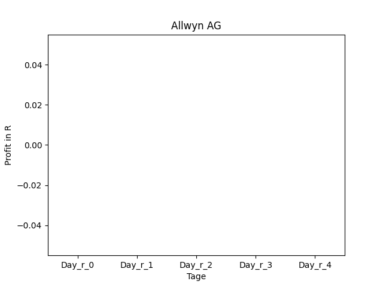

