# dividend-shorter

bet on falling prices on payday **2026-06-26**.

## Signale

| Ticker   |   Divid Rate |   Close |   Volume |   last_close_volume |   Divid % | 5_Days_pos   | above_SMA_50   |
|:---------|-------------:|--------:|---------:|--------------------:|----------:|:-------------|:---------------|
| UUGRY    |         0.95 |   35.07 |    18200 |              638274 |      2.72 | True         | False          |
| TRTX     |         0.24 |    8.53 |   833600 |             7110608 |      2.81 | False        | True           |
| PSBD     |         0.36 |   10.8  |   179000 |             1933200 |      3.33 | True         | True           |
| LIEN     |         0.34 |   10.4  |   173100 |             1800240 |      3.27 | True         | True           |

## UUGRY

### Erwartung in R
|      |   Day_r_0 |   Day_r_1 |   Day_r_2 |   Day_r_3 |   Day_r_4 |   Treffer |
|:-----|----------:|----------:|----------:|----------:|----------:|----------:|
| ohne |       0.1 |       0.1 |       0.1 |      -0.1 |      -0   |        29 |
| mit  |       0.1 |       0.4 |       0.3 |       0.3 |       0.9 |         2 |

### Ohne Filter
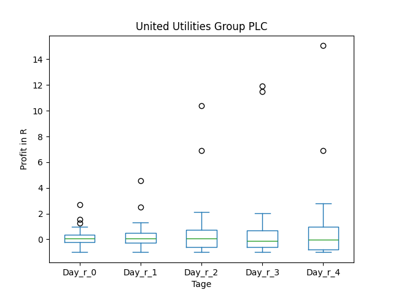
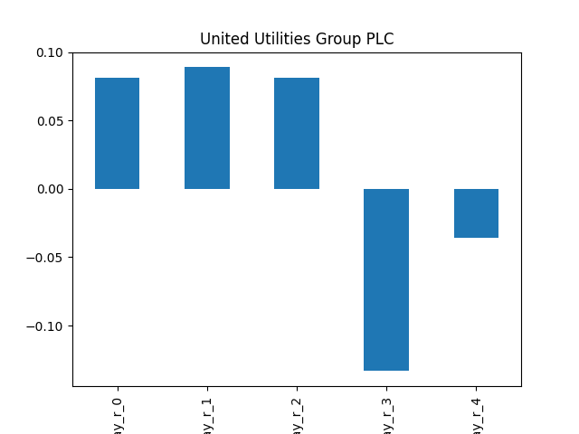

### Mit Filter
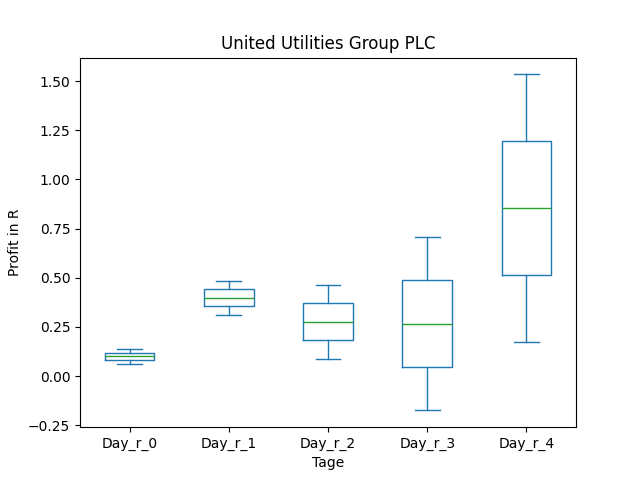
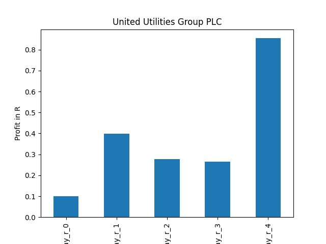

## TRTX

### Erwartung in R
|      |   Day_r_0 |   Day_r_1 |   Day_r_2 |   Day_r_3 |   Day_r_4 |   Treffer |
|:-----|----------:|----------:|----------:|----------:|----------:|----------:|
| ohne |       0   |        -0 |      -0.1 |      -0.1 |      -0.2 |        38 |
| mit  |       0.2 |         0 |      -0.2 |      -0.1 |      -0.2 |        14 |

### Ohne Filter
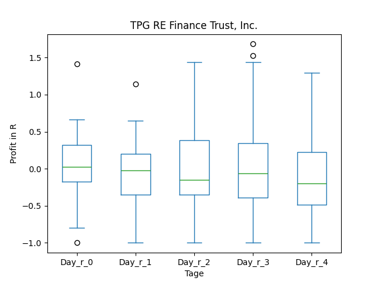
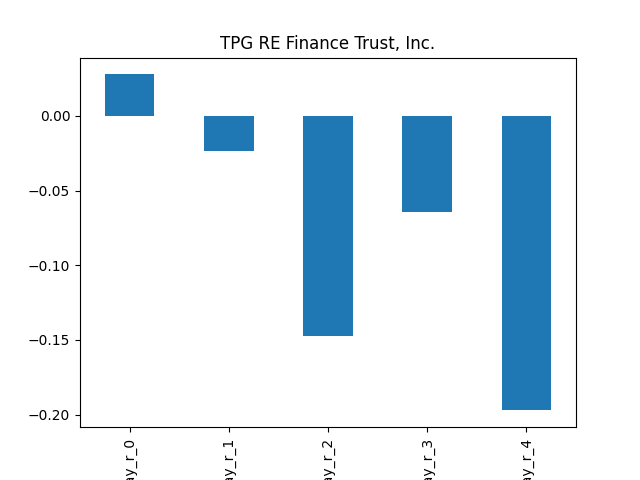

### Mit Filter
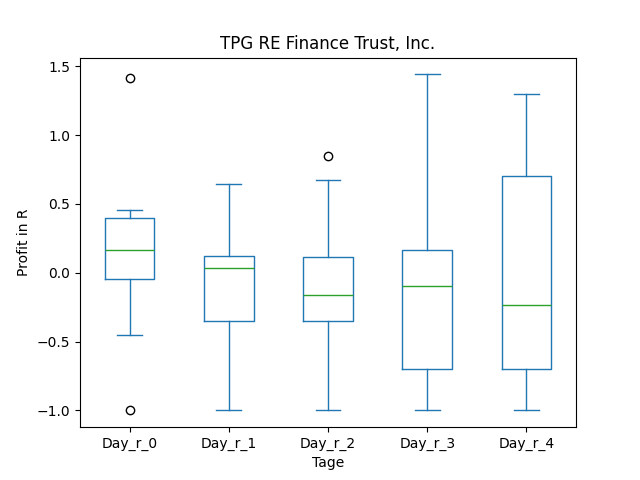
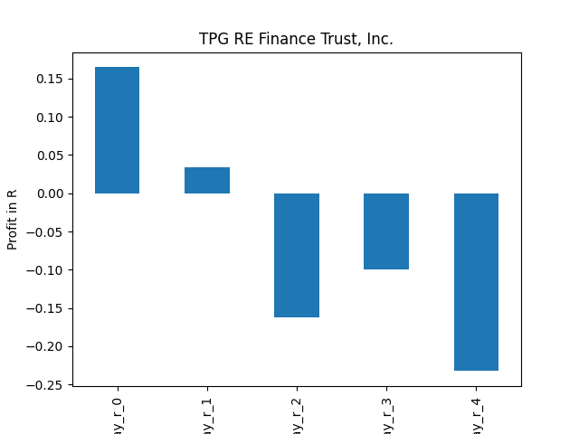

## PSBD

### Erwartung in R
|      |   Day_r_0 |   Day_r_1 |   Day_r_2 |   Day_r_3 |   Day_r_4 |   Treffer |
|:-----|----------:|----------:|----------:|----------:|----------:|----------:|
| ohne |       0.1 |       0   |       0.1 |       0.2 |        -0 |        18 |
| mit  |       0.1 |      -0.1 |      -0   |       0   |        -0 |         3 |

### Ohne Filter
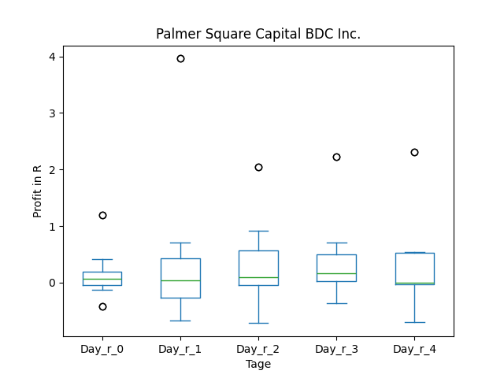
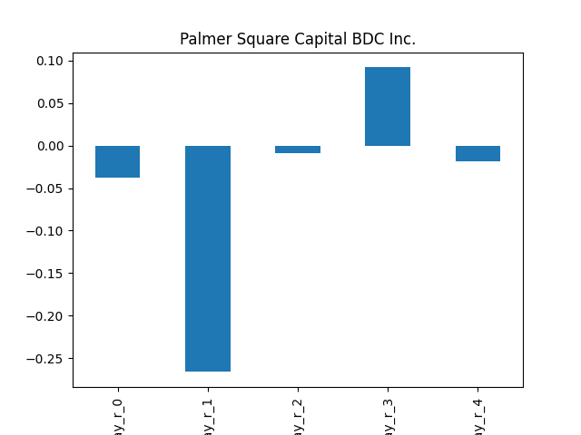

### Mit Filter
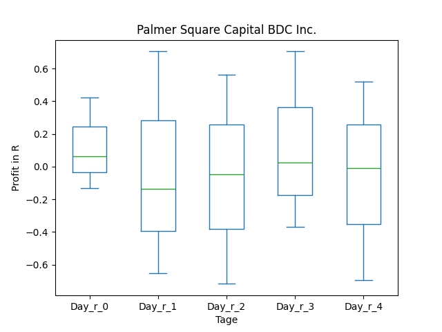
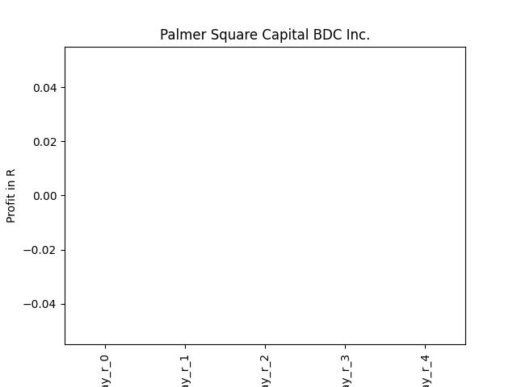

## LIEN

### Erwartung in R
|      |   Day_r_0 |   Day_r_1 |   Day_r_2 |   Day_r_3 |   Day_r_4 |   Treffer |
|:-----|----------:|----------:|----------:|----------:|----------:|----------:|
| ohne |       0.4 |       0.2 |       0.2 |       0.2 |       0.4 |         6 |
| mit  |     nan   |     nan   |     nan   |     nan   |     nan   |         0 |

### Ohne Filter
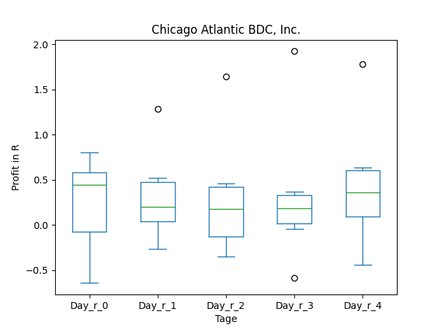
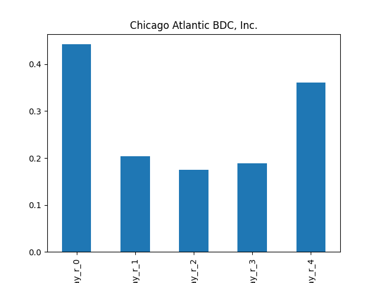

### Mit Filter

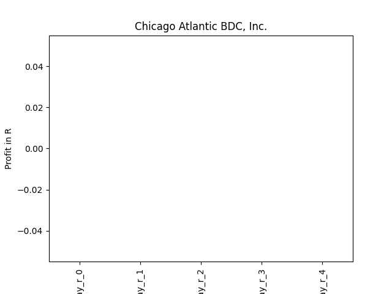

