# dividend-shorter

bet on falling prices on payday **2026-05-19**.

## Signale

| Ticker   |   Divid Rate |   Close |          Volume |   last_close_volume |   Divid % | 5_Days_pos   | above_SMA_50   |
|:---------|-------------:|--------:|----------------:|--------------------:|----------:|:-------------|:---------------|
| MONRY    |         1.65 |   58.44 |  38700          |             2261628 |      2.82 | False        | False          |
| KRP      |         0.41 |   15.47 |      1.2541e+06 |            19400927 |      2.65 | True         | True           |
| KBCSY    |         2.4  |   65.11 |  25800          |             1679838 |      3.69 | False        | True           |
| ISNPY    |         1.33 |   40.84 | 182200          |             7441048 |      3.27 | False        | True           |
| BMPSY    |         1.01 |   11.44 |  68203          |              780242 |      8.84 | True         | False          |
| ARZGY    |         0.96 |   22.99 |  42300          |              972477 |      4.19 | True         | True           |

## MONRY

### Erwartung in R
|      |   Day_r_0 |   Day_r_1 |   Day_r_2 |   Day_r_3 |   Day_r_4 |   Treffer |
|:-----|----------:|----------:|----------:|----------:|----------:|----------:|
| ohne |        -1 |        -1 |        -1 |        -1 |        -1 |         1 |
| mit  |       nan |       nan |       nan |       nan |       nan |         0 |

### Ohne Filter
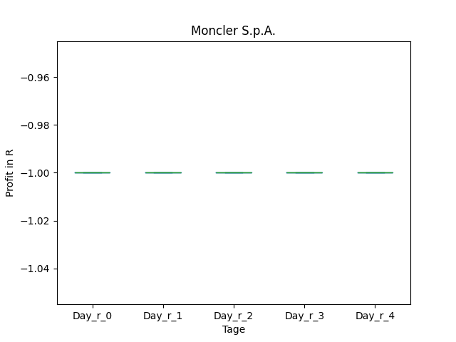
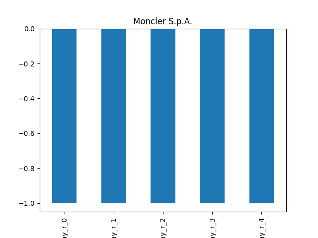

### Mit Filter
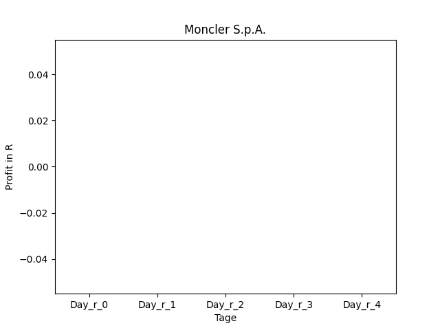

## KRP

### Erwartung in R
|      |   Day_r_0 |   Day_r_1 |   Day_r_2 |   Day_r_3 |   Day_r_4 |   Treffer |
|:-----|----------:|----------:|----------:|----------:|----------:|----------:|
| ohne |       0   |       0.1 |       0.2 |      -0   |      -0.3 |        36 |
| mit  |      -0.1 |      -0.2 |      -0   |      -0.2 |      -0.4 |         8 |

### Ohne Filter
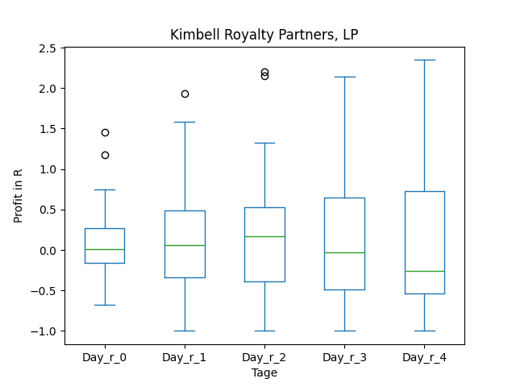
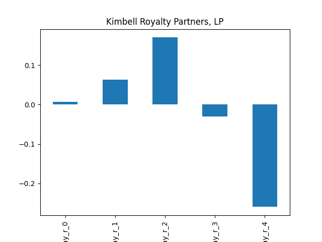

### Mit Filter
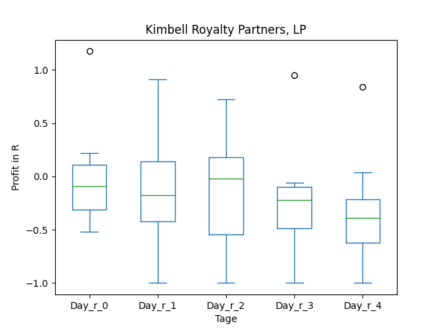
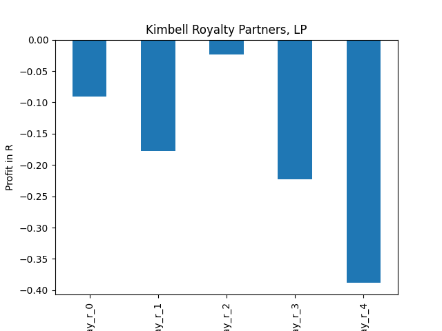

## KBCSY

### Erwartung in R
|      |   Day_r_0 |   Day_r_1 |   Day_r_2 |   Day_r_3 |   Day_r_4 |   Treffer |
|:-----|----------:|----------:|----------:|----------:|----------:|----------:|
| ohne |      -0.2 |      -0.4 |      -0.7 |      -0.8 |      -1   |        21 |
| mit  |      -0   |       0.3 |       0.1 |       0.3 |       0.3 |         5 |

### Ohne Filter
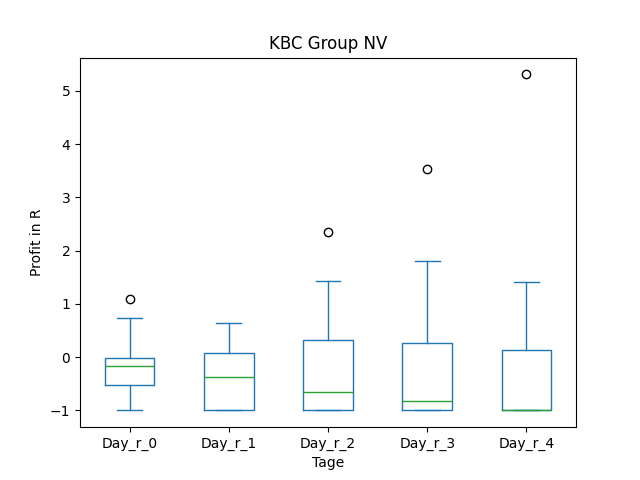
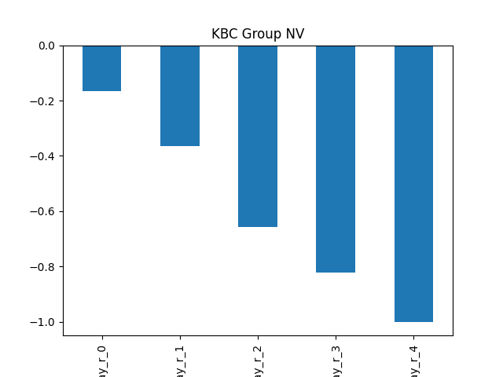

### Mit Filter
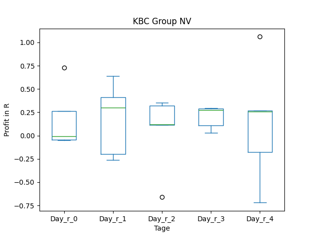
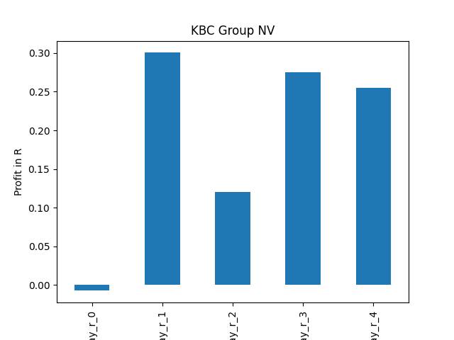

## ISNPY

### Erwartung in R
|      |   Day_r_0 |   Day_r_1 |   Day_r_2 |   Day_r_3 |   Day_r_4 |   Treffer |
|:-----|----------:|----------:|----------:|----------:|----------:|----------:|
| ohne |         0 |        -0 |       0   |      -0   |       0.1 |        21 |
| mit  |         0 |        -0 |       0.2 |       0.1 |       0.2 |        17 |

### Ohne Filter
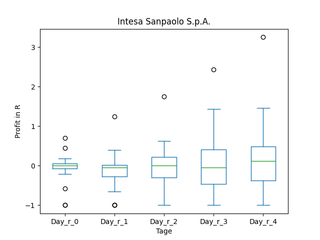
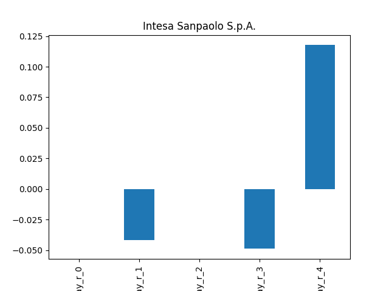

### Mit Filter
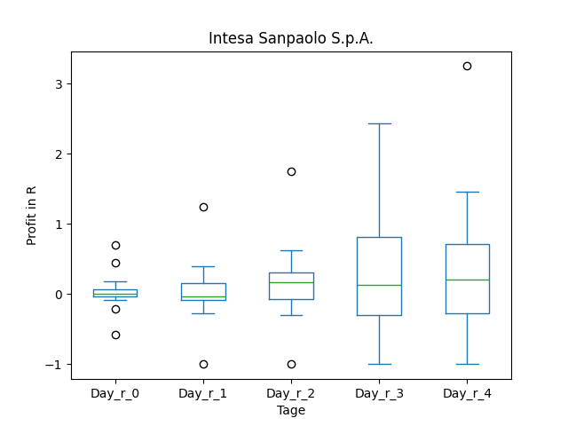
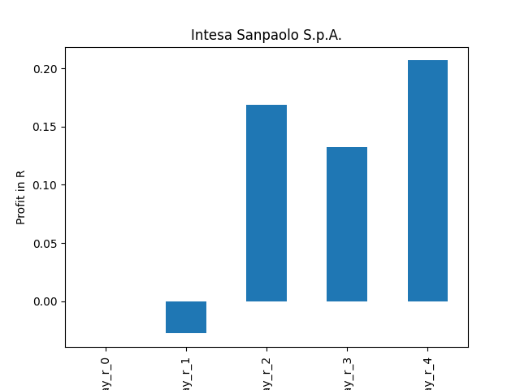

## BMPSY

### Erwartung in R
|      |   Day_r_0 |   Day_r_1 |   Day_r_2 |   Day_r_3 |   Day_r_4 |   Treffer |
|:-----|----------:|----------:|----------:|----------:|----------:|----------:|
| ohne |       nan |       nan |       nan |       nan |       nan |         0 |
| mit  |       nan |       nan |       nan |       nan |       nan |         0 |

### Ohne Filter

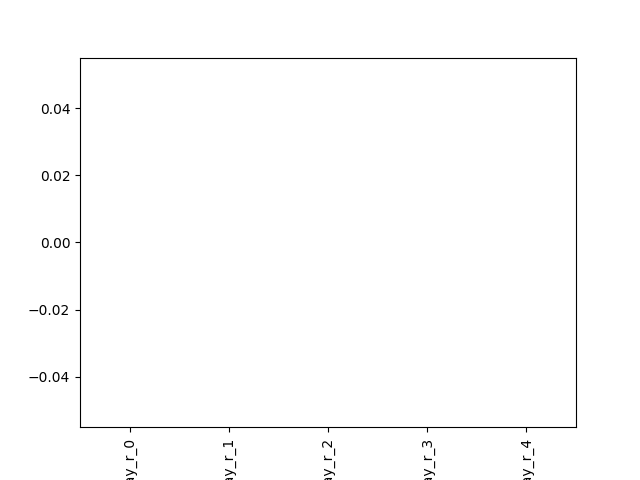

### Mit Filter

## ARZGY

### Erwartung in R
|      |   Day_r_0 |   Day_r_1 |   Day_r_2 |   Day_r_3 |   Day_r_4 |   Treffer |
|:-----|----------:|----------:|----------:|----------:|----------:|----------:|
| ohne |      -0.6 |      -0.8 |      -0.9 |        -1 |        -1 |        16 |
| mit  |      -1   |      -1   |      -1   |        -1 |        -1 |         1 |

### Ohne Filter
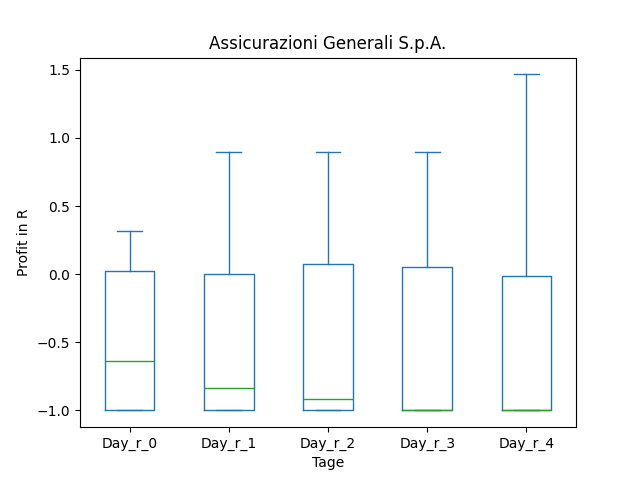
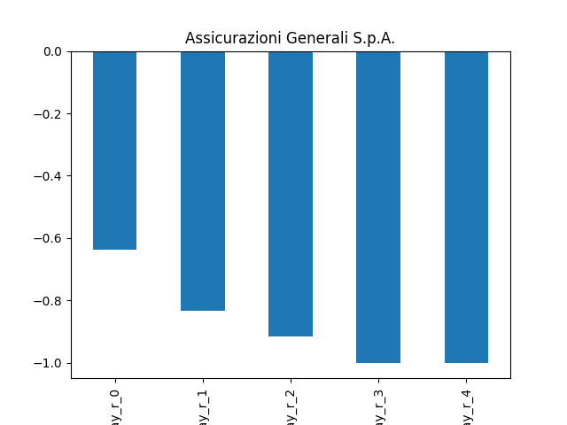

### Mit Filter
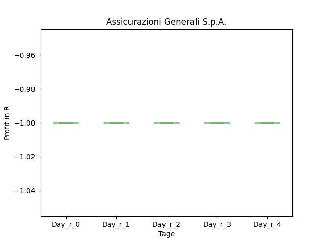
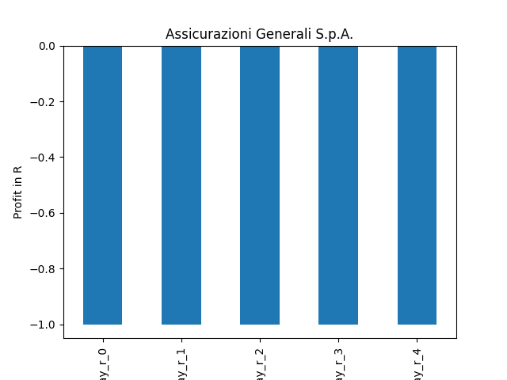

