# dividend-shorter

bet on falling prices on payday **2026-04-21**.

## Signale

| Ticker   |   Divid Rate |   Close |          Volume |   last_close_volume |   Divid % | 5_Days_pos   | above_SMA_50   |
|:---------|-------------:|--------:|----------------:|--------------------:|----------:|:-------------|:---------------|
| SEVN     |         0.28 |    8.47 | 262600          |             2224222 |      3.31 | False        | False          |
| RMR      |         0.45 |   17.06 | 364200          |             6213252 |      2.64 | True         | True           |
| NSRGY    |         4.01 |  101.35 | 285000          |            28884750 |      3.95 | False        | True           |
| MDIBY    |         0.73 |   24.05 |   4700          |              113035 |      3.04 | True         | True           |
| BVN      |         0.99 |   35.08 |      1.2578e+06 |            44123624 |      2.82 | False        | False          |
| AHEXY    |         0.65 |   12.53 |   9100          |              114023 |      5.16 | True         | False          |

## SEVN

### Erwartung in R
|      |   Day_r_0 |   Day_r_1 |   Day_r_2 |   Day_r_3 |   Day_r_4 |   Treffer |
|:-----|----------:|----------:|----------:|----------:|----------:|----------:|
| ohne |       0.1 |       0.4 |       0.7 |       0.7 |       0.6 |        17 |
| mit  |       0.3 |       0.9 |       1   |       0.9 |       0.8 |         2 |

### Ohne Filter
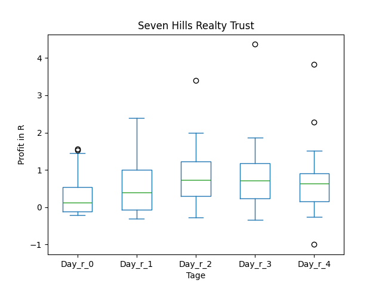
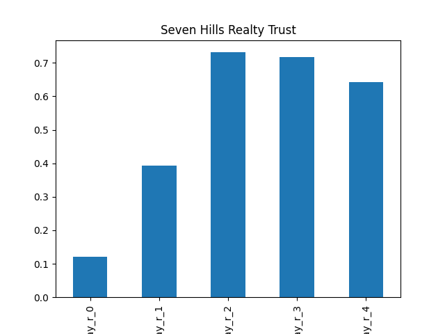

### Mit Filter
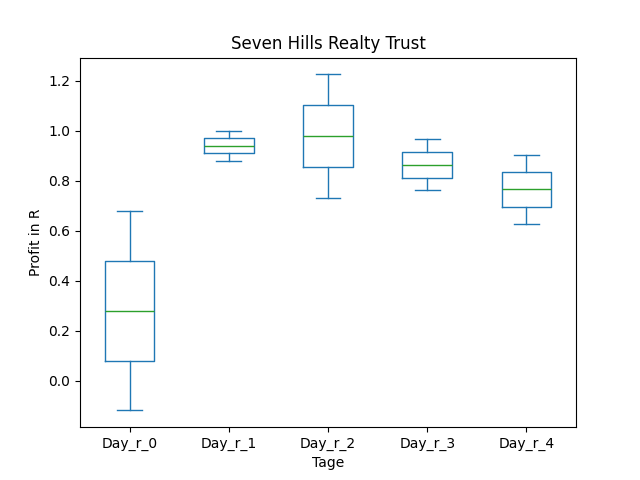
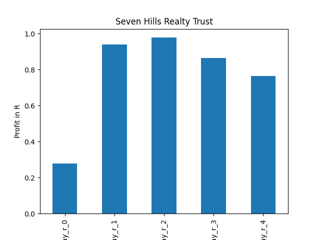

## RMR

### Erwartung in R
|      |   Day_r_0 |   Day_r_1 |   Day_r_2 |   Day_r_3 |   Day_r_4 |   Treffer |
|:-----|----------:|----------:|----------:|----------:|----------:|----------:|
| ohne |       0.2 |      -0.1 |       0.1 |       0.1 |      -0.4 |        42 |
| mit  |       0.2 |       0.3 |       0.5 |       0.4 |       0   |         4 |

### Ohne Filter
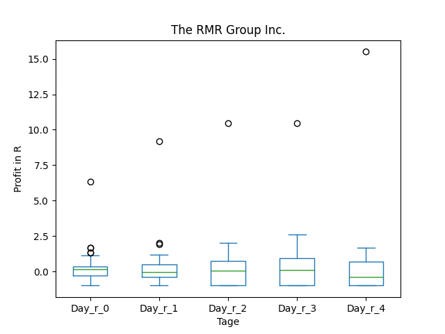
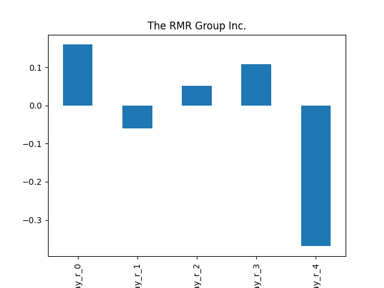

### Mit Filter
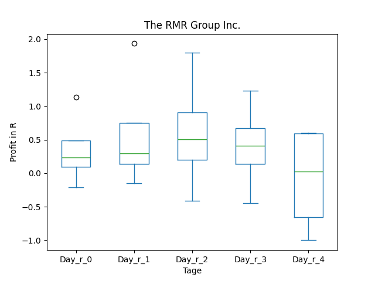
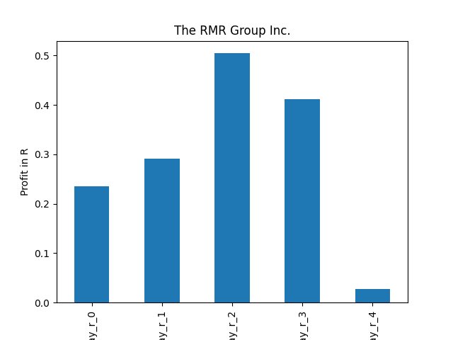

## NSRGY

### Erwartung in R
|      |   Day_r_0 |   Day_r_1 |   Day_r_2 |   Day_r_3 |   Day_r_4 |   Treffer |
|:-----|----------:|----------:|----------:|----------:|----------:|----------:|
| ohne |        -0 |      -0.1 |      -0.2 |         0 |      -0.1 |        19 |
| mit  |         0 |      -0.1 |      -0.2 |         0 |      -0.1 |        14 |

### Ohne Filter
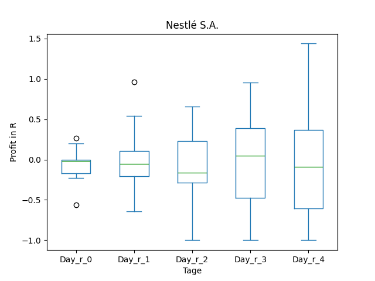
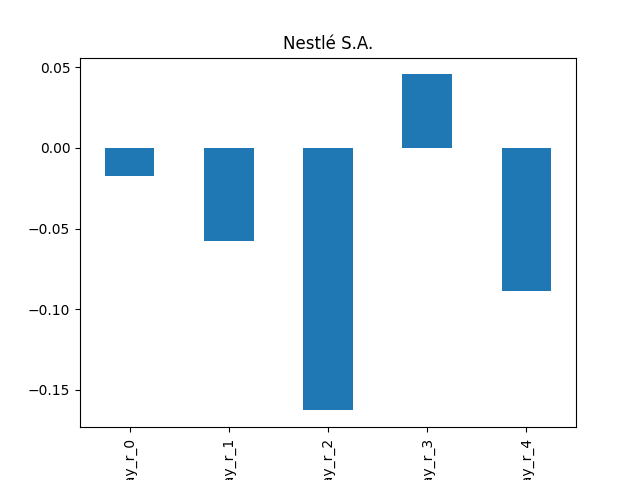

### Mit Filter
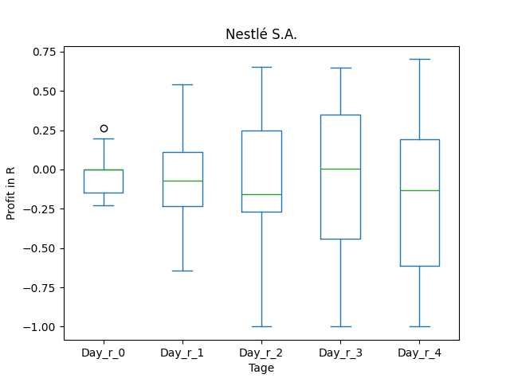
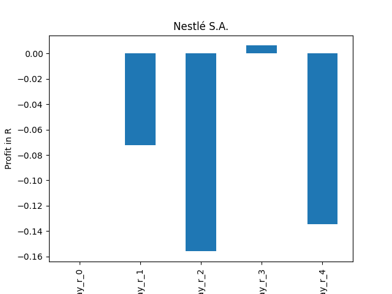

## MDIBY

### Erwartung in R
|      |   Day_r_0 |   Day_r_1 |   Day_r_2 |   Day_r_3 |   Day_r_4 |   Treffer |
|:-----|----------:|----------:|----------:|----------:|----------:|----------:|
| ohne |       0   |       0.1 |       0.1 |       0.1 |       0.1 |         9 |
| mit  |       0.3 |       0.9 |       0.7 |       0.5 |      -0.3 |         1 |

### Ohne Filter
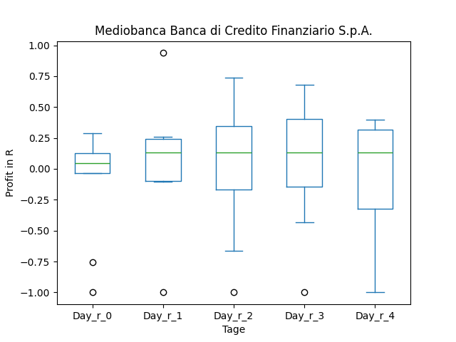
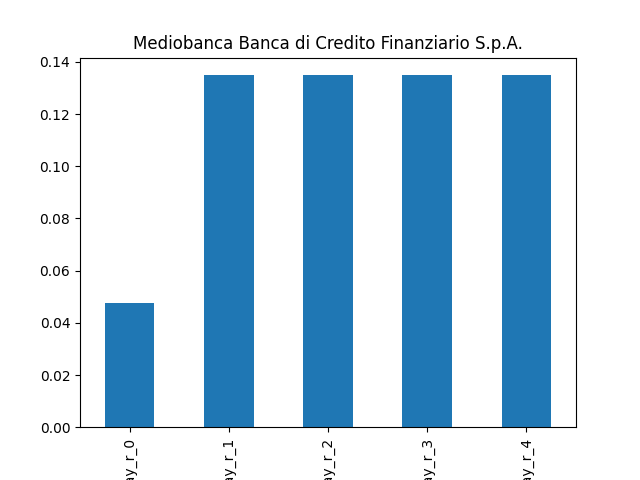

### Mit Filter
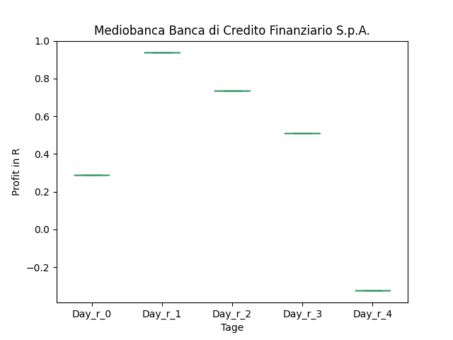
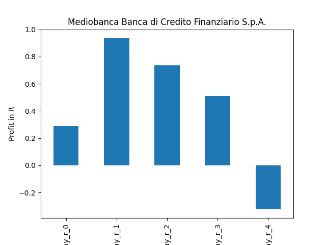

## BVN

### Erwartung in R
|      |   Day_r_0 |   Day_r_1 |   Day_r_2 |   Day_r_3 |   Day_r_4 |   Treffer |
|:-----|----------:|----------:|----------:|----------:|----------:|----------:|
| ohne |       0   |      -0.5 |      -0.2 |      -0.8 |      -0.8 |        38 |
| mit  |       0.1 |       0.5 |      -0   |      -0.3 |       0   |         1 |

### Ohne Filter
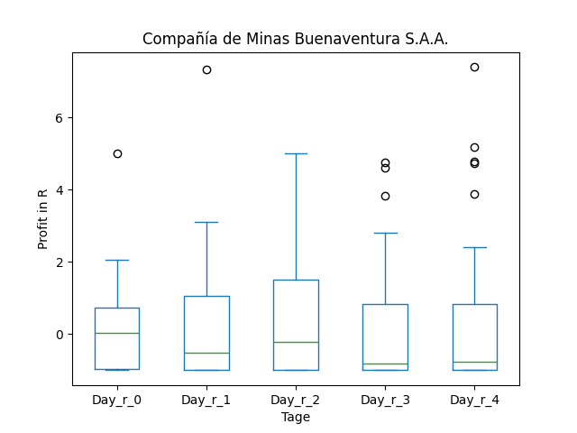
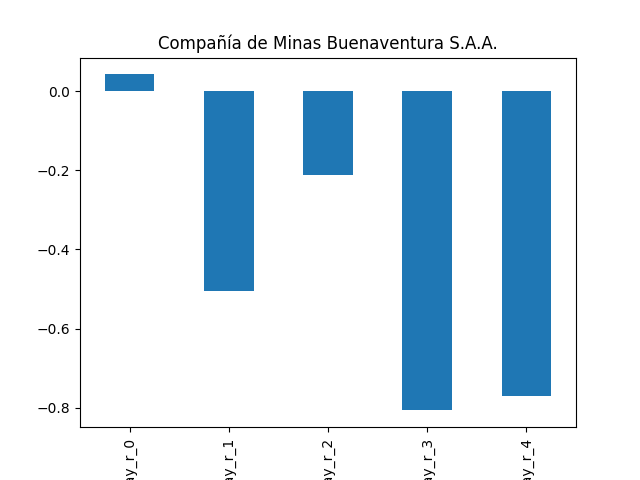

### Mit Filter
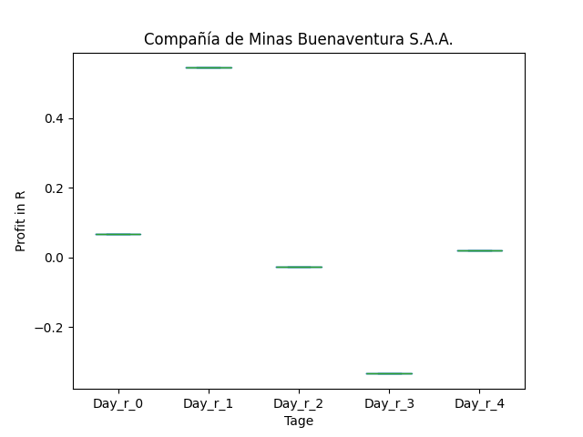
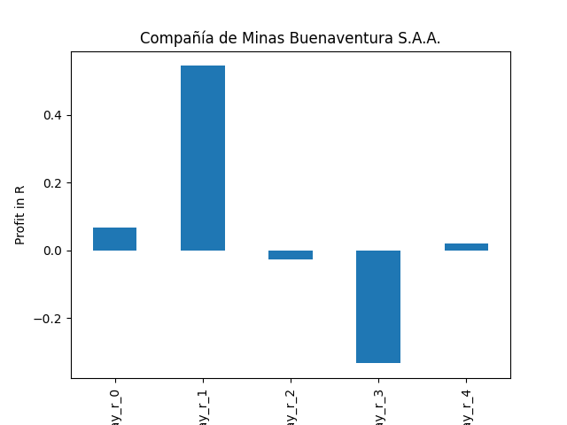

## AHEXY

### Erwartung in R
|      |   Day_r_0 |   Day_r_1 |   Day_r_2 |   Day_r_3 |   Day_r_4 |   Treffer |
|:-----|----------:|----------:|----------:|----------:|----------:|----------:|
| ohne |      -0.1 |      -0.1 |      -0.2 |      -0.1 |      -0.3 |        15 |
| mit  |      -0   |      -0.2 |      -0.2 |      -0.1 |      -0.4 |         3 |

### Ohne Filter
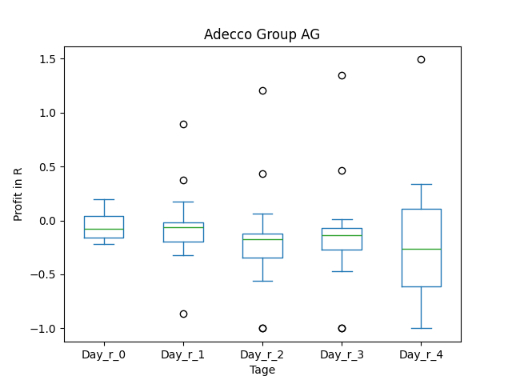
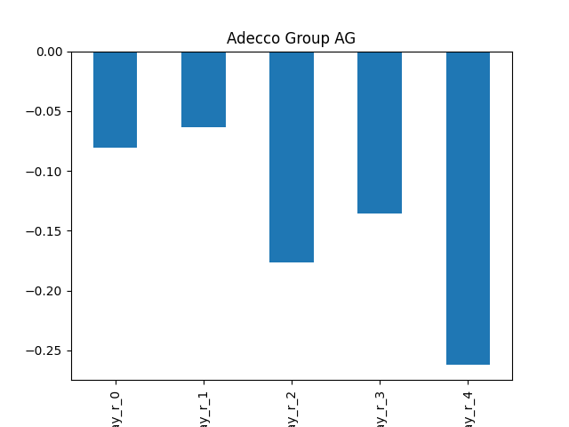

### Mit Filter
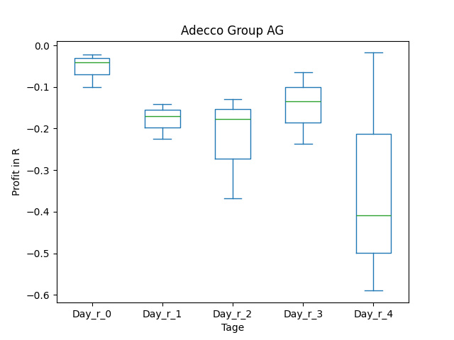
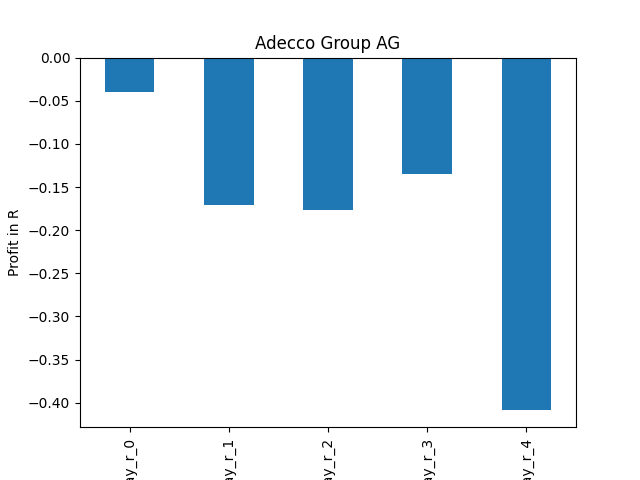

