# dividend-shorter

bet on falling prices on payday **2026-04-13**.

## Signale

| Ticker   |   Divid Rate |   Close |          Volume |   last_close_volume |   Divid % | 5_Days_pos   | above_SMA_50   |
|:---------|-------------:|--------:|----------------:|--------------------:|----------:|:-------------|:---------------|
| ZURVY    |         1.9  |   36.53 | 147400          |             5384522 |      5.21 | True         | True           |
| UPMMY    |         0.88 |   32.03 |   8400          |              269052 |      2.76 | True         | True           |
| KEN      |         3.85 |   88.17 |  32200          |             2839074 |      4.37 | True         | True           |
| BRBS     |         0.6  |    4.18 |      2.2788e+06 |             9525384 |     14.35 | True         | True           |
| BDCX     |         1.03 |   20.66 |   5100          |              105366 |      4.99 | False        | False          |

## ZURVY

### Erwartung in R
|      |   Day_r_0 |   Day_r_1 |   Day_r_2 |   Day_r_3 |   Day_r_4 |   Treffer |
|:-----|----------:|----------:|----------:|----------:|----------:|----------:|
| ohne |         0 |         0 |       0.1 |       0   |       0.1 |        18 |
| mit  |         0 |         0 |       0.1 |       0.2 |       0.1 |        16 |

### Ohne Filter
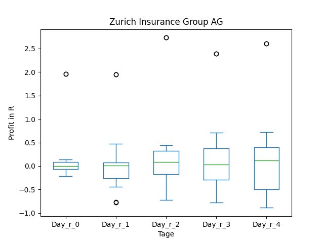
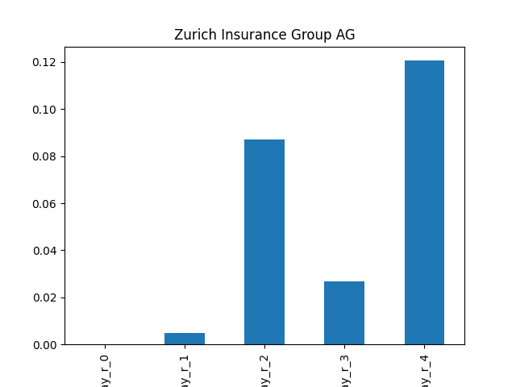

### Mit Filter
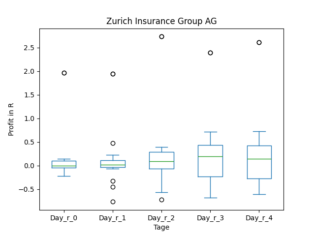
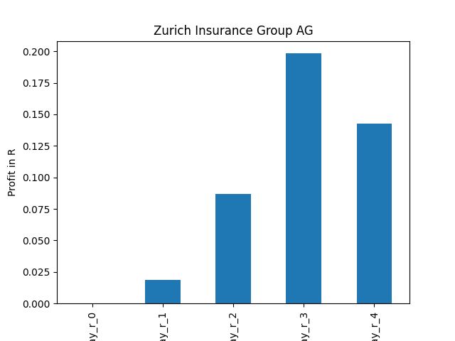

## UPMMY

### Erwartung in R
|      |   Day_r_0 |   Day_r_1 |   Day_r_2 |   Day_r_3 |   Day_r_4 |   Treffer |
|:-----|----------:|----------:|----------:|----------:|----------:|----------:|
| ohne |        -0 |       0.1 |      -0   |      -0.2 |      -0.1 |         9 |
| mit  |        -0 |       0.1 |       0.3 |       0.2 |       0.2 |         3 |

### Ohne Filter
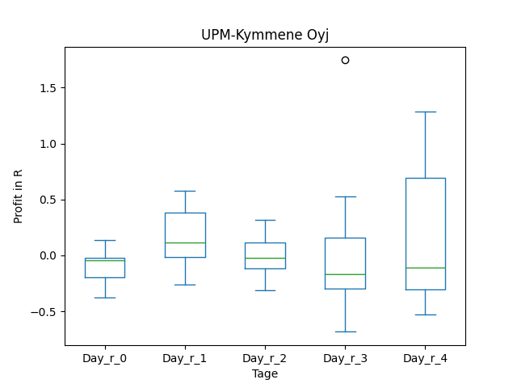
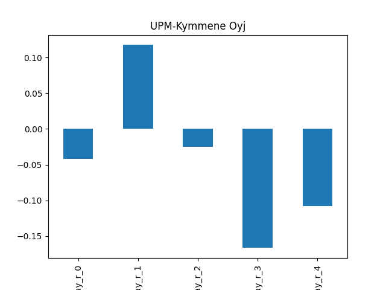

### Mit Filter
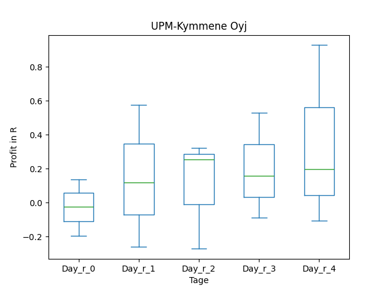
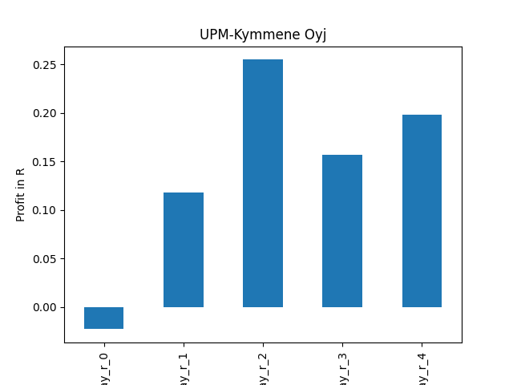

## KEN

### Erwartung in R
|      |   Day_r_0 |   Day_r_1 |   Day_r_2 |   Day_r_3 |   Day_r_4 |   Treffer |
|:-----|----------:|----------:|----------:|----------:|----------:|----------:|
| ohne |       0.1 |       0.2 |       0.3 |       0.2 |       0.2 |         9 |
| mit  |       0.1 |       0.3 |       0.3 |       0.5 |       0.5 |         4 |

### Ohne Filter
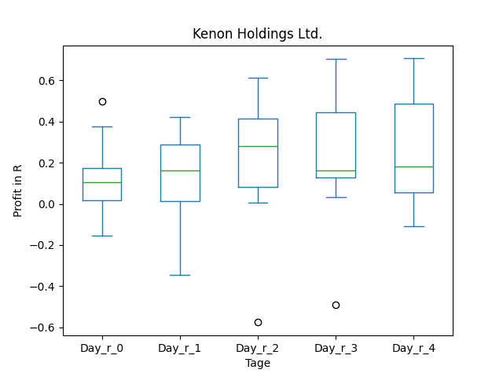
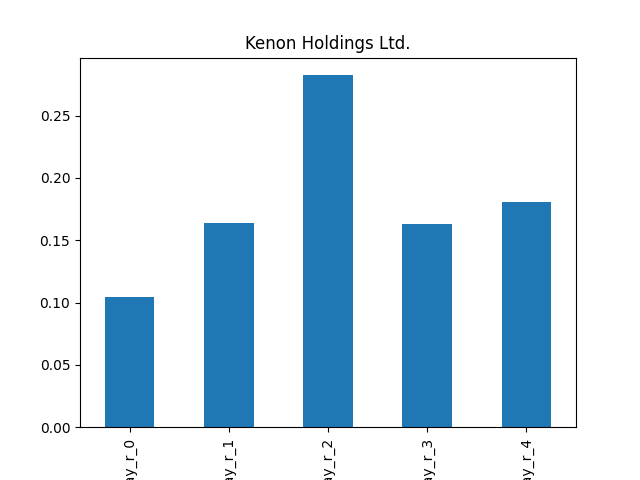

### Mit Filter
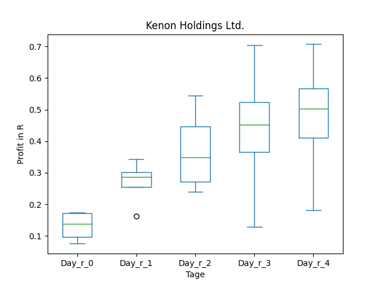
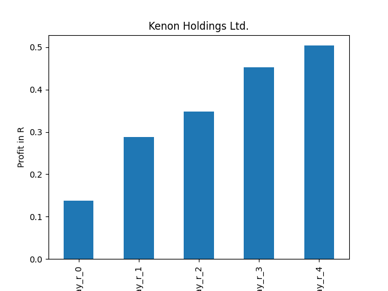

## BRBS

### Erwartung in R
|      |   Day_r_0 |   Day_r_1 |   Day_r_2 |   Day_r_3 |   Day_r_4 |   Treffer |
|:-----|----------:|----------:|----------:|----------:|----------:|----------:|
| ohne |      -0.4 |      -1   |      -1   |      -1   |      -1   |        40 |
| mit  |      -0.1 |       0.2 |       0.1 |       0.2 |       0.4 |         1 |

### Ohne Filter
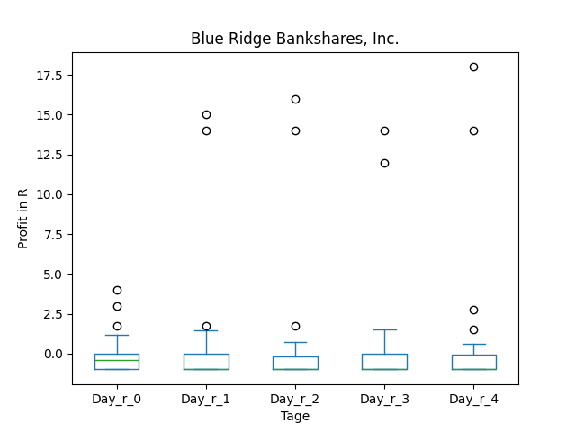
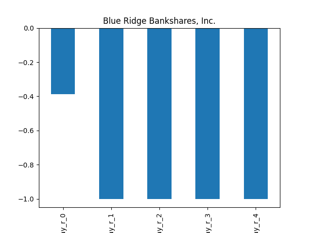

### Mit Filter
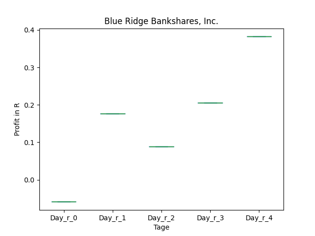
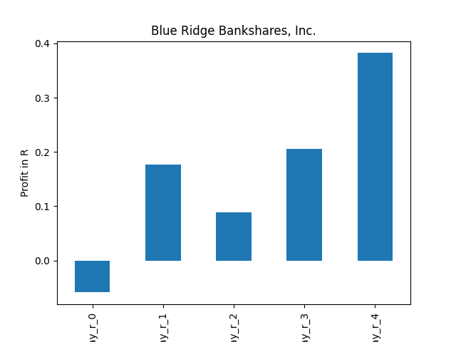

## BDCX

### Erwartung in R
|      |   Day_r_0 |   Day_r_1 |   Day_r_2 |   Day_r_3 |   Day_r_4 |   Treffer |
|:-----|----------:|----------:|----------:|----------:|----------:|----------:|
| ohne |        -0 |       0.1 |      -0.2 |      -0.1 |      -0.1 |        23 |
| mit  |       nan |     nan   |     nan   |     nan   |     nan   |         0 |

### Ohne Filter
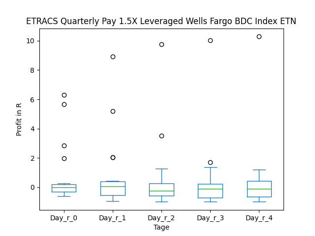
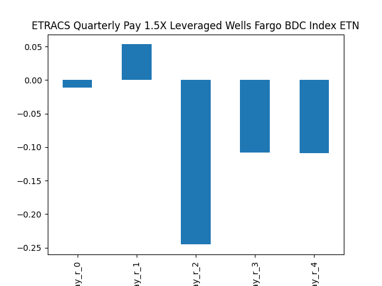

### Mit Filter
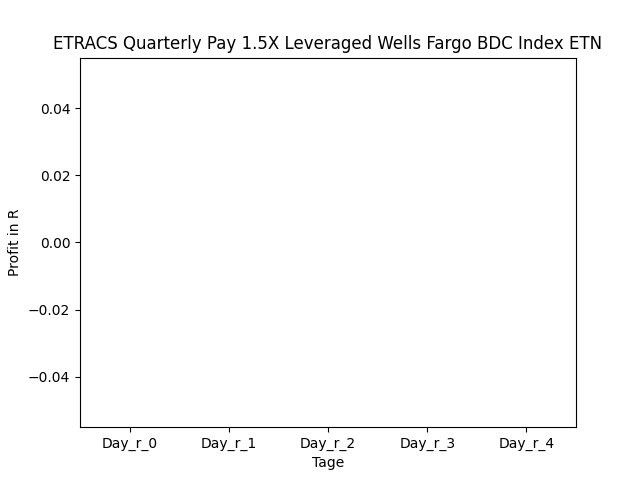
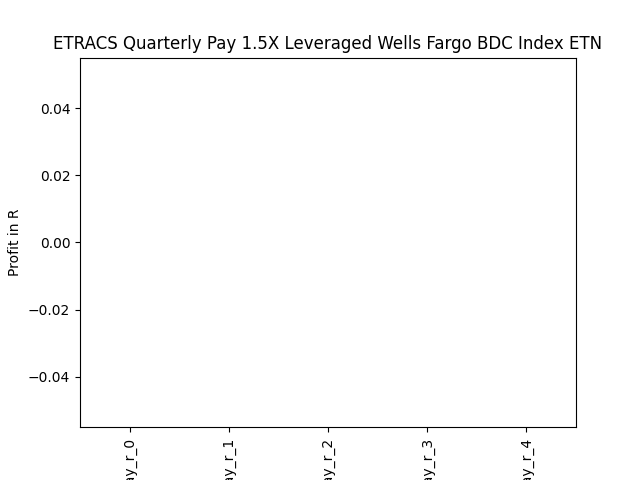

