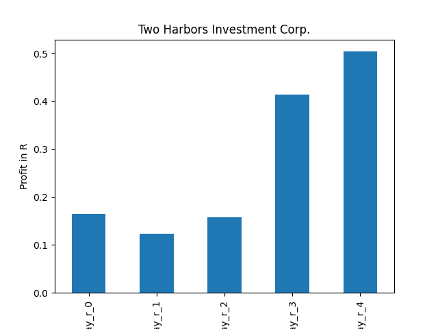

# dividend-shorter

bet on falling prices on payday **2025-01-03**.

## Signale

| Ticker   |   Divid Rate |   Close |          Volume |   last_close_volume |   Divid % | 5_Days_pos   | above_SMA_50   |
|:---------|-------------:|--------:|----------------:|--------------------:|----------:|:-------------|:---------------|
| TWO      |         0.45 |   11.99 |      2.0105e+06 |            24105895 |      3.75 | True         | True           |
| PLTY     |         3.59 |   70.45 | 264300          |            18619935 |      5.09 | False        | True           |
| ORI      |         2    |   36.03 |      1.1315e+06 |            40767945 |      5.55 | False        | False          |
| NVDY     |         0.9  |   23.9  |      3.2223e+06 |            77012970 |      3.76 | False        | False          |
| MRNY     |         0.25 |    5.3  | 989100          |             5242230 |      4.73 | True         | False          |
| MARO     |         2.5  |   38.78 | 179900          |             6976522 |      6.43 | False        | False          |
| IDCBY    |         0.39 |   12.71 |  38200          |              485522 |      3.1  | False        | True           |
| DIPS     |         0.51 |   12.96 | 101900          |             1320624 |      3.9  | True         | False          |
| CICHY    |         0.54 |   16.02 |  38000          |              608760 |      3.38 | False        | True           |
| CDZIP    |         0.56 |   17.9  |  69500          |             1244050 |      3.13 | True         | True           |
| BABO     |         0.45 |   17.2  |  36000          |              619200 |      2.59 | False        | False          |
| ACGBY    |         0.4  |   13.78 |  15400          |              212212 |      2.9  | False        | True           |

## TWO

### Erwartung in R
|      |   Day_r_0 |   Day_r_1 |   Day_r_2 |   Day_r_3 |   Day_r_4 |   Treffer |
|:-----|----------:|----------:|----------:|----------:|----------:|----------:|
| ohne |       0   |       0.1 |       0   |       0   |       0   |        61 |
| mit  |       0.2 |       0.1 |       0.1 |       0.2 |       0.2 |         8 |

### Ohne Filter

### Mit Filter

## PLTY

### Erwartung in R
|      |   Day_r_0 |   Day_r_1 |   Day_r_2 |   Day_r_3 |   Day_r_4 |   Treffer |
|:-----|----------:|----------:|----------:|----------:|----------:|----------:|
| ohne |      -0.3 |      -0.9 |        -1 |        -1 |        -1 |         2 |
| mit  |      -0.3 |      -0.9 |        -1 |        -1 |        -1 |         2 |

### Ohne Filter

### Mit Filter

## ORI

### Erwartung in R
|      |   Day_r_0 |   Day_r_1 |   Day_r_2 |   Day_r_3 |   Day_r_4 |   Treffer |
|:-----|----------:|----------:|----------:|----------:|----------:|----------:|
| ohne |      -0.1 |       0.1 |       0.1 |      -0.3 |      -0.2 |        91 |
| mit  |       0.3 |       0.3 |       0.3 |       0.5 |       0.2 |         7 |

### Ohne Filter

### Mit Filter

## NVDY

### Erwartung in R
|      |   Day_r_0 |   Day_r_1 |   Day_r_2 |   Day_r_3 |   Day_r_4 |   Treffer |
|:-----|----------:|----------:|----------:|----------:|----------:|----------:|
| ohne |        -0 |      -0.1 |      -0.2 |      -0.2 |      -0.4 |        19 |
| mit  |        -0 |      -0.1 |      -0.1 |      -0.1 |      -0.4 |        16 |

### Ohne Filter

### Mit Filter

## MRNY

### Erwartung in R
|      |   Day_r_0 |   Day_r_1 |   Day_r_2 |   Day_r_3 |   Day_r_4 |   Treffer |
|:-----|----------:|----------:|----------:|----------:|----------:|----------:|
| ohne |         0 |       0.1 |      -0   |       0.1 |       0.1 |        13 |
| mit  |         0 |       0.2 |       0.3 |       0.4 |       0.3 |         5 |

### Ohne Filter

### Mit Filter

## MARO

### Erwartung in R
|      |   Day_r_0 |   Day_r_1 |   Day_r_2 |   Day_r_3 |   Day_r_4 |   Treffer |
|:-----|----------:|----------:|----------:|----------:|----------:|----------:|
| ohne |       nan |       nan |       nan |       nan |       nan |         0 |
| mit  |       nan |       nan |       nan |       nan |       nan |         0 |

### Ohne Filter

### Mit Filter

## IDCBY

### Erwartung in R
|      |   Day_r_0 |   Day_r_1 |   Day_r_2 |   Day_r_3 |   Day_r_4 |   Treffer |
|:-----|----------:|----------:|----------:|----------:|----------:|----------:|
| ohne |       0.6 |       0.5 |       0.8 |       0.7 |       0.7 |        13 |
| mit  |       0.6 |       0.5 |       0.8 |       0.6 |       0.6 |         7 |

### Ohne Filter

### Mit Filter

## DIPS

### Erwartung in R
|      |   Day_r_0 |   Day_r_1 |   Day_r_2 |   Day_r_3 |   Day_r_4 |   Treffer |
|:-----|----------:|----------:|----------:|----------:|----------:|----------:|
| ohne |       0.1 |      -0.1 |      -0   |      -0.1 |         0 |         4 |
| mit  |       0.1 |       0.1 |       0.2 |      -0.1 |         0 |         2 |

### Ohne Filter

### Mit Filter

## CICHY

### Erwartung in R
|      |   Day_r_0 |   Day_r_1 |   Day_r_2 |   Day_r_3 |   Day_r_4 |   Treffer |
|:-----|----------:|----------:|----------:|----------:|----------:|----------:|
| ohne |       0.3 |       0.2 |       0.1 |       0.1 |       0   |        13 |
| mit  |       0.3 |      -0.2 |      -0.1 |      -0.2 |      -0.3 |         7 |

### Ohne Filter

### Mit Filter

## CDZIP

### Erwartung in R
|      |   Day_r_0 |   Day_r_1 |   Day_r_2 |   Day_r_3 |   Day_r_4 |   Treffer |
|:-----|----------:|----------:|----------:|----------:|----------:|----------:|
| ohne |        -0 |       0.7 |       0.5 |       0.3 |       0.1 |        13 |
| mit  |       nan |     nan   |     nan   |     nan   |     nan   |         0 |

### Ohne Filter

### Mit Filter

## BABO

### Erwartung in R
|      |   Day_r_0 |   Day_r_1 |   Day_r_2 |   Day_r_3 |   Day_r_4 |   Treffer |
|:-----|----------:|----------:|----------:|----------:|----------:|----------:|
| ohne |       0.1 |         0 |      -0.1 |       0.2 |       0.1 |         4 |
| mit  |       0   |        -0 |       0.2 |       1.1 |       1   |         3 |

### Ohne Filter

### Mit Filter

## ACGBY

### Erwartung in R
|      |   Day_r_0 |   Day_r_1 |   Day_r_2 |   Day_r_3 |   Day_r_4 |   Treffer |
|:-----|----------:|----------:|----------:|----------:|----------:|----------:|
| ohne |       0.2 |       0.2 |       0.4 |       0.6 |       0.5 |        14 |
| mit  |       1.7 |       3.3 |       2.7 |       4.7 |       6.5 |         1 |

### Ohne Filter

### Mit Filter

