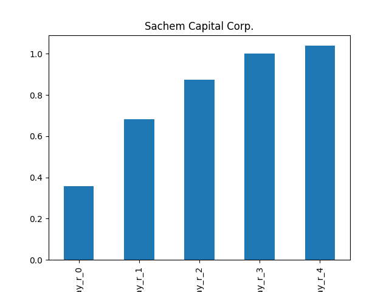
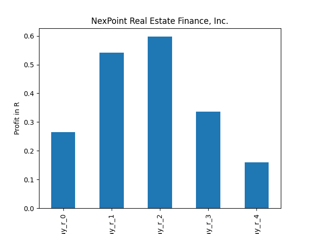
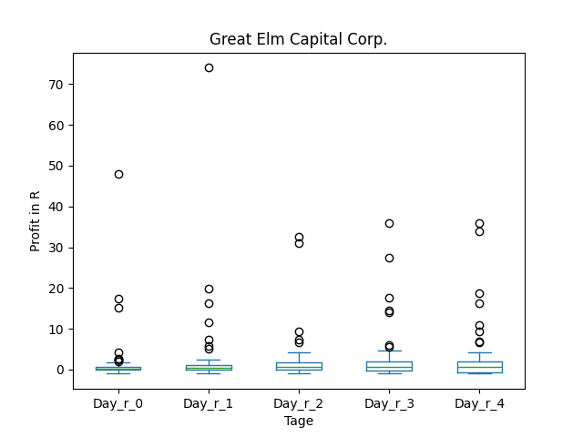
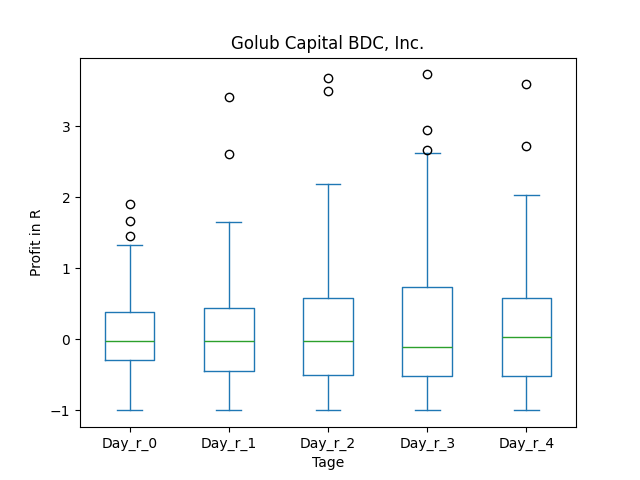

# dividend-shorter

bet on falling prices on payday **2025-09-15**.

## Signale

| Ticker   |   Divid Rate |   Close |          Volume |   last_close_volume |   Divid % | 5_Days_pos   | above_SMA_50   |
|:---------|-------------:|--------:|----------------:|--------------------:|----------:|:-------------|:---------------|
| STRD     |         3.06 |   82.19 | 170600          |            14021614 |      3.72 | True         | False          |
| SACH     |         0.05 |    1.31 | 431900          |              565789 |      3.82 | True         | True           |
| OCSL     |         0.4  |   13.79 | 914000          |            12604060 |      2.9  | False        | False          |
| NREF     |         0.5  |   15.33 |  67300          |             1031709 |      3.26 | True         | True           |
| MBNKO    |         0.81 |   26.1  |  17800          |              464580 |      3.09 | True         | True           |
| GECC     |         0.37 |   11.29 | 120100          |             1355929 |      3.28 | False        | True           |
| GBDC     |         0.39 |   14.76 |      1.3402e+06 |            19781352 |      2.64 | False        | False          |
| BRIA     |         0.13 |    2.55 | 617500          |             1574625 |      5.22 | True         | True           |

## STRD

### Erwartung in R
|      |   Day_r_0 |   Day_r_1 |   Day_r_2 |   Day_r_3 |   Day_r_4 |   Treffer |
|:-----|----------:|----------:|----------:|----------:|----------:|----------:|
| ohne |       nan |       nan |       nan |       nan |       nan |         0 |
| mit  |       nan |       nan |       nan |       nan |       nan |         0 |

### Ohne Filter

### Mit Filter

## SACH

### Erwartung in R
|      |   Day_r_0 |   Day_r_1 |   Day_r_2 |   Day_r_3 |   Day_r_4 |   Treffer |
|:-----|----------:|----------:|----------:|----------:|----------:|----------:|
| ohne |       0.4 |       0.7 |       0.9 |       1   |       1   |        32 |
| mit  |       0.8 |       1.1 |       1.3 |       1.3 |       1.1 |         7 |

### Ohne Filter

### Mit Filter

## OCSL

### Erwartung in R
|      |   Day_r_0 |   Day_r_1 |   Day_r_2 |   Day_r_3 |   Day_r_4 |   Treffer |
|:-----|----------:|----------:|----------:|----------:|----------:|----------:|
| ohne |       0.1 |       0.1 |       0.2 |       0.2 |       0.1 |        99 |
| mit  |       0.1 |       0.1 |       0.2 |       0.2 |       0.3 |         6 |

### Ohne Filter

### Mit Filter

## NREF

### Erwartung in R
|      |   Day_r_0 |   Day_r_1 |   Day_r_2 |   Day_r_3 |   Day_r_4 |   Treffer |
|:-----|----------:|----------:|----------:|----------:|----------:|----------:|
| ohne |       0.2 |       0.5 |       0.6 |       0.5 |       1   |        26 |
| mit  |       0.3 |       0.5 |       0.6 |       0.3 |       0.2 |         5 |

### Ohne Filter

### Mit Filter

## MBNKO

### Erwartung in R
|      |   Day_r_0 |   Day_r_1 |   Day_r_2 |   Day_r_3 |   Day_r_4 |   Treffer |
|:-----|----------:|----------:|----------:|----------:|----------:|----------:|
| ohne |       nan |       nan |       nan |       nan |       nan |         0 |
| mit  |       nan |       nan |       nan |       nan |       nan |         0 |

### Ohne Filter

### Mit Filter

## GECC

### Erwartung in R
|      |   Day_r_0 |   Day_r_1 |   Day_r_2 |   Day_r_3 |   Day_r_4 |   Treffer |
|:-----|----------:|----------:|----------:|----------:|----------:|----------:|
| ohne |       0.2 |       0.4 |       0.7 |       0.6 |       0.6 |        70 |
| mit  |     nan   |     nan   |     nan   |     nan   |     nan   |         0 |

### Ohne Filter

### Mit Filter

## GBDC

### Erwartung in R
|      |   Day_r_0 |   Day_r_1 |   Day_r_2 |   Day_r_3 |   Day_r_4 |   Treffer |
|:-----|----------:|----------:|----------:|----------:|----------:|----------:|
| ohne |        -0 |        -0 |        -0 |      -0.1 |         0 |        73 |
| mit  |       nan |       nan |       nan |     nan   |       nan |         0 |

### Ohne Filter

### Mit Filter

## BRIA

### Erwartung in R
|      |   Day_r_0 |   Day_r_1 |   Day_r_2 |   Day_r_3 |   Day_r_4 |   Treffer |
|:-----|----------:|----------:|----------:|----------:|----------:|----------:|
| ohne |       nan |       nan |       nan |       nan |       nan |         0 |
| mit  |       nan |       nan |       nan |       nan |       nan |         0 |

### Ohne Filter

### Mit Filter

