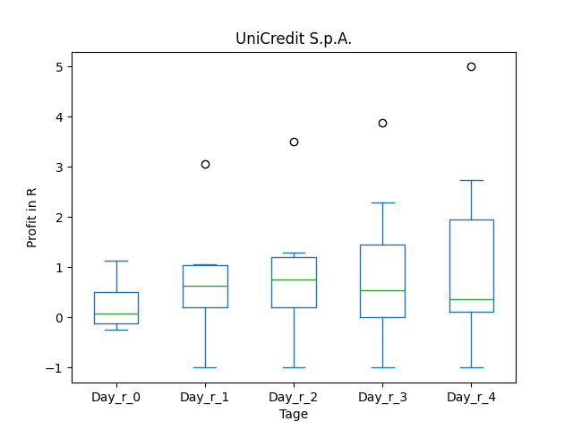
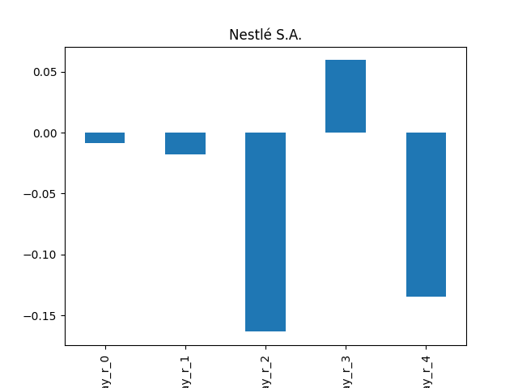
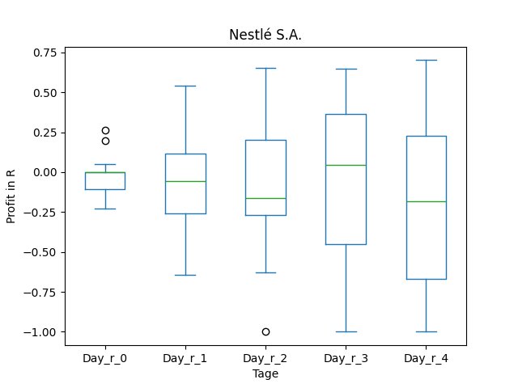
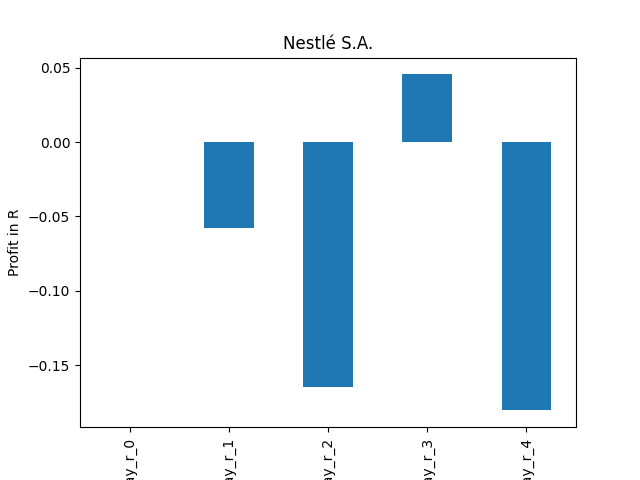
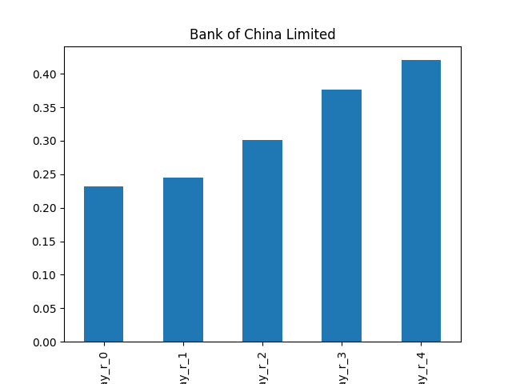
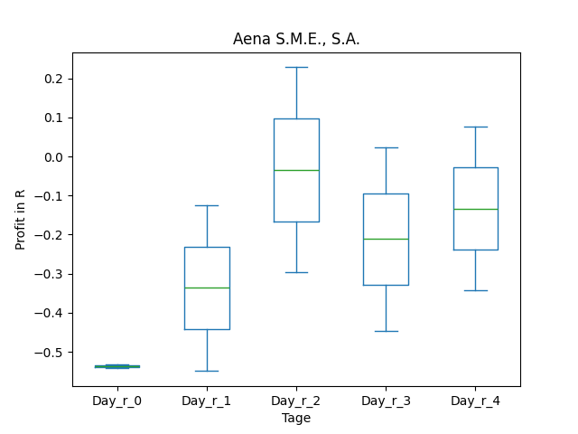
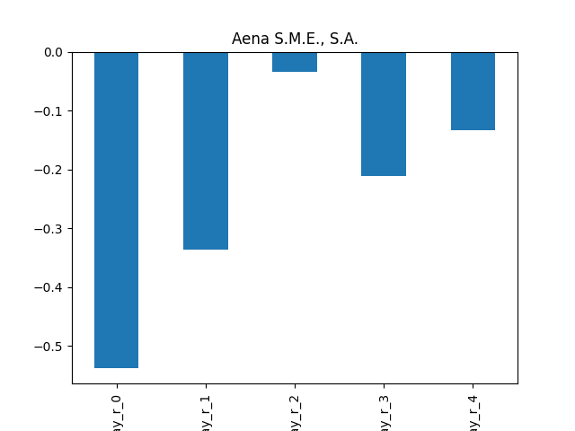

# dividend-shorter

bet on falling prices on payday **2025-04-23**.

## Signale

| Ticker   |   Divid Rate |   Close |   Volume |   last_close_volume |   Divid % | 5_Days_pos   | above_SMA_50   |
|:---------|-------------:|--------:|---------:|--------------------:|----------:|:-------------|:---------------|
| UNCRY    |         0.82 |   28.81 |   328000 |             9449680 |      2.84 | True         | True           |
| NSRGY    |         3.4  |  108.84 |   382600 |            41642184 |      3.12 | True         | True           |
| CAIXY    |         0.1  |    2.54 |   259400 |              658876 |      4.13 | False        | True           |
| BSAC     |         1.35 |   24.84 |   617500 |            15338700 |      5.43 | True         | True           |
| BACHY    |         0.42 |   14.39 |    79000 |             1136810 |      2.91 | True         | True           |
| ANYYY    |         1.02 |   25.45 |     9700 |              246865 |      4.02 | True         | True           |

## UNCRY

### Erwartung in R
|      |   Day_r_0 |   Day_r_1 |   Day_r_2 |   Day_r_3 |   Day_r_4 |   Treffer |
|:-----|----------:|----------:|----------:|----------:|----------:|----------:|
| ohne |       0.1 |       0.6 |       0.8 |       0.5 |       0.4 |         7 |
| mit  |      -0   |       1   |       1.1 |       0.1 |       1.2 |         3 |

### Ohne Filter

### Mit Filter

## NSRGY

### Erwartung in R
|      |   Day_r_0 |   Day_r_1 |   Day_r_2 |   Day_r_3 |   Day_r_4 |   Treffer |
|:-----|----------:|----------:|----------:|----------:|----------:|----------:|
| ohne |        -0 |      -0   |      -0.2 |       0.1 |      -0.1 |        18 |
| mit  |         0 |      -0.1 |      -0.2 |       0   |      -0.2 |        13 |

### Ohne Filter

### Mit Filter

## CAIXY

### Erwartung in R
|      |   Day_r_0 |   Day_r_1 |   Day_r_2 |   Day_r_3 |   Day_r_4 |   Treffer |
|:-----|----------:|----------:|----------:|----------:|----------:|----------:|
| ohne |         0 |      -0.2 |      -0.2 |      -0.4 |      -0.6 |        23 |
| mit  |       nan |     nan   |     nan   |     nan   |     nan   |         0 |

### Ohne Filter

### Mit Filter

## BSAC

### Erwartung in R
|      |   Day_r_0 |   Day_r_1 |   Day_r_2 |   Day_r_3 |   Day_r_4 |   Treffer |
|:-----|----------:|----------:|----------:|----------:|----------:|----------:|
| ohne |       0.1 |       0.1 |         0 |       0   |      -0.1 |        23 |
| mit  |       0.1 |       0.1 |         0 |       0.1 |      -0.1 |        22 |

### Ohne Filter

### Mit Filter

## BACHY

### Erwartung in R
|      |   Day_r_0 |   Day_r_1 |   Day_r_2 |   Day_r_3 |   Day_r_4 |   Treffer |
|:-----|----------:|----------:|----------:|----------:|----------:|----------:|
| ohne |       0.2 |       0.2 |       0.3 |       0.4 |       0.4 |        15 |
| mit  |      -0.3 |      -1   |      -1   |      -1   |      -1   |         1 |

### Ohne Filter

### Mit Filter

## ANYYY

### Erwartung in R
|      |   Day_r_0 |   Day_r_1 |   Day_r_2 |   Day_r_3 |   Day_r_4 |   Treffer |
|:-----|----------:|----------:|----------:|----------:|----------:|----------:|
| ohne |      -0.5 |      -0.3 |        -0 |      -0.2 |      -0.1 |         2 |
| mit  |     nan   |     nan   |       nan |     nan   |     nan   |         0 |

### Ohne Filter

### Mit Filter

