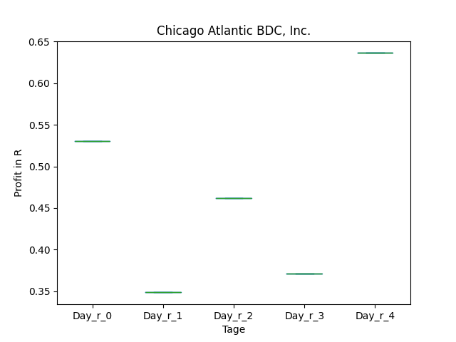
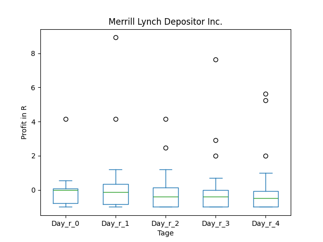
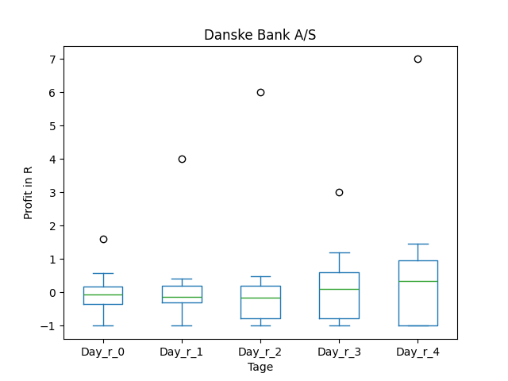
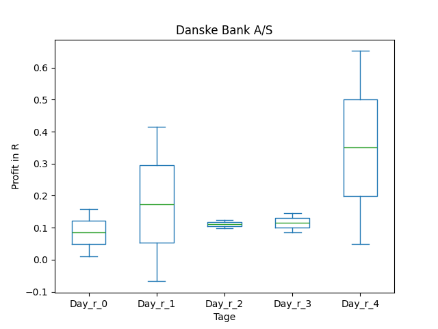
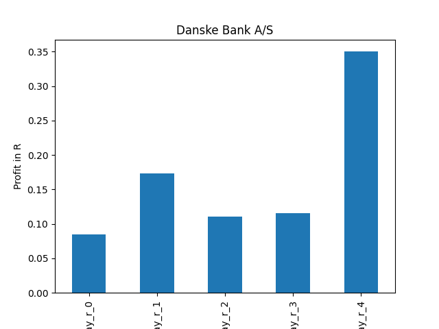
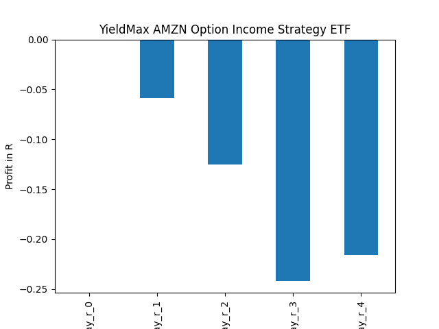

# dividend-shorter

bet on falling prices on payday **2024-12-19**.

## Signale

| Ticker   |   Divid Rate |   Close |          Volume |   last_close_volume |   Divid % | 5_Days_pos   | above_SMA_50   |
|:---------|-------------:|--------:|----------------:|--------------------:|----------:|:-------------|:---------------|
| SQY      |         0.65 |   19.01 | 315400          |             5995754 |      3.44 | False        | False          |
| SMCY     |         2.35 |   29.02 | 339200          |             9843584 |      8.11 | False        | False          |
| MSTY     |         3.08 |   33.52 |      7.7159e+06 |           258636968 |      9.19 | False        | True           |
| LIEN     |         0.34 |   12.99 |  18800          |              244212 |      2.62 | True         | True           |
| JOF      |         0.31 |    7.77 |  33800          |              262626 |      4.01 | False        | True           |
| IPB      |         0.76 |   25.2  |   8400          |              211680 |      3    | False        | False          |
| DNKEY    |         0.46 |   14.6  |  24500          |              357700 |      3.13 | False        | False          |
| AMZY     |         0.86 |   19.69 | 812000          |            15988280 |      4.38 | False        | False          |
| AIYY     |         0.87 |   10.46 |      1.468e+06  |            15355280 |      8.33 | True         | True           |

## SQY

### Erwartung in R
|      |   Day_r_0 |   Day_r_1 |   Day_r_2 |   Day_r_3 |   Day_r_4 |   Treffer |
|:-----|----------:|----------:|----------:|----------:|----------:|----------:|
| ohne |      -0.1 |      -0.2 |      -0.1 |      -0.2 |      -0.2 |        13 |
| mit  |      -0   |      -0.2 |      -0.2 |      -0.1 |      -0.1 |         4 |

### Ohne Filter

### Mit Filter

## SMCY

### Erwartung in R
|      |   Day_r_0 |   Day_r_1 |   Day_r_2 |   Day_r_3 |   Day_r_4 |   Treffer |
|:-----|----------:|----------:|----------:|----------:|----------:|----------:|
| ohne |      -0.2 |      -0.6 |      -0.7 |      -0.8 |       0.9 |         2 |
| mit  |      -0.2 |      -0.6 |      -0.7 |      -0.8 |       0.9 |         2 |

### Ohne Filter

### Mit Filter

## MSTY

### Erwartung in R
|      |   Day_r_0 |   Day_r_1 |   Day_r_2 |   Day_r_3 |   Day_r_4 |   Treffer |
|:-----|----------:|----------:|----------:|----------:|----------:|----------:|
| ohne |       0.2 |       0.1 |       0.1 |       0.1 |       0.3 |         8 |
| mit  |       0.2 |       0.1 |       0.1 |       0.1 |       0.3 |         8 |

### Ohne Filter

### Mit Filter

## LIEN

### Erwartung in R
|      |   Day_r_0 |   Day_r_1 |   Day_r_2 |   Day_r_3 |   Day_r_4 |   Treffer |
|:-----|----------:|----------:|----------:|----------:|----------:|----------:|
| ohne |       nan |       nan |       nan |       nan |       nan |         0 |
| mit  |       nan |       nan |       nan |       nan |       nan |         0 |

### Ohne Filter

### Mit Filter

## JOF

### Erwartung in R
|      |   Day_r_0 |   Day_r_1 |   Day_r_2 |   Day_r_3 |   Day_r_4 |   Treffer |
|:-----|----------:|----------:|----------:|----------:|----------:|----------:|
| ohne |         0 |       0.1 |         0 |      -0.1 |      -0.2 |        27 |
| mit  |       nan |     nan   |       nan |     nan   |     nan   |         0 |

### Ohne Filter

### Mit Filter

## IPB

### Erwartung in R
|      |   Day_r_0 |   Day_r_1 |   Day_r_2 |   Day_r_3 |   Day_r_4 |   Treffer |
|:-----|----------:|----------:|----------:|----------:|----------:|----------:|
| ohne |         0 |      -0.1 |      -0.4 |      -0.4 |      -0.5 |        32 |
| mit  |       nan |     nan   |     nan   |     nan   |     nan   |         0 |

### Ohne Filter

### Mit Filter

## DNKEY

### Erwartung in R
|      |   Day_r_0 |   Day_r_1 |   Day_r_2 |   Day_r_3 |   Day_r_4 |   Treffer |
|:-----|----------:|----------:|----------:|----------:|----------:|----------:|
| ohne |      -0.1 |      -0.2 |      -0.3 |       0.1 |       0.7 |        11 |
| mit  |       0   |      -0.1 |       0.1 |       0.1 |       0.7 |         1 |

### Ohne Filter

### Mit Filter

## AMZY

### Erwartung in R
|      |   Day_r_0 |   Day_r_1 |   Day_r_2 |   Day_r_3 |   Day_r_4 |   Treffer |
|:-----|----------:|----------:|----------:|----------:|----------:|----------:|
| ohne |        -0 |      -0.1 |      -0.2 |      -0.3 |      -0.3 |        15 |
| mit  |        -0 |       0   |      -0.1 |      -0.2 |      -0.2 |         8 |

### Ohne Filter

### Mit Filter

## AIYY

### Erwartung in R
|      |   Day_r_0 |   Day_r_1 |   Day_r_2 |   Day_r_3 |   Day_r_4 |   Treffer |
|:-----|----------:|----------:|----------:|----------:|----------:|----------:|
| ohne |       0.1 |      -0.3 |      -0.3 |      -0.3 |      -0.2 |        11 |
| mit  |       0.1 |       0.1 |      -0.3 |      -0.2 |      -0.2 |         6 |

### Ohne Filter

### Mit Filter

