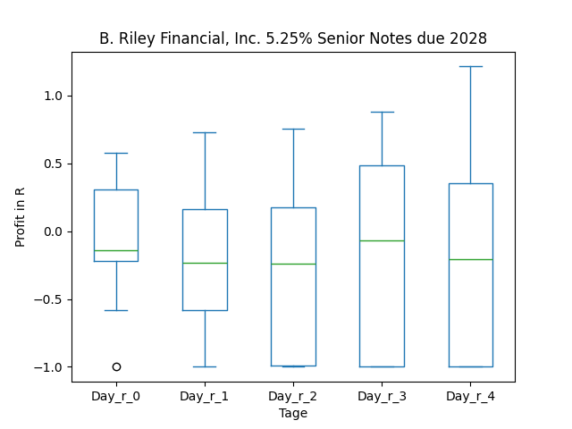
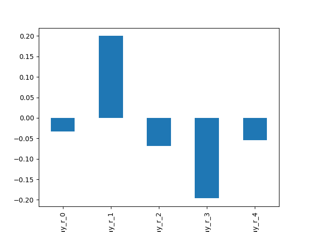
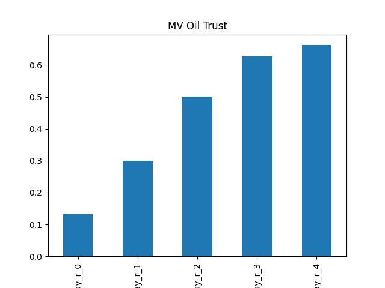

# dividend-shorter

bet on falling prices on payday **2025-04-15**.

## Signale

| Ticker   |   Divid Rate |   Close |   Volume |   last_close_volume |   Divid % | 5_Days_pos   | above_SMA_50   |
|:---------|-------------:|--------:|---------:|--------------------:|----------:|:-------------|:---------------|
| SWZ      |         3    |    9.38 |   149300 |             1400434 |     31.98 | True         | True           |
| RILYZ    |         0.33 |    7.11 |    30700 |              218277 |      4.61 | True         | False          |
| RILYT    |         0.38 |    7.31 |    15800 |              115498 |      5.13 | True         | False          |
| RILYN    |         0.41 |   10.55 |    13600 |              143480 |      3.85 | True         | False          |
| PPERY    |         1.12 |   12.17 |   143100 |             1741527 |      9.24 | True         | True           |
| MVO      |         0.28 |    6.07 |   215500 |             1308085 |      4.53 | True         | True           |
| JBAXY    |         0.57 |   12.4  |   202000 |             2504800 |      4.58 | True         | False          |
| DHCNI    |         0.35 |   13.81 |    11000 |              151910 |      2.55 | True         | False          |
| ARBKL    |         0.55 |    7.23 |    23300 |              168459 |      7.56 | True         | False          |

## SWZ

### Erwartung in R
|      |   Day_r_0 |   Day_r_1 |   Day_r_2 |   Day_r_3 |   Day_r_4 |   Treffer |
|:-----|----------:|----------:|----------:|----------:|----------:|----------:|
| ohne |       0   |       0   |       0.1 |      -0   |       0   |        57 |
| mit  |       0.1 |       0.1 |       0.1 |       0.1 |       0.1 |         4 |

### Ohne Filter

### Mit Filter

## RILYZ

### Erwartung in R
|      |   Day_r_0 |   Day_r_1 |   Day_r_2 |   Day_r_3 |   Day_r_4 |   Treffer |
|:-----|----------:|----------:|----------:|----------:|----------:|----------:|
| ohne |      -0.1 |      -0.3 |      -0.4 |      -0.2 |      -0.3 |        14 |
| mit  |     nan   |     nan   |     nan   |     nan   |     nan   |         0 |

### Ohne Filter

### Mit Filter

## RILYT

### Erwartung in R
|      |   Day_r_0 |   Day_r_1 |   Day_r_2 |   Day_r_3 |   Day_r_4 |   Treffer |
|:-----|----------:|----------:|----------:|----------:|----------:|----------:|
| ohne |        -0 |      -0.1 |      -0.1 |       0.2 |       0.2 |        16 |
| mit  |       nan |     nan   |     nan   |     nan   |     nan   |         0 |

### Ohne Filter

### Mit Filter

## RILYN

### Erwartung in R
|      |   Day_r_0 |   Day_r_1 |   Day_r_2 |   Day_r_3 |   Day_r_4 |   Treffer |
|:-----|----------:|----------:|----------:|----------:|----------:|----------:|
| ohne |        -0 |       0.2 |      -0.1 |      -0.2 |      -0.1 |        21 |
| mit  |       nan |     nan   |     nan   |     nan   |     nan   |         0 |

### Ohne Filter

### Mit Filter

## PPERY

### Erwartung in R
|      |   Day_r_0 |   Day_r_1 |   Day_r_2 |   Day_r_3 |   Day_r_4 |   Treffer |
|:-----|----------:|----------:|----------:|----------:|----------:|----------:|
| ohne |      -0.6 |      -0.3 |      -0.7 |      -0.7 |      -0.7 |        13 |
| mit  |      -0.5 |       0.1 |       0.3 |       0.4 |       0.3 |         2 |

### Ohne Filter

### Mit Filter

## MVO

### Erwartung in R
|      |   Day_r_0 |   Day_r_1 |   Day_r_2 |   Day_r_3 |   Day_r_4 |   Treffer |
|:-----|----------:|----------:|----------:|----------:|----------:|----------:|
| ohne |       0.1 |       0.3 |       0.5 |       0.6 |       0.7 |        71 |
| mit  |       0.4 |       0.4 |       0.7 |       0.9 |       1   |        15 |

### Ohne Filter

### Mit Filter

## JBAXY

### Erwartung in R
|      |   Day_r_0 |   Day_r_1 |   Day_r_2 |   Day_r_3 |   Day_r_4 |   Treffer |
|:-----|----------:|----------:|----------:|----------:|----------:|----------:|
| ohne |      -0.2 |      -0   |      -0.5 |       0.3 |       0.1 |        13 |
| mit  |       0   |       0.4 |       0.3 |       0.4 |       0.4 |         2 |

### Ohne Filter

### Mit Filter

## DHCNI

### Erwartung in R
|      |   Day_r_0 |   Day_r_1 |   Day_r_2 |   Day_r_3 |   Day_r_4 |   Treffer |
|:-----|----------:|----------:|----------:|----------:|----------:|----------:|
| ohne |         0 |       0.2 |       0.1 |       0.1 |      -0.1 |        35 |
| mit  |       nan |     nan   |     nan   |     nan   |     nan   |         0 |

### Ohne Filter

### Mit Filter

## ARBKL

### Erwartung in R
|      |   Day_r_0 |   Day_r_1 |   Day_r_2 |   Day_r_3 |   Day_r_4 |   Treffer |
|:-----|----------:|----------:|----------:|----------:|----------:|----------:|
| ohne |       0.1 |       0.3 |       0.5 |       0.1 |       0.1 |        12 |
| mit  |     nan   |     nan   |     nan   |     nan   |     nan   |         0 |

### Ohne Filter

### Mit Filter

