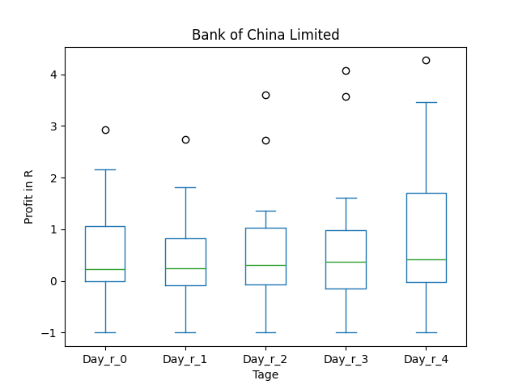
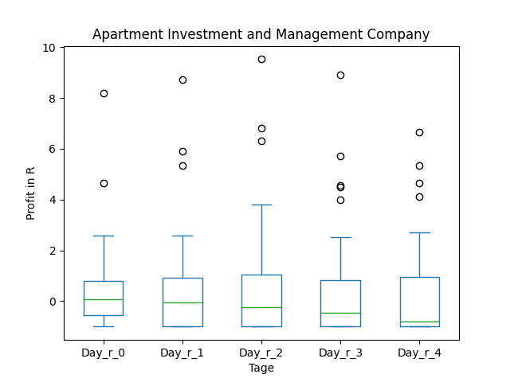

# dividend-shorter

bet on falling prices on payday **2025-01-14**.

## Signale

| Ticker   |   Divid Rate |   Close |          Volume |   last_close_volume |   Divid % | 5_Days_pos   | above_SMA_50   |
|:---------|-------------:|--------:|----------------:|--------------------:|----------:|:-------------|:---------------|
| NEWTH    |         0.71 |   25.47 | 148100          |             3772107 |      2.8  | False        | False          |
| BACHY    |         0.41 |   12.3  |  29300          |              360390 |      3.37 | False        | True           |
| AIV      |         0.6  |    9    |      1.8676e+06 |            16808400 |      6.67 | True         | True           |

## NEWTH

### Erwartung in R
|      |   Day_r_0 |   Day_r_1 |   Day_r_2 |   Day_r_3 |   Day_r_4 |   Treffer |
|:-----|----------:|----------:|----------:|----------:|----------:|----------:|
| ohne |       nan |       nan |       nan |       nan |       nan |         0 |
| mit  |       nan |       nan |       nan |       nan |       nan |         0 |

### Ohne Filter

### Mit Filter

## BACHY

### Erwartung in R
|      |   Day_r_0 |   Day_r_1 |   Day_r_2 |   Day_r_3 |   Day_r_4 |   Treffer |
|:-----|----------:|----------:|----------:|----------:|----------:|----------:|
| ohne |       0.1 |       0.2 |       0.3 |       0.4 |       0.5 |        14 |
| mit  |      -0.3 |      -1   |      -1   |      -1   |      -1   |         1 |

### Ohne Filter

### Mit Filter

## AIV

### Erwartung in R
|      |   Day_r_0 |   Day_r_1 |   Day_r_2 |   Day_r_3 |   Day_r_4 |   Treffer |
|:-----|----------:|----------:|----------:|----------:|----------:|----------:|
| ohne |       0.1 |        -0 |      -0.2 |      -0.3 |      -0.7 |        72 |
| mit  |       0.1 |        -0 |      -0.2 |      -0.4 |      -0.8 |        71 |

### Ohne Filter

### Mit Filter

