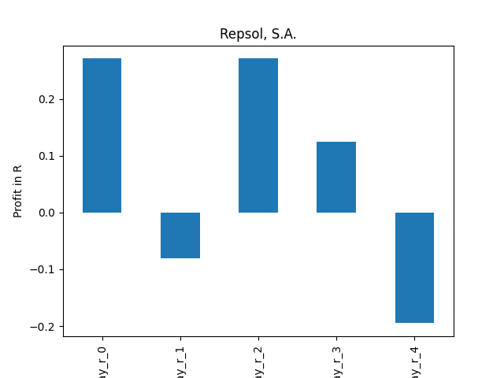
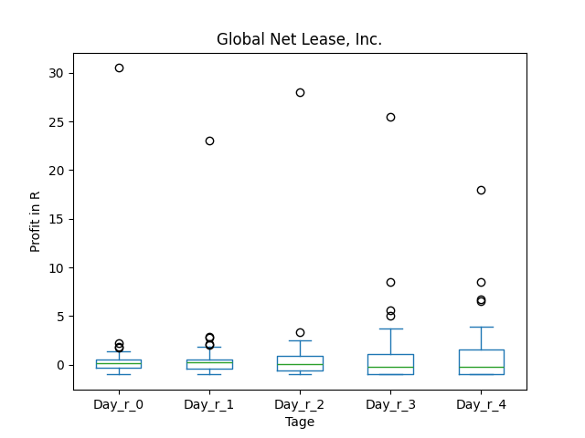

# dividend-shorter

bet on falling prices on payday **2025-01-13**.

## Signale

| Ticker   |   Divid Rate |   Close |          Volume |   last_close_volume |   Divid % | 5_Days_pos   | above_SMA_50   |
|:---------|-------------:|--------:|----------------:|--------------------:|----------:|:-------------|:---------------|
| REPYY    |         0.5  |   12.55 | 150100          |             1883755 |      3.95 | True         | True           |
| GNL      |         0.28 |    7.12 |      2.8011e+06 |            19943832 |      3.86 | False        | False          |

## REPYY

### Erwartung in R
|      |   Day_r_0 |   Day_r_1 |   Day_r_2 |   Day_r_3 |   Day_r_4 |   Treffer |
|:-----|----------:|----------:|----------:|----------:|----------:|----------:|
| ohne |       0   |      -0.2 |      -0.1 |       0   |      -0.3 |        27 |
| mit  |       0.3 |      -0.1 |       0.3 |       0.1 |      -0.2 |        11 |

### Ohne Filter

### Mit Filter

## GNL

### Erwartung in R
|      |   Day_r_0 |   Day_r_1 |   Day_r_2 |   Day_r_3 |   Day_r_4 |   Treffer |
|:-----|----------:|----------:|----------:|----------:|----------:|----------:|
| ohne |       0.2 |       0.3 |       0.1 |      -0.1 |      -0.2 |        68 |
| mit  |       0.1 |       0.1 |      -0.3 |      -0.2 |      -0.7 |        11 |

### Ohne Filter

### Mit Filter

